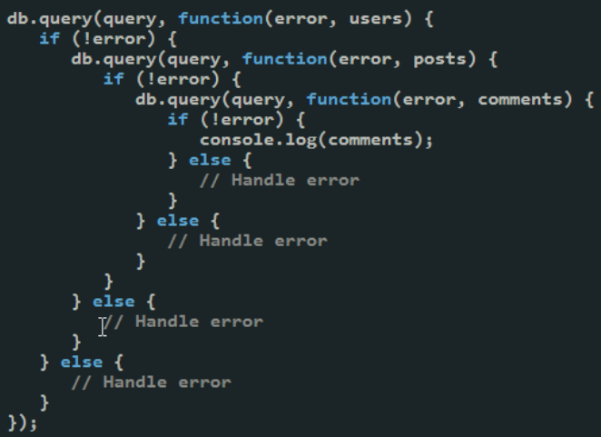

# Why Callbacks?
One of the hardest concepts for most students to grasp when just starting out with JavaScript is the *callback* function.  We learned about it when we saw a few of our very first JavaScript programs - the networking examples in Chapter 2.  Given callback were present in such early examples, it shouldn't be shocking to learn that *callback* are related to JavaScript at a deeply fundamental way. 

Let's refresh with an example we've already seen:

```js
const http = require('http');

const handle_request = (req, res) => {
    // Intepret the request, build 
    // and send a response
}

const server = http.createServer(handle_request);
server.listen(8080, 'localhost');
```
The above example is how we write HTTP server code.  We define a function, and then tell the http server *instance* we created to call it, whenever an HTTP request arrives on the underlying network socket.  `handle_request` is a *callback function*.  

Take some time to think about the following:

1. When will that function get called?
2. How many times will that function get called?
3. Can that function get called twice, at the same time?

The answer to #1 is... **who knows!**.  The server (which is where this code is running) doesn't control *when* an HTTP request is received.  That depends on when a web browser, on a computer potentially across the globe, creates such a request!  We know the `handle_request` function gets called **if and when** an HTTP request is received, but we have absolutely no way of knowing *if and when* such a request will be received.

Could we instead have a function to just wait for a request, and return a corresponding object (containing the parsed request, and a ready-to-use response object)?

```js
const rr = httpServer.waitForRequest();
handle_request(rr.req, rr.res)
```

This seems more deterministic, and more natural to someone who is more accustomed to programming in other languages.  The code implies (by the function name) that we want to *wait* for an incoming request, and then once it arrives we want to process it.  Notice that we still don't know how long we will wait.  It's the same situation, it's just written differently.  It does seem a little easier to think about, since it's a *linear* style of programming.

On to question 2 - how many times will it be called?  Again, we can't answer this question.  We may receive one request, we could receive ten thousand requests.  We might even recieve *zero* requests.  The code we started with isn't concerned - it's just telling `server` that *whenever*, and *everytime* a request is received, call `handle_request`.  

To do the same with our hypothetical `waitForRequest` function, we'd need some sort of loop:

```js
while (true) {
    const rr = server.waitForRequest();
    handle_request(rr.req, rr.res);
}
```
The loop above is explicetly waiting and processing, in sequence, over and over again.  It's important that you keep thinking back to the callback example at the beginning of this section - *it's doing the same things*, the difference is that the loop isn't in your code, **it's somewhere else**!  Let that sink in - they are the same, it's just that you've passed `handle_request` to the `server` object, and *somewhere* in the server object's code, there's a loop that is calling it!

Now what about question 3 - will we receive two requests at the same time?  The answer is... *maybe*.  We can't control whether two people click a button on their phone at the same time, and generate two HTTP requests to our web server at the same time.  It's just luck.

Taking the looping example above, where we call `waitForRequest` then `handle_request`, what happens when `handle_request` is called?  It takes **some** amount of time to do the request processing and generating the response.  How much time?  Hard to say.  Let's take it to an extreme, and say it takes **one second**.  What happens when we receive a *second* request during the time we are processing the first?

**This gets us to the core of the problem**.  By definition, in the looping code, we are **either** waiting for a request or we are handling a request.  If a request comes in while we are handling another, what happens to the request?  There are two possibilities:

1.  The incoming request is queued *by some other process*
2.  The incoming request is dropped.

Option 1 seems way better, but in order for that to happen, it means *some other* process (program) on your computer is reading the incoming network bytes, and is willing to *hold on to them* until you decide to "wait" for another request - at which point it hands it over to you.

In reality, there is a program doing this already - it's your **operating system**.  It will cache *some* network traffic - but not much.  Making matters more difficult is that each time more requests arrive while you are processing the previous ones, **you will fall further and further behind**.  A queue of incoming requests will build, and eventually the operating system will begin dropping the network traffic.  Worse yet, clients will stop waiting, and abandon the request.  

The solution is to **build your own queue**, and figure out a way to process things "faster", usually by processing multiple requests *in parallel*.  Without getting into too much detail, we end up with something like this:

```js
// Will continue to receive http requests, and
// put each on a queue.  This happens in a new thread
server.start_receiving();
while (true) {
    // Blocks until there is a request in the queue
    const rr = server.next();

    // Handles the request in a new thread, allowing
    // the loop to return to the top immediately.
    new Thread(handle_request(rr.req, rr.res))'
}
```
If you aren't familiar with multithreaded code, this might seem complex.  If you *are* familiar with multithreaded code, this *should* seem complex.  Multithreaded code allows the programmer to execute sequences of code in parallel, with each sequence running independently of each other.  They don't wait for each other.  This makes it easier to do things faster, especailly on machines with multiple CPUs.  It also makes things harder to program - issues like race conditions and synchronization abound.  Creating new threads for each request can pay off, but it doesn't come for free either.  The operating system is required to create new threads, and that means we must make API calls to it - incurring additional time.

What is being described above is *dispatch*.  Dispatch is a situation where we are receiving incoming jobs, and each job is being independently handled by independent code.  There is logic required to *queue* incoming jobs and *dispatch* the jobs to appropriate code.  It's a simple concept, that becomes complex when dealing with high volume and performance requirements.  Webservers need to handle high volume, and users expect performance.

This is a huge topic, we could spend several chapters discussing the ins and outs of multithreaded programming.  The goal here however is to motivate *why* callaback functions exist.  Callback functions are an elegant encoding of the dispatch problem.  

```js
const handle_request = (req, res) => {
    // Intepret the request, build 
    // and send a response
}

const server = http.createServer(handle_request);
server.listen(8080, 'localhost');
```

The code above *is doing dispatch*, but dispatch is happening within `server`, not our own code.  We are simply saying - use `handle_request` when you dispatch a request.  We are giving `server` the function to call *in the loop*, but we are letting `server` deal with the loop itself.


## Multiple Streams
There's a secondary benefit to handling the dispatch problem with callbacks rather than a dedicated loop.  Let's create a new more abstract example.  Suppose you have **two** sources of incoming jobs (A and B).  Each time a job is received, the job must be dispatched to a separate handler - based on the type of job that is received - `handle_a`, `handle_b`.  You don't know when the jobs will arrive, and you can't assume they will arrive in any particular order.  You may recieve five jobs of type A before ever receiving a job of type B.

How can we replicate our dedicated loop?  


We can't have two loops, because we need to be able to handle a mix of incoming jobs.  We can't handle all the A jobs before B jobs!

```js
// This won't work!  We never leave
// the first loop!
while (true) {
    const a = server.waitForA();
    handle_a(a);
}
while (true) {
    const b = server.waitForB();
    handle_b(b);
}
```
We'd instead need to do something like this:

```js
while (true) {
    const a_or_b = server.waitForA_or_B();
    if (a_or_b is a)
        handle_a(a_or_b.a);
    else
        handle_b(a_or_b.);
}
```
Pretty awkward.  Now what if we have 5 different job types, with 5 different job sources?  We'd have to have all sorts of combinations of `waitFor` functions, and then big branches in our loop to figure out which event we need to process.

This is where callbacks start to really shine:

```js
const handle_a = (a) => {
    // ...
}

const handle_b = (a) => {
    // ...
}

server.onA(handle_a);
server.onB(handle_b);
```
Notice how that scales.  It's because the loop structure and the dispatch is *within* server. It's written once - with all the necessary complexity and care - and now the programmer may leverage all that work by simply registering callback functions.  `handle_a` and `handle_b` could be called thousands of times.  If we have more jobs types, we simply create more handlers.

The examples above are fairly abstract. If you are newer to programming, it might be enough depth for you, for now.  If you have more experience, especially in any sort of systems programming, you might be wondering how this is all *actually* happening - as we've glossed over some things in the abstract examples.

## What is I/O, really?
When you create a program, you have a sense that your code will be *executed* at some point, on a machine.  That machine has an operating system, and the operating system is responsible for launching this program you've written - at a user's request.  You also have a sense that your program isn't the only program running on the machine.  You know, just from using a computer, that there are many programs running that appear to be doing so *simultaneously*.  This concept is called *timesharing*, and it is up to the operating system to maintain the illusion (in the case of single CPU systems) of multi-tasking.  In reality, each program running on the computer gets a small time slice to run on the CPU, before the operating system chooses another program to run, for a similarly small slice of time.  Programs are run according to a *scheduler*, and run for small enough time intervals that to a human being, it gives the appearance that *all are running* - in much the same way a video fools a viewer into thinking they aren't just seeing a sequence of images being swapped rapidly.

How does your program, that is running on the CPU, get pulled *off* the CPU though?  Most students who haven't studied operating systems have a knee-jerk response: the operating system does this.  This really isn't accurate - because remember, *the operating system is just a program too*.  In a single CPU system, if *your* program is running, then **by definition** the operating system *is not* - and thus cannot "kick" a program off the CPU!

The reality is that programs exit the CPU for one of four reasons:
1. The program voluntarily *yields* the CPU to allow other programs to run.  This happens when the programmer decides to add an API call into their code that explicitely asks invokes the operating system.  This doesn't happen often.
2. The program exits.  This might be due to error, or natural exit.  While mostly every program eventually does this, it's rare in the larger picture.  We are thinking about time sharing, where programs are moving on and off of the CPU thousands of times *per second*.  Most programs won't exit within that time period.
3. A CPU timer expires, allowing the OS to run it's scheduler.  CPU's have *hardware timers* that will interrupt the CPU and shift execution to the operating system.  The operating system sets these timers before choosing the next program to run.  This effectively puts a maximum cap on the total time the program can own the CPU without the operating system running.
4. The program invokes an I/O call. All I/O calls result in the operating system running - and performing I/O on the user program's behalf.

Number 4, I/O calls, is the most interesting for our purposes.  A computer consists of many *devices* - the CPU being one of them.  The CPU does *computation*, the add, multiply, subtract, etc. operations of a program.  Other devices, such as *disk*, *network*, *display*, *mouse* and *keyboard* are part of the system too however - and they are generally referred to as **input and output devices** - IO devices.  Really, *all* devices other than the CPU are considered I/O devices.

A principle job of the operating system is to make efficient use of all the devices of the system.  Each device *takes time to perform it's operations*.  Some devices are fairly quick, some are extradinarily slow.  Some devices depend on humans (ie, waiting for keyboard input), which means *slow* doesn't even begin to do justice to how much slower they are than CPU operations.

No user program (any program that is *not* the operating system) is permitted *direct* access to devices.  There are many reasons for this - but the two main reasons are fairness and safety.  We don't want processes to consume all the devices on the system, and we don't want processes (programs) to use devices inappropriately.  Therefore, *all* device access is achieved by making API calls - usually referred to as **system calls**.  Operating systems provide C APIs to perform all sorts of operations - file access, network communication, display, etc.  

**Critically**, when a system call is invoked, the caller (the user program) is *removed* from the CPU and the operating system begins running.  The operating system must then *initiate* the operation it has been requested to perform by sending a signal the given device.  Keep in mind, once the signal (an instruction, sent *from* the CPU, over the bus, to the intended device) is sent, it will take time before the device begins to operate, and before it completes.  This time might be a few hundred milliseconds, but normally we measure this time in *clock cycles* - or CPU clock cycles.  One clock cycle is one instruction that the CPU executes.  Reading from a hard disk may take hundreds of clock cycles - **however the work being done is not done by the CPU, it is done by the hard disk's microcontroller**.  This is a key concept - the *operating system*, is a program, running on the CPU.  One of the instructions that it executes on the CPU is a command to send a signal to a device.  The operating system will now have *nothing useful to do* until the device completes the operation.  

It has two options:

1. Do nothing (it can literally execute a *no-op* on the CPU, an instruction that does absolutely nothing)
2. Allow *another* program to run.  Note, this **will not** be the program that asked for the device operation to be performed, since that program is necessarily *waiting* for that operation to be completed!

The choice should be obvious - since there is nothing useful for the operating system to do on the CPU, and the program which asked for the I/O has nothing to do either, it makes sense that another program is chosen to run.  At some point in the future, the initiated I/O will complete, and the device will generate a *hardware interrupt* to invoke the operating system (this is actually the *fifth way a program leaves the CPU - on I/O completion).  The operating system will examine the results, and schedule the initating program to run - and the results are passed to it.

I/O and Operating System APIs are a huge part of computer science and systems programming.  We won't go much deeper in this book, but take a look at these references if you are interested:


### Blocking Model
The discussion above on I/O is a difficult concept.  There was a lot going on.  What does all of that actually look like though in code?

```c
int x = 5;
printf("%d\n", x);
```
Yes - that really is it.  That code prints an integer to the terminal.  The code is simple.  However, here's what actually happened *within* the `printf` call:

1.  The C code executed a trap command on the CPU, with parameters to invoke the operating system.
2.  The operating system began to run, and computed pixels within a frame buffer (representing the terminal's window) corresponding to the number 5.  Those pixels needed to be flushed to the output device, so a signal was invoked to the graphics device.
3.  While the graphic device did it's work (this is an oversimplification!), the OS handed the CPU off to another program which likely ended up making an I/O call - repeating this entire process several times.  Many things can be happening during this time, but there is one thing we are *sure* isn't happening:  our program (the one that called `printf` is *not* running).
4.  Eventually, the graphics device subsystem confirmed the pixels had been flushed to the actual screen.  The operating system regained the CPU after the graphics device interruped the CPU.
5.  The operating system added the original program (the one that called `printf`) to the list of programs ready to run again, and eventually it gets selected.
6.  The line of code after the `printf` begins executing.

This is called a *blocking call*.  Blocking calls, invoked by a user program, result in the program *blocking* - or being taken out of the list of schedulable processes, until the result of the blocking call is available.  From a programmer's perspective, it's a vary simple model.  It hides much complexity.

**Pro Tip**&#128161; Understanding **blocking calls** is the most critical part of this section.  A blocking call results in your program being *suspended*, while the operating system and the devices on the computer do their work.  By definition, your program is not running - and will not run until all the work is complete.  While your program is blocked, other programs may run - which is a good thing from a global perspective.  However, remember - when your program is **blocked**, it can't do anything else.  It can't respond to user input.  It can't draw anything to the screen.  It can't receive network events.  It can't do any computation of any kind.  **It is not running**.

The `printf` function is quick, and so it might be difficult for you to conceptualize the full story here.  So, let's create another hypothetical example:

Suppose you have a program that draws things on the screen, and responds to mouse events (mouse movement, clicks, etc).  When the user interacts with the program, the screen is redrawn to indicate the results of that interaction.  In addition, sometimes your program needs to read data from disk, perhaps several hundred MB - which can take a few seconds.  Now let's suppose your application has the following *general* structure in it's code:

```c++
while (true) {
    data = null;
    mouse_events = read_mouse_events();
    if (mouse_events.must_read_file) {
        // This blocks, and can take several seconds
        data = read_file(filename);
    }
    draw_screen(mouse_events, data);
}
```

The loop above is an abstract example with some hypothetical functions, but you can appreciate what's happening here.  The program sits in a loop, gathers user input, and draws the results to the screen - over and over again.  Theoretically, it should be able to do this *thousands* of times per second, which gives the user immediate feedback.  For example, as they move their mouse around the screen, the mouse cursor can be drawn immediately - providing the impression that it smoothly traveling around the screen.

If the user does something such that `must_read_file` is true however, now the code must actually ask the operating system for file data.  If this is a blocking call, then we have a big problem.  While `read_file` is executing, which could be many seconds, we are blocked.  `draw_screen` cannot be called, and we can't `read_mouse_events` either.  The user may continue to move their mouse around, but the cursor won't redraw.  They may try to click buttons, menus, and move scroll bars - but the screen isn't going to redraw.  Our program is *blocked*.

You've probably encountered programs that behave like this actually.  It's not uncommon.  The problem can be solved however, and traditionally it was solved with *multithreaded* code.  A *thread* is a separate path of execution.  When a program has two threads, each thread is *schedulable*.  If one thread is blocked, the other thread can still run on the CPU - they are *independent* of each other.  Let's look at how this solves the problem.

```c++
// THREAD 1 - User input/feedback

// Shared with Thread 2
data = null;

while (true) {    
    mouse_events = read_mouse_events();
    if (mouse_events.must_read_file) {
        signal_file_thread();
    }
    draw_screen(mouse_events, data);
}
```
The user dispatch thread reads mouse inputs and draws the screen.  If the user takes an action that requires a file to be read, that is detected - but instead of actually reading the file, we send a signal to the second thread.  Note, we're hiding complexity here (ie how is this signal sent?) in an effort to keep this fairly high level, because *we won't be doing multithreaded code* in this book.  

So, at the same time, there is another thread waiting for this signal.

```c++
// THREAD 2 - File Reading

// Shared with Thread 1
data = null; 
while (true) {
    wait_for_signal();
    data = read_file(filename);
}
```
The second thread simply waits for signals from the first.  When told to do so, it calls `read_file` - which is still a blocking call.  Crucially, while Thread 2 is blocked, Thread 1 is happily continuing - responding to user input and drawing to the screen.  This is how multithreading solves the problem - it moves the blocking calls to separate threads, so the thread handling user input and drawing (or whatever work there is to be done) is *not blocked*.

### Non-Blocking Model
The majority of programming languages use *blocking calls* to perform I/O activity.  This is largely because in *most* cases it is OK to do so, and is easy to code.  When it's not OK to block, then programmers must use multi-threaded code - which substantially increases complexity.

Node.js is designed differently.  In Node.js, the majority of I/O calls (and even some CPU intensive calls) are designed to be *asynchronous* and **non-blocking**.  There are a few reasons for this:

1. Node.js was built with I/O intensive applications in mind, and I/O intenstive applications tends to suffer when I/O calls are blocking
2. JavaScript non-blocking API's easier to design, since it's much easier to work with callback functions than in other languages (at least, at the time of Node.js's creation).

Before reviewing how Node.js code would be written for the examples above, let's discuss a bit more about it's architecture.  Node.js is a C++ program.  It's the runtime for JavaScript.  It has two fundamental parts - (1) V8 JavaScript Execution Engine and (2) Operating System interface code - to give JavaScript access to the filesystem, network, input/output devices.  We've discussed V8, the critical part is (2) right now.  Node.js provides a JavaScript interface to the C / C++ APIs the operating system supports.  This allows your JavaScript code to invoke the same system calls as a C and C++ program would make - but in a JavaScript style.

Since Node.js is the runtime program for your JavaScript code (when writing server-side code in this book), **and** it is providing access to the operating system's system calls - it has full control over *how* your JavaScript code can interact with those system calls!  It can choose whether to make those operations blocking or non-blocking, and it chose non-blocking.

Nearly all of Node.js's I/O calls expect the caller to provide a *callback* function.  When the Node.js I/O call is invoked, it asks the operating system to start the I/O call, but *importantly* it does this in a non-blocking manner - the operating system does not suspend Node.js until the I/O call is completed.  Node.js then immediately continues executing the JavaScript code that made the I/O call.  

**Read that sentance again**.  When you make an I/O call in Node.js, the call returns immediatly.  *Before* the I/O call is completed.

When the operating system finally receives notification that the I/O has been completed, Node.js will likewise be signaled.  Node.js will continue executing whatever JavaScript code is currently running (more on this in a moment), and once it has nothing to run, it will check for I/O completions.  Seeing the I/O has been completed, Node.js then calls the **callback** function that was provided earlier.

So, let's see how this works in practice, using the same hypothetical program as above.

```js

let data = null;

const process_mouse_events = (mouse_events) => {
    if (mouse_events.must_read_file) {
        // read_file returns IMMEDIATELY
        read_file(filename, (file_data) => {
            // Callback function, sets the data
            // variable
            data = file_data;
            draw_screen(null, data);
        });
    }
    draw_screen(mouse_events, data);
}
read_mouse_events(process_mouse_events);
```
These aren't real Node.js functions of course, but they are written in the style of Node.js I/O calls. Notice that `read_mouse_events` is now non-blocking.  Only when a mouse event is ready does the callback function `process_mouse_events` get called.   Presumably, insude `read_mouse_events`, there is some mechanism that continue to poll for input over and over again - so `process_mouse_events` is called for **all** mouse events.

Inside `process_mouse_events`, we *may* invoke `read_file`, but now `read_file` accepts a callback.  `read_file` does not wait for the data to be read from disk, it returns right away.  The screen can be drawn right away as well.

When the data does arrive, the callback is invoked, and `data` is set.  Since it is assumed that the data that is read in some way alters what should be drawn, we call draw_screen again.  This time, we provided `null` as the mouse parameter, since the call is not invoked as a direct result of mouse data at all.

There's no question - this is harder to understand than the original blocking code.  It's likely no harder than the multi-threaded code, and in fact - it's **a lot safer**, as we do not need to worry about synchronization, shared memory, etc.  

#### Pitfall:  Clogging up the "Event Loop"
The JavaScript code above hides something, something that is within Node.js and is driving everything we do.  It's called the **Event Loop**.

Think of Node.js as a C++ program that does the same sort of loop that we started out this section with - waiting for various *events*.  One of the *events* that it waits for is the availablity of code to execute.   The following (incredibly simplified) psuedocode illustrates what Node.js is doing:

```js
let code_queue = new Queue()
let pending_io = new List();

// Start the program
code = get_entry_point();
code_queue.push(code);

while (!code_queue.empty() && !pending_io.empty()) {
    code = code_queue.next();
    if (code) {
        // Runs code, and if it hits an I/O call, 
        // starts the I/O, returns record (id, callback).
        // If no I/O call is made, keeps running until
        // the code itself completes and returns null.
        io_invoked = run(code);
        for(const io of io_invoked) {
            pending_io.push(io);
        }
    }

    id = operating_system.is_anything_ready();
    if (id) {
        // Looks up the id in pending_io, and if found, and 
        // and has a callback function, adds the callback function 
        // to the code queue.
        io = lookup_pending_io(id);
        if (io && io.callback) {
            code_queue.push(io.callback);
        }
    }
}
```
When your JavaScript program starts, the globally executable JavaScript (the program entry point) is added to the code_queue, and drops into the main event loop.  The event loop will continue to run until there is no additonal code to run, **and** there are no pending I/O calls.  If you follow along, the most critical part to understand is the `run` function.  It accepts JavaScript code, and runs it to completion.  While running it, the code may make I/O calls.  Each I/O call gets an identifier and a possible callback.  When the code is complete, those I/O calls and callbacks are added to the pending IO queue.  Before taking the *next* chunk of code, we check to see if any I/O has completed - and if so, we place that I/O call's callback on the code queue.

Now, let's see how we can effectively *kill* Node.js's ability to process I/O, by monopolizing the event loop.

```js

let data = null;

const process_mouse_events = (mouse_events) => {
    if (mouse_events.must_read_file) {
        read_file(filename, (file_data) => {
            data = file_data;
            draw_screen(null, data);
        });
    }

    // Infinite loop
    while (true) {
        foo();
    }
    draw_screen(mouse_events, data);
}
read_mouse_events(process_mouse_events);
```
In the code above, when we recieve a mouse input, we check to see if we must read a file.  Let's say we do - and we invoke `read_file`.  We know that when `read_file` completes, Node.js will call the callback we provided - which sets the `data` variable.  **However**, after calling `read_file` we drop into an infinite loop.  This code will never complete.  If you look at the psuedocode for the event loop above, we are inside the `run` function - and that `run` function will now never return.  Node.js will never get to check to see if `read_file` has completed, or check to see if there are any more mouse events.  Your program is unresponsive.

The example above is an extreme example.  Instead of having an infinite loop calling `foo`, maybe instead you just do some number crunching - for a few seconds.  This is **still** problematic, because you are **still** blocking the event loop.  While you are doing your number crunching, you are not allowing Node.js to check for I/O completions.  Some times this is simply unavoidable - but it's important to understand the effects.  Anytime you do something *CPU intensive*, without an I/O blocking call, you are blocking the event loop.  

#### More Reading
Node.js implements system calls in conjunction with another C++ library embedded within it's source code - libuv.  While you don't need to understand all the details of how Node.js is implemented in order to write web servers in Node.js, the information and background knowledge is certainly helpful.

- [Node.js Event loop explanation](https://nodejs.org/en/learn/asynchronous-work/event-loop-timers-and-nexttick)
- [Node.js blocking and non-blocking explanation](https://nodejs.org/en/learn/asynchronous-work/overview-of-blocking-vs-non-blocking)
- [Node.js callback pattern explanation](https://nodejs.org/en/learn/asynchronous-work/javascript-asynchronous-programming-and-callbacks)
- [libuv](https://libuv.org/)

## Real-World - HTTP Request Bodies
Let's drill down to something more concrete, and related to our core focus - web development.

We saw in the last chapter how HTTP request **bodies** were handled by the `http` library.  Instead of simply adding it to the `req` object, like it does with query strings, it is instead the programmers responsibility to handle `data` and `end` events on the request, and then parse the request body themselves.  **Why is this**?

Recall, HTTP request **bodies** can be large.  There's no technical limit, and in practice, a web client (browser) could send an entire movie file, of several GBs over the network - to upload a video to a server.  This will take **minutes**.  The `http` library needs to work reasonably for all use cases, and if it were to *block* until the HTTP request body was fully received, it would end up stalling our ability to process *any other requests* that come in while we are reading GBs of data from one particular web browser!  Instead, the `http` implementation *chunks* the data, reading a bit off the socket at a time, and invoking our supplied callback. 

```js
const handle_request = (req, res) => {
    let body = "";
    req.on('data', (chunk) => {
        body += chunk;
    });
    req.on('end', () => {
        req.form_data = qs.parse(body);
        
        serve_page(req, res);
    });
}

http.createServer(handle_request).listen(8080);
```
When a request arrives, we immediately register a callback function for each time a `data` chunk arrives.  The `req.on` function returns immediately, and we call it again to register a callback for the `end` event.  That call to `on` returns immediately too, and thus `handle_request` returns immediately.  At that time, we are free to handle new requests (new calls to `handle_request`) **while the network device continues to receive chunks associated with the first HTTP request**.  Each time a chunk arrives, we append it to the `body` variable, which is held in scope since active callback functions (the ones associated with `data` and `end`) have captured them within their scope (closures).  The append is quick, so the callback for `data` returns quickly, and isn't tying up the event loop.  Between *chunks*, the entire program is free to do other things.  Additional HTTP requests may come in from other clients, and we can happily process them.  When `end` is invoked, we then are ready to parse things - in our use case above it's just form data.

**Pro Tip**&#128161; When writing web server code, you **always** need to remember that new HTTP requests can be arriving *at any time*, because you are potentially serving thousands (or millions!) of web browsers simultaneously.  You *always* have something else to do, while I/O calls are being performed.  Never forget this!

### Reusing the Request Body Parsing
It's a pain to keep writing all that code to parse request bodies.  You might be tempted to do the following:


```js
const parse_body = (req) => {
    let body = "";
    req.on('data', (chunk) => {
        body += chunk;
    });
    req.on('end', () => {
        form_data = qs.parse(body);
        return form_data;
    });
    // ?
}
const handle_request = (req, res) => {
    req.form_data = parse_body(req);
    serve_page(req, res);
}

http.createServer(handle_request).listen(8080);
```
That code might seem nice - since we could imagine reusing the `parse_body` function in other areas of our web server, or in other projects.  **That code is fundamentally broken though**, and WILL NOT work.

**Pro Tip**&#128161;  Pay attention to why the code above doesn't work - it's one of the most common  mistakes students make!

The `parse_body` function above registers callback functions on the `req` object just fine.  In fact, each time a chunk of data is received, or the end of the request body is found, those callbacks **do** get called.  The problem is that `handle_request` is long gone.  Let's see why:

When `parse_body` calls `req.on('data', ...`, that function returns immediately - it's simply registering a callback.  The same thing occurs when `req.on('end', ...` is called - the callback is *registered* and then the function returns right away.  At that point, we arrive at the line of code marked with the comment - `// ?`.  At this time, no chunks have been processed, and the form data has not been parsed.  We've reached the end of the `parse_body` function, and it returns.  The `handle_request` function expected the result of `parse_body` to be something, but it's not - it's just `undefined`.  `handle_request` serves the page, with no form data at all.

*BTW, remember, we couldn't have done `return body` from `parse_body`, or attemted to parse the `body` at the `// ?` line, because the data hasn't been ready yet.*

So, how do we fix this?  How do we wrap up the callbacks associated with parsing the request body so it's reusable?  The answer isn't quite as satisfying as we'd like, *yet*.  For now, the best we can do is wrap it up using another callback.

```js
// The second parameter (done)is a FUNCTION, a callback
// that the caller wants parse_body to call when the 
// body has been parsed. 
const parse_body = (req, done) => {
    let body = "";
    req.on('data', (chunk) => {
        body += chunk;
    });
    req.on('end', () => {
        form_data = qs.parse(body);
        // Call the function we were provided, with 
        // the parsed form data
        done(form_data)
    });
}
const handle_request = (req, res) => {
    parse_body(req, (data) => {
        req.form_data = data;
        serve_page(req, res);
    })
}

http.createServer(handle_request).listen(8080);
```
The `parse_body` function above has been changed, so it accepts a callback function. This is the first time we've used callbacks ourselves - and it might really help you conceptualize how this all works!  The `parse_body` function still returns immediately, so `handle_request` also is returning immediately - but it's returning without actually sending the page to the browser.  It *has* however passed a callback to `parse_body`, as it's `done` parameter.  That callback receives the parsed request body, adds it to the `req` object, and serves the page.  `parse_body` calls `done` (which is the anonymous function passed into it from `handle_request`) once it receives the `end` event and has parsed the data.

## Events vs Results
Before moving on, it's worth considering that we've actually been seeing two different types of *callback* use cases.

```js
const parse_body = (req, done) => {
    let body = "";
    req.on('data', (chunk) => {
        body += chunk;
    });
    req.on('end', () => {
        form_data = qs.parse(body);
        done(form_data)
    });
}
```
The `req.on` function is used twice in the code above.  Once for `data`, and once for `end`.  Note though, we sort of implicitely accept that the `data` event might fire *many* times, while we understand `end` will only be called once.  Likewise, we saw the `read_mouse_events` function in examples above, which was presumably allowing us to register a callback for mouse events - and we understand that there will be *many* mouse events.  We also saw `read_file`, which accepted a callback with the data read from disk - and we understand that that callback would be called *once*, when the file data was available.

There are two situations, both of which are handled with callback functions:  
1. streams of events, where a given callback is called whenever an event arrives.
2. results of I/O calls, where one call results in one callback invocation.

These two use cases are *not* mutually exclusive.  For example, we might have a stream of events, and **only receive one event**.  The `end` event is a good example of this - it's nature and name imply it only happens once, but if you look at the code - it's written like any other event (like the `data` event).  The two use cases are used fluidly, and you should be thoughtful when working with callbacks because of this.  **You should always ask yourself - how many times would my callback be called?**.  The answer is usually found from the context, and the documentation.  There is not hard and fast rule!

There are some considerations regarding streams of events vs *results*.  When dealing with streams of events, we are essentially creating an entry point - a place where are program will begin executing *whenever* an event occurs.

```js
const ke = (key) => {
    console.log(key);
}

keyboard_events(ke);
```
In the code above, it's very clear - we'll have more than one keyboard event.  The hypothetical (**not real!**) functions `keyboard_events` is accepting a callback to call whenever a key is typed.  The `ke` function is an entry point - it exectures and operates **only** on it's input - the key pressed.  Each time it is called, the execution of the function (the `console.log`) is called - without regard to any other key that has been or will be pressed.  Each invokation of `key` is independent.

Contrast this with the code that performs some operation on the result of an asyncrhonous call:

```js
const handle_file = (file_data) => {
    // do something with file data.
}
read_file(filename, handle_file);
```
The code above, if you replace the names, looks almost identical as the keyboard code - with one exception - `read_file` accepts a filename as input.  The `keyboard_events` function didn't accept anything but a callback, because it invokes the callback for every key.  This difference does not imply any conceptuatl difference though - we could have just as easily imagined a function that registered a callback to a *specific* key.

The point is, you can't necessarily tell if we are dealing with a stream of events that can happen at any time, or we are looking for a specific result from an asynchronous operation.  The different depends on context, not code structure.

## Callback Patterns and Anti-Patterns
Callbacks are OK, and we get tremendous benefits from them when used well.  However, they do come with some usability problems.  Each of our examples so far far have involved calling *one* callback function in a sequence.  Most of the examples registered a callback for an event or result, and then when the callback was invoked, we were able to finish whatever work we wanted to do.

What happens if we need to do some work, but before we can do that work we need the results of **two** asynchronous I/O calls though?  Let's say, we want to read **two** files, and append them together.  By the way, instead of using `read_file`, let's actually just use the real Node.js function - `readFile`.  The `readFile` function is found in the `fs` module, and accepts three parameters:  (1) the filename, (2) the file encoding, and (3) a callback to receive the data. The callback follows a conventional pattern that **most** Nodejs callbacks follow - the first parameter is for an error (and many be null) and the second is the actual result.

First lets' read ONE file:

```js
const fs = require('fs');

fs.readFile('file-1.txt', 'utf8', (err, data) => {
  if (err) {
    console.error(err);
    return;
  }
  console.log(data);
});

```
OK, so inside the callback we have the file data.  How do we get the second file?  We could now call `readFile` **again**:

```js
const fs = require('fs');

fs.readFile('file-1.txt', 'utf8', (err, data) => {
  if (err) {
    console.error(err);
    return;
  }
  console.log(data);
  fs.readFile('file-2.txt', 'utf8', (err, data) => {
    if (err) {
        console.error(err);
        return;
    }
    console.log(data);
  });
});
```
This seems messy.  We did a pretty poor job of naming variables, reusing "data".  Let's clean it up a little, and pretend we have an `append` function that can merge the two file data variables together.

```js

const fs = require('fs');

fs.readFile('file-1.txt', 'utf8', (err, f1) => {
  if (err) {
    console.error(err);
    return;
  }
  fs.readFile('file-2.txt', 'utf8', (err, f2) => {
    if (err) {
        console.error(err);
        return;
    }
    combined = append(f1, f2);
  });
});

```
That's better, and it works, but it's a bit unsightly.  It's also somewhat inefficient, because we are waiting for file 1 to be fully read before even asking the operating system to fetch file 2 from disk.  This is wasteful, since there's a good chance the OS could work on both files at least somewhat in parallel.  Another possible approach is as follows:

```js

const fs = require('fs');
let file1 = null;
let file2 = null;

fs.readFile('file-1.txt', 'utf8', (err, f1) => {
    // Error handling omitted for readability
    file1 = f1;
    if (file2) {
        combined = append(file1, file2);
    }
});
fs.readFile('file-2.txt', 'utf8', (err, f2) => {
    // Error handling omitted for readability
    file2 = f2;
    if (file1) {
        combined = append(file1, file2);
    }
});

```
Now we call `readFile` for `file-1.txt`, and when it (immediately) returns we call `readFile` again - for `file-2.txt`.  Depending on their relative size, either one could finish first, we have no way of really knowing for sure (it's even possible for the larger one to finish first - the OS is unpredictable).  To deal with this, we check to see if the *opposite* file has already completed in each of the handlers.  The first callback to execute will find that the other has not, and just return after setting the corresponding file variable.  The second callback invoked will find the first has already been set, and will complete the operation.

This is an example of executing asynchronous operations *in parallel*.  There are more elegant ways of doing this, using libraries that model parallel tasks - but we'll cover them later in the chapter.  

While the above demonstrates two tasks being done in *parallel*, where a final task is done with both inputs - what about tasks that **must** be accomplished in series.

Let's review another example - this time imagining we are working with a *database*.  Retrieving data from a database is the focus of on of the next chapters, for now let's just agree that it's an I/O call.  Let's imaging we have variables stored in our database - A, B, C, and D.  We want to fetch A first.  If A is odd, we want to fetch C, and if A is even we want to fetch B.  We then add A to whatever the second parameter was (B or C), and multiply it by D.

We have a sequence, we need A before we can fetch B or C (unless we wastefully fetch both B and C).  We can then fetch D, or theoretically we can fetch D in parallel.  The chain of dependencies, just with 4 variables, is a mouthful!

In a blocking style program, this would be easy:

```c++
a = db.fetch('a');
op = 0;
if (a % 2 == 0) {
    op = db.fetch('b');
}
else {
    op = db.fetch('c');
}
d = db.fetch('d');
result = (a + op) * d;

```
In an asynchronous world, here's how we might do this:
```js
db.fetch('a', (err1, v1) => {
    if (err1 ) {
        console.error(err1);
        return;
    }
    if (v1 % 2 === 0) {
        db.fetch('b', (err2, v2) => {
            if (err2 ) {
                console.error(err2);
                return;
            }
            db.fetch('d', (err3, v3) => {   
                if (err3 ) {
                    console.error(err3);
                    return;
                }
                console.log((v1 + v2) * d);
            })
        })
    }
    else {
        db.fetch('c', (err2, v2) => {
            if (err2 ) {
                console.error(err2);
                return;
            }
            db.fetch('d', (err3, v3) => {   
                if (err3 ) {
                    console.error(err3);
                    return;
                }
                console.log((v1 + v2) * d);
            })
        })
    }
}
```
That's clearly a nightmare.  You can be more clever, and rearrange things to limit some repetition, but not a lot.  Unfortunately, even with some improvements, this still isn't scalable.  If we need to make a sequence of calls, where each call needs the result of the previous, this nesting of callbacks, with err handling, cascades.  It's referred to as **callback hell**.



Callback cascading and nesting occurs when we are dealing with the *result* type of callback - where we are expecting a specific result from an asynchronous call.  When results depend on other results, we will continue to find ourselves in this situation.  For the first half a decade or so of Node.js, this problem was met with a bit of a shrug.  People tried to re-order their asynchronous calls to avoid these structures, and they worked hard to do things in parallel when they could.  While the community encouraged developers to *avoid* the results cascade by doing things in parallel, the community also recognized that the callback approach was indeed inadequate for large programs.

In response, there was an effort to create additional libraries and tooling to help.  The first problem identified with callbacks was that while the *convention* of having `err` passed as the first paramter and the actual result passed as the second, it was just that - a convention.  It was up to the programmer to use the convention - and not everyone did. Morever, passing errors and data into function couples error handling with the *happy path*, meaning *every* callback had to branch for possible errors.

The first solution to the problems above was to create a stronger *standard*, that modelled callbacks more accurately and helped promote de-coupling of error handling and results processing. This solution was community driven, but eventually made its way into JavaScript itself (and thus Node.js).  It's called *promises*.

