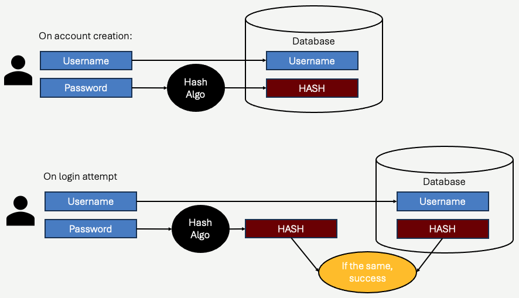

# Credentials on the Server
We've managed to solve the problem of exposing plain text passwords on the network by using HTTPs encryption.  The next challenge we have is *storing* passwords, such that we can check a user's credentials when they are submitted.

We all know the basic structure of how a server must keep track of it's users:

1. Users will have account identifiers, such as a username.  Often, the username is their email address - but it can be anything that *uniquely* identifies them within the appliction.
2. In order to *prove* the person is the real user, we ask the user to create a *password*.  Passwords should be secrets, that only the user knows.  We'll discuss password strength later - but the key here is that strictly speaking, *only the user should know their password*.
3. When the user attempts to login, they send (over HTTPS/TLS) their username and their password.  The server must verify that (1) the username exists, (2) that the supplied password is the correct password.

Points #2 and #3 appear to be in conflict.  If the user is sending a password over the internet, and the server must *verify* that the supplied password is the correct one - then clearly **the server must know the user's password**.  This violates #2 above though - which is no good.

## How do we store passwords?
It's a trick.  **We never store passwords**.  We store *transformations* of passwords - called **hashes**.  Recall, a *hash* is a cryptographic transformation of a plain text message into a *cyphertext* - but unlike encryption, the transformation is **not reversable** - it is a **one way** transformation.

Let's think of a really simplistic hashing strategy - the modulus operator `%`.  Let's think of the plain text as a simple integer, and the cypher text as the *modulus* of that input - perhaps *modulus 10*.

```
123 % 10 => 3
82376 % 10 => 6
9023 % 10 => 3
```
In this simple hashing function, the *output* cyphertext will always be an integer between `0` and `9`.  If we pretend for a moment our passwords are integers, we could store the *resulting cyphertext* with the username, and use it to check to see if the user entered the correct password.

```
user:  user_a
password: 132849
hash:  9

user:  user_b
password: 123784
hash: 4
```
In this scheme, we **do not** store `132849` or `123784`. we just store the hashes - `9` and `4` with each user record.  When user_a logs in and enters `132849` as their password, our code can *hash* the input to get `9`.  It then can check the record (presumably in our database) for user_a, and see that it matches the `9`.  The user has logged in.  If user_a mistypes their password and enteres `132848` instead, our code will hash to the value of `8`, which does not match the `9` in our records, and we can fail the log in attempt.

*If there are some problem with this scheme popping into your head, good - but let's carry the process forward a bit.*

Notice that the hashing function - modulus - is indeed a *one way* transformation.  If you have the hash - ie `9`, there's no way for you to know what the input was.  It could be any number `x` where `x % 10 => 9`.  Thus, the concept of *one way*.

By storing **only** the hash we have gained something very important:  The server (or anyone with access to the server) *doesn't actually know what the password is*.  This is fantastic - because now if an attacker, or just a curious employee, were to look at the database records, they would not know any of the user's passwords.  They'd just see the `9` and `4`.  

Now, there are a few *glaring* problems with this scheme:

1. If you know `user_a`'s password **hash** is `9`, you could actually simply enter `9` as the password - and be successful.  That's because `9 % 10` **is also** `9`.  This is a serious limitation with using the `%` operator as a hashing function - the *hash* hashes to the same hash value!  This limitation **is not** common to all hashing algorithms though.  There are better transformation algorithms (not the modulus operator) that do not have this property.  For example, with a better (and more complex) hashing algorithm, we might have a password `132849` hash to the value `4398`.  If we used **the same algoirthm** to hash `4398`, we would **not** get `4398`, we'd get some other value.  So, for now - suspend your disbelief regarding this problem - it's readily solveable.
2. It's pretty easy to notice that *many* passwords will hash to the same value.  For example, `9`, `19`, `29`, etc all hash to `9`.  In order to *guess* `user_a`'s password and successfully login, you just need to guess a password that *hashes* to the same value as `user_a`'s password does.  You don't actually need to guess the exact password - just one that hashes to the same value.  One in every 10 numbers will work!  The modulus operator - particularly a modulus with a very low value like `10` - suffers from common **collisions**.  When a hashing algorithm has collisions, it means *the same cyphertext* is generated by two or more plain text inputs.  All hashing algorithms have collisions, however more sophisticated hashing algorithms have miniscule collision frequencies - making them resistant to this problem.

There are some more problems, which we will address soon - but let's take a look at a better hashing algorithm first:  [Argon2](https://en.wikipedia.org/wiki/Argon2).  

At the time of this writing (2025), the Argon2 hashing function is considered the best practice in password hashing.  Argon2 is configurable, it can create hashes (known as *digests*) of varying lengths - up to 2<sup>32</sup> bytes.  Typically we use less - a thousand is typically considered more than enough.  Argon2 is computationally expensive - meaning it takes a CPU a fair amount of time to compute a hash.  This means that it is very difficult for an attacker to guess passwords simply by brute force - i.e. guessing every password it can think of until the hash matches the hash stored in the database.  Argon2 also consumes a fair amount of memory, making it even more resistant to brute force attempts.  Finally, for sufficiently sized inputs (see password strength below), the chances of *collisions* is infinitesimally small.  Argon2 is nothing like a modulus operation, by the way.  You can review the [psuedocode online](https://en.wikipedia.org/wiki/Argon2) (nothing is a secret).  

Argon2 is the latest in a series of password hashing algorithms that have been used.  [MD-5](https://en.wikipedia.org/wiki/MD5), [SHA-1](https://en.wikipedia.org/wiki/SHA-1), [SHA-2](https://en.wikipedia.org/wiki/SHA-2), [PBKDF2](https://en.wikipedia.org/wiki/PBKDF2) have been superceeded by Argon2 but for periods of time were considered best practice.  As computers and attackers become more sophisticated, so do the algorithms to keep ahead of them.  Currently, a brute-force attack or attempt to *reverse* Argon2 (compute the plain text from the hash) would require *centuries* for a supercomputer with processing power equal to *the world's total computation power*, on average.  [Until we have quantum computers](https://medium.com/@adelstein/why-quantum-computing-poses-a-major-threat-to-password-security-and-what-you-can-do-to-protect-21f7f7491579), you can assume the following:

1. You can tell an attacker you use Argon2
2. You can tell the attacker the inputs/keys to the algorithm. For example, the 10 in the mod 10 algorithm - Argon has input too.
3. You can tell the attacker all the parameters you used (iterations, digest length, etc)
4. You can **give** the attacker the hash (the cyphertext).
5. You can give the attacker every computer on earth.

*They still won't reliably be able to derive a plain text password that will hash to the same value you stored*.
<hr/>
Revisiting the problems we discussed above - if we use a modern hashing algorithm developed for passwords, we can be sure of the following:

1. Hashing the hash value will not yeild the same hash value.  For example, if `hash(a)` is equal to `b`, then `hash(b)` is **not** equal to `b`.  
2. The odds of guessing a plain text password that hashes *to the same* value as the actual plain text password are astronomically small. For example, if `hash(a)` is `b`, then it's extraordinarily unlikely that `hash(c)` will also equal `b`.

And above all else, while getting from plain text to cyphertext is deterministic and easy, getting from cyphertext to plain text is intractable and impossible for today's computing systems.

Here's a workflow of our hashing scheme:



The key here is that *we only store the hash*.  The *hash* cannot be used as the password, it is only used to *compare* against another hash.  When a user logs in, they enter their password, and we hash the input *using the same algorithm*.  By definition, if the user entered the correct password, then the hash of what they entered will be equal to the hash stored in the database.  If they entered a *different* password, the algorithm *essentially* guarantees that the hash of the input will **not** be the same as what was stored in the database.

### Attacks, counter measures, and salt

Simply using the best available hashing strategy takes us a long way towards secure password storage, but it's not the whole story.  Let's first isolate two *motivations* for an attack on passwords:

1. The attacker wants to login **as a specific person**.  In this scenario, the attacker is interested in a specific person's account - maybe this is a high profile person, and they want to get some information about them.  In this scenario, they must guess that particular person's password.
2. The attacker wants to login as *anyone*.  In this scenario, the attacker doesn't really care who they can login as, they just want to get into the system.  This could be because all users have the same access, perhaps to other things on the machine or within the application.  It can also be as simple as a bank account - the theif doesn't care all that much *who* their victim is - anyone will due.

With these two scenarios in mind, let' consider how our *hashed* passwords fair against some basic strategies of attack.

The most straightforward attack is - **guess the user's password**.   Take a user (`user_a`), and pick a password - `badpassword`.  Try it.  If it works, hooray (or boo), if it doesn't try another password.  If the user's password is `password`, no algorithm - Argon2 or otherwise - will protect it.  No need for quantum computing either.  If the password is easily guessable, the attacker can just guess.  

**Pro Tip**&#128161; Most applications will lock an account after a number of failed password attempts.  Recognizing that a bot can try to log in *thousands of times* to a web app, it makes sense to implement some sort of trigger in your web application to lock accounts after some number of failed password attempts.  Two or three is too few - lots of users mistype things again and again.  But after a few dozen attempts, your application should be wise to the potential that the login attempts could very well be a bot - and that bot is trying common passwords.  Lock the account, notify the user (by some other means).

Repeatedly guessing a login is a logical approach for Scenario 1 - where you perhaps know the username of the person you are trying to attack.  It's a little less reasonable for Scenario 2 - in that you are targeting *all* users.  In Scenario 2, there is a distinction between whether the attacker is aware of the valid set of usernames, or not.  If the attacker is aware, then attacker just chooses a username, and then starts guessing passwords.  If the usernames are not known, the attacker first must figure out a valid username to start guessing passwords for.

**Pro Tip**&#128161; There are two types of login failures - (1) a valid username was given, with an incorrect password and (2) an invalid username was given.  Best practice dictates that your application should not tell the user which reason.  This is so a potential attacker cannot use the login system to "guess" a valid username - which is the first step in guessing a password.  

All of the above amounts to a straightforward attack strategy - guess, over and over again.  It should come as no surprise that the accounts that fall prey to this attack are the account with exceptionally poor passwords.  Typically attackers will build *bots* to programmatically attempt password guesses.  Most applications will implement a lockout feature on an account after a fixed number of login failures, and will also *throttle* attempts to prevent bots from blasting the login with thousands of attempts per-second.  Thus, it's generally only when a user picks a really simple and easy to guess password does this type of attack work.

What if the attacker gains access to all the user accounts, and hashes?  This situation has played out many times over.  Attackers get access to a database.  Maybe a database *backup* gets left on someone's laptop, and falls into the wrong hands.  It's happend too many time - and it will happen again.  This situation differs from the guessing scenario described above because the guessing process is no longer through the application - the actual hash table is in the hands of the attacker.  In this scenario, there is nothing stopping the attacker from guessing *millions* of different password for each user:

```c++
while (true) {
    string next = next_guess();
    string hash = argon2(next);
    if (hash == hash_in_database) {
        // Gotcha!
    }
}
```
Argon2 is computationally expensive - but it's still only a few hundred milliseconds each time around the loop.  This situation is susceptable to a *dictionary* attack - where the attacker builds a gigantic list of common passwords, and simply pickes *every one*, *one by one*, until they find one that matches.

Here's where password complexity comes into play.  The search space of *all* possible passwords depends on which characters are allowed, and what the maximum length of the password is.  Let's be conservative, and say that passwords can contain numeric characters and alphabetic - including uppercase and lowercase, and that the *maximum* password length is 20 character.  Perhaps, the attacker knows this because they gained access to the code that implements such checks on user creation!

There's 52 + 10 = 62 different symbols (upper case, lower case, and digits), and up to 20 characters.  Thats over 62<sup>20</sup> combinations - over 700,000,000,000,000,000,000,000,000,000,000,000.  Multiply that by 200ms, it would take you more time than you have &#128521;.

You don't have to try all the combinations though.  People tend to choose passwords that contain common names, words, phrases.  Maybe with an exclamation mark at the end.  If we are looking at Scenario 2 - where you don't care *whose* account you crack - we're in luck.  We can simply take all the words in the dictionary (and a few variations and numbers appended) and compute the hashes for those.  The chances are good that *one* user of the system used one of those passwords!  If we are in Scenario 1, we need some more luck - we need that one particular user to have chosen one of the passwords in our dictionary - but there's still a decent chance!

The attack just described is a *dictionary* attack.  The amount of time it takes to crack passwords *reliably* comes down to how large the "dictionary" of passwords is.  The larger the dictionary, the more likely one of the users chose that password.  Attackers are clever too - they don't wait around until they have a database of hashes to do this - they can spend years calculating hashes of *trillions* of passwords - and then compare the results against the list of hashes they steal.  The point here - the *dictionary* can be hashed *ahead of time*.

We cannot do a lot about poor passwords (more on this later), but we **can** make it less possible for an attacker to *precompute* dictionaries.  This is where the concept of **salt** comes in.   

Let's assume we have a dictionary of passwords we think people will use:

```
mypassword
mypassword1
birthday
spousemiddlename
```
I can precompute the hashes for all four, and then search the stolen database for matches.  Easy.  If I had a billion passwords, I could hash them in a few hours or days, and do the same.  That's because I'm operating under the assumption that all systems that use Argon2 will hash "mypassword" the same.  Meaning, I can has "mypassword" on my machine, and when I look at an application's database, if I see that hash - I know the password was "mypassword".

Salt allows *every application* and *every user account* to be hashed **differently**.  Salt is a **random** string of text, appended to the plaintext password.  The salt is different for every user.  The salt is stored in the database, right long with the hashes.  Salt values aren't secret, but they do something really important:  they force the attacker to compute their entire dictionary *for each user*.

To conceptualize this - user A and user B both use password "password".  However, user A is randomly assigned (by the application, when the account is created) a salt value of `32nmkjlcre3389`, and user B is assigned `dfs0gi98032`.  When the *hash* is calcuated, the application doesn't hash "password", it hashes `password::32nmkjlcre3389` and `password::dfs0gi98032`.  Those two strings will hash to something *completely* different.   This means that the attacker, when looking at the hashes, doesn't know both users had the same password.  It also means that if the attacker *precomputed* the hash of "password" before, it's useless - because "password" doesn't hash to the same value as `password::32nmkjlcre3389` or `password::dfs0gi98032`.  

Critically, salt would be known to the attacker.  The attacker would know that user A's salt was `32nmkjlcre3389`.  The attacker can still perform a dictionary attack on user A, but the attacker must compute the dictionary of hashes specifically using the `32nmkjlcre3389` value.  They wouldn't have done this ahead of time, because they just obtained access to the salt.  Morever, if they fail to crack user A's password this way, they start all over again for user B - since the salt is different.

In practice, salt is many bytes - often as large as 256 bytes.  This increases the computational costs of calculating hashes exponentially - further thwarting dictionary (and [rainbow table](https://www.geeksforgeeks.org/understanding-rainbow-table-attack/)) attacks.

<hr/>
All said, we have the following strategy in place:

1. On user account creation, the application gathers a username and password from the user.
2. The application creates a *random* salt string for the user.
3. The application hashes the concatenation of the password and salt.  The result (the hash, or digest) is stored in the database, along with the username and salt.

When logging in:
1. The user supplies a username and password
2. The application looks up the user (by username) and finds the salt value.
3. The application concatenates the supplied password and the salt, and computes the hash.
4. If the username provided doesn't exist, or the computed hash does not match the hash in the database, the user is denied entry.  Otherwise, they are signed in.

## Where do we store passwords?
There are no special requirements about *where* to store passwords, as opposed to any other data.  Your application generally will be well served by storing *all* of it's application data in a database.  While configuration data might be stored in separate files (`.env`, `.json`, `.yaml`, etc), *application data* is for a database.  What type of database you use is not relevant to password storage - relational is most common (and in most cases, the right choice) - but passwords can be stored in document stores, etc.

Typically, a user's account information is stored in a single record.  That record will have all the required information about the user - but noteably will have their *username, salt, and password hash*.  Some libraries (such as the one we will use in Node.js) store salt and hash in the same data field, concatenated for convenience.  Of course, you can design your user account data schema any way you want - and if you are tracking lots of data about the user, it will probably be spread outs.

There are few considerations and reminders about where you store password hashes:

- It's bad practice to leak hashes (really bad).  Yes, they are still pretty secure if the user's password is strong - but you don't know for sure the user's password is strong.  **Never** dump passwords or hashes to log files.  Never allow password hashes to travel over to the client (when we see APIs, remember this - we don't ever want to include password hashes in API payloads!).  
- You don't need any special encryption for databases containing passwords - but you might want encryption in general.  What we mean here is that - your application has *layers* of security.  Your database shouldn't accessible by just anyone.  It shouldn't be accepting network connections from the public if possible.  It should have strong authentication measures in place.  You might also encrypt the contents of the database - although this usually incurs a performance cost.  All of these decisions are made to protect *all* the data in your database.  Password hashes, because they are hashes, are probably not as high of a concert as some other data.  For example, a database holding sensitive user information - bank account numbers, social security numbers, health records - will store this data using some form of encryption (hopefully).  This data must be encrypted, not hashed, because it must actually be reversable.  You'll need to use the actual data!  This makes this data far more vulnerable.  Bottom line, passwords aren't likely driving your security decisions - but of course they benefit from them.

## How do we recover passwords?
We don't.  If done correctly, you cannot provide the user the password they created.  This is why when you forget your password, usually the website you are trying to login to requires you to create a *new* password.  The site cannot tell you what the password was - because the site doesn't know. The website knows only the hash.  If you are working with an application that is actually able to reveal to you what your password is, understand that that application *is not* implementing best practices.

## Anti-patterns
The first time students read this chapter, the curious ones immediately start to think of *other options*.  Here's a few that come up from time to time:

1. Why don't we hash the password *client side*, since then we never send the real password over the network anyway.  **Answer**:  In this scenario, we are sending a crypographic hash of the password over either a secure or insecure network.  If the network is *insecure*, then you can assume the hash can be stolen.  If the hash is stolen, and the attacker subsequently sends the username/hash combination, then the server (expecting usernames and hashes to be sent to it for authentication) happily checks the hash and lets the attacker in.  No problem has actually been solved - essentially the hash *has become the password*.  The answer is the network needs to be secure.  Of course, if the network is secure, you can simply send plain text over it.  

2. Why dont' we encrypt the password, so if the user forgets it, we can tell them what it was?  **Answer**:  All encryption is reversable, which means there must be a *decryption* key stored somewhere on the server.  In the discussion above, we noted that by using strong hashing, we could literally give an attacker the entire user database, and the attacker would *still* not be able to do anything with it (provided users picked decent passwords).  Using encrytion significantly weakens this, because in that case, if an attacker gained access they would likely also have the decryption key.  Recall, attackers can be employees, or people with legitimate access to the server.  Putting *everyone' s* password just one decryption key away from being known is terribly risky.  It's an unnecessary risk, and one that really isn't worth it.   Telling the user their original password means you need to display it to them in plain text, on a screen - and maybe in an email or text message.  This is risky too.  

3.  Should we hash the hash, or do X more times to make things more secure?  **Answer**:  It's not necessary.  If you follow the best-practices as described above, you are good.  Any additional encryption, re-hashing, etc is ultimately not really improving upon much.  

**Pro Tip**&#128161; An attacker who has gained access to the physical server presents serious risks.  The most critical risks are that (1) they can acquire the private HTTPs keys, and (2) can inspect application memory.  Obtaining the private key for HTTPs presents problems that we've described before - but recall that doing so would then still require the attacker to successfully perform a man-in-the-middle attack on someone.  In addition, assuming the breach became known, the HTTPs certificate could be revoked immediately, eliminating on going security risk.  If the attacker can inspect main memory, they can potentially intercept plain text passwords as well.  At some point, the plain text password will be contained in a *decrypted* message body, albeit briefly.  You as an application program can only minimize the attack opportunity.  **Never** store plain text passwords in sessions, or any other variable that survives a request/response cycle.  **Never** print plain text passwords to log files!  If the an attacker can inspect memory, and the breach is discovered, it's critical that *all* passwords are invalidated - and users are required to change their password.  The damage is done however.  Unlike HTTS private keys that no longer present a risk after they are revoked, stolen passwords are forever.  Most users (even though they shouldn't) reuse passwords.  Once an attacker knows a username/password combination, even if your application no longer uses the stolen credentials, the attacker will attempt to use the stolen credentials on hundreds of other sites.  If the user chose the same username and password on other sites, then it's bad news.

## The weak links
We talked a lot about the value of hashing and salt.  We covered different attack strategies, and specifically how salt can be used to thwart attackers attempting to brute force entry.  **All of this depends on password strength**.  If a user chooses `12345` as a password, there is nothing that you as an application developer can do to prevent that password from being guessed.  If that user has a high level of access to the application, the attacker can do immense damage - but even if not, the attacker can do significant harm to the individual user that get's hacked too.  The damage can be larger than just something the attacker can do on your application.  Knowing a username/password, it's highly likely that same combination was used by the person elsewhere.  The person's entire digital life, financial life, and potentially personal life is at risk.  **You should do your best to prevent this**.

Your application should enforce password policies.  Don't let a user choose a bad password - or at the very least, make sure they understand the risks.

## Password Strength
Password strength is a contentious subject.  People have some differing opinions.  As a web developer, you should understand the stakes (see above), and also have an understanding of what makes password harder to crack.

The authority on the subject is the National Institute of Standards and Technology - NIST.  NIST publishes guidelines that become the defacto standard of most organizations implementing passwords.  The [guidelines](https://pages.nist.gov/800-63-3/sp800-63b.html) cover everything from password strength requirement, recommended procedures for detecting attacks, facilitating account recovery, and password hashing, salt, and storage.  On the password strength front, there are specific recommendations within the guidelines - but let's outline some general concepts:

1.  The longer the password the better.  As a developer, don't put upper limits on password length (or at least allow a few hundred characters).  Longer passwords mean a **much** larger search space for dictionary attacks.  

Note, users can adhere to all of these rules, and still pick guessable passwords.  There is a measure of *complexity* that determine guessability as well.  Favor using third party, vetted, and proven password strength evaluators.  Most of these are created by people who take this stuff *really* seriously - leverage their work.

Here are a few example libraries that are widely used by the Node.js community to check and evaluate password strength in JavaScript:

- [check-password-strength](https://www.npmjs.com/package/check-password-strength)
- [owasp-password-strength-test](https://github.com/nowsecure/owasp-password-strength-test)
- [zxcvbn](https://www.npmjs.com/package/zxcvbn)

Users will forget their passwords.  Your application should allow users to prove they are who they say they are using some other form - perhaps like having access to an email inbox.  Send them a "password reset" link, and allow them to reset their password.  We'll discuss this a bit in the next section.  

Do you users a favor when you allow them to reset their passwords though:  *Allow them to use a previously used password.*  This is a little controversial, but remember that passwords are only as good as a user's willingess to follow advice.  Users who work with password managers are happy to recreate long, secure passwords if for some reason they lose access.  Other users will need to reset their password specifically *because they forgot theirs*.  If they happen to try to reset it to a previous or current (it happens!) password, it's because they forgot it in the first place.  As long as it's strong enough, so be it.  Forcing them *not* to use a password they used before usually ends up in a frustrated and annoyed user appending `!` to the end of the very same password (or something similar).  This doesn't increase security, and it also makes it **much** more likely they will forget **this** password soon too.

An emerging trend is to do away with passwords altogether, and force users to access their email or phone (text message) to obtain a **O**ne **T**ime **P**assword (OTP) instead.  This grew from the observation that many users, when forced to use strong passwords, essentially forget them *all the time**, and logging in becomes a routine of choosing "Forgot password", obtaining a reset link via email (proving the user has access to their email account), and creating a new passowrd.  Exclusively using an OTP bypasses the ordeal - skipping right to the email!  It's not a terrible approach!

**Pro Tip**&#128161; For yourself - **use a password manager**.  If you read the above carefully, you quickly realize that the best passwords are long, random, and impossible for you to remember.  On top of that, no matter how good your password is, you should never reuse it.  All it takes is *one* poorly implemented web application for your wonderfully constructed password to be broken.  Thus, password managers which can generate unique and strong passwords for each web site you access are the *gold standard* of personal web security.  As a developer, you can't force your users to use them - but you can certainly do so yourself!

## MFA
A note on [multi-factor authentication](https://en.wikipedia.org/wiki/Multi-factor_authentication).  While it's beyond the scope of this book, sufficiently large applications will likely need to communicate with users.  They send emails, they send text messages.  Multi-factor authentication leverages this - with the idea that users authenticate either wholely or in part by proving they have access to their devices.  Typically, emails or text messages are sent with OTPs.  More secure methods also exists, using third party applications (authenticators) and physical keys.  All of these things are important layers of security, all are part of the authentication process.  In this book and in the next section in particular, we'll *only deal with regular passwords*, because we are focus on learning about how things flow in a web application.  Adding additional security doesn't change the architecture and concepts - it just adds more detail.