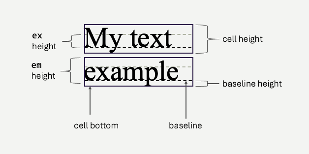

# Styling Text
We've learned the syntax of CSS, how and where we can write it, and how the browser decides which rules to use when rendering.  Over the next few sections, we will take a broad tour of which CSS properties/attributes are available to us.  We'll start with styling that is specifically about the appearance of text, wherever it is found on our pages.

## Font Families
Font control the essential shape and appearance of the letters we use for text.  The characters are typically called *glyph*, and a font defines the precise pixel geometry of each *glyph* in the character set.  Fonts are a tricky subject, from the perspective of the web, because fonts themselves are *traditionally* the purview of the **operating system**.  When your operating system is installed, it comes with collections of fonts - Ariel, Times New Roman, Verdana, Gothic, etc.  Some of these fonts were developed by the operating system vendor, some are open source, some are *licensed* and the cost of using them is already baked into the cost of the operating system itself.  They are stored on your machine in a variety of file formats, depending on the operating system.  On Microsoft Windows, for example, font files are found in `C:\Windows\Fonts` - usually *.tff or *.otf files.  They are bitmaps - meaning they are really just simple arrays of pixel data - drawing each glyph.

Why are we talking about glyphs and font files?  You, as a web developer, don't know which operating system your page's visitors is using.  Different operating systems come with different subsets of fonts.  There's actually a suprising *lack* of consistency!  All this is to say, when we specify fonts to be used on a web page, we need to do so carefully.

The `font-family` attribute describes the font to be used for a particular set of HTML elements.  For example:

```css
p {
    font-family: serif;
}
```
The CSS above instructs the browser to use a *serif* font.  *Serif* means that the characters have those little feet and hooks, as opposed to *sans serif*, which is *without* serif.

<span style='font-size:24pt; margin-right:2em; font-family:serif'>serif</span><span style='font-size:24pt; margin-right:2em; font-family:sans serif'>sans serif</span>

Serif and Sans Serif are not actual fonts - you won't find them on your operating system.  They are *classifications* of fonts, and your operating system is bound to support at least one - and usually has a *default* option for each classification.  The CSS specification takes advantage of these classifications, ans supports 5 base classes of fonts:

<span style='font-size:20pt; margin-right:2em; font-family:serif'>serif</span><span style='font-size:20pt; margin-right:2em; font-family:sans serif'>sans serif</span>
<span style='font-size:20pt; margin-right:2em; font-family:monospace'>monospace</span><span style='font-size:20pt; margin-right:2em; font-family:cursive'>cursive</span>
<span style='font-size:20pt; margin-right:2em; font-family:fantasy'>fantasy</span>

As a web developer, specifying one of these classes doesn't give you total control - the web browser will render the text using the *default* font found within that class on the user's system.  You can *try* to exert more control however.  The `font-family` attribute permits you to specify a *series* of fonts - which the browser will use **if they are available**.  For example:

```css
p {
    font-family: "Edwardian Script", "French Script", cursive;
}
```
<p style="font-size:24pt; font-family: 'Edwardian Script', 'French Script', cursive;">Some font, but not quite sure!</p>

The browser renders in the first font available on the user's system - left to right.  If your operating system supports "Edwardian Script", it will be used to render the text above, if not, maybe "French Script", and as a final fall back - it will use *whatever* cursive default is available.

Typically, you will always want to **at least** end the `font-family` attribute with one of the base classes - which are written *unquoted*.  All other fonts are quoted.  There are some fonts that are more commonly supported than others.  The W3 School lists a few:

- <span style='font-size: 20pt; font-family: "Arial", sans serif'>Arial</span> (sans-serif)
- <span style='font-size: 20pt; font-family: "Verdana", sans serif'>Verdana</span> (sans-serif)
- <span style='font-size: 20pt; font-family: "Tahoma", sans serif'>Tahoma</span> (sans-serif)
- <span style='font-size: 20pt; font-family: "Trebuchet MS", sans serif'>Trebuchet MS</span> (sans-serif)
- <span style='font-size: 20pt; font-family: "Times New Roman", serif'>Times New Roman</span> (serif)
- <span style='font-size: 20pt; font-family: "Georgia", serif'>Georgia</span> (serif)
- <span style='font-size: 20pt; font-family: "Garamond", serif'>Garamond</span> (serif)
- <span style='font-size: 20pt; font-family: "Courier New", monospace'>Courier New</span> (monospace)
- <span style='font-size: 20pt; font-family: "Brush Script MT", cursive'>Brush Script MT</span> (cursive)

[Font stack](https://www.cssfontstack.com/) is another nice resource for judging how widely supported your chosen font will be among your users.  Be conservative, if you are really tied to a particular font, you might be dissapointed to learn many of your uses aren't seeing what you thought they'd see!

### Web Fonts
There is an alternative to the "hope for the best" font selection, and that's to have the user's browser download the font you want to use itself. Providers such as [Google Fonts](https://fonts.google.com/) have thousands of fonts availble, available as fonts defined in CSS.  These fonts can be linked on your page.  For example, here's the `link` element for the font face `Roboto` that can be placed in your HTML file.  It pulls in Roboto, in a variety of weights and styles (italics).

```html
<link href="https://fonts.googleapis.com/css2?family=Roboto:ital,wght@0,100;0,300;0,400;0,500;" rel="stylesheet">
```
<div>
    <link rel="preconnect" href="https://fonts.googleapis.com">
    <link rel="preconnect" href="https://fonts.gstatic.com" crossorigin>
   <link href="https://fonts.googleapis.com/css2?family=Roboto:ital,wght@0,100;0,300;0,400;0,500;0,700;0,900;1,100;1,300;1,400;1,500;1,700;1,900&family=Titillium+Web:ital,wght@0,200;0,300;0,400;0,600;0,700;0,900;1,200;1,300;1,400;1,600;1,700&display=swap" rel="stylesheet">
    <style>
        .roboto {
            font-family: "Roboto";
            font-size: x-large;
        }
    </style>
    <p class="roboto">Roboto Font Example</p>
</div>
That font can now be used in a `font-family` rule, by name - `font-family: "Roboto", sans serif`.  The downside of this style of web font is that it's slower, and can cause page loads to reflow and flicker as the browser renders the text first using a standard font, and then with the downloaded CSS font.

You may also embed your own font files, hosted on your own server.  This is done by defining a *font-face* in your CSS, and linking it to a glyph file - `woff` being the most commonly used extension, which is the [Web Open Font Format](https://developer.mozilla.org/en-US/docs/Web/CSS/CSS_fonts/WOFF)

```css
@font-face {
    font-family: 'my-font';
    src: local('my-font'), url('./my-font.woff') format('woff');
}
```
Once the `font-face` has been defined, you can use the font name in any `font-family` CSS rule.  This method tends to have better visual performance, avoiding text flicker as fonts load.

### Recommendations on Fonts
If your priority is snappy page loads, especially on mobile devices, you will likely what to avoid web fonts. As long as you don't need absolute control of the exact font used, using a system font optimizes user experience.  In reality, unless your font is communicating brand, it's probably OK to use a legible set of basic fonts - so opt for this first.

If you need total control over the font, then start looking at web fonts.  Google Fonts and other providers allow you to explore lots of fonts, and perhaps settle on something.  Before locking in, you should also explore open source fonts that you can serve directly and embed as `@font-face`, as this offers the next best performance aside from relying on system fonts.

## Font Size
Font size is controled using the `font-size` attribute, where the value can be specified in a large variety of ways:

```css 
p {
    font-size: 1em;
}
```
`1em` means the font-size is being sized *proportionally* to it's parent element - in this case, 1:1.  Let's look at some of the different ways you can specify font sizes:

### Physical Estimates

- `px` - using `px` allows you to size the font directly, by pixel, on the user's screen.  The *typical* default font size is 16 pixels, but this is tricky - because screens have very different pixel densities - meaning pixels can be different *physical* sizes depending on the device your user is viewing the page on.
- `pt` - specifying fonts in *point* size is a relatively old-school style of specifying fonts.  Pixels are generally assumed to be about 1/96th of an inch, making 16px fonts on "standard" devices comfortable to read.  The term "standard device" is problematic in today's world, making `px` problematic too.  Point sizes really suffer from the same issue, they are just different physical dimensions.  1 *point* is assumed to be 1/72nd of an inch (so, slightly bigger than a pixel).  16px is roughly equivelant to 12pt.  
- `cm`, `mm`, `in` - use these dimensions is rarely advisable.  For all the same reasons `px` and `pt` can be problematic (screen densities), these measurements have the same challenge, *plus* they aren't really intuitive for graphic designers.  Generally speaking, the notion of specifying elements of HTML (font or otherwise) in *physical* dimensions is very likely always a mistake - as you inherently cannot control the user's physical display device size, nor pixel density.

### Relative Sizes
- `rem` - `1rem` means that a font (or any other element) is to be the same size relative to the *root* - the `html` element.  In the context of font sizes, it means the font size of the given element should be the same as the font size defined on the `html` element.  `1.5rem`, `2rem`, `10rem` mean 1.5x, twice, and ten times the size of the root element.  `rem` units are always relative to the root, making them predictable for developers.  In addition, the `html` element's default font-size set by the web browser generally takes things such as physical display size and pixel density into account.  The web browser can do this because it has access to operating system APIs that will provide it.  This means the `html` element's default font size will generally be a very reliable guide as to a comfortable font.  Sizing elements *relative* to it tends to produce good results across a variety of devices.
- `em` - `em` is very similar to `rem`, but the sizing is relative to the *parent* element.  Let's say a `p` element is sized at `2em`.  If it is within a `body` that is also sized at `2em`, then the `p` element has *four times* as large of text as the default `html` elmeent.  In the same scheme, if both `p` and `body` were set to `2rem`, then both would simply be twice as large.   
- `%`  - percentage based sizing is equivelent to using `em`.  200% is equivelant to 2em.  It is relative to the *parent*.  
- `vw` or `vh` - View width (`vw`) and view height (`vh`) are a newer and popular alternative - combining a bit of the *phyical* dimension with the relative concept. `1vw` is equivelant to 1% of the device's viewable width.  Note, it's the device/window - technically, the *viewport*.  This means that the dimension will change size fluidly as the window of the browser changes on a desktop, and will expand/contract based on mobile device sizes.  A font size of something like `2vw` is a common choice for regular text.

### Size classes
You can also specify size *classes*, in both absolute and relative notation.  By using these classes, the browse ultimately decides the specific font size used.  Each size classification is roughly 20% larger than the previous.  

#### Absolute Sizes
- `xx-small`
- `x-small`
- `small`
- `initial` (the default)
- `large`
- `x-large`
- `xx-large`

#### Relative (to the parent) Sizes
- `smaller`
- `larger`

Of the entire set, generally developers stick to `px`, `em`, and `rem`.  The most recommended approach is to use `em` and `rem`, and to avoid `px` because a pixel on one device just simply *isn't* the same as a pixel on another device.  Screens have varying densities - for example, mobile device pixel density is much higher than a low-cost, large desktop monitor.  A font that looks adequate at a certain pixel dimension on a desktop monitor may look extremely small on a high end mobile device.  Typically, browsers will calculate quality default sizes for `html` and `body` based on the device's pixel density - and if you stick to using `em` and `rem` you are always specifying sizes *relative* to the size the browser selected for the document itself.  The difference between `em` and `rem` is simply what you are defining the font *relative* to.  Many developers find `rem` to be easier to work with, because it is unaffected by parent element changes.

### The Line Box
Another aspec to the physical dimensions that fonts take up on the screen is the *line box*.  The line box controlled partially by the font, and partially by the `line-height` CSS property.  Each text glyph occupies a *cell*, which has a height and width.  `font-size` ultimately defines the height of the individual *glyph*, from the *baseline*  to the top of the cell - called the **em height**.  The font family (the actual font) defines the ratio between em height and ex height, along with baseline height - shown in the figure below.  These ratios are necessarily defined by the font itself, because they are driven by the actual shape of the glyphs.  For some fonts, characters like `y` and `j` dip further below the baseline than other fonts - necessitating a larger *baseline height*, and likewise the relationship between the height of capitalized letters and lower case letters has the same variation driven by the shape of the glyph.



By specifying the `font-size` and `font-family`, you specify the *em height, ex height, baseline height, and cell height* of the text.  However, cells form *lines*, and lines occupy vertical space on the screen.  You may increase (or decrease) *line height* using the `line-height` property, typically using percentages, viewport height, or em/rem values.

```css 
.shorter {
    line-height: 50%
}
.taller {
    line-height: 200%
}
```

<div style='color:yellow'>
<h4>Shorter - `line-height: 50%`</h4>
<p style='line-height: 50%; width: 300px'>In CSS, line-height controls the vertical spacing between lines of text within an element. It can be specified in units, percentages, numbers, or the keyword normal.</p>
</div>

<div style='color:aqua'>
<h4>Normal - `line-height: 100%`</h4>
<p style='line-height: 100%; width: 300px'>In CSS, line-height controls the vertical spacing between lines of text within an element. It can be specified in units, percentages, numbers, or the keyword normal.</p>
</div>


<div style='color:magenta'>
<h4>Taller - `line-height: 200%`</h4>
<p style='line-height: 200%; width: 300px'>In CSS, line-height controls the vertical spacing between lines of text within an element. It can be specified in units, percentages, numbers, or the keyword normal.</p>
</div>

## Font Style
There are three attributes used to change the actual glyphs used when rendering fonts.  For some fonts, the used of these attributes actually changes the font bitmaps that are used to render the glyps, because for many fonts, the artists create separate renderings for bold, italics, and other variations.  This is, in fact, why we call the font a *font family*, it's a group of glyphs in most cases.

- `font-style` can be set to `normal`, `italic`, or `oblique`
- `font-weight` can be set to `normal` or `bold` 
- `font-variant` can be set to `normal` or `small-caps` (and some others, see the [MDN](https://developer.mozilla.org/en-US/docs/Web/CSS/font-variant))

<table>
    <tr>
        <td style='font-style: normal; font-weight:normal; font-variant: normal'>Normal Font Style, Normal Weight, Normal Variant</td>
        <td style='font-style: italic; font-weight:normal; font-variant: normal'>Italic Font Style, Normal Weight, Normal Variant</td>
        <td style='font-style: oblique; font-weight:normal; font-variant: normal'>Oblique Font Style, Normal Weight, Normal Variant</td>
    </tr>
    <tr>
        <td style='font-style: normal; font-weight:bold; font-variant: normal'>Normal Font Style, Bold Weight, Normal Variant</td>
        <td style='font-style: italic; font-weight:bold; font-variant: normal'>Italic Font Style, Bold Weight, Normal Variant</td>
        <td style='font-style: oblique; font-weight:bold; font-variant: normal'>Oblique Font Style, Bold Weight, Normal Variant</td>
    </tr>
    <tr>
        <td style='font-style: normal; font-weight:normal; font-variant: small-caps'>Normal Font Style, Normal Weight, Small-caps Variant</td>
        <td style='font-style: italic; font-weight:normal; font-variant: small-caps'>Italic Font Style, Normal Weight, Small-caps Variant</td>
        <td style='font-style: oblique; font-weight:normal; font-variant: small-caps'>Oblique Font Style, Normal Weight, Small-caps Variant</td>
    </tr>
</table>

*Oblique is rarely much different from italics* but there is subtle difference.  Oblique actually uses the *normal* glyph, and transforms it to be slanted - while *italics* actually uses (when available) a different glyph.  The difference is usually fairly small, but in some special cases, where you have very specific constraints, might be meaningful.  

## Pseudo-Selectors for Text
We've already covered some CSS pseudo selectors for identifying particular *elements*, however there a few that allow you to specify specific parts of text as well.  This is different than element selectors, because individual characters in text are not often (perferrably) wrapped in their own elements.

```css
p {
    color:aqua;
}
p::first-line {
  font-weight: bold;
  text-decoration: underline;
}
p::first-letter {
    color: yellow;
}
```

```html
<p>
    The ::first-line pseudo-class styles the first line of a 
    block-level element, while ::first-letter styles the first 
    character. Both enhance typography, supporting 
    properties like font, color, or size.
</p>
```

<div>
<style>
    .demo {
        color:aqua;
    }
    .demo::first-line {
        font-weight: bold;
        text-decoration: underline;
    }
    .demo::first-letter {
        color: yellow;
    }
</style>
<p class='demo'>
    The ::first-line pseudo-class styles the first line of a block-level element, while ::first-letter styles the first character. Both enhance typography, supporting properties like font, color, or size.
</p>
</div>

These selectors are particularly helpful because they react to the browser's text flow layout.  When the window size changes, text reflows, and the characters belonging to the *first line*, for example, will change.  The CSS styling will apply to the *correct* characters, in all cases - without any extra work on your part!

### Selecting other parts of text?
As a fallback, we often use the `span` element to attach different styles to text without disrupting the flow of the text itself.  Here, we've wrapped a specific portion of the text and colored it differently.  Of course, there are also other more *semantic* inline HTML elements, like `code`, `cite` etc that you could use (and style) for this purpose as well.

```css
span.special {
    color: yellow;
    font-weight: bold;
}
```
```html
<p>
     The span element in HTML is an inline container used to apply styles or
     <span>manipulate</span> a specific portion of text. It doesn't inherently affect 
     layout but works <span class="special">well with CSS</span> or JavaScript.
</p>
```
<p>The span element in HTML is an inline container used to apply styles or <span>manipulate</span> a specific portion of text. It doesn't inherently affect layout but works <span style="color: yellow;font-weight: bold;">well with CSS</span> or JavaScript.
</p>


## The Kitchen Sink
There's more we can do with text, and you should explore the [MDS](https://developer.mozilla.org/en-US/docs/Web/CSS/CSS_text) and other resources to learn more.  With modern CSS, you can essentially do *anything* you need to with text!

- `letter-spacing`: Adjusts the horizontal spacing between characters in text for improved readability or design purposes.  Typical values are `normal`, or a specific length (e.g., 2px, 0.1em).
- `word-spacing`: Modifies the space between words in text to enhance layout and legibility.  Typical values are `normal`, or a specific length (e.g., 2px, 0.1em).
- `text-transform`: Controls text capitalization, converting it to uppercase, lowercase, or title case.  Common values are `none`, `uppercase`, `lowercase`, `capitalize`
- `text-indent`: Sets the indentation of the first line of a block of text.   Usually a specific length (e.g., 2px, 0.1em).
- `text-align`: Aligns text horizontally within its container. Typical value are `left`, `right`, `center`, `justify`, `start`, `end`
- `text-decoration`: Adds or removes effects like underline, overline, or strikethrough to text.  Values include `none`, `underline`, `overline`, `line-through`, `underline overline`.
- `white-space`: Controls how white space, line breaks, and wrapping are handled in text.  This is useful when trying to control how a browser automatically wraps words and lines of text.  Common values include `normal`, `nowrap`, `pre`, `pre-wrap`, `pre-line`.

There are [many](https://developer.mozilla.org/en-US/docs/Web/CSS/CSS_text) others - explore!

