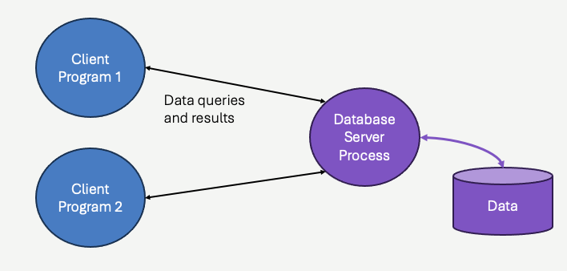
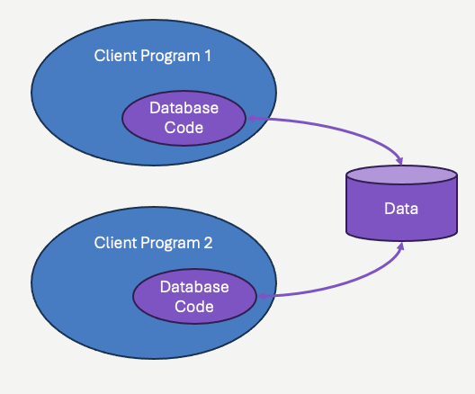

# Working with Databases
In the previous chapter, we enhanced our guessing game example to record games played, along with the guesses made by users.  We created a history page that let us view these past games.  There's one problem though - *whenever the server application restarts, that data is lost*!  We all know that's not a sustainable limitation.  We need **persistant** data storage - not just in web applications, but in *most* applications.

A few notes before we get started with databases:

## Why don't we just make sure the server doesn't restart?
If you are relatively new to programming, you might be asking - why would a web server application restart in the first place?  Why does the data need to be held somewhere other than memory?  You might be thinking that *real* web applications should be designed so they don't crash, and should be run on machines with backup power (or in the cloud!).  

**This isn't practical**, and it's not realistic.  **All programs eventually crash**, even programs [running on intersteller spacecraft](https://www.eejournal.com/article/jpl-software-update-rescues-failing-voyager-1-spacecraft/).  Your web application will need to be restarted.

Reliability is actually much more meaningfully achieved by designing applications that are robust *in the event of failure*.  This means that if you are aiming to make things reliable, your first mission is to make sure your application can smoothly *restart* and get right back up and running when something unexpected happens to kill it.  

It's called *resiliancy*.  You worry about limiting the number of times you need to be resiliant... after you are resiliant.

## Why Databases, Why not Files?
Students who do not know a whole lot about databases often reflexively turn to *files* instead of databases.  In fact, in the previous chapter we saw that the `require` statement can be used to read JSON files into our application.  It's easy to imagine combining that with `fs` to write modified JSON files back to disk in order to *persist* you data to JSON files.  JSON files are nice for structured data - so why not?  

The first part of the answer is that files have a number of limitations:  They can become corrupted - especially when multiple programs attempt to write to them at the same time.  They can also become quite large, and are typically very difficult to read *partially*.  For example, a small JSON file containing guessing game records might work well while you have had a few hundred people play the game.  Once the guessing game gains in popularity though (it's only a matter of time &#x1F61C;), the file you are storing the games in could become many gigabytes.  You won't want to read the entire file at once, and serve a page with billions of records - so you'd need to figure out how to read only *parts* of the JSON file.  Suddenly `require` isn't that great (it can't do this), and you start thinking about custom parsing.  You'll then start to question your decisions.

The second part of the answer is actually related to the first.  The main reason you shouldn't store application data in regular files (text, JSON, XML, or otherwise) is because files are *incredibly limited* in functionality when compared to databases!  Databases allow your application to read and edit data without caring whether other programs are doing the same.  Databases allow your application to read *exactly* the information you need - and *no more* - when you need it.  

Files can be good for storing config data (although lots of applications use databases for *most* config data), and files can be OK in some cases when you have data that is necessarily *readonly* and fairly small.  *For all other use cases*, those who design applications around file storage often end up implementing many of the same features (at least eventually) that databases would have given them in the first place - and those implementations tend to be much more limited and sometimes flawed.

The reality is that *persistant* and *editable* data is really hard to do well.  You need to worry about data durability (corruption), consistency (when multiple programs are reading and editing it) and scaling and efficiency.  The fields of **database design** has largely **solved** these problems - you just need to learn how to use  it!

## What is a database, really?
A database is data, but it is also **code**.  This book isn't about databases, you will be given a lot of links at the end of this section for further reading, but we need to understand some basic principles.

When we talk about data, we are talking about *application* data.  This data is *structured* - meaning it's not just plain text (although it of course is likely to contain lots of text too).  It's the user account data, it's the guessing game records, it's all the analytics keeping track of page views and clicks.  The data will be edited.  New data will be created, and sometimes deleted.  When you read the data, you aren't likely to ever need *all of it* at the same time, you usually just want specific parts of it.

*Databases* are the application data on disk (usually), but *databases* are also **the code** that implements all the creating, reading, updating, and deleting of the data.  It's the code that organizes the data on disk, such that it can be efficiently retrieved - indexed and queries.  It is also the code that implements *synchronization*, allowing multiple programs to read and edit the data simultaneously without data corruption.  A small amount of this code is the responsibility of the *application programmer*, but MOST of it is code *within* the database - either running as a separate process on the machine, or in a library of code embedded within the application code itself.

Let's look briefly at both designs, before turning our focus solely to the former:

### Databases as separate processes
Most database systems you've likely heard of fall into this category.  PostgreSQL, MS SQL Server, Oracle DB - these are all databases that run a separate programs.  The programs (they are typcally called databases "servers", in much the same way as our web applications have web "servers") are completely distinct from the applications that *connect* to them - the clients.



In the diagram above, *clients* (for example, our web application server!) *connect* to the server and send **queries** to it.  The queries are structured text commands, describing the data being requested.  In most cases, that structured query is written in the **S**tructured **Q**uery **L**anguage - SQL.  The *connection* process might be through pipes if the client and database server are on the same machine, but can also (and often) be through network sockets when the database server is on a separate physical computer.  The network connection procedures are in many ways similar to web browsers and web servers - in that we need to know the IP address and the port number to connect to.

The critical thing to take away from this is that programs interact with the database server by sending SQL commands to it, and the database server sends back structured results in the form of *records*.  The client (and the application programmer, to some extend) is responsible for sending the correct SQL for the data it needs, and handling the results.  The database server is responsible for handling and fullfilling the request - including data consistency, synchronization, and efficiency.

### Databases as code library
While having the database implemented as a separate process is often required, there are many situations where it is not entirely necessary.  An alternative is having all the code responsible for handling and fullfilling SQL requests included in a *library* that the application you are writing simply calls.  Think of this like doing `require` or `#include`, with a set of function calls to invoke SQL, rather than sending SQL over a socket or pipe connection to a separate process.  

The difference in design is important, however from a purely code perspective, the differences aren't dramatic.  Since the library needs to know where the database files are, there is still some sort of *initialization* where you "open" a connection to the database - but this time there is no pipe or socket involved.  At that point, you send SQL and receive results back, the fact that the SQL and results aren't crossing a process boundary or a network boundry is largely hidden.



The most notable in-process database is [SQLite](https://www.sqlite.org/).  SQLite is a C library that implements a full featured SQL relational database.  [It is the the most widely used and deployed database i\n the world](https://www.sqlite.org/mostdeployed.html).  It is exceptionally fast, easy to install, runs everywhere and it's open source.  We are going to use it exclusively in this book.

Note, web applications generally use database *servers* - separate processes.  This is because web applications tend to scale quite large (or at least, they plan to).  This scaling normally requires the web application to be splintered into *many* web server applications all running identical code - with a load balancing application routing network traffic to different servers to handle the requests.  When you have multiple programs accessing the same database, having a separate server - generally on a different computer - is more attractive, and can provide more synchronization safety.  **Again**, this isn't a database book - and we'll leave this discussion alone for now.  Just understand that we are using SQLite in this book **for simplicity**, not because it's likely to be your choice when creating a full scale web application.  *Nothing* about SQLite in terms of application design, or SQL, is going to be any different than PostgreSQL, Oracle, MS SQLServer, etc - they are all relational databases and will function quite similarly *from a code perspective*.


## Getting Started with SQLite
We are going to cover databases entirely through example - and that example will be the *guessing game* application.  Before we do anything with our application code, we need to *create* a database using SQLite.  While eventually we will actually do this step *through Node.js code*, we are going to start out doing this outside of our application - using the SQLite command line tool itself.

**Pro Tip**&#128161; **If you haven't read the previous chapter, please do so now - because we are going to be using the code from that chapter here!**

First step - download SQLite and install on your platform.  You can find downloads and instructions for all major platforms [here](https://www.sqlite.org/download.html).  **Note**, download SQLite means downloading the SQLite command line tool - there is no "database server", there's just a C library.  The command line tool is a command line (terminal) user interface for creating SQL commands, and invoking the C library code to execute the SQL commands themselves.

Once you've downloaded it, you should be able to type the following on your command line or terminal:

```
% sqlite3
SQLite version 3.43.2 2023-10-10 13:08:14
Enter ".help" for usage hints.
Connected to a transient in-memory database.
Use ".open FILENAME" to reopen on a persistent database.
sqlite> 
```
You can type `Ctrl+D` to exit.  The prinout above explains that by just invoking `sqlite3` you've created (and connected to) a *transient* in-memory database.  This is nice for testing, but it's not why we are here - we want persistance!

We are going to create a *new* version of the guessing game application from the previous chapter(s).  Go ahead and create a folder on your machine called `guessing-db` (or whatever you wish), and navigate your command line / terminal to that location.  Now, let's actually create a *database file* in that directory:


```
% sqlite3 guess.db
SQLite version 3.43.2 2023-10-10 13:08:14
Enter ".help" for usage hints.
sqlite> 
```
Typing `sqlite3 guess.db` creates and opens a database file at the current working directory.  Let's create a *table* in our database - which is where we will hold all the game records for our application.  

```
sqlite> create table game (id integer primary key, secret integer, completed integer, time text);

```
Press enter after the `;`, and the table will be created.  This table will eventually hold one row per game played.

If you type `Ctrl+D` again, to exit, you can view the database file itself.  Do a `dir` or `ls` and you will see "guess.db" there.  It's a *binary* file, you won't really be able to view it just yet.

Before moving to the application code, let's get a feel for how data will be added to the database itself.  Let's again open up a connection to `guess.db` and this time insert a new game record.  Ordinarily, it's our application that would do this - but for now we will just make up some values to store:


```
sqlite3 guess.db
SQLite version 3.43.2 2023-10-10 13:08:14
Enter ".help" for usage hints.
sqlite> insert into game (secret, completed, time) values (5, 1, "yesterday");
```
Exit out again with `Ctrl+d`.  The `insert` statement above inserted a row into the the database file.  If you do a `dir` or `ls`, you might notice there are more bytes associated with the file now (although on some platforms there might not be any change, due to pre-allocation of disk space when the database file was created).

Open the database file again, and this time issue a `select` statement to view the current data held in the `game` table.  It's the same data we entered.

```
sqlite> select * from game;
1|5|1|yesterday
```
There's no reason to keep exiting `sqlite3`, you can continue to add things, and read things, and delete things.  Feel free to experiment if you want.  We are going to use SQL in simple ways throughout this chapter, nothing particularly fancy.  SQLite contains documentation for SQL (particularly, the dialect of SQL it understands) [here](https://www.sqlite.org/lang.html).  There are many resources for SQL on the web as well:

- [SQLite SQL Documentation](https://www.sqlite.org/lang.html)
- [WWW Schools Tutorial](https://www.w3schools.com/sql/)
- [SQL Zoo](https://sqlzoo.net/wiki/SQL_Tutorial)


## Accessing SQLite from Node.js
You should have already created a dedicated directory on your machine for the application we are building in this section, and `guess.db` should be the only file in it.

Next, copy the `framework.js` and `guess.js` files from the previous chapter's final example.  You can find that source code in it's entirety [here](https://github.com/freezer333/web-foundations/tree/main/code/guessing-game-first-framework)  [TODO - GITHUB CODE]

Now let's get started with changing the application to use *persistant* storage for the game and guess records.  Within `guess.js` we can identify the clear area of the code where things are going to start changing - the *in memory* listings:

```js

const Framework = require('./framework');
const http = require('http');

const games = [];  // <- this is the in-memory array of games 
                   //    that we will be getting rid of!


class Game {
    #secret;
    constructor(id) {
        this.id = id;

        // Create the secret number
        this.#secret = Math.floor(Math.random() * 10) + 1;
        this.guesses = [];

        ...

```
The games array will be going away, instead we will retrieve games from the database.  In order to do that, we need to include a library for Node.js code that can *implement* the SQLite code/logic.  There are several libraries available to do this (SQLite is immensely popular), we will use a library called `better-sqlite3`.  To install it, you need to execute the following command from within the same directory as `guess.js`, `framework.js` and `guess.db`.

```
npm install better-sqlite3
```
After installing, do a `dir` or `ls` - you should see new files/folders - `package.json`, `package-lock.json` and `node_modules`.  We are going to look more closely at these in the next chapter - for now simply understand that you've downloaded additional JavaScript (and C) code that you can now utilize via `require` statements in your own code.

At the top of the `guess.js` file, let's *require* the new library, and open a connection to the `guess.db` database file.  

```js
const Framework = require('./framework');
const http = require('http');

// Require a reference to the better-sqlite3 
// library
const sql = require('better-sqlite3');

// Open the database file.  db will now be an
// object associated with that file, and can 
// be used to access data within it.
const db = sql('guess.db');

```

We already put one row in the `guess.db` file, let's add a *temporary* line of code just to test things out, at the bottom of `guess.js`:

```js
const router = new Framework.Router();
router.get('/', start);
router.post('/', guess, true, schema);
router.get('/history', history);
router.get('/history', game_history, true, [{ key: 'gameId', type: 'int', required: true }]);

// This is temporary.  We are issuing a select
// statement to get all the rows currently in game.
const r = db.prepare('select * from game').get();
console.log(r);

http.createServer((req, res) => { router.on_request(req, res) }).listen(8080);
```
The `db.prepare` function returns a *prepared statement*, which you can think of as a compiled, but not yet *exectured* SQL command.  The prepared statement has a `get` function, which fetches the results of the SQL statement.  The result of `get` is an object, representing the row returned.

If we run that code, you will see the following print out  - which is from the original `insert` we did on the `guess.db` file.


Let's prove out a bit more.  Open sqlite3 again, and add two more games to the table:

```
sqlite3 guess.db
SQLite version 3.43.2 2023-10-10 13:08:14
Enter ".help" for usage hints.
sqlite> insert into game (secret, completed, time) values(6, 1, "thursday");
sqlite> insert into game (secret, completed, time) values(3, 0, "today");
sqlite> ^D
```
Note that we are using 1 for completed to represent a game that was played to completion, and 0 for an in progress game.  If we re-run `node guess.js`, we will see (somewhat unexpectedly) still just one record - the first one we created. That's because `get` returns only the *first* record matched by the SQL query.  If we want them *all*, we need to call *all*!  

```js
const r = db.prepare('select * from game').all();
console.log(r);
```
```
[
  { id: 1, secret: 5, completed: 1, time: 'yesterday' },
  { id: 2, secret: 6, completed: 1, time: 'thursday' },
  { id: 3, secret: 3, completed: 0, time: 'today' }
]
```
Notice the `id` property on each of  these records.  We didn't explicitely add them when doing the the insert.  Instead, sqlite has created them for us.  That's because when we called `CREATE TABLE` when creating the actual table, we set the 

**Pro Tip**&#128161; You might be somewhat surprised to see that the `db` functions are *not* asynchronous.  Most database libraries in Node.js are asynchronous, and work with promises - which should make sense - databases are I/O after all.  `better-sqlite3` explicetly breaks the trend, offering a synchrnonous API.  At first, this was seen as farely controversial, however the overwehlming majority of database calls end up being done in strict sequence, and there are some advantages to having a synchronous API in terms of synchronization and overall performance of the database logic.  All that said, you can expect *most* libraries to have asynchronous APIs rather than synchronous - `better-sqlite3` is the exception to the rule.

## Integrating into Guessing Game

At this point, we know enough to get to work on our application. We need to revise the following:

1. When a game is created, instead of adding an object to the `games` array, we `INSERT` into the database.
2. When rendering the guess page (the form that the user enters their guess on), we must find the game, by it's ID, by finding it in the database.
3. Recording when the game is completed, such that it is saved to the db rather than just edited in memory.
4. Recording guesses (we'll wait on this)
5. Rendering game list (history page)

We'll wait on #4 for moment, we'll need another table in the database for that.

### Creating the Game Record
We create game records by calling the constructor of the `Game` class when rendering the start page.  Here's the existing code:

```js

const start = (req, res) => {
    // The parameter to the Game constructor is the ID.  We used
    // the current length of the games array as an array, since it
    // is unique.
    const game = new Game(games.length);
    // We then push the new instance of the game into the array.
    games.push(game);
    send_page(res, make_guess_page(game));
}
```
Two things will need to change here.  One, we are not going to pass an `id` parameter into the constructor of the Game class anymore.  This is because we are going to defer this job to SQLite, since it will automatically assign an `id` to each record we insert.  Let's modify the `Game` constructor as follows:

```js
class Game {
    // #secret; <- remove this, it's a normal variable now
    constructor(id) {
        // this.id = id;  <- Delete this line.

        // Create the secret number
        // Note it's no longer #secret, it's a normal (public) member.
        this.secret = Math.floor(Math.random() * 10) + 1;
        this.guesses = [];
        this.complete = 0;  // <- changed from false to 0
    }
```

Note we also have changed `#secret` to be a regular class property, instead of a *private* property.  This is because our code outside of the class will need to access (and populate, perhaps) the secret value - taking it to and from the database file.  Finally, we changed our initialization of `complete` to `0`, from `false`.  SQLite does not support *boolean* values, instead it used `1` and `0` and to keep the rest of our code simple, we'll adopt the same strategy.

Now, in the `start` function, we will insert the game instance into the db, and use the returned *changes* object to learn which `id` value was assigned to the new game record.  We need that to be part of the `game` object we pass to `make_guess_page`, since that function places the game object's `id` field into a hidden form field.

```js
const start = (req, res) => {
    const game = new Game(); // <- no id passed to constructor

    const stmt = db.prepare('insert into game (secret, completed) values (?, ?)');
    const info = stmt.run(game.secret, game.complete);

    // The info object returned by the run command will always contain lastInsertRowId
    // when running an insert command - since sqlite is generating the id for us.
    game.id = info.lastInsertRowid;
    
    //games.push(game);  <- no longer using the array!
    send_page(res, make_guess_page(game));
}
```
This properly inserts the game into the database.  You can test it - run the web app (`node guess.js`) and start a game by loading the `/` page in your web browser. Then, from the command line, go into `sqlite3` and do a `select * from game;` command.  You'll see the new game was added.

### Finding the Game to Render
Now let's look at the `guess` page rendering function.  This function is called when we *receive* an HTTP post message, containing the game ID and the user's guess. It's job is to compare the users's guess with the game's secret number.  It needs to be adjusted, because we are no longer putting the game in an array.

```js
const guess = async (req, res) => {
    
    // This is no longer going to work, since the game isn't in an array
    // const game = games.find((g) => g.id === req.body.gameId);

    // Instead, we pull the game from the database.
    const game = db.prepare('select * from game where id = ?').get(req.body.gameId);

    if (!game) {
        res.writeHead(404);
        res.end();
        return;
    }
    const response = game.make_guess(req.body.guess);
    if (response) {
        send_page(res, make_guess_page(game, response));
    } else {
        send_page(res, `<h1> Great job!</h1> <a href="/">Play again</a>`);
    }
}
```
While this *looks* reasonable, we aren't quite there.  The `game` object is just a plain old JavaScript object - it is **not** an instance of the `Game` class, as it was when we were finding it in the `games` array.  We want to treat it like a class though, since we call `game.make_guess` later on in the function.

Let's add a *factory* method to the `Game` class that accepts a regular JavaScript object, and builds an instance.

```js
class Game {

    static fromRecord(record) {
        const game = new Game();
        game.id = record.id;
        game.secret = record.secret;
        game.guesses = record.guesses;
        game.complete = record.completed;
        game.time = record.time;
        game.guesses = [];
        return game;
    }

    constructor(id) {
        ...

```
Now we can use that function in the `game` function:

```js
const guess = async (req, res) => {
    const record = db.prepare('select * from game where id = ?').get(req.body.gameId);
    if (!record) {
        res.writeHead(404);
        res.end();
        return;
    }
    // create a game instance from the record found in the db
    const game = Game.fromRecord(record);
    const response = game.make_guess(req.body.guess);
    if (response) {
        send_page(res, make_guess_page(game, response));
    } else {
        send_page(res, `<h1> Great job!</h1> <a href="/">Play again</a>`);
    }
}
```

### Recording Game state changes
Inside the `game` function above we call `game.make_guess`.  That function is shown below:


```js
class Game {
    ...
    make_guess(user_guess) {
        this.guesses.push(user_guess);
        if (user_guess === this.secret) {
            this.complete = true;
            this.time = new Date();
        }
        return this.guess_response(user_guess);
    }
    ...
```
Let's ignore the `guesses` part (that's part #4 from our list of changes above), but we should figure out how to deal with the recording of `complete` and `time`.  As mentioned before, SQLite doesn't use *boolean* data, instead we will indicate that the game is complete by setting that value to `1`. SQLite also doesn't use `Date` objects - instead we defined that column as simple text.  We can format a `Date` object in JavaScript into something human-readable pretty easily though:

```js
class Game {
    ...
    make_guess(user_guess) {
        this.guesses.push(user_guess);
        if (user_guess === this.secret) {
            this.complete = 1;
            this.time = (new Date()).toLocaleDateString();
        }
        return this.guess_response(user_guess);
    }
    ...

```
**Important**:  Changing the member variables of the `Game` class instance *does not change what's in the database*. This is critical - the entire purpose of storing things in a database is that the database is the *single source of truth* - in particular, between HTTP requests.  We are no longer storing game objects in a global memory array - meaning this instance of `Game` that was created when the request was made (inside the `game` function) is gone once the request is served.  The change we are making is gone too.  **We need to persist the change BACK to the database** so the game is marked as completed.  

Let's return to the `game` function, were we called the `game.make_guess` method in the first place.  After making the call, we **must** update the game record in the database.

```js
const guess = async (req, res) => {
    const record = db.prepare('select * from game where id = ?').get(req.body.gameId);
    if (!record) {
        res.writeHead(404);
        res.end();
        return;
    }
    // create a game instance from the record found in the db
    const game = Game.fromRecord(record);
    const response = game.make_guess(req.body.guess);
    if (response) {
        send_page(res, make_guess_page(game, response));
    } else {
        send_page(res, `<h1> Great job!</h1> <a href="/">Play again</a>`);
    }

    const stmt = db.prepare('update game set completed = ?, time = ? where id = ?');
    stmt.run(game.complete, game.time, game.id);
}

```
At this point, if you go ahead and play a game with the web browser, and play the game to completion, you should see a record in the database that has `complete` = `1` and the date in which you completed it.  Progress!

### Viewing Game Listings
The `/history` page displays a list of games, which in the previous example were game class instances.  Utilizing our `db` and the `fromRecord` static method, we can fairly easily modify the `history` function to generate the same page using the database:

```js
const history = (req, res) => {

    // Before, the games array was just in memory. It's not anymore, we need to 
    // get all the completed games from the database, and build instances from 
    // the records.  Otherwise, the HTML is EXACTLY the same.
    const records = db.prepare('select * from game where completed = ?').all(1);
    const games = records.map(r => Game.fromRecord(r));

    const html = heading() +
        `
        <table>
            <thead>
                <tr>
                    <th>Game ID</th>
                    <th>Num Guesses</th>
                    <th>Completed</th>
                </tr>
            </thead>
            <tbody>
                ${games.filter(g => g.complete).map(g => `
                    <tr>
                        <td><a href="/history?gameId=${g.id}">${g.id}</a></td>
                        <td>${g.guesses.length}</td>
                        <td>${g.time}</td>
                    </tr>
                `).join('\n')}
            </tbody>
        </table>
        <a href="/">Play the game!</a>
        `
        + footing();
    send_page(res, html);
}

```
If you load up `http://localhost:8080/history` you will see a table, and (unless you deleted rows we created before) you'll see games completed "yesterday" and "thursday", alongside any other games you completed while writing the code.  You will notice however that the *number of guesses* is always 0 - which obviously is wrong.  It took some number of guesses to get the right number!

The problem is that we aren't storing guesses in the database. We have an array *inside* the `Game` class instances, but that array is never saved to the database.  It isn't populated in `fromRecord` either.  We need to fix this.

## Guesses within Games, Foriegn Keys
Without diving *too far* into relational database design, let's cover two important design principles:  

1.  We **never** store *lists* as columns in relational database tables.
2.  We **always** relate data *between* tables with constraints where applicable.

The first is pretty important - and pretty relevant to our guessing game.  Users are going to make a sequence of guesses. We **do not** want to store those guesses as a list.  Instead, the proper way to store this type of data is in a *new* table - called `guesses`.  The `guesses` table will contain *at least* two columns (we'll add a third in a moment) - `game` and `guess`.  Each row in the table will contain a unique guess (corresponding to a guess the user made), and the game (id) it is associated with.  We can always retrieve all the guesses for a game by doing a `select * from guess where game = <game_id>`.

In order to remember which *order* the guesses game in, we'll also add a third column - `time`.  Unlike the `time` in `game`, we'll use an actual integer timestamp (seconds since January 1, 1970) so we can later order / sort easily.

The second principle is the issue of *constraints*.  In our `guesses` table, we have a `game` column that *relates* to the `game` table.  The value (id) found in the game column of the guess table points us to a game row in game table - by way of `guesses.game == game.id`.  It's a *relationahip*.  We are using a *relational database*.  We don't have to, but it would be a shame not to tell the database that this relationship exists. If we do, it will do lots of nice stuff for us - *like deleting guesses associated with games that we delete, automatically*!

This type of relationship is called a *foreign key*.  The `guesses.game` column is a *foreign key*, because it is actually a (primary) **key** of a *different* table.  You can learn a lot more about foreign keys [here](https://www.tutorialspoint.com/sql/sql-foreign-key.htm).

Let's create the table, appropriately marking `guesses.game` as a foreign key.

```
sqlite> create table guesses 
        (game integer, 
        guess integer, 
        time integer, 
        foreign key(game) references game(id));
```
Now we can add guesses to the database whenever we make a guess.


```js
const guess = async (req, res) => {
    const record = db.prepare('select * from game where id = ?').get(req.body.gameId);
    if (!record) {
        res.writeHead(404);
        res.end();
        return;
    }
    // create a game instance from the record found in the db
    const game = Game.fromRecord(record);
    const response = game.make_guess(req.body.guess);
    if (response) {
        send_page(res, make_guess_page(game, response));
    } else {
        send_page(res, `<h1> Great job!</h1> <a href="/">Play again</a>`);
    }

    // We add a guess record into the guesses table regardless of whether the 
    // guess was low, high, or correct. We'll be able to figure out if it was too 
    // high or low based on the game's secret number anyway.
    const g = db.prepare('insert into guesses (game, guess, time) values (?, ?, ?)');
    g.run(game.id, req.body.guess, (new Date()).getTime());

    const stmt = db.prepare('update game set completed = ?, time = ? where id = ?');
    stmt.run(game.complete, game.time, game.id)

}
```
Now, before we call `fromRecord` we can find the guesses and pass them into the function.

```js
const history = (req, res) => {

    const records = db.prepare('select * from game where completed = ?').all(1);
    for (const r of records) {
        r.guesses = db.prepare('select * from guesses where game = ? order by time').all(r.id).map(g => g.guess);
    }
    const games = records.map(r => Game.fromRecord(r));

    const html = heading() +

        ....
```
And inside `fromRecord` we can pass along that value:

```js
static fromRecord(record) {
    const game = new Game();
    game.id = record.id;
    game.secret = record.secret;
    game.guesses = record.guesses;
    game.complete = record.completed;
    game.time = record.time;
    game.guesses = record.guesses;
    return game;
}

```

Now, when you view the `/history` page, the **correct** number of guesses will be shown.

**Pro Tip**&#128161; If you know about SQL and relational databases, you might be a little worried about what you just saw. It's *really* inefficient to issue separate sql statements for **each** game, to get the guesses.  We should use `JOIN`. We probably should just get the `count(*)` of `guesses` rather than all the guesses too - we can always get the actual guess records when rending the individual game's history page.  All of these things are really important, but right now we **just** focusing on how to *integrate* a database.  Making better choices with our SQL won't change how that's done - it will just improve performance!

### The Game's History page
Finally, we can modify the rendering of the game itself.  Here's the code!

```js
const game_history = (req, res) => {
    const record = db.prepare('select * from game where id = ?').get(req.query.gameId);
    record.guesses = db.prepare('select * from guesses where game = ? order by time desc').all(record.id).map(g => g.guess);
    const game = Game.fromRecord(record);

    //const game = games.find((g) => g.id === req.query.gameId);
    if (!game) {
        res.writeHead(404);
        res.end();

    ...
```

This section has completely transformed the Guessing Game application from a toy application that couldn't hold on to data between restarts, to something is reallyu starting to take shape. It's recognizable as a web application. But it suffers from some design flaws, that we can improve.  Over the remaining two sections of this chapter, we will iterate on the design to improve it in ways that increases reliability, maintainability, and portability.
