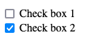
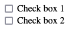
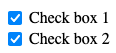
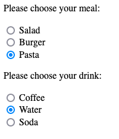
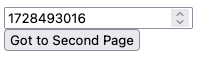

# Form Controls
The previous section introduced simple text fields and buttons.  The mechanics of how data is sent to the server are important to understand. More importantly, you must understand how forms relate to the request/response cycle of the web.  Pages are rendered, and those pages may have forms.  Users enter data, and *submit* forms, usually by clicking a button.  To submit a form means that the web browser initiates a `GET` or `POST` request, based on the `form` element's `method` attribute, to the url specified by the `form` element's `action` attribute.  The web server, when that request is received, is responsible for performing any necessary processing on that form data, and sending an HTTP response - usually another web page.


`form` elements are not limited to just text fields and buttons however. HTML specifies a rich set of user interface controls that we can use within forms.  They all result in defining data that will be submitted with the form they are enclosed in - so the mechanics are all the same.  Whether the form just has one or two text fields, or hundreds of different controls within in, submitting the form will always result in all the data associated with all the controls within it being sent to the server.

Let's take a look at some of the other form controls:


## Input Variations & Attributes
The `input` element is versatile, it is not necessarily just for plain text input.  In HTML 5, the `input` element was expanded to support a number of different types aside from `text`.  The standard also specifies that *if a browser does not support a type*, then it shall be rendered as a normal text input.

Some commonly supported input types are as follows:

- `type="password"` - Passwords - This one isn't new, it's been around forever. An input field with type "password" will display it's characters are masked (usually dots instead of characters).  This is a nice privacy feature, but sometime leads to a false sense of security.  Remember, passwords entered as form elements - whether they are entered into a text input or a password input, are transmitted **in plain text** unless the web site uses HTTPS.  Inputs of type password
- `type="number"` - Number - restricts input to contain numbers.  Accepts a `min` and `max` attribute to set limits on the number, and usually the browser will render the input field with up and down arrows to allow the user to increment/decrement the number (although this isn't required).  The `step` attribute can be used to control the increment used by these arrows.
- `type="email"` - Email - restricts input to contain an email address, containing a well formed email address.  This input field is not quite as widely supported, many browsers will simply render it as a text box.  The value is that it is easier to take advantage of input validation when you've specifically specified `type=email`, and you are also providing more information for web browsers to pre-populate the form field.
- `type="url"` - URL - this is similar to email inputs, in that not all browsers will do anything differently.  However, some browsers will restrict the input to be a well qualified URL.
- `type="tel"` - Telephone number - most browsers will provide some input assitance for users when entering phone numbers - like grouping area code, for example.  Many browser will simply render this as a normal text field however.
- `type="date"` - Date - Most modern web browsers will render this *initially* as a text box, but when the user clicks the text box to bring it into focus a date picker of some sort will be provided.  This allows for significantly more effective date entry, as opposed to asking the user to enter the date in as free-form text.  Because date entry is *so* problematic in plain text, most modern browsers to provide *some level of enhanced support for date inputs*.
- `type="time"` - Time - Similar to date entry, entering times as free-form text is cumbersome and error prone.  Most browsers, when the type is set to "time", will provide a time picker control to the user when they begin editing the input.  It's not quite as commomnly supported as date types, but close.  Keep in mind, for both date and time, the *actual* control the browser will provide for picking dates and times vary dramatically - both between browsers, and across devices.
- `type="color"` - Color - colors are generally RGB values, although they are sometimes represented as hexidecimal numbers (we'll see a lot of that with CSS), and other color formats.  When web applications want the user to choose a color (maybe they are selecting a theme for their account profile, for example), asking them to enter colors using technical standards like RGB, HSL, or hex is problematic.  Most modern browsers will render a `color` control very different than an ordinary text control - giving the user a standard color picker to select a color with. As always, if the browser *does not* support the color input type, the the control will just be text.  Note, when a user selects a color, it will be sent in the HTTP request (on form submission) as plain text - as a seven-character hexadecimal string. For example, if the user selects black, the value of the input element will be sent as `#000000`.

Here are some examples of these in action.  Note, browsers are free to support each type of input the way they see fit.  On a mobile device, browsers might display different types of controls for things like numbers (dials), as opposed to on the desktop.  As a web developer, using the correct input field is really important, because it allows the web browser to make the decision on how to facilitate data entry - and the browser is in the position to best know how to do this well!

```html

<form action="/destination" method="post">
    <!-- Text Input -->
    <label for="username">Username:</label>
    <input type="text" id="username" name="username" placeholder="Enter your username">
    <br/>
    <br/>

    <!-- Password Input -->
    <label for="password">Password:</label>
    <input type="password" id="password" name="password" placeholder="Enter your password">
    <br/>
    <br/>

    <!-- Number Input -->
    <label for="age">Age:</label>
    <input type="number" id="age" name="age" min="1" max="100" placeholder="Enter your age">
    <br/>
    <br/>

    <!-- Email Input -->
    <label for="email">Email Address:</label>
    <input type="email" id="email" name="email" placeholder="Enter your email">
    <br/>
    <br/>

    <!-- URL Input -->
    <label for="website">Website:</label>
    <input type="url" id="website" name="website" placeholder="https://example.com">
    <br/>
    <br/>

    <!-- Telephone Input -->
    <label for="phone">Phone Number:</label>
    <input type="tel" id="phone" name="phone" placeholder="Enter your phone number">
    <br/>
    <br/>

    <!-- Date Input -->
    <label for="dob">Date of Birth:</label>
    <input type="date" id="dob" name="dob">
    <br/>
    <br/>

    <!-- Time Input -->
    <label for="meeting">Meeting Time:</label>
    <input type="time" id="meeting" name="meeting">
    <br/>
    <br/>

    <!-- Color Input -->
    <label for="favcolor">Favorite Color:</label>
    <input type="color" id="favcolor" name="favcolor">
    <br/>
    <br/>

    <button type="submit">Submit</button>
</form>
```


There are a few more, and we will cover types `checkbox`, `radio`, `file`, `hidden` in their own sections below.  You are encouraged to review more reference material about the various input types.

- [Mozilla Developer Network - Input Controls](https://developer.mozilla.org/en-US/docs/Web/HTML/Element/input)

## Labels & Placeholders
You might have noticed the use of `label` in the examples above. The `<label>` element in HTML forms is used to provide descriptive text for form controls, such as `<input>` elements, improving both **usability** and **accessibility** of forms. The main purpose of the `<label>` element is to ensure that users — especially those with disabilities — can easily understand the purpose of form fields. Associating a label with an `<input>` element makes forms more user-friendly and accessible across different devices and assistive technologies.

- **Clear visibility**: The `<label>` element helps users quickly identify the purpose of form controls. For example, a form might have multiple input fields, and without labels, users might be confused about what information is expected in each field.
- **Click to focus**:  When a `<label>` is correctly associated with an `<input>` element, clicking on the label will automatically focus the corresponding input field. This improves the user experience by increasing the clickable area, especially in cases where the form control (like a small checkbox or radio button) is hard to click.
- **Screen readers**:   Associating a `<label>` with an `<input>` ensures that screen readers can read out the label when the input field is focused. This is crucial for users with visual impairments who rely on screen readers to navigate forms.  When navigating a form via the keyboard (using the Tab key), a screen reader or accessibility tool will correctly announce the label when the corresponding input field is focused.

### Associating `<label>` with `<input>` Elements
There are two primary ways to associate a `<label>` with an `<input>` element:
1. **Using the `for` attribute**:  The most common method is by using the `for` attribute in the `<label>` element. The value of the `for` attribute must match the `id` attribute of the associated `<input>` element.

```html
<label for="username">Username:</label>
<input type="text" id="username" name="username">
```

The `for="username"` in the `<label>` element connects it to the `<input>` element with `id="username"`.  Clicking on the label will focus the input field, and screen readers will announce the label when the input field is focused.

2.  **Wrapping the `<input>` in the `<label>`**: Another method is to wrap the `<input>` element inside the `<label>` element. In this case, the association between the label and the input is implicit, and you do not need to use the `for` and `id` attributes.

```html
<label>
    Username:
    <input type="text" name="username">
</label>
```

Both methods are valid, but using the `for` and `id` approach is generally preferred because it keeps the HTML cleaner and separates the label from the input field, which can help with styling and layout.

## The `placeholder` Attribute
The `placeholder` attribute is used to provide a short hint or example inside an input field, giving users a sense of what type of information they should enter. This hint disappears once the user begins typing in the field.

Here’s an example using `placeholder`:
```html
<input type="text" name="username" placeholder="Enter your username">
```

In this example, the text "Enter your username" appears inside the input field but disappears when the user clicks on the field or starts typing.

**Pro Tip**&#128161; **Note** that `placeholder` is different than setting the `value` attribute.

```html
<input type="text" name="username" value="Enter your username">
```
In the above example, the "Enter your username" text is actually the text written in the input element, and if the user were to submit the form, that text would be submitted.  In order for the user to enter their username, they would need to delete the "Enter your username" text.  The `value` attribute should **never be used as a hint/instruction**, it is only appropriate for actually pre-filling values that may be submitted.  A good use case is when displaying a form that allows the user to edit *existing* information.

While both `placeholder` and `label` help guide users in filling out a form, they serve very different purposes and behave differently. The most significant difference is that while the **placeholder** disappears when the input field is interacted with, a label does not.  For this reason, use placeholders **in addition** to labels, **not instead of labels**.  Placeholders are best used to add hints, or examples - while labels are use to really describe what the user needs to enter.

```html
  <label for="email">Email Address:</label>
  <input type="email" id="email" name="email" placeholder="e.g., user@example.com">
  ```

In the above example, a lable is used to **clearly describe** that the input field is for an email address. The placeholder attribute is providing some additional context, but once it disappears, the user will not be confused.


## Longer text with `textarea`
The `<textarea>` element in HTML is used to create a multi-line text input field in a form, ideal for collecting larger amounts of text such as comments, feedback, or detailed descriptions. Unlike the `<input type="text">` element, which is used for single-line text input, the `<textarea>` element allows multiple lines of text and places its content inside the element rather than as an attribute.

```html
<form action="http://example.com/destination", method="post">
    <label for="message">Message to submit</label>
                <br/>
    <textarea name="message" rows="4" cols="50">
        Enter your message here...
    </textarea>
</form>
```

The `textarea` element differs from the shorter `input` text control in several ways.
- **Content Placement**:
   - **`<input type="text">`**: The user input is placed as a value attribute, such as `value="user text"`.
   - **`<textarea>`**: The text goes inside the element tags. For example, `Enter your message here...` appears inside the opening and closing `<textarea>` tags.

- **Multi-line vs. Single-line**:
   - **`<textarea>`**: Supports multiple lines of text input.
   - **`<input type="text">`**: Only supports single-line text input.

- **Resizable**:
   - **`<textarea>`**: Can usually be resized by the user (depending on browser support and CSS settings).
   - **`<input type="text">`**: Has a fixed size unless adjusted through CSS.

The following attributes are commonly used with `textarea` elements:
1. **`name`**: Identifies the field and is sent along with the form data when the form is submitted.
2. **`rows`**: Specifies the number of visible text lines in the text area.
3. **`cols`**: Specifies the visible width of the text area in terms of character columns.
4. **`placeholder`**: (optional) Displays a hint to the user about what they should type.
5. **`disabled`**: (optional) Prevents the user from interacting with the text area.
6. **`readonly`**: (optional) Allows the user to see the text but not edit it.
7. **`maxlength`**: (optional) Limits the maximum number of characters that can be entered.
8. **`required`**: (optional) Indicates that the field must be filled out before submitting the form.

## Universal Attributes
While we are starting to define more controls, there are a few attributes used with all of the different types - some of which were described breifly above.  Let's take a moment to go over these in
- `autocomplete` - This attribute allows you to nudge the web browser towards autocompleting the form field.  It's available on most form elements.  You can set the value to "on" or "off", and when "on" the web browser will use the label, along with any previous entries the user has made on your site (on the same form) to pre-fill the input field.  Alternatively, you can also specify a sequence of tokens (separated by a space), for example `shipping zip-code`, to provide further hints to the browser.  Note, the web browser is not required to do **anything**, this is only a suggestion.  User's may turn off these features, and different browsers may not support it at all.  For more on the typically supported tokens, and other functionality, see [here](https://developer.mozilla.org/en-US/docs/Web/HTML/Attributes/autocomplete).
- `disabled` - This is a *boolean* attribute, it's presense indicates that the element should be disabled.  Disabled is different than read only (see below), in subtle ways.  Disabled elements generally visually appear differently - they are often greyed out.  Disabled element indicate to the user that the option is *not available*.  You may set most form elements to disabled.
- `readonly` - This is a *boolean* attribute, it's presence indicates that the element is read only.  Read only elements generally look the same as other elements, but their state (the text entered, the checked/selected state, etc) is pre-defined and not editable.  `readonly` can be used on most form elements.
- `required` - This is a *boolean* attribute, and is available on most form elements.  When `required` is present, form submission *may* be prevented if a value has not been specified.  Note that *"may"* here is important.  A web browser is likely to display instructions indicating the form element is required, and it *may* prevent the user from submitting the form if a value is not present, but this **does not replace the need for server side validation**.  Not only is it entirely up to the browser to honor the `required` attribute, but remember - anyone can submit form data using *any* program - so what you receive on the server side isn't necessarily sent from a proper web browser at all!
- `name` - As we've already seen, the `name` attribute identifies the element, and the value, when sending to the server.  The `name` attribute is **required** if the value of the control will be sent to the server on form submission.
- `id` - It's worth noting that it is *common* for all form elements to have an `id`, but not strictly necessary.  There are many features (such as relating `label` to elements) that utilize the `id` element, but they are not directly used when considering form submission itself.

### Boolean Attributes
It's important that you are clear on how *boolean* attributes work in HTML.  Let's look at the following foure `input` elements:

```html
<input name="a" required/>
<input name="b" required = "false"/>
<input name="c" required = "true"/>
<input name="d"/>
```

In the HTML above, **all three elements with the required attribute - a, b, and c require input**.  It does not matter that `required` is set to `"false"` for the `b` element.  Even if we set it to the boolean value `falase` rather than the string `"false"`, it is still considered required.  The **only** element that is not required is `d`, because it does not have the `required` attribute at all.  This is **critical** - for *boolean* attributes, we do not add values - their presence, and their presence alone, indicates that the attribute is true.  Using the `name=value` syntax is technically *incorrect*, and is at the very least confusing and error-prone.

## Checkboxes, Radios
The use of checkboxes and radio buttons is common for discrete input values.  Checkboxes are excellent at allowing users input true/false values, or selecting several options among a set.  Radio buttons allow for *mutually exclusive* selection of one choice, among several.  Both controls share common features, but they are distinct - particularly in how they are treated on form submission.

### Checkbox
A checkbox is created with an `input` element of type `checkbox`:

```html
<input type='checkbox'/>
```


Note that *there is no text associated with the chekbox*.  Typically, we must tell the user what the checkbox represents - and we do this with the label element.  There are several strategies, and often it will depend on your CSS styling strategy, but `label` elements are associated with checkboxes just like we've seen before.

```html
<!-- Two checkboxes, with labels.  The second checkbox is checked initially -->
<div>
    <input type="checkbox" name="box1" id="box1"/>
    <label for="box1">Check box 1</label>
</div>
<div>
    <input type="checkbox" name="box2" id="box2" checked/>
    <label for="box2">Check box 2</label>
</div>
```



You'll note that in the above Check box 2 is *preselected*.  The `checked` attribute is a **boolean** attribute, when present, the checkmark will be rendered and the checkbox value is considered to be "on".

When a form is submitted that contains a checkbox, the checkbox is **only included in the request body if it is checked**.  In the example above, if the form that contained "Check box 1" and "Check box 2" were to be submitted (with only checkbox 2 checked), then the following would be the request body:  `box2=on`.  **This is important**, when a checkbox is *not* checked, the name is not sent to the server on form submission *at all*.  When the checkbox is selected, the value sent to the server *should* be "on" - but at the very least (for perhaps older or non-compliant browsers), will be *present* in the request body.  This is critical when it comes to parsing HTTP requests (query string, request bodies), as it implies that the server receiving the request needs to take care - not all possible checkboxes will be in the request, only the ones that are "true".

To drive this home, here's the possible checkbox permutations, with the corresponding request body sent on form submission:



... nothing! ...


`box2=on`



`box1=on&box2=on`

Checkboxes should *always* have labels.  Sometimes, you may wish to put labels to the left of the checkbox, to the right, or somewhere else - but they generally should always be present.  Checkbox are sometimes styled with CSS to appear as switches and other types of toggle inputs - but regardless of their style, "yes/no" types of input controls are almost always implemented with checkboxes.

### Radio Buttons
Sometimes we have a set of choices, one of which might be selected.  Imagine you have option A, B, and C.  If users could select none, one, two, or all three of these options, then it might make sense to present them as three distinct checkboxes.  However, if the user must select **one** of the three options, then *radio buttons* are the preferred approach.

Radio buttons are inherently *grouped*, which presents a unique situation when writing the markup.  Since choices for radio buttons are **mutually exclusive**, we want the browser to de-select the others whenever the user selects one.  In order for the browser to do this, it must know which radio buttons belong to a particular set of choices.

Let's look at an example where we have **two** questions - the user's selection of a meal and the user's selection of a drink.  We've pre-selected the choice of "Pasta" and "Water" using the same `checked` attribute as found in checkbox.

```html
<section>
    <p>Please choose your meal:
    <div>
        <input type="radio" name="meal" value="salad" id="salad-meal"/>
        <label for="salad-meal">Salad</label>
    </div>
    <div>
        <input type="radio" name="meal" value="burger" id="burger-meal"/>
        <label for="burger-meal">Burger</label>
    </div>
    <div>
        <input type="radio" name="meal" value="pasta" id="pasta-meal" checked/>
        <label for="pasta-meal">Pasta</label>
    </div>
</section>

<section>
    <p>Please choose your drink:
    <div>
        <input type="radio" name="drink" value="coffee" id="coffee-drink"/>
        <label for="coffee-drink">Coffee</label>
    </div>
    <div>
        <input type="radio" name="drink" value="water" id="water-drink" checked/>
        <label for="water-drink">Water</label>
    </div>
    <div>
        <input type="radio" name="drink" value="soda" id="soda-drink"/>
        <label for="soda-drink">Soda</label>
    </div>
</section>
```


Let's carefully examine the relationship between the `name`, `value`, and `id` attributes, along with what gets sent to the server on form submission.

The `name` attribute **is used to group radio buttons**.  They can appear *anywhere* on the page (they don't need to have a common parent element, for example) - the only thing that controls whether or not multiple radio buttons are considered *mutually exclusive* is the `name` attribute.  In the example above, selecting "Burger" causes "Pasta" and "Salad" to be unselected - as "Salad", "Burger", and "Pasta" input elements all have **the same name** attribute - `"meal"`.  The other three choices (drinks) form another set of choices, because they all share the same name - `"drink"`.

Note that because all three meal (and all three drink) elements *share the same name*, it's even more important that the receive unique `id` attributes.  The association between `label` and `input` is made through `id`, **not** `name`.

Finally, notice that unlike checkboxes, radio button input elements have a `value` attribute.  The `value` defines what will be sent to the server **if and only if that radio button is selected**.  Let's consider the same example as above - where "Pasta" and "Water" were selected (checked).  Let's assume the user has not changed the selection.  The following will be sent to the server:

```
meal=pasta&drink=water
```
If the **user** selects soda and burger, then those radio buttons will be checked and the others will be de-selected.  The following would be sent to the server on form submission:

```
meal=burger&drink=soda
```

It's important to remember that *nothing* is sent to the server until the actual form is submitted, usually by the user clicking on a submit button.

**Pro Tip**&#128161; It's easy to mess up radio buttons.  A common mistake is writing three `input` radios, with different names.  When you do this, they are all individually selectable - they aren't treated as a *set of options* by the browser.  This also means they are all sent to the server (each unique name).  It's also common to accidentally copy/paste the *same* name when you don't want them.  For example, in the meal and drink example above, if we accidentally set the `name` attribute of the "Water" option to `"meal"`, then it would be part of the set of meal choices.  Clicking "Water" would not de-select "Coffee" or "Soda", it would de-select "Salad", "Burger", or "Pasta".  It's one of the silliest yet easiest errors to make - so watch out!

## Selects
Radio buttons are a good strategy for when users need to choose *one* among several choices, however when there are more than 3-4 choices, radio buttons are problematic.  They occupy a lot of screenspace, and can lead to usability issues.  When there are more than 4 choices to choose from, and especially when there are many choices, a *drop down* selection control is generally more effective. Not only do they require less screen space, but for mobile devices browsers will use the device's built in dial controls for easy and egonomic selection.

The *select* control is created with the `select` element.  The `select` element contains child `option` elements, each with a `value` attribute and text content within them.

```html
<select name="mychoice">
    <option value="choice-1"> Choice 1 </option>
    <option value="choice-2"> Choice 2 </option>
    <option value="choice-3"> Choice 3 </option>
</select>
```


While checkboxes and radio controls can be pre-selected using the boolean `checked` attribute, the `select` element is pre-selected by adding a boolean `selected` attribute to the desired `option` element.  Otherwise, the first option is preselected

```html
<select name="mychoice">
    <option value="choice-1"> Choice 1 </option>
    <option value="choice-2" selected> Choice 2 </option> <!-- Preselected choice-->
    <option value="choice-3"> Choice 3 </option>
</select>
```
Sometimes, if we want "no choice" to be pre-selected, developers will include a false placeholder option, with an absent value.  If the form is submitted with this option selected, no value is sent to the server.

```html
<select name="mychoice">
    <option value=""></option> <!-- Preselected choice since it's first, an no others have selected attribute -->
    <option value="choice-1"> Choice 1 </option>
    <option value="choice-2"> Choice 2 </option>
    <option value="choice-3"> Choice 3 </option>
</select>
```
Otherwise, whichever `option` element is currently selected, it's `value` will be sent to the server as a name value pair, using the `name` attribute on the `select` element. In this way, to the server, the name / value pair sent is identical as it would be with a named `input` control.  There is no special processing or consideration required.  In the `select` control above, if "Choice 2" were selected when the form was submitted, the pair `mychoice=choice-2` would be sent to the server.

### Multiple Selection
Select boxes can also be transformed into *multiple selection* controls.   This allows user to select one or more items within the list of choices.  This is achieved by adding the boolean `multiple` attribute.

```html
<select name="mychoice" multiple>
    <option value="choice-1"> Choice 1 </option>
    <option value="choice-2" selected> Choice 2 </option>
    <option value="choice-3"> Choice 3 </option>
    <option value="choice-4" selected> Choice 4 </option>
    <option value="choice-5"> Choice 5 </option>
</select>
```


A user can select any number of choices, selecting multiple by holding the shift key while clicking on choices.  When the form is sent to the server, each value selected will be sent as a separate name/value pair.  For example, if "Choice 2" and "Choice 4" are selected, the request body (or query string) will contain `mychoice=choice-2&mychoice=choice4`.  Note that the code used on the server side must appropriately handle duplicated names found in the request body.  Our initial example in the previous section does not do this!  As we will see soon, in most cases you will use a library to handle this (and many other) cases, but hopefully you understand that doing this type of processing is not particularly challenging - it just requires a bit more code!

Generally speaking, `select` is a good choice when there are up to a dozen or so choices to make.  The use of `multiple` is appropriate in cases where multiple choices are possible, however checkboxes might be an easier method for most users in this case.  For many, many choices, alternative methods are recommended for usability.  This include things like

See the [Mozilla Developer Network](https://developer.mozilla.org/en-US/docs/Web/HTML/Element/select) reference for more information, including option groups,

## Button Types
We've already seen the "submit" button, `<button type="submit">Submit</button>`.  We also discussed breifly the concept of having a button of type `button`, which does not cause the browser to take any action at all.  We will revisit this later in the book when we cover client-side JavaScript.

There are actually two different styles of creating *submit* buttons:

In HTML forms, buttons are used to trigger various actions such as submitting a form, resetting form fields, or performing custom JavaScript tasks. There are different types of buttons available, each designed to perform a specific function. Here are the main button types:

```html
<button type="submit">Submit Form</button>
<input type="submit" value="Submit">
```
Bot elements above create buttons (they will look identical), and both will cause the form to submit (provided they are within a form element).  There are some subtle differences however - most importantly `button` elements are permitted to have other HTML within them, and are more flexible for styling than `input type='button'` or `input type='submit'`.  Typically, most modern HTML is written with `button` elements rather than `input type='submit'`.

There is a third type of button - `type="reset"`.  The reset button is an often overlooked button, that can actually really improve usability of forms. The reset button's default behavior is the *reset* the value of the form it is within.  This means that if you have form with various *other* input controls, the user can clear their activity and restore all the controls to their original state by clicking a reset button.  This not only "clears" the controls, but if the controls had an original default value, the default values are restored.

```html
<button type="reset">Reset Form</button>
```

## File Controls
The `<input type="file">` element allows users to select and upload files from their device. Typically, the browser will opens a file picker that allows users to choose one or more files for upload. The concept is simple, but the implementation can be a bit more challenging.

The first deviation from the *standard form* elements we've been using is that the form must use the `enctype="multipart/form-data"` encoding type to handle file uploads correctly.
```html
<form action="/upload" method="post" enctype="multipart/form-data">
    <label for="file">Choose a file:</label>
    <input type="file" id="file" name="file">
    <br><br>
    <button type="submit">Upload File</button>
</form>
```
Forms with file upload controls *must* be `POST`, and must have the `multipart/form-data` `enctype` attribute.  This encoding type allows the browser to send the file data as part of the form submission, along side other data fields.  It shouldn't be surprising that sending files, over HTTP (inside the POST request body), as plain text, requires encoding. . The `enctype` is what is handling this.

We've already seen how the web server can parse the request body, and extract name/value pairs.  When using `multipart/form-data` encoding, this also becomes more complex. While we can absolutely write our own parser for HTTP request bodies containing `multipart/form-data`, we will defer this to after we learn about `npm` modules. This will allow us to bring in industry-standard file parsers rather than writing the code ourselves.

## Hidden Inputs
Perhaps the most overlooked, but surprisingly useful input element is not a "user input" at all - it is a *hidden* element.  Before looking at it's syntax (which is pretty easy), let's discuss *why* would ever want to have an *hidden* form element.

Recall from earlier, *each request and response* is independent of all other request/response cycles.  This means that when a page is requested and sent by the server, there is no memory of that request occuring when it receives *the next* request.  Students view this with skepticism when they first read this, because that's not their experience with the web intuitively.  In every day life, when we interact with web sites, as we navigate between pages within the same web application, the system clearly has some sort of "memory".  For example, after we log in to a web site, we don't get asked to  log in each time we visit a new page.  **There must be some memory**!

The truth is that while HTTP request/response cycles are independent, that doesn't mean the you, as the programmer, can't create mechanisms that allow for some degree of memory between requests and responses.  We will see how we can accomplish this - we'll dedicate parts of an entire chapter learning about *cookies and sessions*.  While cookies and sessions are the most elegant way to handle these types of things, there are other ways - and sometimes we need to utilize these techniques because there are situations where cookies and sessions are not available.  **One such way is using hidden fields**.

Let's take a simple example.  The user requests a page, and the server responds with HTML for the page.  On that page, there is a button the user can click to view *a second* page that tells them the *time* between the first page being loaded and the second page being loaded.  How can we accomplish this?

### The multiple user problem
Before we look at hidden fields, it's fair to wonder why the server can't just set a variable on the first page load, within *it's own memory*.  Maybe something like this:

```js
let first_page_view = null;
if (req.method.toUpperCase() === 'GET' && req.url === '/first') {
    // Get number of seconds since Jan 1, 1970
    const now = (new Date())e.getUTCSeconds();
    first_page_view = now;
    send_page(res, `<a href="/second">Go to Second Page</a>`);
}
else if (req.methos.toUpperCase() === 'GET' && req.url === '/second') {
    const now = (new Date())e.getUTCSeconds();
    const seconds_since_first = now - first_page_view;
    send_page(res, `<p>Second between page views:  ${seconds_since_first}</p>`);
}
```

There are two problems.  One, remember that a web browser can request `/second` before ever visiting `/first` - making the logic a little less than robust.  There second problem is much bigger, and much more fundamental to your understanding of web servers.  Your web server is receiving requests from *all of your users*, potentially at the same time.  People in on different computers, different towns, different countries - might all be accessing your web site!  There is nothing in our web server code that know *which* browser is making these requests.  It's **PERFECTLY** possible that User A requests `/first`, and then ten seconds later User B request `/first`.  Both requests will exectute the same code.  The same `first_page_view` variable will be set.  **There is only one web server**.

If User A and B each request `/first`, the last one to do so will have their time recorded in `first_page_view`.  Then, if User A and B each request `/second` at the same time, they will both do the same computation on the variable, and get the same answer - even if their requests to `/first` were at very different times.

**The bottom line** is that web server code cannot simply use variables to store data *between* requests, because those requests are not necessarily from the same users!

Now back to actually solving the problem.  From the perspective of the web server, we can't remember when a user visits the first page when processing the second page. However, we can ask the user (the web browser) to remember for us, and send us the information we need!  Let's look at the following:

```js
if (req.method.toUpperCase() === 'GET' && req.url === '/first') {
    // Get number of seconds since Jan 1, 1970
    const now = (new Date())e.getUTCSeconds();

    send_page(res, `<form action="/second", method="get">
                        <input name="first", type='number' value='${now}'/>
                        <br/>
                        <button type="submit">Go to Second Page</button>
                    </form>`);
}
else if (req.methos.toUpperCase() === 'GET' && req.url === '/second') {
    // Form data submitted on query string, since it's GET
    const body = parse_form_data(req.url.split('?')[1]);
    const now = (new Date())e.getUTCSeconds();
    const seconds_since_first = now - parseInt(body.first);
    send_page(res, `<p>Second between page views:  ${seconds_since_first}</p>`);
}
```
The code above uses the `form` concept in a clever way.  The web page delivered in response to `/first` is now not just a hyperlink to `/second`, but a `form` with an input field.  The field is pre-filled with the number of seconds since the epoch (Jan 1, 1970).



This seems strange - but let's look at what this allows for.  When the user clicks the button that says "Go to Second Page", **the form** is submitted to `/second`.  When a form is submitted, the input element values within it are sent to the server.  We've constructed the form so the input field **contains** the time set by the server, when the page was loaded.  That's exactly the time we needed to remember!  Now, in the code that handles the request to `/second`, we take the time "first" from the submitted data, perform the computation, and render the page!  **The server didn't need to remember anything**, it put the value it needed to remember **in the HTML** it served to the web browser.  The web browser then dutifully sent it back to the server.  If multiple users were doing this around the same time, they would be sending their own distinct values in their second requests, because they received their own distinct values in their first request!

### Hiding the memory
It doesn't make sense to show the user the time value computed on the server, and it certainly doesn't make sense to let them change it using an input element.  We could make it readonly, but still - why show it at all?  **That's why we have hidden inputs**.

We can change this:
```html
<form action="/second", method="get">
  <input name="first", type='number' value='${now}'/>
  <br/>
  <button type="submit">Go to Second Page</button>
</form>
```
- to this -

```html
<form action="/second", method="get">
  <input name="first", type='hidden' value='${now}'/>
  <button type="submit">Go to Second Page</button>
</form>
```
An the result is *just* a button that says "Go to Second Page".  From there, we can leverage CSS to render the button as if it's a link, and present a seemless user interface to the user.

The point of the above is not suggest that this is the best way to implement memory between requests - because *it is not*.  It is **one way**, and it is sometimes the easiest way to accomplish what we need.  It **is an important concept** though, even if you rarely use it.  The concept of having the *browser* remember things, and send those things *back to the server* is powerful - and involved in implementing almost every web server/application you will create!

<hr/>

This section outlines many of the input controls available in HTML.  You should use additional resources for deeper references, as there are some additional aspects of form development that are quite useful.  MDN has [extensive documentation](https://developer.mozilla.org/en-US/docs/Learn/Forms/Basic_native_form_controls).

In addition, you might want to check out the following example:

[Form Controls Demo](../../code/form-control-demo)

Download the example and run it on your own machine.  It will give you a chance to experiment with a variety of user interface elements, and also examine what the server receives upon various form submissions.
