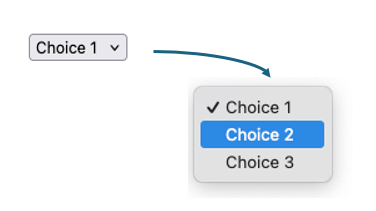

# Form Controls
The previous section introduced simple text fields and buttons.  The mechanics of how data is sent to the server are important to understand. More importantly, you must understand how forms relate to the request/response cycle of the web.  Pages are rendered, and those pages may have forms.  Users enter data, and *submit* forms, usually by clicking a button.  To submit a form means that the web browser initiates a `GET` or `POST` request, based on the `form` element's `method` attribute, to the url specified by the `form` element's `action` attribute.  The web server, when that request is received, is responsible for performing any necessary processing on that form data, and sending an HTTP response - usually another web page.


`form` elements are not limited to just text fields and buttons however. HTML specifies a rich set of user interface controls that we can use within forms.  They all result in defining data that will be submitted with the form they are enclosed in - so the mechanics are all the same.  Whether the form just has one or two text fields, or hundreds of different controls within in, submitting the form will always result in all the data associated with all the controls within it being sent to the server.

Let's take a look at some of the other form controls:


## Input Variations & Attributes
The `input` element is versatile, it is not necessarily just for plain text input.  In HTML 5, the `input` element was expanded to support a number of different types aside from `text`.  The standard also specifies that *if a browser does not support a type*, then it shall be rendered as a normal text input.

Some commonly supported *new* input types are as follows:

- `type="password"` - Passwords - This one isn't new, it's been around forever. An input field with type "password" will display it's characters are masked (usually dots instead of characters).  This is a nice privacy feature, but sometime leads to a false sense of security.  Remember, passwords entered as form elements - whether they are entered into a text input or a password input, are transmitted **in plain text** unless the web site uses HTTPS.  Inputs of type password
- `type="number"` - Number - restricts input to contain numbers.  Accepts a `min` and `max` attribute to set limits on the number, and usually the browser will render the input field with up and down arrows to allow the user to increment/decrement the number (although this isn't required).  The `step` attribute can be used to control the increment used by these arrows.
- `type="email"` - Email - restricts input to contain an email address, containing a well formed email address.  This input field is not quite as widely supported, many browsers will simply render it as a text box.  The value is that it is easier to take advantage of input validation when you've specifically specified `type=email`, and you are also providing more information for web browsers to pre-populate the form field.
- `type="url"` - URL - this is similar to email inputs, in that not all browsers will do anything differently.  However, some browsers will restrict the input to be a well qualified URL.
- `type="tel"` - Telephone number - most browsers will provide some input assitance for users when entering phone numbers - like grouping area code, for example.  Many browser will simply render this as a normal text field however.
- `type="date"` - Date - Most modern web browsers will render this *initially* as a text box, but when the user clicks the text box to bring it into focus a date picker of some sort will be provided.  This allows for significantly more effective date entry, as opposed to asking the user to enter the date in as free-form text.  Because date entry is *so* problematic in plain text, most modern browsers to provide *some level of enhanced support for date inputs*.
- `type="time"` - Time - Similar to date entry, entering times as free-form text is cumbersome and error prone.  Most browsers, when the type is set to "time", will provide a time picker control to the user when they begin editing the input.  It's not quite as commomnly supported as date types, but close.  Keep in mind, for both date and time, the *actual* control the browser will provide for picking dates and times vary dramatically - both between browsers, and across devices.
- `type="color"` - Color - colors are generally RGB values, although they are sometimes represented as hexidecimal numbers (we'll see a lot of that with CSS), and other color formats.  When web applications want the user to choose a color (maybe they are selecting a theme for their account profile, for example), asking them to enter colors using technical standards like RGB, HSL, or hex is problematic.  Most modern browsers will render a `color` control very different than an ordinary text control - giving the user a standard color picker to select a color with. As always, if the browser *does not* support the color input type, the the control will just be text.  Note, when a user selects a color, it will be sent in the HTTP request (on form submission) as plain text - as a seven-character hexadecimal string. For example, if the user selects black, the value of the input element will be sent as `#000000`.

Here are some examples of these in action.  Note, browsers are free to support each type of input the way they see fit.  On a mobile device, browsers might display different types of controls for things like numbers (dials), as opposed to on the desktop.  As a web developer, using the correct input field is really important, because it allows the web browser to make the decision on how to facilitate data entry - and the browser is in the position to best know how to do this well!

```html

<form action="/destination" method="post">
    <!-- Text Input -->
    <label for="username">Username:</label>
    <input type="text" id="username" name="username" placeholder="Enter your username">
    <br/>
    <br/>

    <!-- Password Input -->
    <label for="password">Password:</label>
    <input type="password" id="password" name="password" placeholder="Enter your password">
    <br/>
    <br/>

    <!-- Number Input -->
    <label for="age">Age:</label>
    <input type="number" id="age" name="age" min="1" max="100" placeholder="Enter your age">
    <br/>
    <br/>

    <!-- Email Input -->
    <label for="email">Email Address:</label>
    <input type="email" id="email" name="email" placeholder="Enter your email">
    <br/>
    <br/>

    <!-- URL Input -->
    <label for="website">Website:</label>
    <input type="url" id="website" name="website" placeholder="https://example.com">
    <br/>
    <br/>

    <!-- Telephone Input -->
    <label for="phone">Phone Number:</label>
    <input type="tel" id="phone" name="phone" placeholder="Enter your phone number">
    <br/>
    <br/>

    <!-- Date Input -->
    <label for="dob">Date of Birth:</label>
    <input type="date" id="dob" name="dob">
    <br/>
    <br/>

    <!-- Time Input -->
    <label for="meeting">Meeting Time:</label>
    <input type="time" id="meeting" name="meeting">
    <br/>
    <br/>

    <!-- Color Input -->
    <label for="favcolor">Favorite Color:</label>
    <input type="color" id="favcolor" name="favcolor">
    <br/>
    <br/>

    <button type="submit">Submit</button>
</form>
```


There are a few more, and we will cover types `checkbox`, `radio`, `file`, `hidden` in their own sections below.  You are encouraged to review more reference material about the various input types.

- [Mozilla Developer Network - Input Controls](https://developer.mozilla.org/en-US/docs/Web/HTML/Element/input)

## Labels & Placeholders
You might have noticed the use of `label` in the examples above. The `<label>` element in HTML forms is used to provide descriptive text for form controls, such as `<input>` elements, improving both **usability** and **accessibility** of forms. The main purpose of the `<label>` element is to ensure that users — especially those with disabilities — can easily understand the purpose of form fields. Associating a label with an `<input>` element makes forms more user-friendly and accessible across different devices and assistive technologies.

1. **Clear Identification of Form Fields**:
   The `<label>` element helps users quickly identify the purpose of form controls. For example, a form might have multiple input fields, and without labels, users might be confused about what information is expected in each field.
2. **Clickable Label for Easier Interaction**:
   When a `<label>` is correctly associated with an `<input>` element, clicking on the label will automatically focus the corresponding input field. This improves the user experience by increasing the clickable area, especially in cases where the form control (like a small checkbox or radio button) is hard to click.
3. **Screen Reader Support**:
   Associating a `<label>` with an `<input>` ensures that screen readers can read out the label when the input field is focused. This is crucial for users with visual impairments who rely on screen readers to navigate forms.
4. **Improves Keyboard Navigation**:
   Labels help improve form navigation for users who rely on keyboards rather than a mouse. When navigating a form via the keyboard (using the Tab key), a screen reader or accessibility tool will correctly announce the label when the corresponding input field is focused.

### Associating `<label>` with `<input>` Elements

There are two primary ways to associate a `<label>` with an `<input>` element:

#### **Using the `for` Attribute**

The most common method is by using the `for` attribute in the `<label>` element. The value of the `for` attribute must match the `id` attribute of the associated `<input>` element.

```html
<label for="username">Username:</label>
<input type="text" id="username" name="username">
```

The `for="username"` in the `<label>` element connects it to the `<input>` element with `id="username"`.  Clicking on the label will focus the input field, and screen readers will announce the label when the input field is focused.

#### **Wrapping the `<input>` in the `<label>` Element**

Another method is to wrap the `<input>` element inside the `<label>` element. In this case, the association between the label and the input is implicit, and you do not need to use the `for` and `id` attributes.

```html
<label>
    Username:
    <input type="text" name="username">
</label>
```

Both methods are valid, but using the `for` and `id` approach is generally preferred because it keeps the HTML cleaner and separates the label from the input field, which can help with styling and layout.

### Browser Behavior

When a `<label>` is properly associated with an `<input>` element, browsers provide the following enhancements:
1. **Clickable Labels**:
   Clicking the label automatically moves the focus to the associated input field, making it easier for users to interact with smaller form controls like checkboxes or radio buttons.
2. **Focus Support for Accessibility**:
   Screen readers and other assistive technologies will automatically announce the label’s text when the input field is focused. This provides crucial information for visually impaired users about what information is expected.
3. **Styling Consistency**:
   Most browsers apply some basic styling to form controls, and associating a label with an input field helps ensure that label and input combinations are consistently styled across different browsers.

## The `placeholder` Attribute
The `placeholder` attribute is used to provide a short hint or example inside an input field, giving users a sense of what type of information they should enter. This hint disappears once the user begins typing in the field.

Here’s an example using `placeholder`:
```html
<input type="text" name="username" placeholder="Enter your username">
```

In this example, the text "Enter your username" appears inside the input field but disappears when the user clicks on the field or starts typing.

**Pro Tip**&#128161; **Note** that `placeholder` is different than setting the `value` attribute.

```html
<input type="text" name="username" value="Enter your username">
```
In the above example, the "Enter your username" text is actually the text written in the input element, and if the user were to submit the form, that text would be submitted.  In order for the user to enter their username, they would need to delete the "Enter your username" text.  The `value` attribute should **never be used as a hint/instruction**, it is only appropriate for actually pre-filling values that may be submitted.  A good use case is when displaying a form that allows the user to edit *existing* information.

While both `placeholder` and `label` help guide users in filling out a form, they serve very different purposes and behave differently. The most significant difference is that while the **placeholder** disappears when the input field is interacted with, a label does not.  For this reason, use placeholders **in addition** to labels, **not instead of labels**.  Placeholders are best used to add hints, or examples - while labels are use to really describe what the user needs to enter.

```html
  <label for="email">Email Address:</label>
  <input type="email" id="email" name="email" placeholder="e.g., user@example.com">
  ```

In the above example, a lable is used to **clearly describe** that the input field is for an email address. The placeholder attribute is providing some additional context, but once it disappears, the user will not be confused.


## Long Text
The `<textarea>` element in HTML is used to create a multi-line text input field in a form, ideal for collecting larger amounts of text such as comments, feedback, or detailed descriptions. Unlike the `<input type="text">` element, which is used for single-line text input, the `<textarea>` element allows multiple lines of text and places its content inside the element rather than as an attribute.

```html
<form action="http://example.com/destination", method="post">
    <label for="message">Message to submit</label>
                <br/>
    <textarea name="message" rows="4" cols="50">
        Enter your message here...
    </textarea>
</form>
```

### Key Differences Between `<textarea>` and `<input type="text">`

1. **Content Placement**:
   - **`<input type="text">`**: The user input is placed as a value attribute, such as `value="user text"`.
   - **`<textarea>`**: The text goes inside the element tags. For example, `Enter your message here...` appears inside the opening and closing `<textarea>` tags.

2. **Multi-line vs. Single-line**:
   - **`<textarea>`**: Supports multiple lines of text input.
   - **`<input type="text">`**: Only supports single-line text input.

3. **Resizable**:
   - **`<textarea>`**: Can usually be resized by the user (depending on browser support and CSS settings).
   - **`<input type="text">`**: Has a fixed size unless adjusted through CSS.

### Attributes
The following attributes are commonly used with `textarea` elements:
1. **`name`**: Identifies the field and is sent along with the form data when the form is submitted.
2. **`rows`**: Specifies the number of visible text lines in the text area.
3. **`cols`**: Specifies the visible width of the text area in terms of character columns.
4. **`placeholder`**: (optional) Displays a hint to the user about what they should type.
5. **`disabled`**: (optional) Prevents the user from interacting with the text area.
6. **`readonly`**: (optional) Allows the user to see the text but not edit it.
7. **`maxlength`**: (optional) Limits the maximum number of characters that can be entered.
8. **`required`**: (optional) Indicates that the field must be filled out before submitting the form.


## Universal Attributes
While we are starting to define more controls, there are a few attributes used with all of the different types - some of which were described breifly above.  Let's take a moment to go over these in
- `autocomplete` - This attribute allows you to nudge the web browser towards autocompleting the form field.  It's available on most form elements.  You can set the value to "on" or "off", and when "on" the web browser will use the label, along with any previous entries the user has made on your site (on the same form) to pre-fill the input field.  Alternatively, you can also specify a sequence of tokens (separated by a space), for example `shipping zip-code`, to provide further hints to the browser.  Note, the web browser is not required to do **anything**, this is only a suggestion.  User's may turn off these features, and different browsers may not support it at all.  For more on the typically supported tokens, and other functionality, see [here](https://developer.mozilla.org/en-US/docs/Web/HTML/Attributes/autocomplete).
- `disabled` - This is a *boolean* attribute, it's presense indicates that the element should be disabled.  Disabled is different than read only (see below), in subtle ways.  Disabled elements generally visually appear differently - they are often greyed out.  Disabled element indicate to the user that the option is *not available*.  You may set most form elements to disabled.
- `readonly` - This is a *boolean* attribute, it's presence indicates that the element is read only.  Read only elements generally look the same as other elements, but their state (the text entered, the checked/selected state, etc) is pre-defined and not editable.  `readonly` can be used on most form elements.
- `required` - This is a *boolean* attribute, and is available on most form elements.  When `required` is present, form submission *may* be prevented if a value has not been specified.  Note that *"may"* here is important.  A web browser is likely to display instructions indicating the form element is required, and it *may* prevent the user from submitting the form if a value is not present, but this **does not replace the need for server side validation**.  Not only is it entirely up to the browser to honor the `required` attribute, but remember - anyone can submit form data using *any* program - so what you receive on the server side isn't necessarily sent from a proper web browser at all!
- `name` - As we've already seen, the `name` attribute identifies the element, and the value, when sending to the server.  The `name` attribute is **required** if the value of the control will be sent to the server on form submission.  
- `id` - It's worth noting that it is *common* for all form elements to have an `id`, but not strictly necessary.  There are many features (such as relating `label` to elements) that utilize the `id` element, but they are not directly used when considering form submission itself.

## Check boxes, Radios


## Selects
Radio buttons are a good strategy for when users need to choose *one* among several choices, however when there are more than 3-4 choices, radio buttons are problematic.  They occupy a lot of screenspace, and can lead to usability issues.  When there are more than 4 choices to choose from, and especially when there are many choices, a *drop down* selection control is generally more effective. Not only do they require less screen space, but for mobile devices browsers will use the device's built in dial controls for easy and egonomic selection.

The *select* control is created with the `select` element.  The `select` element contains child `option` elements, each with a `value` attribute and text content within them.

```html
<select name="mychoice">
    <option value="choice-1"> Choice 1 </option>
    <option value="choice-2"> Choice 2 </option>
    <option value="choice-3"> Choice 3 </option>
</select>
```


While checkboxes and radio controls can be pre-selected using the boolean `checked` attribute, the `select` element is pre-selected by adding a boolean `selected` attribute to the desired `option` element.  Otherwise, the first option is preselected

```html
<select name="mychoice">
    <option value="choice-1"> Choice 1 </option>
    <option value="choice-2" selected> Choice 2 </option> <!-- Preselected choice-->
    <option value="choice-3"> Choice 3 </option>
</select>
```
Sometimes, if we want "no choice" to be pre-selected, developers will include a false placeholder option, with an absent value.  If the form is submitted with this option selected, no value is sent to the server.

```html
<select name="mychoice">
    <option value=""></option> <!-- Preselected choice since it's first, an no others have selected attribute -->
    <option value="choice-1"> Choice 1 </option>
    <option value="choice-2"> Choice 2 </option>
    <option value="choice-3"> Choice 3 </option>
</select>
```
Otherwise, whichever `option` element is currently selected, it's `value` will be sent to the server as a name value pair, using the `name` attribute on the `select` element. In this way, to the server, the name / value pair sent is identical as it would be with a named `input` control.  There is no special processing or consideration required.  In the `select` control above, if "Choice 2" were selected when the form was submitted, the pair `mychoice=choice-2` would be sent to the server.

### Multiple Selection
Select boxes can also be transformed into *multiple selection* controls.   This allows user to select one or more items within the list of choices.  This is achieved by adding the boolean `multiple` attribute.

```html
<select name="mychoice" multiple>
    <option value="choice-1"> Choice 1 </option>
    <option value="choice-2" selected> Choice 2 </option>
    <option value="choice-3"> Choice 3 </option>
    <option value="choice-4" selected> Choice 4 </option>
    <option value="choice-5"> Choice 5 </option>
</select>
```


A user can select any number of choices, selecting multiple by holding the shift key while clicking on choices.  When the form is sent to the server, each value selected will be sent as a separate name/value pair.  For example, if "Choice 2" and "Choice 4" are selected, the request body (or query string) will contain `mychoice=choice-2&mychoice=choice4`.  Note that the code used on the server side must appropriately handle duplicated names found in the request body.  Our initial example in the previous section does not do this!  As we will see soon, in most cases you will use a library to handle this (and many other) cases, but hopefully you understand that doing this type of processing is not particularly challenging - it just requires a bit more code!

Generally speaking, `select` is a good choice when there are up to a dozen or so choices to make.  The use of `multiple` is appropriate in cases where multiple choices are possible, however checkboxes might be an easier method for most users in this case.  For many, many choices, alternative methods are recommended for usability.  This include things like

See the [Mozilla Developer Network](https://developer.mozilla.org/en-US/docs/Web/HTML/Element/select) reference for more information, including option groups,

## Button Types
We've already seen the "submit" button, `<button type="submit">Submit</button>`.  We also discussed breifly the concept of having a button of type `button`, which does not cause the browser to take any action at all.  We will revisit this later in the book when we cover client-side JavaScript.

There are actually two different styles of creating *submit* buttons:

In HTML forms, buttons are used to trigger various actions such as submitting a form, resetting form fields, or performing custom JavaScript tasks. There are different types of buttons available, each designed to perform a specific function. Here are the main button types:

```html
<button type="submit">Submit Form</button>
<input type="submit" value="Submit">
```
Bot elements above create buttons (they will look identical), and both will cause the form to submit (provided they are within a form element).  There are some subtle differences however - most importantly `button` elements are permitted to have other HTML within them, and are more flexible for styling than `input type='button'` or `input type='submit'`.  Typically, most modern HTML is written with `button` elements rather than `input type='submit'`.

There is a third type of button - `type="reset"`.  The reset button is an often overlooked button, that can actually really improve usability of forms. The reset button's default behavior is the *reset* the value of the form it is within.  This means that if you have form with various *other* input controls, the user can clear their activity and restore all the controls to their original state by clicking a reset button.  This not only "clears" the controls, but if the controls had an original default value, the default values are restored.

```html
<button type="reset">Reset Form</button>
```

## File Controls
The `<input type="file">` element allows users to select and upload files from their device. Typically, the browser will opens a file picker that allows users to choose one or more files for upload. The concept is simple, but the implementation can be a bit more challenging.

The first deviation from the *standard form* elements we've been using is that the form must use the `enctype="multipart/form-data"` encoding type to handle file uploads correctly.
```html
<form action="/upload" method="post" enctype="multipart/form-data">
    <label for="file">Choose a file:</label>
    <input type="file" id="file" name="file">
    <br><br>
    <button type="submit">Upload File</button>
</form>
```
Forms with file upload controls *must* be `POST`, and must have the `multipart/form-data` `enctype` attribute.  This encoding type allows the browser to send the file data as part of the form submission, along side other data fields.  It shouldn't be surprising that sending files, over HTTP (inside the POST request body), as plain text, requires encoding. . The `enctype` is what is handling this.

We've already seen how the web server can parse the request body, and extract name/value pairs.  When using `multipart/form-data` encoding, this also becomes more complex. While we can absolutely write our own parser for HTTP request bodies containing `multipart/form-data`, we will defer this to after we learn about `npm` modules. This will allow us to bring in industry-standard file parsers rather than writing the code ourselves.

## Hidden Inputs
THE MOST OFTEN FORGOTTEN, AND UNDERAPPRECITED ELEMENT - HIDDEN!

## Server Processing - Full Example
Show code that accepts form input, and HTML for all the inputs.  Generate a response page that shows the entire contents.

Link t he code, it's a good demo.
