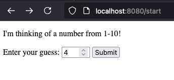
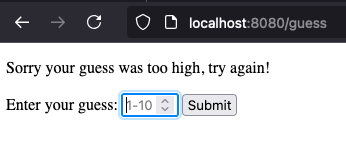
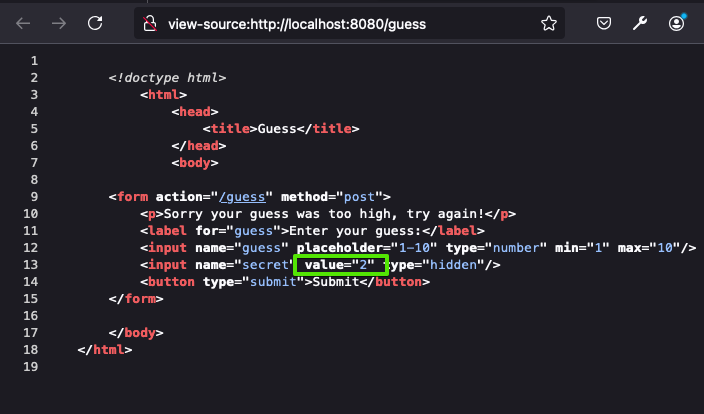

# Guessing Game - Version 1
It's taken us a while - but we have now seen all the components to start truly thinking about *web applications*.  We know enough about HTTP to understand the request and response cycle.  We know enough about HTML to present information to a user, and now to gather information from a user.  We also know enough about JavaScript to actually start writing logic.

Throughout this book, there will be a few *running examples* that serve as vehicles of demonstration.  We'll keep them as simple as possible, and keep iterating on them over and over again everytime we learn new ways of doing things.  These simple examples help a lot, because you get to see how different aspects of web development are applied to *the same application*.

The primary example we will use, and the most simple, is the **guessing game**.  Let's go over the requirements:

1. When a user visits the starting page (`/start`), the web server computes a *secret* number between 1 and 10. This number is random, and it should be (although by chance, it may not always be) unique per browser, user, etc.
2. On the `/start` page, the user will have an input control to enter a *guess*.  They will be told the number is between 1 and 10, and that they can guess by entering the number and clicking a button labeled "Guess".
3. When they click the button, their guess is sent to the server via HTTP post to `/guess`.  The server will compare their guess with the secret number assigned, and respond with one of two different options:
  - A *redirect* to `/success`, which renders a "success" page, when the guess is correct.  This page will congratulate the user, and give them a link to go back to `/start` and play again.
  - A "guess again' page (no redirect), that renders a message indicating if the guess was **too low** or **too high**.  The `/guess` page also includes another form, with another input control, where the user can make a new guess.  The form submits to `/guess`, so the process can repeat itself.

We will add more features to this example, and change the requirements slightly, but this simple game will actually allow us to demonstrate *a lot*.


## The screens and user flow
Let's assume that on page load, the *secret* value assigned to the user is `2`.



If the user enters `4` as their guess, and clicks the button to make the guess, the server will respond by rendering a new form, with an appropriate message.  Notice that the URL is `/guess`, because this page was rendered in response to a `POST` request to `/guess`.  In this case, the guess was too high (4 is greater than 2).  The user may guess again.



The user may continue to make incorrect guesses.  Each time that occurs, the `POST` to the `/guess` will be rendered with a form, and a message indicating too high or too low.


*Eventually* the user will get it right,  and a *redirect* will be returned - to the `/success` page.


## Implementation Keys
The key to implementing this web application is using a *hidden* form field. Each time we render the form, the server will place the secret number **as a hidden form field** in the form itself.  This means it will be sent with each guess, so the server need not remember it.  Every `POST` to `/guess` will have **both** the secret number and the user's input in the form data!  This makes it possible for as many browsers to play the game, simultaneously, as you want.  When you download the source (link below), run it on your machine and try playing in multiple browser windows.  There's no conflict!

This should make you think - isn't this easy to cheat then?  Couldn't a user just look at the *actual* HTML to see the secret number?  **Yes, they certainly could!**.



User's *can always* see the HTML loaded in their browser.  **There is no way to prevent this**, no matter what.  So, does this mean this isn't a valid approach?  That's hard to say.  What are the stakes?  What if the user cheats?  If we were awarding people money and fame for guessing these numbers correctly, then perhaps we would want to be more careful (and we absolutely can be, and succeed).  If this is just a game, without reward though - or, more commonly, we are hiding the data not because it's secret, but because the user doesn't *need* it, then there isn't any harm with this approach at all.  Most people will never look anyway - just remember, **they can, if they want to**!


*BTW - if you think this seems incredible, that a game would give away the answers within it's source code, even if people could see it by viewing it in their browser... check out the popular Wordle game.  [Every day's answers, past present and future, are right there for you to see](https://www.pcworld.com/article/606109/how-to-cheat-at-wordle.html)!*


##  &#128721; STOP
At this point, you might benefit from trying this on your own.  The rest of this section will walk you through the code, but you'll learn a lot more if you try it yourself first!

## The server
A lot of the server code for this version of the guessing game will look like the code we wrote at the beginning of this chapter.  First, let's create a skeleton of the server code, without anything specific to guessing game other than the expected URLs and request verbs.

The code below sets up an HTTP server, and a function to handle incoming requests - called `handle_request`.  The `handle_request` function simply branches off for specific verbs and URLs, and if the combination is recognized, calls a function (which are not yet implemented) to do the work.

You will note **one** change from our previous example however.   For form data processing, we still use `req.on` to register handlers for data and the end of the incoming request body stream, however *instead of parsing the request body ourselves*, we are using `querystring`.  `querystring` is a module built into Node.js, just like `http`.  It does a great job in parsing both *query strings* and request bodies with form data - since they are the same format (name value pairs, seperated by &).

```js
const http = require('http');
const qs = require('querystring');


const render_start = (req, res) => {
  // Assign the secret value and send the initial page.
  // This is the creation of a new "game".
}
const render_success = (req, res) => {
  // Send a success page, with a link to the /start page.
}

const process_guess = (req, res) => {
  // Now we need to look at the submitted data -
  // the guess and the secret, to figure out what
  // to do next.  Either redirect to /success or
  // render new form page for another guess.
}

const render_404 = (req, res) => {
  // Just send a 404 response, we've done this before!
  res.writeHead(404, { 'Content-Type': 'text/html' });
  res.write(heading() + `<p>Sorry, page not found</p>` + footing());
  res.end();
}

const handle_request = (req, res) => {
    if (req.method.toUpperCase() === 'GET' && (req.url === '/' || req.url == '/start')) {
      render_start(req, res);
    }
    else if (req.method.toUpperCase() === 'GET' && req.url == '/success') {
      render_success(req, res);
    }
    else if (req.method.toUpperCase() === 'POST' && req.url == '/guess') {
        let body = "";
        req.on('data', (chunk) => {
            body += chunk;
        });
        req.on('end', () => {
            // qs parses the guess=x&secret=y string
            // into an object.
            req.form_data = qs.parse(body);
            process_guess(req, res);
        });
    }
    else {
        render_404(req, res);
    }
}

http.createServer(handle_request).listen(8080);
```
This skeleton above uses a *convention*. Each function that is supposed to do the work of processing a page request accepts the same parameters - *a request and response*.  In the case of `process_guess`, rather than having it accept form data as a separate (third) parameter, we *attach* the form data (parsed) to the request object itself before calling the function.  The parsed form data *is part of the request*, so it follows intuitively.  Keep this convention in mind, it will come up again.

Let's add some utility functions for actually creating the HTML documents too - they are most unchanged from the example at the beginning of this chapter

```js
const heading = () => {
    const html = `
        <!doctype html>
            <html><head><title>Guess</title></head>
            <body>`;
    return html;
}

const footing = () => {
    return `</body></html>`;
}
const send_page = (res, body) => {
    res.writeHead(200, { 'Content-Type': 'text/html' });
    res.write(heading() + body + footing());
    res.end();
}
```

Now let's look at each page:

### Start Page Implementation
When a `GET` for `/start` or `/` is received, the request handler branches and calls `render_start`.  This function has two key jobs - *create a new secret number*, and render a page that contains a `form` element for entering the next guess. We create the secret using the built in `Math.random()` function, which generates a floating-point number between 0 (inclusive) and 1 (exclusive).  We multiply the random number by 10, giving us a value betwen 0 and 9.9999.  The `Math.floor` rounds the number down, giving us an integer between 0 and 9.  The +1 shifts us to have a range betwen 1 and 10.

Next, we create a `form` element that when submitted, initates a `POST` to `/guess`.  It contains a hidden form element for the secret number we just computed, and a numeric input for the guess the user will make.
```js
const render_start = (req, res) => {
  // Assign the secret value and send the initial page.
  // This is the creation of a new "game".
  const secret = Math.floor(Math.random() * 10) + 1;
  const body =`
    <form action="/guess" method="post">
      <p> Welcome to the guessing game.  I'm thinking of a number
          between 1 and 10.
      </p>
      <label for="guess">Enter your guess:</label>
      <input name="guess" placeholder="1-10" type="number" min="1" max="10"/>
      <input name="secret" value="${secret}" type="hidden"/>
      <button type="submit">Submit</button>
    </form>
    `;
    send_page(res, body);
}
```
Thinking ahead, building the form element will be useful for **both** the start page, and also when rending the page after an incorrect guess.  Both pages have a form, with a `POST` to `/guess`, an input field for the guess, and a hidden field for the secret.  In fact, the only thing that would be different is the message at the top of the form.  Let's factor that out, so we can re-use some of this later.

```js
const make_form = (message, secret) => {
  return `
    <form action="/guess" method="post">
      <p> ${message}</p>
      <label for="guess">Enter your guess:</label>
      <input name="guess" placeholder="1-10" type="number" min="1" max="10"/>
      <input name="secret" value="${secret}" type="hidden"/>
      <button type="submit">Submit</button>
    </form>
    `;
}
const render_start = (req, res) => {
  // Assign the secret value and send the initial page.
  // This is the creation of a new "game".
  const secret = Math.floor((Math.random() * 10 - 0.1)) + 1;
  const body = make_form(
        `Welcome to the guessing game.  I'm thinking of a number between 1 and 10.`
        , secret);
  send_page(res, body);
}
```

### Guess (POST) Implementation
The handling of a `POST` to `/guess` is where the bulk of the logic is taking place.  Recall, **before** calling `process_guess`, we have parsed the form data and placed it into an object called `form_data`, within the `req` object.  Based on the data, we render a form and send a page that indicates the guess was too high or too low, or we issue a redirect response.  Note, when the redirect response is sent, we aren't actually sending any HTML.  The browser will receive our `307` response an initiate a new `GET` request to `/success` - which we handle an independent request.

```js
const process_guess = (req, res) => {
  // Now we need to look at the submitted data -
  // the guess and the secret, to figure out what
  // to do next.  Either redirect to /success or
  // render new form page for another guess.
  const secret = parseInt(req.form_data.secret);
  const guess = parseInt(req.form_data.guess);
  if (guess < secret) {
    // The guess was too low, render a form with the appropriate message.
    const body = make_form(`Sorry that guess is too low, try again!`, secret);
    send_page(res, body);
  }
  else if (guess > secret) {
    // The guess was too high
    const body = make_form(`Sorry that guess is too high, try again!`, secret);
    send_page(res, body);
  }
  else {
    // The guess was correct!  Respond with a redirect, so the
    // browser requests /success with GET
    res.writeHead(302, { 'Location': '/success' });
    res.end();
  }
}
```
### Success
The success page is pretty straightforward, it's just a congratulations message an a link.  We can utilize the `send_page` function to make this pretty quick.
```js
const render_success = (req, res) => {
  // Send a success page, with a link to the /start page.
  send_page(res, `<p>Congratulations!  Please play <a href="/start">again</a></p>`);
}
```

## Download and try yourself!
That's it!  We have a full web application.  It's a good idea to download this source code and run it yourself.  **Study it**, it's a foundational program for the rest of this book.  It capture the workflow of a web application - managing state (the secret), routing requests to responses (`handle_request`'s branches), and serving html.

[Guessing Game - Version 1](../../code/guessing-game-01-first-version)
