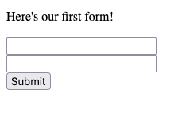
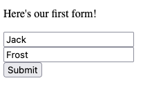
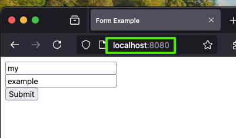
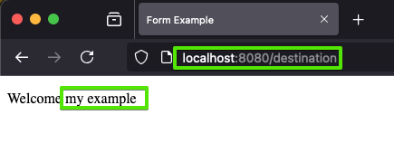
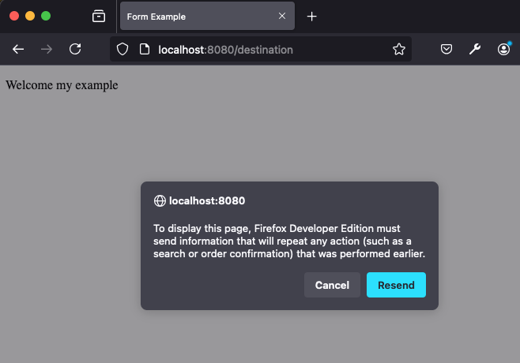

# Forms and Responses
When we covered HTML a few chapters ago, we only covered the *presentation* part of HTML.  The second part of HTML, and in many ways the part that starts to move is from *web sites* to *web applications* is **forms**.

HTML **forms** are sets of user interface controls that allow a user to enter data, and have that data transmitted to the web server.  All of the user controls you are used to seeing on the web - text boxes, numeric inputs, drop downs, check boxes, and more - they are all HTML **form** controls - or *input controls*.

We'll examine each kind of control in this chapter.  We'll see the *default* rendering of those controls, and later on we'll see how to use CSS to customize their appearance.  Before reviewing *all* the different types of controls however, it's really important that we understand the basics.


## A simple form
A **form** is just a `<form>` element on a standard HTML web page, with one or more controls in side of it.  The `form` element is rendered by the browser as a *block* element, without any additional special styling.  The `form` element has unique functionality, however.  Based on attributes defined on the `form` element, HTML authors can command the web browser to initiate new **HTTP requests** to specified URLs, with data the user has input.  The browser will then render the response it receives from the web server, just like if a user had clicked on a link or typed in a new URL in the address bar.  **HTML Forms** initiate a normal request/response cycle, just like a click of a hyperlink - the differnce is that the request *can* contain additional data found within the form, and the request *may* be either an HTTP `GET` **or** `POST`.

Let's take a look at the most simple form:

```html

<!DOCTYPE html>
<html>
  <head>
    <title>This is a page with a form</title>
  </head>
  <body>
    <div>
        <p>Here's our first form!</p>
    </div>
    <form action="/destination", method="post">
        <input name="first" type="text"/>
        <br/>
        <input name="last" type="text"/>
        <br/>
        <button type="submit">Submit</button>
    </form>
  </body>
</html>
```
First, let's establish what this page looks like.  Let's assume it is hosted on `http://www.form-examples.com`, at the root (`/`) page. The user has either arrived at this page by clicking on a link, or typing it directly into the address bar.  It will look something like this:



We'll see how to add labels and all sorts of nice things soon enough - let's just focus on what we see.  The `form` element itself is just a block element, it doesn't have any specific appearance.  There are **three** child elements within it (aside from the new line `br` elements) that are critical to the form.  These are two `input` elements - which are rendered as empty text boxes, and one `button` of **type** submit.

First, understand that when the page is loaded, users can *type* into the two input fields.  Typing into the fields do not cause the browser to take any action at all. **Input elements can also be pre-initialized**, but setting the `value` attribute directly:

```html
<input name="first" value="John"/>
```
When the input field above is rendered, the text "John" will be pre-filled in the control, but remains editable by the user.

In the form above, the `button` element is what will drive browser action.  When the user clicks the button, the web browser responds by following the commands specified within the attributes of the `form` element the button is contained within:

```html
<form action="/destination", method="post">
```
The `method` attribute tells the browser to create a `POST` request.  The `action` attribute provides the relative URL to make the `POST` request to.  In this case, since we established that this page was at `http://www.form-examples.com`, a `POST` request will be sent to `http://www.form-examples.com/destination`.



We saw what POSt requests looked like in the HTTP chapter.  Given the data that was filled in above, let's look at what this particular HTTP request will look like:

```
POST /destination HTTP/1.1
Host: www.form-examples.com

Content-Length: 21
Content-Type: application/x-www-form-urlencoded

first=Jack&last=Frost
```
Let's examine first the *header* the browser will set when sending this request - `Content-Type`.  The default format for an HTTP request body *initiated by a form* is `application/x-www-form-urlencoded`.  It's a mouthful, but it's simply the MIME extension for *form data*, which are **name / value** pairs separated by ampersands - basically exactly like query strings.

The request **body** has the actual name/value pairs.  The `name` attribute of each input element within the form is included, along with whatever value the input control currently has.  In this case, we have **two** input elements, with `name` attributes `first` and `last`, which result in the request body above.

### What happens to the request?
The HTTP request that the browser constructs arrives at the web server just like any other request.  Now that we know more about JavaScript from the last chapter, let's take a look at a sample Node.js web server capable of serving the initial form, and handling the `POST` request sent when it is submitted.

The `heading` and `footing` functions below are just some helper functions to build the html boilerplate.  `send_page` calls them, along with writing the HTTP header value to specify the type as HTML. Combined, `send_page`, `heading` and `footing` are just utilities for generating HTML responses.

```js
const http = require('http');

const heading = () => {
    const html = `
        <!doctype html><html>
            <head><title>Form Example</title></head>
            <body>`;
    return html;
}

const footing = () => {
    return `</body></html>`;
}

const send_page = (res, body) => {
    res.writeHead(200, { 'Content-Type': 'text/html' });
    res.write(heading() + body + footing());
    res.end();
}

```
The next function we'll use is `parse_form_data`.  We will receive a request body when we receive the HTTP `POST` request, and this function parses the form-encoded string (name value pairs, separated by &).  It will return an object (`form`) representing the name value pairs found in the http request body. **As written, this parsing is extremely unsophisticated**.  It isn't handling any of the HTTP character encodings (special characters, etc), and it's not robust to malformed request bodies.  Remember, *any program can send HTTP requests*, so all code that handles requests needs to be **extremely** carefully written - otherwise your program could crash, or commit security infractions, as a result of malformed or cleverly (and maliciously) formed HTTP requests.  We are going to replace this parsing with something *far better* shortly.  For now, it's useful to see it's simplicity.

```js
// This is a really unsophisticated way of parsing
// form data, we will replace it with something better
// very soon.
const parse_form_data = (data) => {
    const form = {};
    const fields = data.split('&');
    for (const f of fields) {
        const pair = f.split('=');
        form[pair[0].trim()] = pair[1].trim();
    }
    return form;
}

```
Now let's take a look at the code that is actually handling the HTTP requests.  The `handle_request` function accepts a `req` object representing the request, and a `res` object representing the response.  The `handle_request` function is *registered* as the function that called by the http server.  You can see this happening at the very bottom - 
`http.createServer(handle_request)`.

The `handle_request` function is a first look at the type of *branching* we ultimately need to do in response to a request.  Our web servers will do different things, based on if the request is `GET` or `POST`, and based on which URL it is to.

The easiest to understand is how a `GET` to `/` is handled.  We simply send an HTML page, containing the form (the same form we saw earlier).  The browser will render the form.

```js
const handle_request = (req, res) => {
    if (req.method.toUpperCase() === 'GET' && req.url === '/') {
        // This a GET request for the root page - which is the HTML that
        // contains the form.
        send_page(res, `<form action="/destination", method="post">
                            <input name="first" type="text"/>
                            <br/>
                            <input name="last" type="text"/>
                            <br/>
                            <button type="submit">Submit</button>
                        </form>`);
    } 
    else if (req.method.toUpperCase() === 'POST' && req.url === '/destination') {
        // The request body is streamed to our code, we need to register
        // a handler for the data.
        let body = "";
        req.on('data', (chunk) => {
            // This function gets called as chunks of data arrive.
            // In our case, it's probably just one chunk since
            // we have such little data, but we still need 
            // to handle it using a callback like this (for now).
            body += chunk;
        });

        // Eventually, the stream of data arriving from the browser (the 
        // request body) will end.  We register a function to be called
        // when that event occurs.
        req.on('end', () => {
            console.log(body);
            // The request body will look like this:
            // first=something&last=something
            body = parse_form_data(body);
            // We need to respond with an HTML page, let's just make 
            // it have the data posted.
            send_page(res, `<p>Welcome ${body.first} ${body.last}</p>`);
        });
    }
    else {
        res.writeHead(404, { 'Content-Type': 'text/html' });
        res.write(heading() + `<p>Sorry, page not found</p>` + footing());
        res.end();
    }
}

http.createServer(handle_request).listen(8080);
```
The more complicated path is when the request is a `POST` for `/destination`.  Here we need to process the incoming request a little more carefully.  By default the `http` library will parse the HTTP request start line, and all header fields, and it makes them available on the `req` object.  That's where we get the `req.method` and `req.url` properties from.  The request *body* however is handled differently.  Since HTTP request bodies can be *arbitrary* length, the `http` library exposes the body as a data *stream*.  It's mimicking how the underlying socket works, where the request body is being read from the socket as as stream of characters.  

To accomplish request body processing, we must tap into this stream.  The `req.on` function allows us to *register* function handlers for when data arrives, and also when the stream has ended.  The underlying `http` library will handle the detection of stream end - usually using the `Content-Length` header, but potentially using HTTP 1.1 chunking, etc.

Review the code above carefully.  Notice that when we receive the `POST` to `/destination`, we actually do not send the page response right away at all. We register a small little function to append each chunk of the request body to a `body` variable. We register a function to be called when the request body stream has ended, and that function *parses* the request body, and builds a page to send to the browser at that time.

Note that we wrote the HTML form such that it *posts* to `/destination`. We could have just as easily had it post to `/`.  This would not have created a conflict, as the `POST` is differentiated from the `GET`.  In fact, it might be quite natural for the webserver to **server** the HTML containing the form in response to `GET /` and handle the form submission at `POST /`.  It's totally up to you!

You can download the code above - [form-server-1.js](../../../code/html-forms/form-server-1.js).  It doesn't require any dependencies, you can download it and run it using `node form-server-1.js` command from your terminal.  Then visit the page by typing `http://localhost:8080` into your web browser.



Now go ahead and submit the form, buy clicking the "Submit" button.  You'll notice the print out by the server (look at the terminal where you are running `node form-server-1.js`).  It's showing the raw request body that was received. The request body is parsed, and an HTML page is generated.



Go ahead and add some more printouts.  Experiment with it!

### Alternative:  Redirect

Note that *sometimes* web application developers prefer to process the incoming data and *redirect* to another page.  After clicking submit, click the browser's "Refresh" button.  You'll notice the browser throws up a warning message, something like this:



This message is indicating that clicking "Refresh" will result in the `POST` request being *re-issued*. This warrants a warning, because `POST` often has a some sort of *side effect* on the server.  In our example, it doesn't - we just render a page - however often time a `POST` might be used to store data in a database, login, or something else.  Contrast this with `GET` requests, which are **supposed** to be read-only.  They should never alter the state of *anything*.  `GET` requests are supposed to be *idempotent* - they can be repeated over and over again without any additonal effect. **The browser is warning the user** - it's being asked to repeat a `POST` request, which unlike a `GET` request, may actually change the server's state.

Sometimes, instead of rendering a page in response to a form submission, the web server instead **issues a redirect** to a landing page.  Redirects (300 level responses) cause the browser to issue a `GET` request to the new location (set by the `location` header in the 300 response).  The advantage is that now a browser "Refresh" is just repeating a `GET`. The **disadvantage** is that the redirect loses context.  Unlike our result page above that contains the form data that was posted, a  redirect will issue a brand new `GET` request, and the server will need to respond by creating an HTML page - but it no longer has the HTTP request body from the previous `POST`.  There are solutions to this (for example, the `POST` may have stored data to a database, which can be retrieved when rendering the response to the new redirected `GET`), but we'll wait to see them for a bit.

### POST or GET
HTML forms are *often* configured to result in HTTP `POST` messages.  In the example above, we set `method`equal to `post` to specify this.  We learned in the HTTP chapter that there are other HTTP methods - `GET`, `PATCH`, `PUT`, `DELETE`.  `PATCH`, `PUT`, and `DELETE` **are not** supported by HTML forms, *however*, `GET` certainly is.  

Recall that an HTTP `POST` message may contain a *message body*, while a `GET` request cannot. So how would we have a `form` element that uses `GET` to submit it's data?

```html
<form action="/destination", method="get">
    <input name="first"  type="text"/>
    <br/>
    <input name="last"  type="text"/>
    <br/>
    <button type="submit">Submit</button>
</form>
```

The form above will look *identical* to the form we had before, however when "Submit" is clicked, the web browser will generate a `GET` request to `/destination` instead of a `POST`. **In addition**, the form data (the name value pairs) will be appended *as a query string*.  The resuling URL that the `GET` request will specify is as follows - assuming the user entered in "A" as the first name, and "B" as the last name:

`http://localhost:8080/destination?first=A&last=B`

Note that this means the form data **is in the URL address bar** of the browser.  It also means that that URL is bookmarkable, it is linkable.  We discussed query string when discussing HTTP requests.

Here's how we might handle the request in Node.js

```js
const handle_request = (req, res) => {
    if (req.method.toUpperCase() === 'GET' && req.url === '/') {
        // This a GET request for the root page - which is the HTML that
        // contains the form.  NOTE we set method to GET now
        send_page(res, `<form action="/destination", method="get">
                            <input name="first" type="text"/>
                            <br/>
                            <input name="last" type="text"/>
                            <br/>
                            <button type="submit">Submit</button>
                        </form>`);
    } 
    else if (req.method.toUpperCase() === 'GET' && req.url.startsWith('/destination')) {
        // The url is going to be /destination?first=A&last=B, so we need to compare
        // with startsWith, rather than an exact match
        console.log(req.url);
        if (req.url.indexOf('?')) {
            // Give parse_form_data the part of the url AFTER the ? symbol.  
            // Form data in the POST request body is formatted the same way
            // as a query string in a GET message is, so we can reuse the same 
            // code.
            body = parse_form_data(req.url.split('?')[1]);
            send_page(res, `<p>Welcome ${body.first} ${body.last}</p>`);
        }
        else {
            send_page(res, `<p>No form data was sent!</p>`);
        }
    }
    else if (req.method.toUpperCase() === 'POST' && req.url === '/destination') {
        // we could still have procssing code for POST too..
        ....
    }
    else {
        res.writeHead(404, { 'Content-Type': 'text/html' });
        res.write(heading() + `<p>Sorry, page not found</p>` + footing());
        res.end();
    }
}
```
You can simulate form submission by simply entering the `http://localhost:8080/destination?first=A&last=B` URL into the browser's address bar too - the web server cannot tell *why* it is receiving the HTTP `GET` message with a query string - it simply responds to it!  If you type `http://localhost:8080/destination` without the query string, you'll see the message indicating that the query string was not present.


BTW - if you are wondering why forms don't support `PATCH`, `PUT` and `DELETE`.  There are lots of reasons, but perhaps the most definitive is - *legacy*.  Original specifications of HTML simply decided only `GET` and `POST` were to be supported by forms.  There are too many legacy pages, legacy browsers, and legacy servers on the world wide web to effectively move on from those decisions.  Unsatisfying - but it's the truth!

### GET or POST for Form Data?
We've seen how to use `GET` or `POST`, and how that data will be processed server side. So, the question is - which should we use?

There's no one right answer.  `POST` is the right approach when one or more of the following hold:

1. You **do not want** the submitted data to appear in the address bar of the browser.  This might be for privacy reasons, for example. Note, *request body* in a `POST` message is **not** secure (unless sent over https), but it is *somewhat* hidden from casual observers.  Note also, `POST` data does not appear in web history.  You would always use `POST` for something like submitting login credentials, for example.
2. The data being submitted by the form is large.  We will see more form controls soon (even file uploading), which never make sense as `GET` requests. Generally `GET` requests are subject to query string lengths of a few thousand characters, if that.  Request bodies associated with `POST` can be many megabytes and gigabytes in length.

If you answer "yes" to the following, however - then `GET` might be the best option for your form:
- You **do** want the form data to be *bookmarkable* and *shareable*, so you **do** want the query string to be where the data is specified.  This allows the the data in the form to be part of a web browsers page history, copyable, and easy to share.  `http://localhost:8080/destination?first=A&last=B` can be sent to anyone, and if they visit that page, with that query string, they will see exactly what you saw when you submitted the same form.  This makes perfect sense for things like search results - where the search string is is submitted as a form.  Users can share they URL, and it has the search string embedded with in it.  Same for a web site that lets you get traffic directions - the form that the user enters the beginnning and destination address can be submitted with `GET`, so the directions results are shareable.

Most forms are submitted with `POST`, but you should always make the decision consciously - don't just default to using `POST` or `GET` exclusively!

### Buttons
You might be wondering, why do we need to put `type="submit"` in the `button` element. The reason is actually *a bit* more complicated than it should be.

`button` elements are *controls*, and they do not necessarily always need to cause a form submission.  When we learn more about JavaScript (on the client), we will learn how to execute JavaScript code when buttons are clicked.  This JavaScript may or may not need to interact with the web server at all - we don't want the web browser to take any action on our behalf, we just want our JavaScript code to run.  For those kinds of buttons, we will use `type="button"` instead of `type="submit"`.  

According to the HTML standard, `type` attribute is **required** on the `button` element - but web browsers genenerally accept that if you leave the attribute off, it will treat the button *as if* it is of type "button".  This feels like a good approach - this way, if the author of the web page doesn't add a `type` attribute, the button click results in *no action* by the web browser.  This feels like a good approach *today*, but in the earlier years of web development - when buttons almost *always* were for form submission - browser made other assumptions. For example, most versions of Internet Explorer treated a `button` without a `type` as having `type="submit"`!  This led to web pages potentially working very differently on different browsers - which is always bad news!

The bottom line - **always** specify - either `submit` or `button` (or a couple of others, which we will see in the next section).

Another interesting features of the `button` element is that it can *optionally** accept a `name` attribute.  When placing a `name` attribute on a button, it doubles as an input control that is encoded in the form data submitted.

```html
<form action="/destination", method="post">
    <input name="first" type="text"/>
    <br/>
    <input name="last" type="text"/>
    <br/>
    <button type="submit" name="foo">Submit 1</button>
    <button type="submit" name="bar">Submit 2</button>
</form>
```
In the HTML form above, if the user clicks the "Submit 1" button, along with the `first` and `last` data, the parameter `foo=` will be placed in the request body.  If the user clicks "Submit 2", then `bar=` will be in the body.  Although there is no value, the *presense* of those parameters in the request body can be understood by the server - allowing the server to know *which* submit button was clicked.  There are many situations where this can be helpful.

### The `name` attribute
Explain how the name attribute should be a valid identifier
What happens if two controls of the same name appear
What happens if name is left out
Name is not ID

<hr/>

**Pro Tip**&#128161; One of the most common mistakes new students make is *forgetting* the `form` element. The `form` element is not visible to the user (at least, not unless there is styling).  Often, students will focus on what they see, and create HTML pages with `input` elements *outside* of `form` elements. The page looks just fine, but when the user clicks submit buttons, nothing happens.  Worse yet, sometimes students **do** create a `form` element, but they put the `input` elements *outside* the `form` element!  When you do this, your `form` element might very well submit (provided you've correctly set the `action` and `method` attributes, and included a button of type `submit`) - but the form data associated with elements *outside* the `form` aren't going to be submitted with the request!  **Make sure you understand this concept** - `form` elements are the *container* of any input data you need to send in the form submission request.  User control data only gets submitted with the HTTP request if the user control is within the form being submitted!

