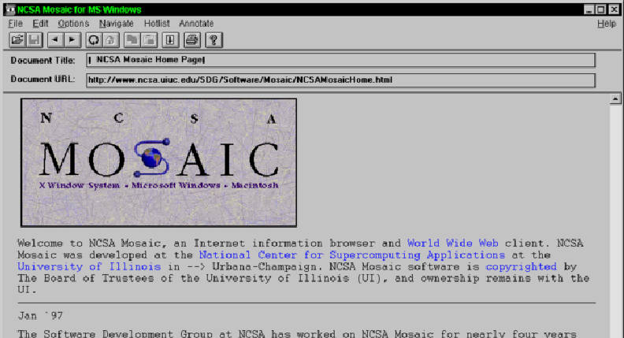

# HTML Basics
We've spent the last two chapters really focusing on how data is sent back and forth between the client (a web browser) and server (a web server).  These concepts are crucial in your understanding of web development, but they very likely aren't why you became interested in it.  Now we turn to looking deeper into how to actually *make web pages*, which will make up our web applications.

It's worth repeating a bit from Chapter 1, where we examined the relationship between *structure*, *style* and *interactivity* within a web page being displayed by a web browser.

- **Structure**:  HyperText Markup Language (HTML)
- **Style**:  Cascading Style Sheets (CSS)
- **Interactivty**:  JavaScript

HTML is the foundational language we use to describe the *structure* of a page.  **It is critical** that you separate this from how the page *appears*.  HTML *is not* the way we arrange the layout of the page, specify colors, alignments, font size, etc.  It is simply a way to describe *what* will be rendered, not necessarily *how* it will be rendered.  **Keeping this distinction in mind will pay huge dividends**.

HTML is also used to convey *semantics* of parts of a document.  We will have elements like strong, emphasis, paragraphs, lists, tables, articles, navigation and others.  They *suggest* how they might be rendered visually, but they are really about conveying meaning and relationships between parts of text within a document.

There are **three** core aspects to HTML, or three groups of HTML *elements* we will learn.  The first is content / document structure - like the elements mentioned above.  We'll spend the majority of this chapter talking about those.  The second is *form* elements and *input controls*, where we design input interfaces so users can enter information into our web application.  These HTML elements will be covered in Chapter 6, since we'll have to learn a little more about the backend code (Chapter 5) in order to process all this user input.  The third group is more subtle - we don't see and interact with them in normal use cases directly.  The third group of elements contain *metadata* and additional resources.  These elements describe the document's title, how it might behave on different devices, how it should be intepreted from a security perspective, and what *styles* and *interactivity* is embedded and linked to within the document.  We'll cover the third group in a variety of places throughout the book, when they each are appropriate.

## HTML Versions
There have been a half a dozen or so major versions of HTML, however the only 3 we need to really consider is **HTML 4.01**, **XHTML**, and **HTML 5** - with the last one being the *only* version of HTML that anyone develops with in the 2020's.  HTML 4.01 is very similar to HTML 5, although it supports fewer *element types*, and has less sophisticated support for layout, and lacks some of the multimedia and device integration support that HTML5 has defined.  Otherwise, it is very much the *same langauge*.

### The earliest versions of HTML
The original version of HTML was created by Tim Berners-Lee in 1990, as a way of describing hypertext documents.  Berners-Lee was working at [CERN](https://home.cern/about), the main goal of HTML at this time was to create *scientific* documents - the design goals were not the same as they are today! An early HTML document would have had elements we continue to use today - and the overall look of the document remains fairly unchanged.

```html
<!DOCTYPE html>
<html>
  <head>
    <title>This is a title</title>
  </head>
  <body>
    <div>
        <p>Hello world!</p>
    </div>
  </body>
</html>
```
The initial verisons (circa 1992) included `title`, `p`, headings, lists, glosary, and address elements.  Shortly after, things like `img` for images and `table` was added as well.  Of course, HTML is only as useful as your ability to **render** the document as well.  At CERN, several worked on creating primitive web browsers.  It's important to note that during this time, the language of HTML and the web browsers themselves were evolving *together*.  In many respects, the web browser **was the specification** of what HTML was - whatever the web browsers expected of HTML, and did with HTML, *was* HTML.

In 1993, NSCA Mosaic was released, and this is widely considered to be the first browser to have truly wide scale adoption (although the definition of *wide scale* was very different in the 1990's).  In the screenshot below, you should notice some familiar features:

1. Address bar (for typing the URL)
2. Page title (`title`)
3. Image element (`img`)
4. Hyperlinks (`a`)
5. Horizontal lines (`hr`)
6. Paragraphs (`p`)



During most of the 1990's, the vast majority of HTML was written by hand - meaning authors of documents sat down at their computer, openned a text editor, and typed out the contents of HTML.  One of the goals of the web was the *democratization* of technology and communication of information - and thus there was an emphasis on ensuring technical and non-technical people could create content for the web.  Browsers allowed for this by being *extremely permissive* in terms of the syntax of HTML.

As a programmer, you know that these two lines of C++ code aren't the same, even though to a novice the look pretty close:

```c++
cout << "Hello World" << endl;
cout << Hello World << endl
```
The second line won't compile, it's missing quotes around the "Hello World" text, and it's missing it's semicolon.  We as software developers get it, you need to write the program using correct syntax.  To someone non-technical however, this seems like a drag - and an unnecessary one at that!  "It's clear Hello World is what I want to print out, and the end of the line should be good enough - why do I need to write a semicolon!".  Honestly, it's a sort of fair point - for a non-programmer.

The early versions of HTML (or, more accurately, browsers) had no problem rendering the following HTML document:

```html
<html>
  <head>
    <title>This is a title</title>
  </head>
  <body>
    <div>
        <p>Hello world!</p>
  </body>
</html>
```
It's missing the `DOCTYPE` header, and doesn't close the `div`.  No harm no foul.  Small inconsistencies and errors in HTML documents resulted in browsers making their *best effort* to render the page.  Remember, the expectations of users were pretty low in the 1990s.  If one browser's best effort had a bit different result than another browser's best effort, it wasn't viewed as the end of the world necessarily.  Different people coded up the different browsers, and they didn't code up all their attempts to parse valid and invalid HTML the same way.  It was understandable!

On the topic of valid/invalid HTML, different browsers also began supporting *different* subsets of HTML elements.  By the middle of the 1990s, the web had begun to move out of scientific and academic venues and straight into consumer's homes.  Windows 95 completely revolutionized computing - suddenly *millions* of people were on the web.  Where there are consumers, there is market opportunity, competition for said market, and innovation.  Netscape Navigator (a descendent of Mosaic, and ancestor of today's Mozilla Firefox) and Internet Explorer (a step-relative so to speak of today Edge browser) competed for users.  One of the ways these browsers competed (beyond how well they dealt with HTML errors in people's documents) was by *inventing new elements*.

All sorts of elements began to crop up - `font`, `texttop`, `center`, `big`, `small`, `blink`, `marquee`, `applet` and many many more.  Some were supported first by Internet Explorer, some were created by Netscape.  Some were quickly adopted by the other, to remain on par.  Some were answered with different and competing elements.  This quickly began to spiral however, as web authors now needed to adhere to *different* HTML rules for different browsers - which was essentially impossible to do well!  We began to see things like "This site is best viewed with Microsoft Internet Explorer" written along the top of website, indicating to the user that the site might be using elements that Netscape didn't support.

Non-compatability, ambiguous rules, and competing features sets threatended the future of the web.  

**Things were not well in the late 1990's.**

### XML and XHTML
XHTML is a bit of a misunderstood variant of HTML itself.  Before describing it, let's define the elephant in the room when it comes to HTML and XHTML - and that's *XML*.  The e**X**tensible **M**arkup **L**anguage is a markup language (and often a file format) used to store *structured* data.  It was defined by the World Wide Web Consortium in 1998, and was (and still is) a huge player in the structure data space (it has been supplanted by the more simple **JSON** format in many areas within the last 10-15 years however).  XML, if you haven't seen it before, is a pretty familiar looking thing - at least on the surface:

```xml
<?xml version="1.0" encoding="UTF-8"?>
<library>
    <book>
        <title>The Great Gatsby</title>
        <author>F. Scott Fitzgerald</author>
        <year>1925</year>
        <genre>Fiction</genre>
        <price>10.99</price>
        <isbn>9780743273565</isbn>
        <publisher>Scribner</publisher>
    </book>
    
    <book>
        <title>1984</title>
        <author>George Orwell</author>
        <year>1949</year>
        <genre>Dystopian</genre>
        <price>9.99</price>
        <isbn>9780451524935</isbn>
        <publisher>Houghton Mifflin Harcourt</publisher>
    </book>
    
    <book>
        <title>To Kill a Mockingbird</title>
        <author>Harper Lee</author>
        <year>1960</year>
        <genre>Fiction</genre>
        <price>7.99</price>
        <isbn>9780061120084</isbn>
        <publisher>J.B. Lippincott & Co.</publisher>
    </book>
    
    <book>
        <title>The Hobbit</title>
        <author>J.R.R. Tolkien</author>
        <year>1937</year>
        <genre>Fantasy</genre>
        <price>8.99</price>
        <isbn>9780547928227</isbn>
        <publisher>George Allen & Unwin</publisher>
    </book>
</library>

```
As you can see, the XML document above describes a library of books.  XML arranges heirarchies of "objects" or *entities*, in a human readable format.   The language can become quite complex however - particular when considering defining an XML document's *schema*.  The concept of *schema* is that documents have a pre-defined structure.  Imagine having many XML files, each describing collections of books - the *schema* is the agreement between all authors of such documents on such details as (1) the root element is called `library`, the year of publication is called `year` rather than something like `publication-year`, for example.  The schema describes the *rules* of the XML document.  The XML schema sub-language is really what made XML *extensible*, anyone could describe a set of rules, using XML schema language, and thus (at least, in theory) and program could produce and consume those XML documents.

You may be wondering, with some basic knowledge of HTML, whether HTML *is* XML - since from what we just described, it seems perfectly logical that HTML could be defined using an XML schema!  HTML is just a set of specific XML elements for creating HTML documents.  Your inituation is *somewhat* correct - however HTML **pre-dates** XML.  As mentioned above, the original version of HTML was developed by Tim Berners-Lee almost 10 years prior.  The language looks like XML, but it wasn't general purpose. In reality, XML was a *generalization* of the already popular HTML langauage!  

XML was developed to solve some of the problems of the initial version of HTML, in the data exchange space.  While HTML had many quirks, and was very permissive in terms of syntax, when exchanging *arbitraryt* data between programs those ambiguities are a bug, not a feature.  XML is more restrictive than early versions of HTML - for example, the document is entirely invalid if you do not `<close>` an element with a corresponding `</close>` tag, or forget to include quotes enclosing an attribute.  XML of course introduced the secondary XML schema language as well.

Once XML was devleoped, it was a pretty obvious next step to develop a *new* HTML standard **described** as an XML schema.  Thus, the E**x**tensible **H**yper**T**ext **M**arkup **L**anguage (XHTML) was born (2000).  XHTML was simply the HTML language, adapted such that it was a conformant XML document, with a well defined XML schema outlining the language rules (rather than the rules being decided by a collaboration of standards bodies authoring text descriptions, and browsers actually implementing rendering of said HTML).  In the early 2000's XHTML appeared poised to become the dominant form of HTML - there was a huge amount of support behind XML in nearly all areas of Computer Science and Software Engineering.

The story didn't actually go as planned for XHTML however.  While from a strictly engineering standpoint, having a *rigourous* and *unambiguous* specification (using XML Schema) of the language was a gigantic leap forward - that *strictness* was also a liability.  Remember, in the early 2000's  *a lot* of HTML was still being written by novices, by hand (not generated by programs).  XHTML did not offer any feature enhancements over standard HTML in terms of things that developers could do that their users could **see**.  Yes, XHTML was a better technology - since XHTML was harder to write, and didn't offer any user-facing benefits, it just didn't gain the level of traction we thought it would.

### Browser Wars
While XHTML aimed to achieve rigor, it was not widely adopted by authors.  Thus, in the mid 1990's, web authors were stuck dealing with some rather significant inconsistencies between what *dialect* of HTML different browsers supported.  We dont' need to get into the details here, but you should also note that the differences were even more magnified when it came to how *styling* with CSS and *interactivity* with JavaScript was supported across browsers.  Until the late 1990's and early 2000's, the main browsers were Netscape and Internet Explorer.  Given their share of the market, there were efforts to somehow standardize the HTML language to avoid having two completely distinct dialects of HTML evolving in the wild.   To large effect, this was achieved with the ratification by the World Wide Web Consortium of HTML 4.0 (and HTML 4.01) in late 1990's - however, as you can see in the image below, by that time **Internet Explorer** had effectively become the standard.  It had won the Browser war.  While Microsoft Internet Explorer largely adoped HTML 4.01 (the standard was based in part on what Internet Explorer supported in the first place!), it did continue to support other features.


*Image linked from [Wikipedia](https://commons.wikimedia.org/wiki/File:Browser_Wars_(en).png)*

Towards the right of the image above, you see another competitor enter the scene - Google Chome.  In 2009, it's usage was small - however it marked a very important turning point in web browsers.  Google Chrome of course supported HTML 4.01, however it also had an important killer feature - JavaScript performance.  At the time of it's release, JavaScript (which is only loosely defined by the HTML specification) was a backwater in web development.  Different browsers supported it differently, and performance was pretty abysmal.  Google Chrome changed the architecture (more on this later in the book), and achieved performance increases in JavaScript execution by several orders of magnitude.  

In 2007, another important development took place that ultimately changed HTML, CSS, and JavaScript as well - the first iPhone was released.  At the time, the web was split along a second axis - interactivity.  As described above, JavaScript was a poor alternative for creating the types of richly interactive web applications we expect today.  Web applications that served mainly documents used HTML, CSS, and some JavaScript, but web applications that served up interactive visualizations, games, maps, etc used a completely different language (embedded within HTML) - Adobe Flash.  You can learn more about Flash on the web, and it's an important part of the evolution of the web - but the reason it's brought up here is that the iPhone not only **didn't support it**, but Apple unambigously stated **it would never support it**.  It was incredibly controversial, yet proved pivitol.  The iPhone had two characteristics which made it uniquely positioned to drive change - (1) it was a wild success, and (2) it's form factor (mobile!) offered lots of new ways to envision how web applications could interact with the device and the user.  By refusing the adopt Adobe Flash, and instead pointing towards the *promise* of JavaScript (just starting to take shape in early version of Google Chrome), Apple effectively put a giant thumb on the scale - leading to the complete demise of Flash, and more importantly - an incredible thirst in the market place for better JavaScript.


*Image linked from [Wikipedia](https://en.wikipedia.org/wiki/Usage_share_of_web_browsers)*

In the graphic above, you can see how Google Chrome (desktop and Andoid devices) and Apple Safari (the iPhone's browser, along with Mac) completely destroyed Internet Explorer's dominance among browsers.  During the 2000s and 2010s, we returned to a time where there was not **one** dominant browser - and this was an opportunity.  Without a dominant browser, all browser vendors benefit from **strong** standards - learning the lessons of the 1990's browser wars.  With an opportunity for stronger standardization, and a serious need for a new set of standards to better support the *new* web - multimedia, multdevice, and enhanced capabilities - the World Wide Web Consortium's HTML 5 specification (which was being developed in parallel to all of these new developments) was right in time.

### HTML 5 and beyond
The development of HTML 5 began with the first public *working draft* in early 2008.  Public releases of draft standards continued through the early 2010's, with browsers often adopting parts of the draft standards that appeared stable.  The first formally released standard came in October 2014.  HTML 5 was a major milestone in web development, aimed at modernizing how the web is built and experienced. The goal was to address the limitations of earlier versions of HTML, while reflecting the evolving needs of web developers and users. With the rise of multimedia, dynamic content, mobile browsing, and web applications, HTML5 provided much-needed improvements in functionality, performance, and standardization.

One of the key drivers behind HTML5’s development was the need to natively support richer multimedia and interactivity directly in the browser. Before HTML5, embedding video or audio required third-party plugins such as Adobe Flash or Microsoft Silverlight, which were power hungry, slow, and insecure. HTML5 introduced native `<video>` and `<audio>` elements, making it easier to embed media content without relying on external technologies. This change empowered browsers to handle media more efficiently and securely, contributing to a more seamless web experience, especially on mobile devices, where performance is critical.

Another major feature of HTML5 was the introduction of new semantic elements like `<header>`, `<footer>,` `<article>`, `<section>`, and `<nav>`. These elements added meaning to the structure of web pages, enabling developers to better organize content and improving accessibility for assistive technologies like screen readers. Semantic HTML not only enhances the user experience but also helps search engines better understand the content on a page, improving SEO and making the web more intuitive for machines and users alike.

HTML5 also worked hand-in-hand with JavaScript, empowering developers to build more powerful and interactive web applications. New APIs like the Canvas API for drawing graphics, Geolocation API for location-based services, and Web Storage API for local data storage enabled richer experiences without the need for external libraries or plugins. This shift allowed developers to create applications that previously would have required native desktop software, ushering in a new era of web applications.

Standardization was another critical goal. HTML5 sought to unify the web development landscape, where browser-specific code and fragmented implementations had long been an issue. By setting clear rules and specifications, HTML5 helped ensure that all major browsers (Chrome, Firefox, Safari, Edge, etc.) would render content consistently, reducing the need for browser-specific hacks and workarounds. This emphasis on standardization paved the way for smoother cross-browser development and a more reliable user experience across devices and platforms.

In short, HTML5 was necessary because it aligned the language of the web with modern requirements, streamlining multimedia, enhancing semantics, improving JavaScript capabilities, and unifying the development process. These features laid the foundation for a more efficient, accessible, and future-proof web.

In the rest of this chapter, we will exclusively target HTML 5.  While incremental version of HTML 5 continue to be released, the changes have been limited.  When we cover CSS and JavaScript, we likewise will target the capabilities of modern browsers supporting HTML 5 fully - as HTML 5 is sort of an umbrella for not only modern HTML, but also modern CSS and JavaScript.

### HTML History
This section covered HTML history at a really, really high level.  The intent is to give you a bit of a glimpse as to how we got where we are today.  The history of web browsers and HTML is a fascinating one however, and you are really encouraged to learn more about it!  Mozilla has a nice front-page, [here](https://www.mozilla.org/en-US/firefox/browsers/browser-history/) that has several links to other resources - it's a great start.


