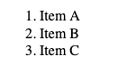
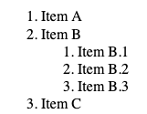
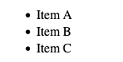
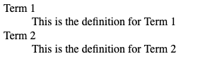
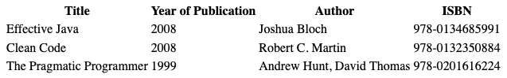
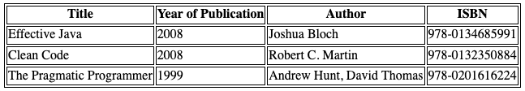
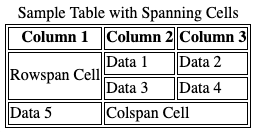
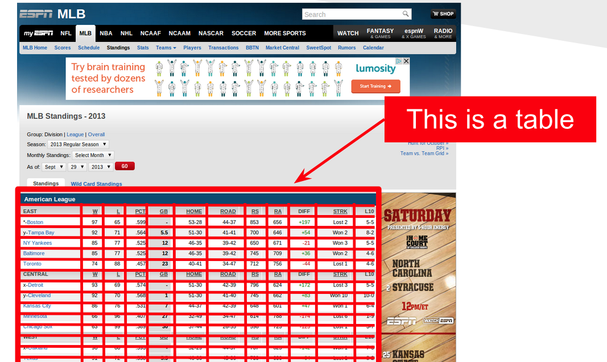
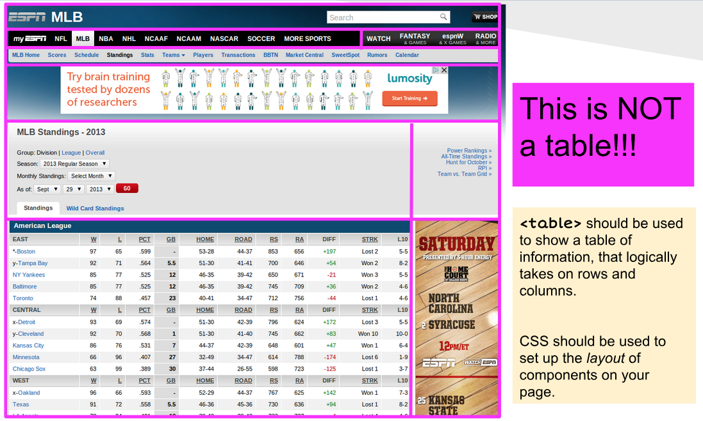

# Block Elements
Block elements are HTML elements that *by default* are always rendered within their own vertical space.  They can have vertical padding/margins, separating themselves from other elements above and below them.  By default, block elements always occupy the *entire* horizontal space available on the screen (or within their parent element).  Block elements can contain other block elements, inline elements, or a combination of both.

We've seen a few block elements already:

- `body` - this is always a block element, it is the second child of the `html` element root, and contains all the visible elements of the page.
- `p` - the paragraph element
- `pre` - the preformatted text element
- `h1, h2, h3, h4, h5, h6` - the header elements
- `div` - the generic block element, which has now special styling or semantics.  This is primarily useful for establishing groups and relationships between elements and for applying CSS styles to groups of elements.

Until HTML 5, this was about all there was in terms of pure text block elements.  Lists, dictionaries, and tables also existed (see below).  HTML 5 introduced a number of new block elements, which are used to help define the structure of a page while conveying some additonal semantics.  These were added to promote better accessibility and to help search engines better understand the content of a page, and also to cut down on the proliferation of `div` all over most HTML pages.

## Block container elements
HTML 5 introduced `<section>`, `<article>`, `<nav>`, `<header>`, `<footer>` and `<aside>` to give HTML authors better and more descriptive element names for parts of their webpage.  Here's an example of some HTML prior to HTML 5 that might create two short blog posts:

```html
<div>
  <h1>My First Blog Post</h1>
  <p>Date published goes here</p>
  <p>Here is the content of my blog post.</p>
  <p>Author information goes here.</p>
</div>
<div>
  <h1>My Second Blog Post</h1>
  <p>Date published goes here</p>
  <p>Here is the content of my blog post.</p>
  <p>Author information goes here.</p>
</div>
```
Notice that `div` isn't particularly descriptive.  In addition, the paragraph elements containing date published and author information are not semantically related to the blog post content, but we only know that because we understand what we are reading!  Now let's see how we might write this using some of the HTML 5 elements:

```html
<article>
    <header>
        <h1>My First Blog Post</h1>
        <p>Date published goes here</p>
    </header>
    <section>
        <p>Here is the content of my blog post.</p>
    </section>
    <footer>
        <p>Author information goes here.</p>
    </footer>
</article>
<article>
    <header>
        <h1>My Second Blog Post</h1>
        <p>Date published goes here</p>
    </header>
    <section>
        <p>Here is the content of my blog post.</p>
    </section>
    <footer>
        <p>Author information goes here.</p>
    </footer>
</article>
```
It's longer, because we've used `header`, `footer`, and `section` to wrap the critical areas of each post.  Now, let's see how it's rendered.


[Live on your own machine](https://localhost:8080/examples/inline/block-article.html)

Which rendering is that?  Actually - **and this is very important**, the new HTML 5 block containers *do not carry with them any styling*.  They are rendered **exactly like `div`**, they are just more semantically descriptive.  Often students first learning this will question the wisdom of using more elaborate elements, since clearly it makes things a little more complex.  The answer is that the complexity is worth it, because it makes the page more accessible to screen readers and search engines, and it makes the page easier to understand for other developers.  Today's web is consumed by more bots than humans, and semantic elements within HTML allows bots (I'm using the word in a neutral way, nothing nefarious) to make better use of the content.  **This is a good thing**.

There is an additional benefit of using more descriptive HTML 5 block containers, and it presents itself when we begin styling our pages with CSS.  Clearly, things like headers, footers, navs are likely to have different visual styles to them.  Without going into the details too much, in order to style all headers the same way using HTML 4 `div` we'd need to make sure we added a *CSS class* attribute to each `div` that was intended to serve as a header to a blog post.  With HTML 5, we do not need to add additional noise - we can simply style *all header elements*.  This is a small thing, but it adds up over time.

```html
    <div class="header">
        This content can be styled
        by writing CSS rules that target
        all elements with header class.
    </div>
    <header>
        This content can be styled
        by writing CSS rules that target
        all header elements.
    </header>
```

The new block elements *suggest* some meaning.  For example, a `nav` element should generally be an element that contains navigation links and buttons.  It probably will be styled so it is at the top, or along the side of a page, but that's what we use CSS for.  However, the fact that `nav` is used tells a screen reader, or a search engine bot, that the content within the `nav` element is likely to be navigation links.

Similarly, using `aside` suggests that the text within it is not part of the primary content of the section of text - but that it is an "aside".  The browser will not render `aside` off to the side of the text, but you will earn to use CSS to do so if you choose.  However, again, a screen reader will understand that it should not process the contents of an `aside` when processing the main text within an article or section, for example.

## More specialized block elements
HTML 5 also introduced a number of other block elements that are used to convey meaning.  These include `<address>` and `<blockquote>`.  Most browsers will render `<address>` elements as italics, and it's a nice wrapper element you can use to contain other elements of an address.  You can, of course, write CSS rules to target `address` and style it separately as well.    `blockquote` is typically rendered with a left margin, and sometimes with a right margin, to indicate that the text within it is a quote from another source.

```html
<address>
    <p>1234 Elm Street</p>
    <p>Springfield, IL 62701</p>
</address>
<p> Here is some generic text, not part of the Gettysburg Address.</p>
<blockquote>
    Four score and seven years ago our fathers brought
    forth on this continent, a new nation, conceived
    in Liberty, and dedicated to the proposition that all...
</blockquote>
```


## Lists & Dictionaries
The web was built, originally, to create a hypertext library of scientific documents.  Scientific documents have a lot of lists and glossaries, and so it's not surprising that these are some of the original HTML block elements.  Lists and glossary (definition lists) are block elements that convey some semantics, along with some special formatting assumptions that are usually fairly useful by default.

Let's look at the two most common forms of lists - **ordered lists** and **unordered** lists.  An **ordered list** is a group of *list items* that are arranged in a **numeric** order.  When constructing a list like this, the web browser will **automatically** create numberings for you, you should not add numbers to the text of your lists itself.  Here's an example:

```html
<ol>
    <li>Item A</li>
    <li>Item B</li>
    <li>Item C</li>
</ol>
```
Notice that the `<ol>` element contains three list item elements (`li`).  When rendered, margins are applied to the list items, and numbers are automatically applied.



Fear not, you do have control over styling, even whether numbers appear or not - but we'll do that with CSS.  Note also that you may *nest* list elements within list items, creating sub-lists.  The browser will make a reasonable attempt at rendering these in a coherant way.

```html
<ol>
    <li>Item A</li>
    <li>
        Item B
        <ol>
            <li>Item B.1</li>
            <li>Item B.2</li>
            <li>Item B.3</li>
        </ol>
    </li>
    <li>Item C</li>
</ol>
```



Unordered lists use precisely the same structure, but we use `<ul>` for **u**nordered instead of `ol` for **o**rdered.  The list elements themselves are still just `li` elements.

```html
<ul>
    <li>Item A</li>
    <li>Item B</li>
    <li>Item C</li>
</ul>
```



Nesting is similarly supported, and it is perfectly viable to nest ordered lists within unordered list elements, and vice versa.

The third type of list is a *definition* list.  It's less frequently used, but it nevertheless a fairly useful element that might not get the credit it rightly deserves. Definition lists are compound list elements, containing a *term* and a *definition*. This is perfect for creating dictionaries, glossaries, and other types of descriptive listings.

```html
<dl>
    <dt>Term 1</dt>
    <dd>This is the definition for Term 1</dd>

    <dt>Term 2</dt>
    <dd>This is the definition for Term 2</dd>
</dl>
```



Note here that we no longer use `li` elements, but instead each terms is build from a consecutive pair of `dt` (term) and `dd` (definition) elements.

For all three list types, CSS can help us style the padding, spacing, font, and even the decorators (the numbers, dots) - all of which we will cover when we dive into CSS.


## Tables
Much like lists, *tables* are a common feature of scientific documents, and as such have been part of HTML from very early on.  The `table` element has a checkered past, and we will discuss it in a moment, but first lets jump right to the syntax of a table.

Each `table` element creates an individual table.  The table element should have at least one child - `tbody` (table body) but may also have a table heading (which typically contains column headings) using the `thead` element.  Finally, a table element can also feature a `tfoot` element for a table footer area.  Tables can have *any number* of `thead`, `tbody`, and `tfoot` elements, appearing in any order within the table.

Within the `thead`, `tbody` or `tfoot` exist **table rows** - represented by the `tr` element. The `tr` element may contain any number of *table data* or *table heading* columns - represented by `td` and `th` elements.  For now, let's keep things simple and assume that *all rows have the same number of columns* - although this isn't a real requirement.

Here's an example:

```html
<table>
    <thead>
        <tr>
            <th>Title</th>
            <th>Year of Publication</th>
            <th>Author</th>
            <th>ISBN</th>
        </tr>
    </thead>
    <tbody>
        <tr>
            <td>Effective Java</td>
            <td>2008</td>
            <td>Joshua Bloch</td>
            <td>978-0134685991</td>
        </tr>
        <tr>
            <td>Clean Code</td>
            <td>2008</td>
            <td>Robert C. Martin</td>
            <td>978-0132350884</td>
        </tr>
        <tr>
            <td>The Pragmatic Programmer</td>
            <td>1999</td>
            <td>Andrew Hunt, David Thomas</td>
            <td>978-0201616224</td>
        </tr>
    </tbody>
</table>
```



Notice that Firefox (which I use to render all the images in this book) adds some styling to tables.  The `th` heading elements are bold, and centered - while the `td` elements are left justified. We can of course change all that using CSS, and we can also add table borders, padding, etc.  Again, we'll cover styling of tables later in the CSS chapter -  for now we'll just focus on the HTML itself.

To make things a little easier to see, structurally, let's introduce a tiny bit of CSS however.  At the top of the HTML page, let's add some border styling:

```html
<style>
table, th, td {
  border: 1px solid black;
}
</style>
```


With those borders, now we can take a look at some of the other element features of tables.  For example, we can add `<caption>` element to add a title, and we can also create column cells that span multiple colums:


```html
<table>
    <caption>Sample Table with Spanning Cells</caption>
    <thead>
        <tr>
            <th>Column 1</th>
            <th>Column 2</th>
            <th>Column 3</th>
        </tr>
    </thead>
    <tbody>
        <tr>
            <td rowspan="2">Rowspan Cell</td>
            <td>Data 1</td>
            <td>Data 2</td>
        </tr>
        <tr>
            <td>Data 3</td>
            <td>Data 4</td>
        </tr>
        <tr>
            <td>Data 5</td>
            <td colspan="2">Colspan Cell</td>
        </tr>
    </tbody>
</table>
```



[Live on your own machine](https://localhost:8080/examples/inline/block-table-spanning.html)


Tables present some problems when considering HTML to be shown on multiple devices, particularly smaller screens.  You might notice that plain text tends to look readable wherever you view it - be it on a large desktop screen or a small smart phone.  It may not be perfect, but even without any CSS the web browser generally does a fairly good job at rendering with appropriate text wrapping.  This is not the case with tables, unfortunately. You will find that without CSS, tables tend to be quite cumbersome for users to work with on smaller devices, forcing lots of horizontal scrolling.  It also becomes difficult to control how cells (columns) will be rendered, and avoid unwanted text wrappiing within cells.  All of these issue can be corrected with CSS, but it's worth pointing out that *sometimes* there are alternative HTML structures that might lend themselves better to *response* design.  We will discuss responsive design later with CSS, however it refers to the design goal of supporting many different screen sizes well - often by changing what things are visible, or how they are rendered, depending on the screen size.  Whenever you are considering a table, you could also consider the responsive concerns that it may include.

**Pro Tip**&#128161; Use tables for tabular data.  This sounds simple, but it's often forgotten. HTML tables are the best option when you have a table of data - not words and paragraphs, not search listings, not text.  If what you are typing to put on the page *is a table*, in the true sense of the word, then by all means you should use a `table` element.  If not, however - using the `table` element *may* be a mistake.  Other elements we've seen - like unordered, ordered, and definition lists - can be much better choices.  They offer more flexibility, and easier stylings options.  *You don't need to avoid `table` elements*, but you should be careful to use them only for what they are good at!

### Tables are not for layout
There was a time, in the 1990s, where `table` elements were not just used for presenting data, they were used for layout.  In particular, they were used to create sidebars to the left and right of main text on pages, including sidebars that just had mostly blank space!  For complex layouts, web developers created elaborate tables, with tables within tables, along with tables with empty cells, all in an effort to do what today CSS does *far better*.  Don't judge those developers though, in the 1990s CSS was *decidedly not great*, and browsers were quite inconsistant in how they interpreted complex CSS.

Here's an example (from a somewhat ancient version of a website) of where to use tables, and where not to use tables.

*By the way, the screen shot above is from a 2013 archive of major league baseball standings on espn.com.  I sincerly doubt that as late as 2013 espn.com was using actual table elements for their layout, however the screen shot is illustrative of the types of page layouts that had been commonly achieved with table elements.*





A picture is worth a thousand words in this case.  As you can see, the first image outlines a *true* table - and yes, the HTML in that area uses a `table` element, with `th` and some nice CSS.  The image below shows *another* table though - and it's not a table at all - it's a collection of cells that the web author has used a `table` element to *arrange* as a grid.  This is an old web page, and it has some serious flaws.  First, a `table`, as  discussed above, cannot adequately adjust it's layout for smaller screens. This makes it an incredibly poor element for laying things out as a grid, because that grid will need horizontal scrolling on smaller devices.  Today, CSS has vastly superior layout mechanisms, which allow you to construct the same page layout using normal block containers like `div`, `section`, `nav`, `aside`, etc. 

You should **never** use tables to layout content on a page.  You should use tables to present data!


## More Block Elements
There are more block elements, some of which we will spend a lot more time on soon.  HTML forms, which allow for user input, will be covered in a later chapter.  HTML forms themselves are block elements, and individual controls (text inputs) are inline and block elements.  THere are several specialized elements for multimedia, including a few block elements (`video`) that we will cover next as well.
