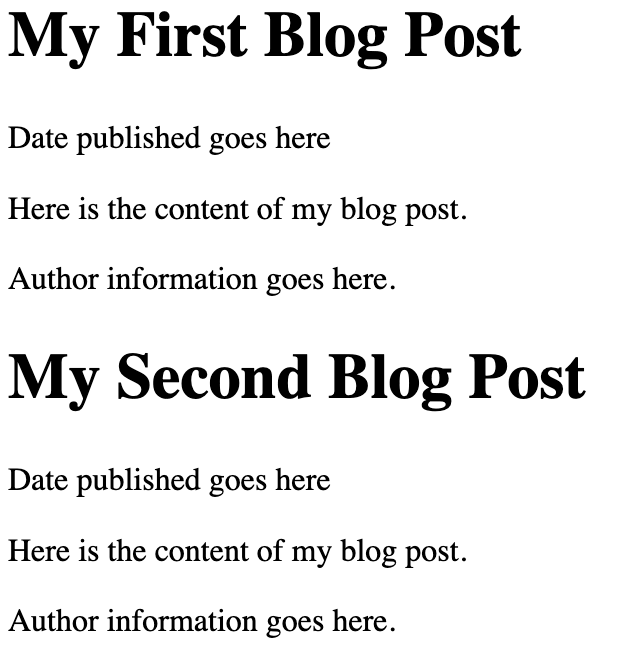
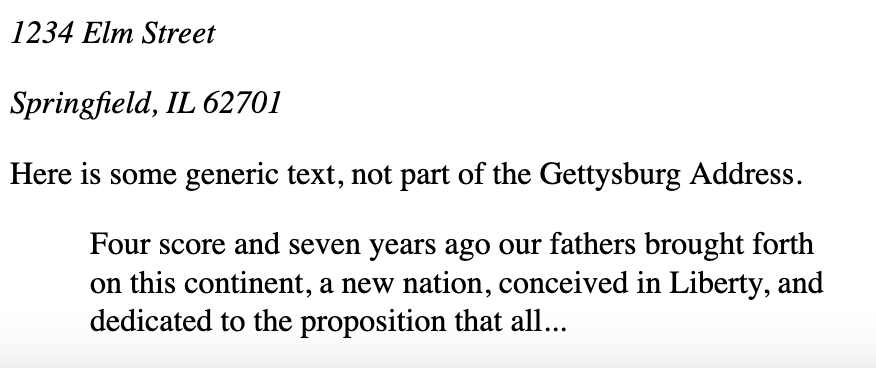

# Block Elements
Block elements are HTML elements that *by default* are always rendered within their own vertical space.  They can have vertical padding/margins, separating themselves from other elements above and below them.  By default, block elements always occupy the *entire* horizontal space available on the screen (or within their parent element).  Block elements can contain other block elements, inline elements, or a combination of both.

We've seen a few block elements already:

- `body` - this is always a block element, it is the second child of the `html` element root, and contains all the visible elements of the page.
- `p` - the paragraph element
- `pre` - the preformatted text element
- `h1, h2, h3, h4, h5, h6` - the header elements
- `div` - the generic block element, which has now special styling or semantics.  This is primarily useful for establishing groups and relationships between elements and for applying CSS styles to groups of elements.

Until HTML 5, this was about all there was in terms of pure text block elements.  Lists, dictionaries, and tables also existed (see below).  HTML 5 introduced a number of new block elements, which are used to help define the structure of a page while conveying some additonal semantics.  These were added to promote better accessibility and to help search engines better understand the content of a page, and also to cut down on the proliferation of `div` all over most HTML pages.

## Block container elements
HTML 5 introduced `<section>`, `<article>`, `<nav>`, `<header>`, `<footer>` and `<aside>` to give HTML authors better and more descriptive element names for parts of their webpage.  Here's an example of some HTML prior to HTML 5 that might create two short blog posts:

```html
<div>
  <h1>My First Blog Post</h1>
  <p>Date published goes here</p>
  <p>Here is the content of my blog post.</p>
  <p>Author information goes here.</p>
</div>
<div>
  <h1>My Second Blog Post</h1>
  <p>Date published goes here</p>
  <p>Here is the content of my blog post.</p>
  <p>Author information goes here.</p>
</div>
```
Notice that `div` isn't particularly descriptive.  In addition, the paragraph elements containing date published and author information are not semantically related to the blog post content, but we only know that because we understand what we are reading!  Now let's see how we might write this using some of the HTML 5 elements:

```html
<article>
    <header>
        <h1>My First Blog Post</h1>
        <p>Date published goes here</p>
    </header>
    <section>
        <p>Here is the content of my blog post.</p>
    </section>
    <footer>
        <p>Author information goes here.</p>
    </footer>
</article>
<article>
    <header>
        <h1>My Second Blog Post</h1>
        <p>Date published goes here</p>
    </header>
    <section>
        <p>Here is the content of my blog post.</p>
    </section>
    <footer>
        <p>Author information goes here.</p>
    </footer>
</article>
```
It's longer, because we've used `header`, `footer`, and `section` to wrap the critical areas of each post.  Now, let's see how it's rendered.


[Live on your own machine](https://localhost:8080/examples/inline/block-article.html)

Which rendering is that?  Actually - **and this is very important**, the new HTML 5 block containers *do not carry with them any styling*.  They are rendered **exactly like `div`**, they are just more semantically descriptive.  Often students first learning this will question the wisdom of using more elaborate elements, since clearly it makes things a little more complex.  The answer is that the complexity is worth it, because it makes the page more accessible to screen readers and search engines, and it makes the page easier to understand for other developers.  Today's web is consumed by more bots than humans, and semantic elements within HTML allows bots (I'm using the word in a neutral way, nothing nefarious) to make better use of the content.  **This is a good thing**.

There is an additional benefit of using more descriptive HTML 5 block containers, and it presents itself when we begin styling our pages with CSS.  Clearly, things like headers, footers, navs are likely to have different visual styles to them.  Without going into the details too much, in order to style all headers the same way using HTML 4 `div` we'd need to make sure we added a *CSS class* attribute to each `div` that was intended to serve as a header to a blog post.  With HTML 5, we do not need to add additional noise - we can simply style *all header elements*.  This is a small thing, but it adds up over time.

```html
    <div class="header">
        This content can be styled
        by writing CSS rules that target
        all elements with header class.
    </div>
    <header>
        This content can be styled
        by writing CSS rules that target
        all header elements.
    </header>
```

The new block elements *suggest* some meaning.  For example, a `nav` element should generally be an element that contains navigation links and buttons.  It probably will be styled so it is at the top, or along the side of a page, but that's what we use CSS for.  However, the fact that `nav` is used tells a screen reader, or a search engine bot, that the content within the `nav` element is likely to be navigation links.

Similarly, using `aside` suggests that the text within it is not part of the primary content of the section of text - but that it is an "aside".  The browser will not render `aside` off to the side of the text, but you will earn to use CSS to do so if you choose.  However, again, a screen reader will understand that it should not process the contents of an `aside` when processing the main text within an article or section, for example.

## More specialized block elements
HTML 5 also introduced a number of other block elements that are used to convey meaning.  These include `<address>` and `<blockquote>`.  Most browsers will render `<address>` elements as italics, and it's a nice wrapper element you can use to contain other elements of an address.  You can, of course, write CSS rules to target `address` and style it separately as well.    `blockquote` is typically rendered with a left margin, and sometimes with a right margin, to indicate that the text within it is a quote from another source.

```html
<address>
    <p>1234 Elm Street</p>
    <p>Springfield, IL 62701</p>
</address>
<p> Here is some generic text, not part of the Gettysburg Address.</p>
<blockquote>
    Four score and seven years ago our fathers brought
    forth on this continent, a new nation, conceived
    in Liberty, and dedicated to the proposition that all...
</blockquote>
```


## Lists & Dictionaries
The web was built, originally, to create a hypertext library of scientific
## Tables

## More Block Elements
There are more block elements, some of which we will spend a lot more time on soon.  HTML forms, which allow for user input, will be covered in a later chapter.  HTML forms themselves are block elements, and individual controls (text inputs) are inline and block elements.  THere are several specialized elements for multimedia, including a few block elements (`video`) that we will cover next as well.
