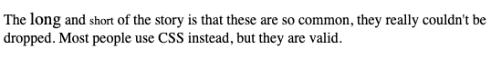
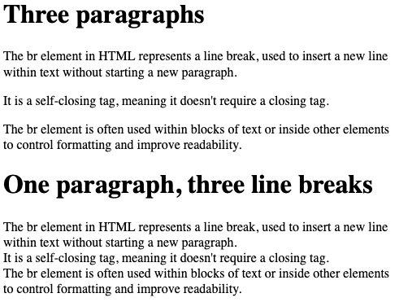
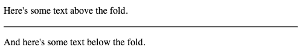
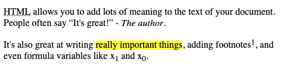
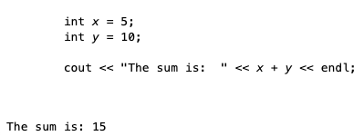
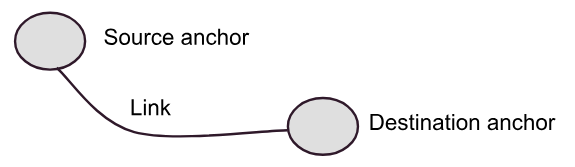

# Inline Elements, Text, and Links
In the previous section we examined `<strong>` and `<em>` as inline elements that hinted at some meaning behind the text they enclosed.  Strong words feel like they should be in bold, although it's debatable whether or not *emphasis* is really saying italics, or whether it's really different than *strong*.  That aside, there are a few **inline** elements that do convey pretty specific meaning.

**Inline elements** cannot contain block elements, but they may contain other inline elements.  Otherwise, inline elements will typically contain just text.  Inline elements, just like block elements, can have attributes.

BTW, you can play along.  If you downloaded the `html-serve` folder, you can run the program on your machine (`node server.js`).  This will start the web browser and you can use the links provided within the text to exploer further.

## Inline Sizing
While it's not really in line with pure *semantic* meaning, HTML does continue to support a small set of sizing elements that are *inline*.  They aren't terrifically supported.  At the time of this writing, `small` has no effect on the text rendered by Firefox.  Expect this to continue, as

```html
<p>
    The <big>long</big> and <small>short</small> of the story is
    that these are so common, they really couldn't be dropped.
    Most people use CSS instead, but they are valid.
</p>
```



[Live on your own machine](https://localhost:8080/examples/inline/sizing.html)

## Vertical Spacing
We already saw the `br` element.  It is an example of an HTML **empty** element, meaning it is both an opening and closing tag, with **no content**.  It is **illegal** to include any content in the `br` element in fact (if you think about it, that wouldn't make any sense).  The `<br/>` element causes a single line break.  There is no additional vertical spacing/padding applied, the text simply begins on the next line.  Contrast this with paragraphs, which by default will also receive some separation spacing.

```html
<h1>Three paragraphs</h1>
<p>The br element in HTML represents a line break, used to insert a new line within text without starting a new paragraph.</p>
<p>It is a self-closing tag, meaning it doesn't require a closing tag. </p>
<p>The br element is often used within blocks of text or inside other elements to control formatting and improve readability.</p>


<h1>One paragraph, three line breaks</h1>
<p>The br element in HTML represents a line break, used to insert a new line within text without starting a new paragraph. <br/>It is a self-closing tag, meaning it doesn't require a closing tag. <br/>The br element is often used within blocks of text or inside other elements to control formatting and improve readability.
</p>
```




[Live on your own machine](https://localhost:8080/examples/inline/br.html)


Notice that depending on line wrapping and screen size, the text with line break may have more than three lines - including a few really short lines.  This is illustrative of why you want to use caution relying on the `br` element too much.

Often we wish to draw a clear separation between two areas of text.  On printed paper, this is usually accomplished with a simple *horizontal line* - and HTML provides this with another **empty** or *self-closing* element - `<hr/>`.  The *horizontal rule* draws a horizontal line on the next vertical space (technically, it is a block element).

```html
<p>Here's some text above the fold.</p>
<hr />
<p>And here's some text below the fold.</p>
```




[Live on your own machine](https://localhost:8080/examples/inline/hr.html)

## Association Elements
There are inline elements that work to associate text with other parts of the document, or to call them out from the rest in some way.  You would be familar with them from writing any large document, especially technical documentation.

- `cite` - Used for citations, generally will show the text in italics.
- `mark` - Wrap text to highlight or mark in some way.  In most browsers, the text enclosed in this element will be highlighted in yellow.
- `label` - Used to associate text with something else on the page.  The label element supports the `for` attribute, which allows you to specify which element the label is *for*. This is common on HTML forms, which we will cover in a later chapter.
- `q` - Surrounding text with the `quote` element will automatically put quotes around the text.  This is very helpful, especially for character encoding issues.  It also convey a lot more meaning than just using the " marks within plain text.
- `abbr` - The `abbr` element uses the `title` attribute to show a popover when the abbreviation text is hovered over.  It can also be used for screen readers to prompt the system to audibly explaint the abbreviation.  For example, `<abbr title="World Health Organization">WHO</abbr> semantically associates the World Health Organization with the acronym WHO, in a meaningful way.
- `sub` and `sup` - These are for subscripts and superscripts.
- `time` - Wraps a time value, in hopes of allowing the browser to display the time value in a local-specific way.  In practice, most browsers don't do a whole lot with this, but it's nice to use when possible to take advantage of any features the browser can provide.  The `time` element also supports a `datetime` attributes that expects a valid timestamp (in an ISO formatted string).  This can be useful to associate text (ie. Independence Day) with a specific date (2027-07-04).

```html
<p>
<abbr title="HyperText Markup Language">HTML</abbr> allows you
    to add lots of meaning to the text of your document.  People often
    say <q>It's great!</q> - <cite>The author</cite>.
</p>
<p>
    It's also great at writing <mark>really important things</mark>,
    adding footnotes<sup>1</sup>, and even formula variables like x<sub>1</sub>
    and x<sub>0</sub>.
</p>
```



[Live on your own machine](https://localhost:8080/examples/inline/misc.html)

## Code / Computer Output
It's somewhat questionable whether all of the inline elements we've added to HTML for computer code was a great idea, it seems sort of biased to a particular domain (people who write about code), but hey - why not.  Your results may vary, depending on your browser - there isn't a lot of agreement between browsers how code should be rendered. Firefox in 2024 renders variable names in italics, for example.  There's no question that the element convey meaning, but they don't really dictate visual representation

```html
<pre><code>
int <var>x</var> = 5;
int <var>y</var> = 10;

cout << "The sum is:  " << <var>x</var> + <var>y</var> << endl;
</code>
</pre>
<samp>
    The sum is:  15
</samp>

```




[Live on your own machine](https://localhost:8080/examples/inline/code.html)

<hr/>

There are additional inline elements, and lots of resources on the web that gives more explanation.
[WWW Schools](https://www.w3schools.com/html/html_blocks.asp) has a good listing of inline elements, and allows you to demo some of them online.  We are going to return to some more soon, including the `a` element below, and the `img` element when we cover multimedia.  First. let's take a look at some other *text* issues that come into play with HTML.

## Text & Special Characters
When we talk about inline elements, we are mostly talking about text, and so this is a good enough place as any to discuss some of the quirks about text, as it appears in HTML.  We've already seen that text in HTML uses *white space collapsing* - meaning multiple consecutive spaces, tabs, and even new lines are always *rendered* as a single space.  This is one instance, but not the only instance, where the text that you write in your editor is *not* the same as the text that appears on the browser screen once the HTML is rendered.

HTML is of course a programming language, and so there are special characters in the language itself that act as delimiters. As any language, HTML must be parsed by machine code (the browser, in most cases), and therefore there needs to be some provisions for differentiating between delimiters and true characters.

In HTML, the most noticable delimters are the `<` and `>` that make up the opening and closing tags - `<body>...</body>`.  This angle brackets **may not appear** within text contents, as they create ambiguity for the parser:

```html
<p>
    It is against the language rules to have < or > in the text, like was done here!
</p>
```
The above HTML may or may not render at all, browsers still have discretion when dealing with invalid HTML. Make no mistake, however - **it is invalid HTML**.

HTML defines a number of *named entity* references, which are essentailly like the escape codes you use in other languages (for example, the `\n` as a new line).  For the angle characters, we have `&gt;` for the greater than symbol, and `&lt;` for the less than symbol. There are also named entities for `<=` and `>=`.

| Char | Named entity |
|------|--------------|
| `<`    |   `&lt;`       |
| `<=`   |   `&le;`      |
| `>`    |   `&gt;`       |
| `>=`   |   `&ge;`      |

There are additional characters that are not permitted to be within text content of HTML elements.  Not unexpectedly, the `&` that begins an entity reference *is* a special character - and as such must be written with a named entity reference itself - `&amp;`.  There are also named entities for character that often create confusion when copy and paste is used between editors, especially when the editors are using different character encodings. A prime example of this is the double quote character - `"`.  When using rich text editors, often the quotes are different from the ASCII quote, which will not work well in HTML.  Due to the possible confusion, it is *always* recommended to either use the `<q>` element to wrap text that should be put in quotes, or to use the corresponding entity reference - `&quot;`.

Here's a listing of some of the more commonly used entity references.  Each *named* entity reference can also be written using it's hex or decimal code (although to most people, this is less readable)  [There are many, many more.](https://www.w3schools.com/charsets/ref_html_entities_a.asp).  There are even entity references for [emoji](https://www.w3schools.com/html/html_emojis.asp)  &#128540;

| Character | Named Entity | Hex | Dec |
| --------- | ------------ | ----| ----|
| &lt;    |   `&lt;`       | `&x0003C;` | `&x60;` |
| &le;   |   `&le;`      | `&x2264;` | `&x8804;` |
| &gt;   |   `&gt;`        | `&x0003E;` | `&x62;` |
| &ge;   |   `&ge;`       | `&x02265;` | `&x8805;` |
| &quot; | `&quot;` | `&x00022;` | `&x34;` |
| &hyphen; | `&hyphen;` | `&x2010;` | `&#8208;` |
| &dot; | `&dot;` | `&x002D9;` | `&#729;` |
| &middot; | `&middot;` | `&x000B7;` | `&#183;` |

## Comments
If you look in your developer tools when loading a web page, or right click and choose "View Source", you can always see the HTML loaded in the browser.  It's source code, and just like any other source code, it may or may not have *comments*. You of course know what comments are all about - as a programmer you *hopefully* comment your code to the extent that is necessary for some other poor soul (or your future self) to understand what you've done.

HTML is no different, however since HTML is typicall *not complex*, most of the time comments are used for more routine purposes - like author names, or additional information about the page.

Comments in HTML are delimited by `<!--` and `-->`.  There are no single line comments (like the `//` vs `/*   */` in some other languages).

```html
<p>
    Here's some text.
    <!--
    This is a comment, and won't render
    -->
    Here's some more text.
</p>
<!-- This won't render either-->
 ```
Use comments in HTML sparingly.  There really shouldn't be a need to document your HTML - if it's complex enough to confuse someone, something has gone terribly wrong. Remember, comments actually are part of the HTML that gets sent to the client - therefore it takes up network bytes.

**Pro Tip**&#128161; Unlike in other programming languages, your end users have direct access to your source code.  Possibly more than any other language, HTML is very much *open*, there is literally no way your web page can render in someone's browser while at the same time preventing them from seeing the HTML code if they want to. Why is this important?  Your comments are part of your code.  **Keep your comments professional**.  Do not put **anything** in comments that you don't want the entire world to see.  This includes unprofessional language, but it also includes secrets (API keys, etc.).  **Remember**, HTML code that you write can be seen easily by **anyone** who can load the web page.

## Links and Anchors - HyperText!
We've saved the best inline element for last, the *anchor* element.   It's the best because it puts the *hyper* into *Hyper*Text.  Anchor elements are the links that we take for granted on the web.  The term "link" though isn't really used the same way it was thought of (in theory) when HTML was created.  Instead, links were the path between **two anchors** - a source and a destination.



In HTML, there are implicity anchors - such as a **URL**, and explicit anchors created with `<a>` elements.  Typically, we create *source* anchors within web pages, which identify *destinations* by using a **URL**.  The following creates a text link to Mozilla.org:

```html
<!doctype html>
<html>
    <body>
        <p>Here's a <a href="https://www.mozilla.org">link</a>
        to a great place to get a web browser</p>
    </body>
</html>
```

In the source code above, the `<a>` element is a *source* anchor - it's a jumping off point, to another *hyper*text.  The `href` attribute is indicating that the destination is on another page, at a different domain - `https://www.mozilla.org`.  The URL itself is an implicit anchor.  We know, of course, that the browser *renders* the `<a>` element as a **link**.  Links are *usually* rendered as colored text, with an underline.   The color of the text is usually blue, and the underline is usually removed when the link is clicked.  This is the default behavior of the browser, and can be changed with CSS.

The value of the the `href` attribute is a URL.  The URL can be a relative URL, or an absolute URL.  If the URL is relative, it is relative to the current page.  If the URL is absolute, it is a full URL - *which must begin with the scheme*.

Let's assume you have an HTML page loaded from `https://www.example.com/foo/bar.html`.  The following `href` values are all valid:

- `href="baz.html"` - this is a relative URL, and the browser will request `https://www.example.com/foo/baz.html`
- `href="/baz.html"` - this is a relative URL, and the browser will request `https://www.example.com/baz.html`
- `href="https://www.anotherexample.com/baz.html"` - this is an absolute URL, and the browser will request `https://www.anotherexample.com/baz.html`
- `href="//www.anotherexample.com/baz.html"` - this is an absolute URL, and the browser will request `https://www.anotherexample.com/baz.html`.  The `https` is assumed, based on the fact that you are currently viewing an `https` page.

The following are **problematic**, and need to be avoided:
- `href=www.anotherexample.com/baz.html` - this is a relative URL, and the browser will request `https://www.example.com/foo/www.anotherexample.com/baz.html`.  Clearly, that's unlikely to be what you actually wanted - but without the scheme, or leading `//`, the browser will assume it's a relative URL.
- `href="http://www.anotherexample.com/baz.html"` - This is an absolute reference, and is *ok*.  However, you should note that linking to `http` sites within an `https` site might invoke a warning from the browser when the user clicks it.  Sometimes we have no choice, the site we link to is only served with `http`, but generally if you can, always choose `https`.

Browsers respond to clicking on *source* links with `href` values by generating a **new** HTTP `GET` request to the target URL.

### Anchors within pages
As discussed above, there are *two* anchors - a source and a destination.  In the examples above, we were linking to a URL, which implicitely is an anchor.  We can create *explicit* destination anchors *within* an HTML page as well though.

The following page creates several explicit anchors, and links to them at the top.

```html
<!doctype html>
<html>
    <body>
        <!-- Source Anchors -->
        <p>
            <a href="#section1">Section 1</a>
            <a href="#section2">Section 2</a>
            <a href="#section3">Section 3</a>
        </p>
        <!-- Destination Anchors -->
        <h1><a name="section1">Section 1</a></h1>
        <p>This is section 1</p>
        <h1><a name="section2">Section 2</a></h1>
        <p>This is section 2</p>
        <h1><a name="section3">Section 3</a></h1>
        <p>This is section 2</p>
    </body>
</html>
```
[Live on your own machine](https://localhost:8080/examples/inline/dest-anchors.html)

Try this one on your own machine, but make the window really small, so you can't see the entire vertical page.  When you click on the section links along the top of the page, the browser responds by *scrolling* down to the location of the destination anchor.  The destination anchors are `<a>` elements, but **instead** of having a `href` attribute, they have a `name` attribute.  The `name` attribute is the *destination* anchor.  The browser will scroll the page to the location of the destination anchor when the source anchor is clicked.

Notice that the **source** anchors still use `href` - they are sources, and the `href` creates the link to the destination anchor.  In this case, the source anchors are refering to the current page, but at the **named** destination - prefixed with `#`.  We can also combine a URL and a name to create links to different web pages, at *specific* locations.  For example, if the html with the three section links were to be hosted at `https://my-anchors.com/sections.html`, the following would link to the second section:

```html
<a href="https://my-anchors.com/sections.html#section2">Section 2</a>
```

### Relative vs Absolute URLs
When linking *to* other resources that are external to our own site (on a different domain), we have no choice but to list URLs using the full absolute syntax.  If our site is hosted on `https://mysite.com` and we are linking to something on `https://example.com`, then the `href` **must** be absolute.  What about when we are linking to resources on our own site?  Should we use relative or absolute URLs?  In almost **all cases** we want to link using *relative* links.  This is because relative links are more robust - they are less likely to break when the site is moved, or when the site is accessed from a different domain.  If you use absolute URLs, and the site is moved, then all the links will be broken.  If you use relative URLs, then the links will continue to work, as long as the relative structure of the site is maintained.  This also lets you develop your web site on your own computer, using a localhost web server, and have it function exactly the same way it will when it's deployed to a real server.

Sometimes, within a web application with many pages, with a nested structure, it can feel awkward to restrict yourself to relative links - you find yourself using `.../.../other.html` type syntax, counting the `../` up complex paths.  In this case, **remember** that an `href` value of `/other.html` is still a "relative" link, in that it is not changing the domain - it's just linking to a resource starting at the root, rather than the current path.  This can be a good compromise, it let's you link directly to a resource within your site from *anywhere* within your site using the same URL - but it does not break if the site is moved to a different domain.

Relative paths in `href` that *do not* start with the `/` root character are always evaluated relative to the current page - with one caveat.  It is possible to include a `<base>` tag in the `<head>` of the document, which will change the base URL for all relative links.  This is rarely used, but can be useful in some cases.  Use this with care however, as it does make the HTML harder to understand.

### Anchor *Targets*
Often when we link to a new page, we want to open the new page within a new browser window or tab.  This is done using the `target` attribute of the `<a>` tag.  The `target` attribute can take several values, but the most common are `_blank` and `_self`.  `_blank` will open the link in a new tab or window, while `_self` will open the link in the current tab or window.  The default is `_self`, so if you don't specify a `target`, the link will open in the current tab or window.  A third possible target is `_parent`, which can be used to open the link in a parent window, when the current window is a frame within the parent (we'll discuss `frames` later).

```html
<a href="https://www.example.com" target="_blank">Open in new tab</a>
<a href="https://www.example.com" target="_self">Open in current tab</a>
```
Generally opt for keeping `_self` when you are linking within your own site.  It's up to you whether to use `_blank` or not when linking to external sites.  You might prefer to keep your own page open on the users browser, while they have the option to read the newly opened tab.  Remember however that most people's browsers *let them decide*, so your choice of target is just a suggestion to the browser and the user.
