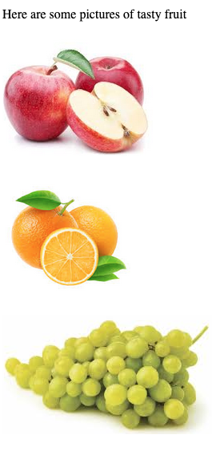
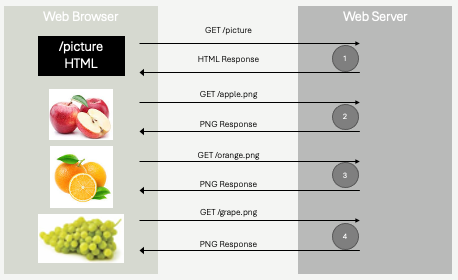
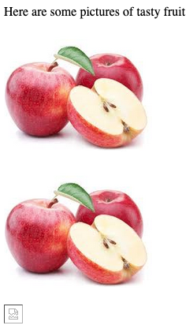
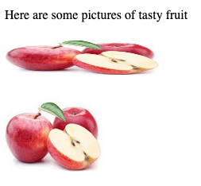

# Media Types and Media Elements
We will now cover some specialized HTML elements that allow for the embedding of *non-text* within an HTML page.  These elements allow you to render images and video and play audio.  While elements for images, audio and video all have their own details - they share something important in common:  They are embedded resources, requested *separately* by the browser using a *separate* HTTP request.

Let's cover the most basic media element first, the image element - and observe how it is rendered by the browser.  From there, we can cover the others more quickly - focusing on some of the more specific features they provide.

## Images
Let's begin with a very simple example, containing the minimum to embed an image in an HTML page.

```html
<!doctype html>
<html>
    <head>
        <title>Image Example</title>
    </head>
    <body>
        <p>Some leading text</p>
        
        <p>Some following text</p>
    </body>
</html>
```


The `img` element is a *self closing* HTML element. There is no content found within the `img` element itself. The `src` attribute is used to make a reference to a resource external to the current HTML page.  In this case, it is a URL outside of the current domain - on Wikipedia.  We could have also used a relative path if we wanted to show an image that was hosted on the same site as the web page rendering it.

```html

```
Really, all the same things we learned with the `href` attributes for anchors tend to work the same way for the `src` attribute (however the `src` attribute doesn't used named anchors, just URLS).

So far, this is fairly straightforward.  Images are loaded and displayed in the HTML. It's worth looking at this a little more closely however - because something **very important** is happening with the `src` attribute that will be critical to our understanding of many other features of HTML.  Let's see how the image is actually loaded.

### Requests
Early on in Chapter 2 we focused on an important concept - the HTTP request and response cycle.  Recall, each HTTP request and response is *independent*.  In addition, one HTTP request maps to exactly one response - one resource - one URL.

So let's look at an example HTML document with some images once more:

```html
<!doctype html>
<html>
    <head><title>One Request, One Response</title></head>
    <body>
        <p>Here are some pictures of tasty fruit</p>
        <p>
            
        </p>
        <p>
            
        </p>
        <p>
            
        </p>
    </body>
</html>

```
The HTML above is *one* resource.  We might imagine it was retrieved by the web browser issuing a `GET` request to a hypotethetical website - `https://fruits.com/pictures`.  The response to that GET request **is only the html you see above**, it does **not** include the actual images! So, how do the images appear in on the screen?



The `src` attribute within each `img` element creates a *relative* URL.  In this case, three distinct URLs are formed from the `img` elements - `https://fruits.com/apple.png`, `https://fruits.com/orange.png`, and `https://fruits.com/grape.png`.  These are three distinct resources, three distinct URLs.

The web browser, **after loading the HTML document** scans the HTML for `src` attributes, and **initiates new `GET` requests** for each resource identified.  The web server will receive these requests, and responds to them *independently*.

Let's review, by looking at a minimal HTTP request and response for each.

#### Request 1 - for the HTML
Here the web browser responds to either a link being clicked, or the user directly entering `https://fruits.com/pictures` into their address bar, by issuing a `GET` request.  This is the first request.
```
GET /pictures
host:  fruits.com
```
#### Response 1 - the HTML
The web server will respond with a standard HTTP response, containing the HTML in the response body.

```
HTTP/1.1 200 OK
Content-Type: text/html; charset=UTF-8
Content-Length: 331

<!doctype html>
<html>
    <head><title>One Request, One Response</title></head>
    <body>
        <p>Here are some pictures of tasty fruit</p>
        <p>
            
        </p>
        <p>
            
        </p>
        <p>
            
        </p>
    </body>
</html>

```
The HTML is rendered by the browser.  **Importantly**, there are no images to render, and the screen will appear to just have text - if not for just a brief moment.  You've undoubtedly seen this yourself, you've accessed a web page, and for a brief moment there is text, but no images.  Eventually, the images appear.  This is exactly what we are describing here!  The browser receives the HTML first, and then makes follow up requests for the images.

#### Request 2 - apple.png
The next HTTP request is made, to retrieve the image `apple.png`.  You'll note that it looks like any other HTTP request, however an extra header has been added.  This header - `referrer` - is sent to the server to tell it that the URL being requested (`apple.png`) was *referred* to by the `/pictures` resource.  This information is just that - it's information - nothing else.  The server is unlikely to do anything with it in this example, but it's important to remember this.  Whenever a resource is requested as a result of another URL being loaded, the web browser will send this information along using the `referrer` header.  This is the cornerstone of web tracking, or allowing web servers to track user behavior.  It has good uses, bad uses, and neutral uses - and we will discuss it in a lot more detail later on!

```
GET /apple.png
host:  fruits.com
referrer:  fruits.com/pictures
```
#### Response 2 - apple.png
The response the server returns is again an ordinary HTTP response, however the content type is not just plain text - it's binary data.  We won't write the binary data in the figure below, it wouldn't make any sense - but understand that it is a binary image format (png).  We'll discuss image formats in a bit.

```
HTTP/1.1 200 OK
Content-Type: image/png
Content-Length: 55013

... binary data, 55KB of PNG formatted data...

```
The next request and response for orange.png will be very similar:

```
GET /orange.png
host:  fruits.com
referrer:  fruits.com/pictures
```
```
HTTP/1.1 200 OK
Content-Type: image/png
Content-Length: 43065

... binary data, 43KB of PNG formatted data...

```
Followed by the last request for grape.png:

```
GET /grape.png
host:  fruits.com
referrer:  fruits.com/pictures
```
```
HTTP/1.1 200 OK
Content-Type: image/png
Content-Length: 67800

... binary data, 67KB of PNG formatted data...

```
We have a total of **four** requests - one for the HTML, and three for the additional images.  **Four** round trip network requests.



Let's look at a slight variation, and test our understanding a bit:

```html
<!doctype html>
<html>
    <head><title>One Request, One Response</title></head>
    <body>
        <p>Here are some pictures of tasty fruit</p>
        <p>
            
        </p>
        <p>
            
        </p>
        <p>
            <!-- Let's assume there is NO such
                 such image called mystery.png on the server
            -->
            
        </p>
    </body>
</html>
```

In the example above, two changes were made.  First, `apple.png` is being referred to **twice**.  Web browsers are smart, and when an HTML page is referencing *the same* resource twice, only one `GET` request will be generated.  In fact, even when the browser sees requests for `apple.png` in the near future, as long as it's the same complete URL (domain, path, etc), it probably will continue to use a cached copy of the image to avoid downloading the same image again within a short amount of time.  This caching can be somewhat controlled by some of the response headers we saw in Chapter 2 however.

The second change is that the third image now links to `mystery.png`.  Let's assume that image *does not exist* on the server.  Just like any other HTTP request, if the requested resource doesn't exit, the server will likely return a `404 Not Found`.  What does the browser do in this case?



As you can see above, the page still loads.  The images of the apple still load.  The only thing that doesn't load is the missing `mystery.png` image.  This is the nature of the **one request, one response** cycle - if one request fails, the rest of the page can still be presented.  The broken image symbol at the bottom is a placeholder, most browsers will show somethign similar to indicate to the user that an image failed to load.

### Image Sizing
Why did the images in the fruits examples load at a particular size?  Without any additional instructions, when an image is loaded in HTML it takes on the same *pixel* dimensions as the actual image itself.  If the image is 1280x900 pixels, then the image will occupy 1280 horizontal pixels and 900 vertical pixels - an awfully large image for a web page.  Large images take time to download, especially on mobile devices.

If you've ever encountered a web page with a lot of text, and some images mixed in, you might have encountered the rather annoying effects of failing to specify image size directly.  Since images download *after* the HTML text, browsers will render and lay out the text before the images arrive.  Without any additional information, browsers **have no way of knowing the size of the image** they will receive, so they simply render text as if the image *will* be some small square (about the size of that broken image placeholder).  The problem with this is that when the image *does arrive*, it's usually larger.  The browser then is forced to *redraw* the text - shifting it, and disrupting the user.

Beyond the text rendering problems with delayed image sizing, we typically prefer to be able to control the size of the image when it is being rendered within HTML.  The native dimensions of the image are not usually exactly what we want on our page.

We will cover *better* ways to size images when we cover CSS, however HTML itself has a primitive mechanism for doing so, using **attributes**.  Consider the HTML below:

```html
<!doctype html>
<html>
    <head><title>One Request, One Response</title></head>
    <body>
        <p>Here are some pictures of tasty fruit</p>
        <p>
            
        </p>
        <p>
            
        </p>
    </body>
</html>
```


Here, we see the same image - apple.png - being rendered at different sizes.  When specifying **both** height and width, we need to take care to keep the proper aspect ratio (we did not in the screen shot above, clearly!).  Generally it's preferred to only specify one - height or width, and allow the browser to preserve the natural aspect ratio of the image itself.

**It's important to note** that apple.png is still only requested **once**.  The actual image data, with a native resolution that just so happens to be `188x151px`, is transferred over the network one time.  The image is *rendered* twice, at the requested dimensions.

**Pro Tip**&#128161; It pays to scale images on the server, rather than serving large images all the time.  If the `apple.png` image was actually a large image - let's say 1880x1510px instead of 188x151, it would take *a lot longer* to download to the web browser.  If the HTML it was rendered in always specified that the width should be on the order of 200px, then we would be downloaded *a lot* of extra pixels that get tossed away before rendering.  This matters - it degrades user experience on slow network connections significantly.  It also costs money - while transfering a few extra KB might seem like no big deal, if your website is popular these can quickly add up to many GB of network costs - which generally will end up costing you a fair amount of money!  If you have an image on the server that is large, but you know you will often show a smaller version on HTML pages, it makes sense to scale the image using image scaling software, and store the smaller image on the web server.  A common use case is *thumbnail* images, where small images are shown on a page, and if the user clicks them, the larger image will be shown.  This can be achieved efficiently by storing **two** versions of the image - `apple.png` and `apple-thumb.png`, where `apple-thumb.png` is small.  HTML needing the thumbnail verison can link directly to it, avoiding downloading the full sized image.

As mentioned above, CSS will give us additional flexibility in sizing images - however the `height` and `width` attributes are *still* always recommended.  One reason they are still relevant is page layout, while images are loading.  By specifying image dimensions using the `height` and/or `width` attributes, a web browser can know the dimensions to reserve in the screen *before* it receives the image.  This allows it to layout text *assuming* the image is placed on the page.  When the image does arrive, text will *not* shift - as space will already have been reserved.  The CSS we learn later will superceded the `height` and `width` attributes, but only after the image itself is loaded from the network.

### Image Formats
One of the responses to the images above was as follows:

```
HTTP/1.1 200 OK
Content-Type: image/png
Content-Length: 67800

... binary data, 67KB of PNG formatted data...

```

What is this *binary data* though?  The image **format** is identified in the `Content-Type` header - it is PNG - the **P**ortable **N**etwork **G**raphic image format.  It's a specific binary format for storing pixel data (red/green/blue color values).  As a web developer, you don't need to know exactly how PNG files (or other image formats) are specified - but it does pay to have a bit of understanding of the differences.  Several image formats are widely supported by most web browsers, and there are many many other image formats in use by various platforms and software.

#### RGB Files
Perhaps the simplest image format is RGB (also called RAW), which in it's most naive form is simply a sequence of red, green, blue color values - typically integers between 0-255 for each color component.  Each pixel represented by **three** integers.  Pixels are stored in the file in row or column order.  It's quite straightforward to parse an RGB file - you simple read triples of integer bytes, and draw  them to the screen.

An RGB file such as the one describe tends to be extremely large, and unnecessarily so for certain types of images.  Imaging a 500x500 pixel image, where the vast majority of pixels (in fact, let's say *all* the pixels) are red.  Red is written as 255, 0, 0 for an individual pixel.  This means we'd store this red image as 500x500 = 250,000 triples (255,0,0) in a row.  That's 750,000 integers.

A smarter way to store such an image would be to use simple *run length encoding* - where you specify the *number* of pixels in a row that will use the *same* color.  In the same trivial example, we'd store the number 250000 (a quarter million pixels), followed by 255, 0, 0 (red).  These 4 integers provide the *same* information as the 750,000 integers were prior.

This is an extraordinarily simplistic explanation of *image compression*, it should be of no surprise that for more complex images (that aren't all red, for example!), we need to be more clever in how we do our compression and encoding.

#### Lossless Compression w/ GIF, BMP and PNG Files
Another common method of compression is to take advantage of the fact that simple images tend to have a small subset of colors when compared to the full visible spectrum.  There are several million distinct colors that you can represent with 8-bit red, green and blue pixel data (24-bit color).  If you think about the typical company logo, there's probably no more than a dozen individual colors used.

Again, let's say we have a 500x500 pixel image, and it contains 24-bit color values.  Thats 750,000 integers (250,000 pixels, three integers each).  Instead, let's assume we scan the image and determine that only 8 **distinct** colors are actually used in the image.  We can create a *color table*, with 8 entries, each entry corresponding to a 24-bit color.  For each pixel in the image, instead of storing the full RGB value (three 8-bit integers), we instead store the index into the color table - which in this case is a **3 bit index** - `000`-`111` in binary.  Now, we still have 250,000 pixels, but instead of each pixel weighing in at 24-bits, each pixel occupies 3-bits.  The beginning of the file would also need the color table itself, but this is a fairly insignificant amount of overhead (8 24-bit values).  This is a gigantic difference - drastically reducing the overall image size!

The concept of color tables, or look up tables, are used by the BMP (Bitmap) file format and GIF (Graphics Interchange Format) in more sophisticated ways than explained above.  Conceptually, they are similar, in that they are *lossless*.  They also have similar performance profiles - in that they perform best when there are relatively few distinct colors that need to be encoded.  As the number of distinct colors grows, the color table / look up tables get larger, which means the *indexes* into the tables take up more bits.  Eventually, if there are enough distinct colors, the level of compression becomes poor enough that it's no longer worth the processing time!

PNG (Portable Network Graphics) is another lossless image format that retains all image data, making it ideal for high-quality images. It supports transparency, which allows parts of an image to be transparent, making it particularly well suited for logos, icons, and web graphics. PNG files generally provide better compression than GIF and BMP when compressing non-photorealistic images.  For similar reasons as GIF and BMP however, PNG is *not* particularly good at compressing photorealistic images containing many thousands of distinct colors.

Of the three major lossless compression formats, PNG is the most widely used.   It performs best over a wider range of images and is supported by all modern browsers.

#### JPEG Files
The JPEG (also sometimes written as JPG) image format, created by teh **J**oint **P**hotographic **E**xperts **G**roup in 1992 specializes in compressing images that GIF and BMP perform poorer on - images with *many* distinct colors.  The JPEG compression format differens from BMP and GIF in that is is *lossy* - meaning images that are scaled down / compressed from raw RGB **do lose some detail** when undergoing the transformation to JPEG.  The compression scheme is complex, and involves averaging nearby pixels.  The JPEG format is **very widely supported**, and is best used on photo-realistic images (rather than cartoons and logos, which tend to have a small number of distinct colors).

#### WebP Files
**WebP** is an image format developed by **Google** in **2010** as a modern alternative to traditional formats like **JPEG, PNG**, and **GIF**. The goal was to create a format that offers better compression, reducing image file sizes without sacrificing quality, to speed up web loading times, especially on mobile devices.  WebP is designed to handle both **lossy** and **lossless** compression, combining the strengths of formats like JPEG (lossy) and PNG (lossless), while producing smaller file sizes. It also supports **transparency** (alpha channel), similar to PNG, and **animation**, similar to GIF, making it versatile for various web applications.

WebP is *not* as widely supported as some of the older formats, but at the time of this writing (2025), it is supported in all modern versions of Firefox, Chrome/Chromium/Edge and Safari.

#### Other Formats
There are dozens of other image formats.  Some of which are used to preserve all information (loss-less compression), and others that include layering information.  These formats are often associated with image processing software.  Generally speaking, it's smart to avoid trying to serve these more exotic formats (ie .tiff files, .psd files), as most web browsers will fail to render images in these formats.

**Remember** though, you cannot change the image format just by writing a different MIME extension in your HTTP response, or by changing the filename from `apple.jpg` to `apple.png`!  Files are encoded in a specific format, and if you want a different one, you must use image processing software to save a new version in the new format, and put that image on your web server!

**Pro Tip**&#128161; When in doubt, PNG tends to be the best choice.  It's a good compromise as it performs well for simple files and complex realistic imagery.  It doesn't lose too much detail when reducing pixel density, and is very widely supported.

Image formats are an interesting sub-topic in Computer Science, and are really part of the entire *compression* topic.  As a web developer, you will encounter compression algorithms a lot, given the importance of reducing network traffic and improving page loading speed - however it's unlikely you will need to understand all the precise details of how they work.  It's a good idea to understand tradeoffs - time spent encoding and decoding to various formats, along with expected compression ratios, so you can make informed decisions about which to use in different scenarios.

#### SVG Files
A side note for now on a completely different type of image format - **S**calable **V**ector **G**raphics - SVG.  SVG files are XML files that contain *instructions* for drawing arcs, lines, rectangles, etc.  They are ideal for drawing schematics, logos, and many other types of digital pictures.  They are small, since they are not holding pixel data.  They are scalable, since the instructions for drawing shapes can scale up or down without losing precision.  They aren't for photorealistic images, they are best for drawing.

You are encouraged to [read more on SVG](https://developer.mozilla.org/en-US/docs/Web/SVG/Tutorial), they are an incredibly powerful tool in your toolbox as a webdeveloper - and as a graphics designer - but they are outside the scope of what we are focusing on in this book.

### Alternative text
The alt attribute, short for "alternative text," is used with the  element in HTML to provide a textual description of an image. This description is essential for improving accessibility, user experience, and search engine optimization (SEO).  For users who rely on screen readers (such as individuals with visual impairments), the alt text is read aloud, allowing them to understand the content and context of the image.  If an image fails to load due to slow internet connection or a broken image link, the browser displays the alt text in place of the image. This ensures that users still get an idea of what the image represents even when it cannot be displayed.  Search engines use alt text to understand the content of images, which improves a website's visibility in image search results. Providing descriptive and relevant alt text can improve the overall search ranking of a webpage.

```html

```
The use of the `alt` attribute is always recommended.

### Images as Links
While not particularly related to image formats and image sizes, it's common to be a bit confused by something we often see on web pages - *clickable images*.  Many times you encounter a web page that has images that you can click on, that take you to a new page - thumbnails.  Sometimes this is achieved using JavaScript, which we will start looking at soon - but most of the time it's just by wrapping an image in an standard `a` element.

You might recall, `a` is an *inline* element.  Inline elements may only (technically) contain *inline* children.  It just so happens that `img` is an *inline* element.

```html
<p>
    <a href="/foo">Click me to go to a new page></a>
</p>
<p>
    <a href="/foo">  </a>
</p>
```
The paragraphs in the HTML above contain two links.  One is a text link, which would be rendered just like any other link.  The other is an *image*.  When the user hovers over the image with a mouse, they will see a hand cursor like they would when hovering over a text link.  When the click the image, they will go to the `/foo` page, just like if they clicked the "Click me..." text in the link above.

## Video and Audio
When we talked about browsers of the past at the beginning of the chapter, we discussed how the iPhone played a transformative role in web development by it's refusal to support Adobe Flash.  Up until the late 2000's, Adobe Flash was the main method to do anything *highly* interactive, with complex animations, on the web.  To be clear, Adobe Flash was a *distinct* language - it ran using a plugin that needed to be installed within the browser, and the plugin operated independently from the rest of the web browser.

In addition to animations, Flash was also used as the main method of playing *video* content within a web browser.  This was largely because video formats were extremely poorly (if at all) supported by web browsers at the time.  Video file formats utilize vastly more sophisticated encoding and decoding algorithms than image formats, and "codecs" (the code that did the encoding and decoding) were simply not integrated into web browsers.  Compounding the problem was that at the time, video formats lacked uniform standards - it was simply very difficult to support video playback broadly.  Adobe Flash's investment in video codecs and playback was one of several reasons it became so widely used through the 1990's and 2000's.

HTML 5, and a maturing digital video industry, along with the push towards browser-native (Flash-less) solutions driven by the iPhone put at end to this problem however.  In HTML 5, two new multimedia elements were introduced - `<audio>` and `<video>`, which act as containers for playback of both types.  These elements support a (small) set of *standard* video and audio encoding formats, and provide user controls for playback, pause, stop, rewind, seek, etc.

Let's first examine video, as it's a lot more common than just placing an audio element on your web page.

```html
<body>
    <video src="video.mp4" type="video/mp4"/>
</body>
```
In it's simplest form, the video element resembles an image element, consisting of a `src` attribute which results in a new `GET` request being generated to fetch the video from the web server.  It is common to also utilize the `type` attribute to identify the video encoding format used, so the browser can ensure it can support playback *before* issuing the request - since video files are so large.

The video element can be sized with `height` and `width` just like the iamge element, and can also be sized with CSS as we will see later.

### Supported Formats
THe two main video encoding standards used are MP4 (MPEG-4) and WebM.  Chrome, Firefox, Opera, Edge, and Safari in 2025 all support both formats.  MP4 remains the most widely supported.  These encoding schemes are *proprietary*, and web browsers must license them.  An open source alternative - Ogg (Ogv) - also exists, while less commonly used.  Ogg video files are supported by Firefox, Opera, and limited versions of Chrome.

Because video codecs have such a difficult history of support, the notion of allowing browsers to *choose* between file formats was built directly into the `<video>` element.  If a web site wishes to support the largest variety of web browsers, videos can be encoded in all three formats (and thus stored as three separate files on the web server).  The `video` element can make use of a child `source` element to *list* the video sources - and the browser will choose the one that it can best support, automatically.  When using the `source` elements, you must omit the `src` attribute.

```html
<body>
    <video>
        <source src="video.mp4" type="video/mp4">
        <source src="video.webm" type="video/webm">
        <source src="video.ogv" type="video/ogg">
        Your browser does not support the video tag.
    </video>
</body>
```
Note in the HTML above, we have also added text inside the `video` element.  This text is ignored by any browser that can play video, but is displayed by browsers that do not support the `video` element (pre-HTML5).

### User Controls
Unlike images, users generally need to *interact* with video.  This includes pressing "Play", "Pause", "Stop" and seeking to different points of the video.  In order to enable user controls within a video element, you can simply place the `controls` attribute - a *boolean* attribute in the `video` element.  Boolean attributes have no `=` or value, their presence indicates "true", and absense indicates "false"

```html
    <!-- Video element with controls for user -->
    <vide controls>
        <source src="video.mp4" type="video/mp4">
        <source src="video.webm" type="video/webm">
        <source src="video.ogv" type="video/ogg">
        Your browser does not support the video tag.
    </video>
```

There are a number of other options that you can enable on `video` elements.  This includes `loop`, `muted`, `poster`, `preload`, and `autoplay`, among others.  These attributes provide complete control over whether videos play automatically on page load, start out muted, continue to play over and over again, and whether or not the are pre-fetched from the server before the user clicks "Play".  You can learn more about contolling how users interact with video [here](https://developer.mozilla.org/en-US/docs/Web/HTML/Element/video).

### Audio
Videos contain audio, but sometime you *just* want to play a sound on a web page.  This can be achieved with the more limited `audio` element:

```html
<audio controls src="song.mp3"></audio>
```
The audio element supports many of the same elements as the `video` element - although the controls, for example, are more limited.  The standard audio formats of `mp3`, `wav`, and `ogg` are supported across most browsers, with `mp3` being the preferred.

Learn more about the audio element [here](https://developer.mozilla.org/en-US/docs/Web/HTML/Element/audio).
