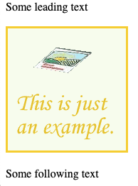

# Media Types, Media Elements, and Frames
We will now cover some specialized HTML elements that allow for the embeding of *non-text* within an HTML page.  These elements allow you to render images and video, play audio, and even embed entire external websites within your page.  While elements for images, audio, video, and websites all have their own details - they share something important in common:  They are embedded resources, requested *separately* by the browser using a *separate* HTTP request.  

Let's cover the most basic media element first, the image element - and observe how it is rendered by the browser.  From there, we can cover the others more quickly - focusing on some of the more specific features they provide.

## Images
Let's begin with a very simple example, containing the minimum to embed an image in an HTML page.

```html
<!doctype html>
<html>
    <head>
        <title>Image Example</title>
    </head>
    <body>
        <p>Some leading text</p>
        
        <p>Some following text</p>
    </body>
</html>
```


The `img` element is a *self closing* HTML element. There is no content found within the `img` element itself. The `src` attribute is used to make a reference to a resource external to the current HTML page.  In this case, it is a URL outside of the current domain - on Wikipedia.  We could have also used a relative path if we wanted to show an image that was hosted on the same site as the web page rendering it.

```html

```
Really, all the same things we learned with the `href` attributes for anchors tend to work the same way for the `src` attribute (however the `src` attribute doesn't used named anchors, just URLS).  

So far, this is fairly straightforward.  Images are loaded and displayed in the HTML. It's worth looking at this a little more closely however - because something **very important** is happening with the `src` attribute that will be critical to our understanding of many other features of HTML.  Let's see how the image is actually loaded.

### Requests
Multiple images, multiple request cycles.  Response types

Same image, twice, one request

Image not found, layout

### Image Sizing

### Image Formats

## Video and Audio

## Frames
