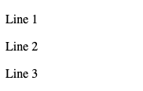
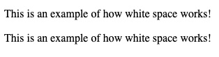
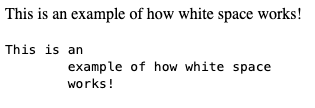
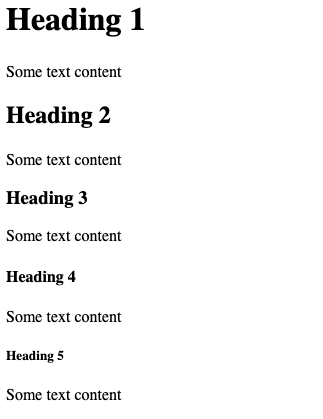
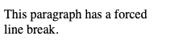
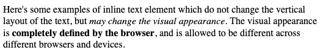

# HTML Structrure
As the last section describes, HTML has a very long and winding history.  You may have heard the saying that "nothing is ever gone from the internet", or something to that effect.  Bad (or just old) HTML never leaves the internet either.  If you surf the web long enough, you are going to see all sorts of HTML pages - some using upper case elements intead of lower case elements (or a mix of both), some using deprecated elements, and other "quirks".  The terms "quirks" is actual an official term - most browsers will have "quirks" mode, which cases the HTML to rendered not be the modern HTML 5 parsing engine (the newer, and undoubtably better code) in the browser, but instead by older code.  

**As a modern web developer**, you must develop a strong sense of *embarrasment* about writing poor HTML.  As a web developer, you have a professional responsibility to write standards complient HTML 5.  This allows you to reap the rewards of all of the (phenomenal) advancements browsers have made over the past decade.  **There is no excuse**.  An ability to understand how to write HTML correctly will prevent you from *ever* getting a serious job in web development.


## Structure of a Standard HTML Document
The structure of the document starts with the very first line - the `doctype` line.  This line communicates, in the first bytes of the *response body* that the browser reads from it's TCP socket, what kind of HTML document is receiving.  As such, this line will be processed *before* the parser is loaded.  Choose the correct `doctype`, your page will be processed with the browser's modern parser and render.  Choose poorly (or not at all), and you are thrown into the badlands of the early 2000's - and it's not fun.

The correct `doctype` is fortunately easy - it's simple `html`.  THe first element - `<!DOCTYPE html>` is not like all the rest - it has an `!` character, and it is capitalized.  Technically, this is case sensitive, although you will often see `<!doctype html>` written in HTML-like files that will be processed / transformed into standard HTML (more on this later in the book).
 
```html
<!DOCTYPE html>
<html>
  <head>
    <title>This is a title</title>
  </head>
  <body>
    <div>
        <p>Hello world!</p>
    </div>
  </body>
</html>
```
The remaining part of the HTML document above is just that - HTML *markup*.  HTML (and XML) is a tree-styled document, where *elements* enclose other elements - beginning at the **root** of the document.  The root of all HTML documents is the `html` element.  An element is defined as the entire HTML "element" - the opening **tag** (`<html>`), the **content** (the child elements), and the closing **tag** (</html>).  Sometimes people use the terms *element* and *tag* interchangeably, but they are indeed different.  Again - *element* is the entire things, *tag* is referring to either the opening or closing tag, the delimiters of the element.

Insidte the `html` element may contain **precisely** two elements, in precise order - first **head** and then **body**.  Note, there **is no foot(er)**.

### The Head Element
The head element different than the body in that it is really all about *metadata* and additional resources.  The types of things you find in the `head` element include the page title (`title`) - which doesn't show up in the web page directly, but will likely be used by the web browser as the title in the top of the browser tab, for example.  Also found in the `head` element may be a series of `<meta>` tags - which can be used to define a range of information - from the author's contact information to defining the aspect and scaling ratios to be used on various devices and screens.  The `meta` element supports many modern features - we will examine some as we go, but it's worth taking a bit of a [detour now (or remember to later) so you can learn more](https://developer.mozilla.org/en-US/docs/Web/HTML/Element/meta).

While `meta`'s use has only been widely adopted fairly recently, `title` and the following meta data elements have been in use since the early 1990's:

- `link` - Allows you to *link* external resources (usually CSS files that contain rendering style rules) to the page.  These link elements result in the web browser initiating **new** HTTP requests to retrieve these resources.  In the case that the resource is a CSS file, the file is retreived from the web server (so a second HTTP request/response cycle) and used by the browser to format/style the currently loaded HTML file.  Other resources can also be loaded using the `link` element, such as web fonts, etc.
- `style` - Allows you to specify CSS styling rules directly within the HTML document, which will be used by rendering.  This is called *embedded* CSS.
- `script` - Allows you to reference an external JavaScript file (a separate resource, requested with a second HTTP request/response cycle) to use on the loaded page, or to directly embed JavaScript code to execute on the loaded page.

`link`, `style`, and `script` are all used to integrate different types of resources - not additional HTML.  Therefore, we won't talk all that much about them just yet - but we will come back to them when we cover things like CSS and client-side JavaScript.

### The Body Element
The body of an HTML page is the actual content that gets *rendered* to the browser screen.  It contains paragraphs, heading, grouping elmeents, phrase elements, lists, tables, and multimedia.  These are the elements that are normally *visible* to the user.

Let's look at the most straightforward and foundational element, in order to introduce some other concepts that will apply to them all - the `p`, or *paragraph* element.

The paragraph element encloses a set of either *text content* or *child elements*.  Let's first consider straight text elements:

```html
  <p>This is a paragraph</p>
```
The words "This is a paragraph" will be rendered by the browser in standard font, on it's own line.  By "it's own line", we mean that if there are several `p` elements, they each will occupy their own vertical space, with some whitespace padding separating them vertically.

```html
  <p>Line 1</p> 
  <p>Line 2</p>
  <p>Line 3</p>
```



Paragraphs may contain *other* elements too - including additional child `p` elements.  The following is a perfectly reasonable set of paragraphs, although it's not quite common to enclose `p` elements wihtin other `p` elements for reasons that should become more clear soon.

```html
  <p>
    <p>Line 1</p> 
    <p>Line 2</p>
    <p>Line 3</p>
  </p>
```
#### White Space
White space - which is the space between words, along with new lines, tabs, etc. are often a source of confusion for those that are new to HTML.  Let's look at the following HTML `p` elements:

```html
<p>This     is     an 
   example of how   white space
   works!
</p>
<p>This is an example of how white space works!</p>
```
Both `p` elements are rendered *identically* because of a term called **whitespace collapse**.  In HTML, what the programmer writes and what is seen on the screen is *not* meant to be identical - and the quicker you understand that, the easier time you will have!



Whitespace collapse means that when the browser renders *text content* within an element, all consecutive `space` characters - new lines, tabs, space bar, - are collapsed into **one** space.  New lines and tabs typed by the programmer do **not**translate to new lines or multiple spaces, the are rendered by a single space (although browsers **do** automatically add some extra space after periods ending sentances).  The **browser** is in charge of wordwrapping - not you!  This is actually a great thing, because the screen you are typing your HTML on isn't the same sized screen as the end user's - it's probably not even the same font!  You, the author, really aren't in a position to layout text - only the browser running on the user's machine is!  The web browser does a wonderful job of layout out text on the screen, and in virtually every scenario you should also simply let it do it's thing.  

If we *really* want to override text layout, we do have an element that can help - `pre`.  The `pre` element stands for *preformatted* and can be used when you do want to preserve white space.

```html
<p>This     is     an 
   example of how   white space
   works!
</p>
<pre>This     is     an 
   example of how   white space
   works!
</pre>
```


The `pre` element (and it's cousin - `code`) are nice for special purposes (maybe if you are writing about programming code!), but should be used sparingly.

#### Headings
Text documents are usually organized into headings.  Headings are of course very helpful for readers to skim to different sections of a text document, and get an overview of the content.  It's not surprising that even the very first version of HTML supported headings - which *by default* are rendered on their own line, in a font usually bolder and larger than the standard font being used.  Documents generally have hierarchical heading structures, and HTML supports 5 levels of headings:

```html
<h1>Heading 1</h1>
<p>Some text content</p>
<h2>Heading 2</h2>
<p>Some text content</p>
<h3>Heading 3</h3>
<p>Some text content</p>
<h4>Heading 4</h4>
<p>Some text content</p>
<h5>Heading 5</h5>
<p>Some text content</p>
```


**Pro Tip**&#128161; We haven't discussed what the *standard* font is yet.  Until we learn CSS, the standard font is set by the browser (or potentially user settings in the browser).  It's normally Times New Roman or other highly legible font, at around 10pt-12pt font size. 

It's important to note that the "boldness" or size of headings is *arbitrarily* defined by the browser, in the absense of CSS styling rules.  Most browsers will look pretty similar to the screenshot above, but they aren't obligated to.  HTML is about **meaning** not visual styling.  Using headings (and their numbers) is important to convey *meaning*  and relationships, and should **never** be used just to make some text loop a specific way!

#### Block Elements
`p`, `pre` and headers are all referred to as **block elements**.  They are defined such that *by default* they always occupy their own vertical space - they are always on their own lines.  This can be overriden by CSS, but it's useful to learn element defaults on their own.  In the original HTML specifications, `p`, `pre`, and headings were primary ways of laying text out on new lines.  In addition, authors could also use the `<br/>` *inline* element to force line breaks.

```html
<p>This paragraph has a forced <br/>line break.</p>
```


As discussed, `pre` and headings clearly change the visual appearance of the text content they enclose.  `p` elements were frequently **the method** of having text occupy separate lines, but they are awkward when not actually trying to represent *paragraphs*.  As we've mentioned, HTML is about conveying *meaning*.   For this reason (right or wrong) a new element was added and because the de-facto way of (1) grouping elements together and (2) making those groups have their own vertical space - the `div` element.

The `div` element is a **block** element, does not affect the visual appearance of it's contents (other than starting and ending them on their own line), and is used commonly for grouping elements together (or at least until recently).  They convey no semantic meaning, but they are easily styled with CSS, which makes them a popular choice.

Notice here, the visual appearance is not altered, but the HTML structure actually starts to mimic the document's conceptual organization better - since headings and their associate text *are part of the same element*.

```html
<div>
  <h1>Heading 1</h1>
  <p>Some text content</p>
</div>
<div>
  <h2>Heading 2</h2>
  <p>Some text content</p>
</div>
<div>
  <h3>Heading 3</h3>
  <p>Some text content</p>
</div>
<div>
  <h4>Heading 4</h4>
  <p>Some text content</p>
</div>
<div>
  <h5>Heading 5</h5>
  <p>Some text content</p>
</div>
```
As we will see later, HTML 5 added additional block elements that have made `div` less useful, as the newer alternatives provide additional semantic context.  Regardless of which element you use, 
**block** elements occupy their own vertical space, and may contain **block** child elements and/or **inline** child elements.

#### Inline Elements
Inline elements wrap specific text content for a variety of reasons.  They **do not** change the vertical layout of the text.  We'll discuss more later, but for now we can look at a few:

```html
<p>
  Here's some examples of inline text element 
  which <span>do not change the vertical layout 
  of the text</span>, but <em>may change the visual 
  appearance</em>.  The visual appearance is 
  <strong>completely defined by the browser</strong>, 
  and is allowed to be different across different 
  browsers and devices.
</p>
```


In the HTML above, we see the use of the `strong` and `em` inline elements, which change the rendering of the font to bold and italics.  It's important to note that HTML 4.01 and below used to support the `<b>` element and `<i>` elements for bold and italics, and most modern browsers *do* still allow for them since they were so popular.  The replacement of `b` and `i` was driven by the push towards *semantic* elements rather than elements that purely described visual appearance.  It's a little wonky, but notice that `b` and `i` leave nothing to the browser, it's clear the author is describing how the text appears.  Alternatively, `strong` and `em` (emphasis)  are describing meaning, and leaving it up to the browser how to decide.  This is in line with the separation of HTML from CSS.

The third inline element you see in the HTML above is the `span` element.  Think of this like the inline analog to the `div` element.  It is used *purely* for grouping and identifying text, it does not alter the visual representation of the text **at all**.  When we learn CSS, we will see why this is so useful.  Just like with div, HTML 5 has introduced some more semantically meaningful alternatives to the `span` element that similarly *do not change the appearance* but do convey more meaning.


### Attributes
A last part of the *structure* of HTML is the **attribute**.  An attribute is a **name-value** pair that can be attached to *any* element.  The HTML standard defines a set of attributes that can be defined on each element in the standard, although there are also *legal* ways to place arbitrary attributes on elements too - which we will examine later in the book.  Elements may have any number of attributes defined.

The HTML below shows three attributes (these **are not real attributes**) to illustrate the syntax.  Attribute names **never contain spaces**, the name and value is always separated with an `=` sign, and the *value* is always quoted (typically double quotes, but single are usually accepted - but never mix and match!).  Attribute names are always lower cast.

```html
<p attribute1="value 1" attribute2 = "value 2" attribute3 = "value 3">Some text</p>
```
Attributes **never** directly effect the visual rendering of the element - instead, they are used to store and convey additional data to the browser (or, as we will see later, JavaScript).  There are four **universal** attributes which are always available for **any** HTML elememnt:

- `id` - Allows you to specify a unique identifier for the element within the page.  The value must start with [a-z] or [A-Z] and can be followed by any number of letters, digits, hyphens, underscores, colons, or periods.  The value **must** be unique across the entire page.  The `id` is often very useful when used in conjunction with CSS and JavaScript, as it will allow that code to identify particular elements within a page.
- `class` - Allows you to specify am arbitrary *classification* for the element.  The value adheres to the same rules as `id`, however any number of elements can have the *same* classification. In addition, elements may have multiple classes, where the classes are separated by spaces.  `<p class="a b c">` for example, adds class `a`, `b` and `c` to the paragraph.  `class` is useful for the same reasons as `id`, CSS and JavaScript will often refer to *groups* of elements by specifying their class.
- `style` - Allows you to attach specific CSS fuiles to the element directly.  This is used for *inline* css, which will be applied by the browser. `<p style="color:red">` will create a paragraph with red ttext.  Generally this is **not recommended**, as there are better and more powerful ways of defining CSS - however the element is supported and used in the wild frequently.
- `title` - Not to be confused with the `<title>` element contained in the `<head>`, the `title` **attribute** defines text that describes the element.  The classic example is for allowing special text to appear on the screen when the user hovers their mouse over the element.  Note, browsers are not obligated to use the `title` attribute in any particular way.  A browser that is using screen reading technology may produce audio of the title upon request from the user, while a browser on a touch screen might need to use it in a totally different way.

We will see the use of these later in the book.

## Working Examples - An enhanced Node.js Web Server
At this point, we are about to start looking at particularly common HTML elements in a lot more detail.  We'll have lots of example, but they all won't be embedded directly into the book's pages.  Instead, you are strongly encouraged to run the HTML demo provided [here](https://github.com/freezer333/web-foundations/tree/main/code/html-serve).  The HTML demo contains a small HTML web server, written in Node.js.  It serves HTML files, that are located in the same project directory.

It's worth spending a little time reviewing - since we just learned about HTTP servers in the last chapter a bit.  Take a look at the code - and read the comments!  This is a much more fully fledged HTTP server, but is still simple enough for you to understand pretty readily.  It can recognize when a requested path lines up to an HTML file, and serve the file from disk.  It can also recognize appropriate headers (MIME types), when resources are being requested that *do not* map to a file (including some generated pages), and returns appropriate response codes in all cases.

**We will use this working example in several chapters, so please do download it so you can run it and utilize it while reading**.

<div style="text-align:center"><a href="https://github.com/freezer333/web-foundations/tree/main/code/html-serve", role="button">Source Code &amp; example HTML directory</a></div>

```js
{{#include ../../../code/html-serve/serve.js}}

```