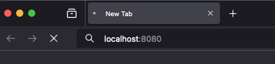
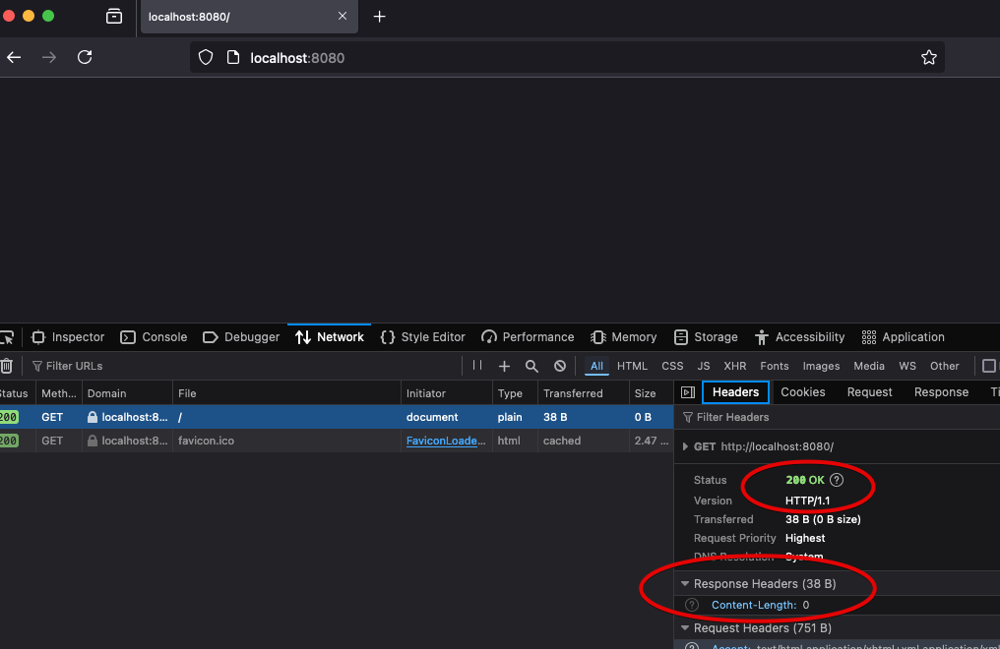
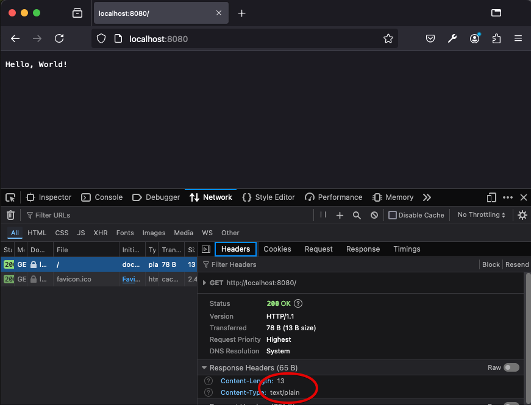
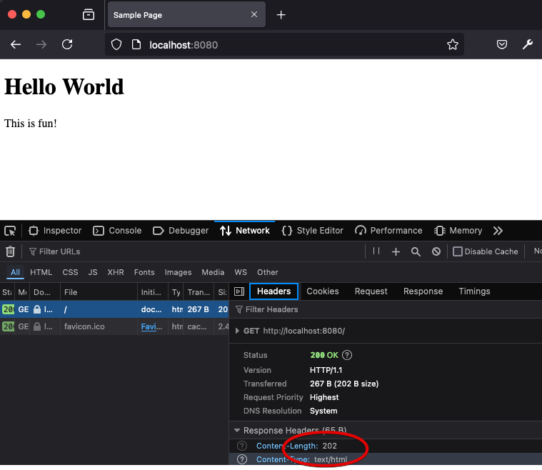
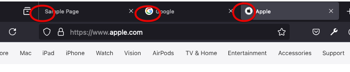

# HTTP Implementation - The Hard Way
In the previous sections, we used some text-based programs like `telnet` to simulate what a web browser does - constructing a text HTTP request and sending it to a web server.  We saw first hand that web servers do not really know (or care to know) what program generates an HTTP request.  If a web server receives a valid HTTP request, it sends back a valid HTTP response!

It's also useful for you to start to understand the server side a bit more.  Recall back in Chapter 2, when we wrote an Echo client and server - with just plain old JavaScript and sockets (we started with C++).  Below is an adaptation (actually, a simplification) of a TCP server written in Node.js

```js
const net = require('net');

const on_socket_connect = (socket) => {
  socket.on('data', (data) => {
    const request = data.toString();
    console.log(request);
  })
}

const server = net.createServer(on_socket_connect);
server.listen(8080, 'localhost');
```
*Remember, until we start really learning JavaScript, you should try not to get too caught up in syntax.  We will cover it all - right now code examples are just to illustrate concepts*.

The code above creates a *TCP* server using Node.js's built in `net` library.  The server object is constructed by calling the `createServer` function in the `net` library.  The `createServer` function accepts one parameter - *a function callback*, which will be called whenever a **client** connects to the server.  Once the server object is created, it is set to the listening state, on port 8080, bound to the localhost.

The interesting stuff is happening in the `on_socket_connect` callback function. When it is called (by the `net` library's server code), a connection has been established with a TCP client.  That connection is represented by the the `socket` parameter.  `on_socket_connect` now registers *another* callback - this time an *anonymous*  function.  We'll cover these later in more depth, but for now think about how in most languages you can have *literal* numbers (ie 5) and *named variables* that hold numbers.  Well, in JavaScript, functions *are* data, and thus we can have *literal* functions (without names) and *named* variables that represent functions.  `on_socket_connect` is a named function, but so it the function that we create and set as the second parameter to the `socket.on` function in the code above.  The `socket.on` function is a generic event registration function.  The first parameter is the type of event we are registering a function for - in this case, we are interested in defining a function to be called whenever **data** is received from the client.  The second parameter is the function itself, which we want the socket to call when **data** is received.  The function accepts a single argument (`data`), converts it to a standard string, and prints it to the console.

**You are strongly encouraged to take this code and run it on your machine**.  If you have it running, you can launch a web browser (any web browser will do!), and enter the following into the address bar:  `http://localhost:8080`.

Observer what happens.  The web browser *is the TCP client*!  It generates an *connects* to the server, over port `8080`.  It sends an HTTP request message, and the server successfully receives it and prints it out!  You will see something like this print to the server's console:

```
GET / HTTP/1.1
Host: localhost:8080
User-Agent: Mozilla/5.0 (Macintosh; Intel Mac OS X 10.15; rv:131.0) Gecko/20100101 Firefox/131.0
Accept: text/html,application/xhtml+xml,application/xml;q=0.9,image/avif,image/webp,image/png,image/svg+xml,*/*;q=0.8
Accept-Language: en-US,en;q=0.5
Accept-Encoding: gzip, deflate, br, zstd
Connection: keep-alive
Upgrade-Insecure-Requests: 1
Priority: u=0, i
```
Depending on yoru web browser, you might have something slightly different, but chances are your web browser generated and HTTP request that looks a lot like the above.  Your server received it over the socket!

Also take a look at the web browser.  It's likely that you'll notice it still needs to receive a response - it's still waiting.  You've seen this before, whenever your browser is having trouble connecting - here's a screenshot of Firefox:



So, why is your web browser hanging?  It's really pretty simple - it expects our web server to respond!  Our web server printed to the console, but it didn't send anything back to the client - *it left the client hanging!*.

Let's follow *each* request we receive with the simplest HTTP response we could possibly return - `OK`, with no content.

```js
const net = require('net');

const on_socket_connect = (socket) => {
  socket.on('data', (data) => {
    const request = data.toString();
    console.log(request);

    // Note the extra blank line, to tell the client there are no more headers
    const response =
      'HTTP/1.1 200 OK\n' +
      'Content-Length: 0\n' +
      '\n';
    socket.write(response);
  })
}

const server = net.createServer(on_socket_connect);
server.listen(8080, 'localhost');
```

If we re-launch the server (when we do so, you might notice the browser that was hanging for a response gives up, since the socket is disconnected), and reload the web browser - we'll see something.  **A blank web browser page!**.

Before we go much further, let's discuss *web developer tools*.  As a web developer, it's critical that you can debug your programs.  When writing your own server code (as we are right now), it's easy to print to the server's console, or even run a proper debugger and inspect the operation of the server code.  Sometimes, however, you need to see *what the browser receives* in order to better debug your code.  In this case, you'd be forgiven to wonder why the browser is showing a blank screen (maybe you understand why already, if so - great!).  Our server sent the 200 reponse, so what gives?

In [Google Chrome], Chromium, Firefox, and other major browsers, you have the ability to peer into the internals of the web browser to inspect lots of things that ordinary users have no interest in.  One of these things is the *actual* network traffic - the actual HTTP requests.  I recommend that you **get very familiar** with the web developer tools that come with your favorite web browser for software development.  Note, Safari and Microsof Edge (at least at the time of this writing) do not offer the same level of tooling - for development, I recommend using Firefox or a Chromium-based browser.

- [Dev tools in Chromium/Chrome](https://developer.chrome.com/docs/devtools)
- [Dev tools in Firefox](https://firefox-source-docs.mozilla.org/devtools-user/)

Here's what you will see when accessing the **Network** tab in Firefox's dev tools when making the request:



We can clearly see, the browser did receive our response - a 200 status code, with OK as the message.  The `Content-Length` is 0.  Well, maybe now that jogs our memory - the browser **renders content**, not the actual HTTP response.  We can see the HTTP response in dev tools, but without sending any content (response body), the browser isn't going to render anything!

Let's send something, shall we?  We can create some text, and add it to the response body, being careful to adjust the `Content-Length` header accordingly.  Since it's just plain text, let's also go ahead and set the `Content-Type` to the correct MIME extension.

```js
  socket.on('data', (data) => {
    const request = data.toString();
    console.log(request);

    const text = 'Hello, World!';
    const response =
      'HTTP/1.1 200 OK\n' +
      'Content-Type: text/plain\n' +
      'Content-Length: ' + text.length + '\n' +
      '\n' +
      text + '\n';
    socket.write(response);

  })
```
Now when we load the browser, we see our Hello World text.  It's also clear in the dev tools that the browser received the HTTP response we sent, in full.



Plain text is pretty boring.  Browsers can render all sorts of content, as we know.  Let's instead send some HTML:

```js
const on_socket_connect = (socket) => {
  socket.on('data', (data) => {
    const request = data.toString();
    console.log(request);

    const html = `
      <!DOCTYPE html>
      <html>
      <head>  
        <title>Sample Page</title>
      </head>
      <body>
        <h1>Hello World</h1>
        <p>This is fun!</p>
      </body>
      </html>
    `
    const response =
      'HTTP/1.1 200 OK\n' +
      'Content-Type: text/html\n' +
      'Content-Length: ' + html.length + '\n' +
      '\n' +
      html + '\n';
    socket.write(response);
  })
}
```

We see that our HTML that we generated using just a simple little program renders just like any other HTML we see on the web:



## Responding to Requests
You might have noticed something odd in the web developer tools screenshots above.  In each, there are actually **two** requests - one for `/`, which is the request directly caused by typing `http://localhost:8080` in the address bar, and another for `/favicon.ico`.  As a matter of convention, web browsers always issue a request to any web site it is loading resources from to `favicon.ico`.  You can try it out, visit any other site, with web developer tools open - you'll see the request (be prepared, on a modern web site, one site visit triggers *many* requests to sift through).

A favicon is the graphic/logo you see at the top of the browser tab.  It's usually the same across the entire web site you are visiting.  Your browser is getting them automatically for you, and using whatever is returned to it.



You can actually just enter the following into the address bar to laod the favicon directly for google: [https://google.com/favicon.ico](https://google.com/favicon.ico).

So, that's why you see the two requests - but interestingly, our "Sample Page" doesn't have a logo.  We're not going to create one right now, but you might be curious - why is our server returning 200 to the `/favicon.ico` request then?

Why does our server do the things that it does?  Because we wrote it that way!  Our server returns 200, along with the same HTML for **every** request it receives!  In fact, if you look at the console output of the server, every time you load the page in the browser, it's actually printing **two** HTTP requests/responses - because it received two:

1. `GET / HTTP/1.1`
2. `GET /favicon.ico HTTP/1.1`

If you don't see them, your browser may have started caching the response to favicon, and stopped requesting it.  You can usually hold the `CTRL`/Command key while clicking refresh to load it without caching.

It would be great to actually server a graphic, but for now let's just stop lying, and stop returning a `200` response when the favicon.ico is requested.  We don't have one, and we should return something cloer to reality - like `404 Not Found`.

In order to do this, we need to start **differentiating** between requests.  We have to start actually looking at what the browser is requesting!  To do that, we need to *parse* the HTTP request message instead of just printing it out.

In the code below, we grab the *first line* of the request message, which contains the verb, path, and HTTP version.  We then extract the *path* by splitting the first line into the three components, and looking at the second part.  If the path requested is `/` we return our HTML. If the path is *anything else*, we return a 404, since we don't have any other resources on our web server yet.

```js
const on_socket_connect = (socket) => {
  socket.on('data', (data) => {
    const request = data.toString();

    const first_line = request.split('\n')[0];
    const path = first_line.split(' ')[1];

    if (path === '/') {
      const html = `
        <!DOCTYPE html>
        <html>
        <head>  
          <title>Sample Page</title>
        </head>
        <body>
          <h1>Hello World</h1>
          <p>This is fun!</p>
        </body>
        </html>
      `
      const response =
        'HTTP/1.1 200 OK\n' +
        'Content-Type: text/html\n' +
        'Content-Length: ' + html.length + '\n' +
        '\n' +
        html + '\n';
      socket.write(response);
    }
    else {
      const text = `404 Sorry not found`;
      const response =
        'HTTP/1.1 404 Not Found\n' +
        'Content-Type: text/html\n' +
        'Content-Length: ' + text.length + '\n' +
        '\n' +
        text + '\n';
      socket.write(response);
    }
  })
}

```
You can see in web developer tools that the requests to favicon.ico are now showing up as *not found*.  Note, if we type anything in the browser with a different path - like `http://localhost:8080/foo/bar`, we will get a 404 response back - which is what we want.

We can now start thinking of how we'd server *multiple* resources.  The code below prints a text about message if you visit the `http://localhost:8080/about` page.  I removed some extra whitespace from the HTML to keep things a little more succinct

```js
const on_socket_connect = (socket) => {
  socket.on('data', (data) => {
    const request = data.toString();

    const first_line = request.split('\n')[0];
    const path = first_line.split(' ')[1];

    if (path === '/') {
      const html = `
        <!DOCTYPE html><html><head><title>Sample Page</title></head>
        <body><h1>Hello World</h1><p>This is fun!</p></body></html>
      `
      const response =
        'HTTP/1.1 200 OK\n' +
        'Content-Type: text/html\n' +
        'Content-Length: ' + html.length + '\n' +
        '\n' +
        html + '\n';
      socket.write(response);

    }
    else if (path === '/about') {
      const text = `This is just about learning web development.`;
      const response =
        'HTTP/1.1 200 OK\n' +
        'Content-Type: text/plain\n' +
        'Content-Length: ' + text.length + '\n' +
        '\n' +
        text + '\n';
      socket.write(response);
    }
    else {
      const text = `404 Sorry not found`;
      const response =
        'HTTP/1.1 404 Not Found\n' +
        'Content-Type: text/html\n' +
        'Content-Length: ' + text.length + '\n' +
        '\n' +
        text + '\n';
      socket.write(response);
    }
  })
}

```

## Improving code through abstractions
To be a web developer is to immediately realize there should be a *libary* or *framework* for this... and of course, there is.  Take a look closely at the code above.  If you were trying to improve it, you might think about (1) creating some utility functions to parse the HTTP request, and (2) creating more utility functions that can be used to *generate* HTTP responses.  Since HTTP is a standard protocol, it makes sense there should be standard functions.

We might imagine something like this, making use of some nice functions

```js
const on_socket_connect = (socket) => {
    socket.on('data', (data) => {
        const request = parse_http_request(data.toString());
        let response = null;
        if (request.path === '/') {
            const html = `
            <!DOCTYPE html>
            <html>
            <head>  
              <title>Sample Page</title>
            </head>
            <body>
              <h1>Hello World</h1>
              <p>This is fun!</p>
            </body>
            </html>
          `
            response = make_http_response(200, 'text/html', html);
        }
        else if (request.path === '/about') {
            response = make_http_response(200, 'text/plain', 'This is just about learning web development.');
        }
        else {
            response = make_http_response(404, 'text/html', 'Sorry not found');
        }
        socket.write(response.toString());
    })
}

```
The code is a lot clearer, making use of some handy functions to parse HTTP requests and create HTTP responses.  Hopefully it is not too hard for you to imagine how these would be written - and more importantly, hopefully it's clear what the advantages are.  With these abstractions, we could improve our parsing and response creation a lot more, and be able to reuse this improved parsing and response creation for all our projects.  Our parser could parse all the HTTP headers, our response creator could handle many different types of responses, headers, content types.

Of course, these abstractions *do exist*, in fact multiple level of abstractions exists - from the most basic to the most advanced frameworks used today.  We'll start with `http`, which is built in to Node.js and can replace the use of the `net` library, but we will eventually (in later chapters) work ourselves all the way up to the Express framework.


## The `http` library
The `net` library that is built into Node.js has convenient abstractions for creating TCP servers (and clients), sockets, and using sockets to read and write *arbitrary* data.  When writing a web server, we could use the `net` library, since HTTP is just text data - but we can also opt to use the `http` library instead.  

The `http` library includes similar features for creating servers (and clients) as the `net` library, but at a higher level.  When creating an **http** server, TCP is assumed, and sockets are hidden (they still exist, but the library code handles them).  Instead of sockets to read from and write to, we *receive* HTTP request **objects** and write to HTTP response **objects**.  Request objects are given to our code through callback functions, much like `data` was given to our function when data was received.  The difference is that when data is received on the socket, the http library code is now reading it for us, and parsing it all into a structured object representing the request.  The request object has useful properties, like the `url` being requested and the headers the client sent with the request!

The **response** object has useful methods, such as writing an initial status line, headers, and content.  It makes writing http server *far* easier, without obscuring what is really happening.

Below is **the same** web server, with the same functionality, written with the `http` library instead:

```js
const http = require('http');

const on_request = (req, res) => {
    if (req.url == '/') {
        const html = `
            <!DOCTYPE html><html><head><title>Sample Page</title></head>
            <body><h1>Hello World</h1><p>This is fun!</p></body></html>
          `
        res.writeHead(200, { 'Content-Type': 'text/html' });
        res.write(html)
        res.end();
    }
    else if (req.url == '/about') {
        const text = `This is just about learning web development.`;
        res.writeHead(200, { 'Content-Type': 'text/plain' });
        res.write(text)
        res.end();
    }
    else {
        res.writeHead(404);
        res.end();
        return;
    }
}

const server = http.createServer(on_request);
server.listen(8080, 'localhost');

```
**That's the entire program**, there's no dealing with the `net` library at all (`http` uses it however).  

No sockets.

When creating the server object, instead of providing a function that will be called when a socket connects, we are providing a function that gets called **when an HTTP request is received**.  The function (`on_request`) is passed the request object (parsed HTTP request) and a response object.  Those objects are then used to serve the response!

## Up next
We've now seen the fundamental aspects of the HTTP protocol, and hopefully you have a grasp of *how simple* it really is - just text/character-based requests and responses.  We are going to continue to build our knowledge of HTTP throughout this book, but we will do so within the context of other topics - as needed.  

Next, we need to start looking at *what* HTTP delivers in more detail - and HTTP was primarily made to to deliver is the **H**yper**T**ext **M**arkup **L**anguage.