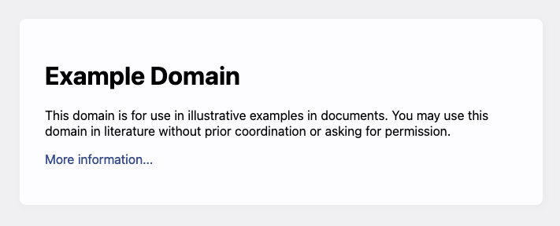

# Verbs - Requests and Responses
HTTP is a protocol for referencing and retrieving *resources*.  In the previous section we described how resources are *identified* - which is of course a prerequisite for referencing and retrieving.  Now let's take a look at actual retrieval.

The first thing to understand, and I'd argue that it is one of the most important and fundamental things for anyone who is learning the web to understand, is that HTTP operates on a **request** and **response** basis.  **ALL** action begins with a **request** for a resource, by the client (the web browser).  That request is folled by a **response** from the web server.  **That is it**.  Web servers do not initate any action.

Furthermore, each HTTP request and response pair is **independent**.  That is, there **is no contextual memory** between requests/responses built into the HTTP protocol *at all*.  Of course, you implicitely know that there *must be* some sort of contextual memory - since you know that you can do things in sequence over a series of web pages, such as build a shopping cart and check out, or login before accessing private data.  This contextual memory (state) entirely managed by the web developer however, **it is not** part of HTTP.  HTTP provides tools to support stateful interaction, but it does not do so on it's own.  This is important to keep in mind as you begin.

So, what exactly is a **request**?  A request is just that - it's a request for the server to do *something* to a particular resource.  The server may agree, or disagree.  There are only a few things that HTTP supports in terms of *types* or requests, although programmers can use them liberally.

The main types of requests are as follows:

- `GET`:  A request to retrieve the data associated with a resource (the resource itself).  The request *should* be read only, meaning if multiple `GET` requests are made, the same exact response should be returned, unless some other process has unfolded to change the resource.
- `POST`: A request to submit an entity (data) *to* the resource.  This will usually change the resource in some way, or at least have some discernable side effect associated with the resource.
- `PUT`: A request to replace the current resource with another.  A complete overwrite of the data, if it already exists.  This is often used to *create* data at a given resource.
- `PATCH`: A request to modify a portion of the resource.  Think of this as editing an existing resource, keeping most of the data.
- `DELETE`: A request to remove the resource.

There are a few others that are less commonly (directly) used, but are important nonetheless.  We will discuss them a bit further later.

- `HEAD`:  A request to retrieve **only** the metadata associated with a resource.  This meta-data will be exactly the same as what would have been returned with the `GET` request, but without the resource.  This is useful for cacheing.
- `OPTIONS`: A request to learn about which verbs are supported on this resource.  For example, the result may say you can't delete it.

There is a wealth of information online describing all the specifications and expectations of HTTP verbs.  We will cover what we need, as we go - but you can use the [MDN](https://developer.mozilla.org/en-US/docs/Web/HTTP/Methods) docs for more information.

Of the above request types, by far the vast majority of requests are GET, followed by POST. Typically, GET requests are issues automatically by the web browser whenever the user types in a URL in the address bar, clicks a link, accesses a bookmark, etc.  GET requests are also used to fetch images, videos, or any other resources *embedded* in an HTML page (we'll see how this is done in the next chapter).  POST (and GET) requests are made by web browsers when users submit *forms*, which you will recognize as user inputs on web pages with buttons (ie username and password, with a login button).

`PUT`, `PATCH`, `DELETE` are not actually used by web browsers natively - however they are used by application developers to perform other actions, initiated by client-side JavaScript.  We will defer discussion of them for now, but understand that the structure of a `PUT`, `PATCH`, or `DELETE` request doesn't differ from `GET` and `POST` within the HTTP protocol - they are just different types of requests.

Notice also that if you are used to thinking about resouces (URLS) as being *files* on a web server, then some of these requests make intuitive sense, and some may not.  `GET` is probably the most intuitive, you would make this request to read the file.  But what about `POST`?  Are we actually changing a file on the server?  What's the difference between `POST` and `PATCH` then?  Does `PUT` create a new file, and `DELETE` remove it?  The answer is "maybe" - but you might be missing the point.  **URLs don't necessarily point to files.**

Take the following URL:
```
http://contactlist.com/contacts/102
```
This might be a URL referring to contact with ID #102.  That contact might have a name, address, phone number, etc.  That contact isn't a "file", its an "entity".  That entity might be stored in the server's memory, or maybe in one large file, or maybe a database!  It's a thing.  It's a noun.  You can `GET` it, but now maybe is starts to make more sense that you can also `POST` to it, `PUT` it, `PATCH` it, and `DELETE` it.  `PUT` might mean replace the contact info entirely, or maybe we are attempting to *create* a new contact with this ID number.  `DELETE` might remove contact 102 from our contact list.  `PATCH` might edit, while `POST` might come along with some data that then gets emailed to the contact.  We'll see how requests can have data send along with them in a moment.

**Pro Tip**&#128161; The request type, unto itself, is meaningless.  The web server will receive the request, and decide what to do.  The "web server" is just code - and you, the programmer, will write that code.  Customarily, if the web server receives a `GET` request, it *should* be idempotent (it does not change the state of anything), but the server could do whatever the programmer wants it to do.  It could end up deleting something.  There is nothing stopping the developer from making poor choices.  There is **nothing inherently forcing action** about HTTP.  HTTP is just defining a structured way of sending requests, it isn't forcing you to take a particular action.  I say all this not to encourage anyone to do unexpected things.  To the contrary, I am explaining this because it's important to understand that **it is up to you** to design your applications to conform to the expectations of HTTP.  HTTP has stood the test of time, for nearly 40 years, through all the changes we've seen.  It is wise to follow it's intended purpose, you will be rewarded - but keep in mind, **you must actually do the work**, nothings happening for you!

## Making a Request
In the last chapter, we discussed domain name resolution.  We know that given a URL, one way or another, we can obtain the following:

- The IP address of the target machine
- The port number to send data to
- The protocol we expect to use.

For example, if we have the following URL:

```
http://example.com/index.html
```
We know that `example.com` can be resolve to an IP address (at the time of this writing, it's `93.184.215`.14).  We know, since the protocol is `http`, the port is `80` since it's not specified otherwise.  Thinking back to the echo server example, we now have enough information to open a **socket** using the **TCP** protocol to this server - all we needed was the address and port number.

**Pro Tip**&#128161; TCP is the transport protocol used for HTTP (and HTTPS).  It doesn't make any sense not to use it, in the vast majority of cases.  There may be some niche use cases where UDP is used in an unconventional situation, but it's rare enough for us to completely ignore for the remainder of this book.

In the echo server example, we opened a socket to the echo server (from the client) and sent over some text.  The echo server responded by sending back the same text, capitalized.  This was a request/response pair - but there was no structure to the message.  This is where things start to diverge, and we see that HTTP provides **structure**, or almost a **language** to facilitate hypertext actions.

The most basic request contains only 4 things:

1. The verb
2. The path of the resource
3. The version of HTTP the client is speaking
4. The host the request is intended for.

The verb should be self explanatory - it's `GET`, `POST`, `PUT`, etc.  The *path* of the resource is the path part of the URL.  For example, if we are requesting `http://example.com/foo/bar`, the path is `/foo/bar`.  The path identifies the resource *on the given machine*.

HTTP is just a text format, so given the first to things, we'd format the text request as

```
GET /index.html
```
This text would be sent straight to the webserver, just like the echo client sent straight text to the echo server.  In this case however, the server would *parse* the text, and decide how to handle it.

Unfortunately, that's not enough.  We have two more requirements - version and host.

First, the version (#3) - HTTP just like anything else in computer science, changes.  It hasn't changed a lot though - it's actually *remarkably* stable.  Version 0.9  was the first "official" version, and it just let you GET a resource.  No other verb was present. Version 1.0 (mid 1990's) added things like headers (we'll see them in a bit), and by the late 1990's HTTP Version 1.1 was standardized.  HTTP Version 1.1 is *essentially* still the defacto standard used - some 35 years later.  In 2015 HTTP Version 2.0 was standardized.  HTTP Version 2.0 is widely supported and used, however it's somewhat transparent to the web developer - as the major change was that it is a *binary* protocol with the ability to multiplex (have mutliple simultaneous requests over the same socket) and enhanced compression.  It does not make any changes to the actual *content* of the HTTP request (or response).

Suffice to say, in this book we'll use Version 1.1, since it's the latest text-based version.  You wouldn't want to read HTTP in binary.  Since ultimately we won't be writing our own HTTP beyond this chapter, instead letting libraries do it for us, the switch to Version 2.0 won't change anything for us.

The version is the third entry on the first line, which is referred to as the **start line**:

```
GET /index.html HTTP/1.1
```

Finally, we have #4 - the "host the request is intended for".  Technically this is *required*, but in most cases it is.  It is not at all uncommon for the same **physical** machine to host multiple "web sites".  For example, you might have two domain names within your domain:

```
www.acme.com
private.acme.com
```
The `www` site might be the public facing website, while `private` might be a web portal used by employees, requiring a login.  They are two separate domain names - however, to save costs, we want to have both sites served by the same physical machine.  This might make a lot of sense actually, since it's unlikely the private portal has enough traffic to warrant it's own machine, and the two sites probably share a lot of the same data.

Since both domain names resolve to the *same* IP address, two clients sending requests to these sites would send their HTTP to the *same* web server.  The web server would have no way of knowing which domain the client was looking for.

To make this clear, the following are two valid web addresses, and presumably two different resources.

```
www.acme.com/info.html
private.acme.com/info.html
```

The path is the same, but they are different web sites, from the perspective of the user.  To help the web server understand which site the request if for, we add our first **HTTP header**, the `host` header to the `GET` request.

```
GET /index.html HTTP/1.1
host: example.com
```
From the acme examples above, we can now see why the requests would be different.  Both of the following request *go to the same web server*, but the web server can see that one is asking for `/info.html` from `www.acme.com` and the other from `private.acme.com`.

```
GET /info.html HTTP/1.1
host: www.acme.com

```
```
GET /info.html HTTP/1.1
host: private.acme.com
```

Of course, it's up to the web server to be smart enough to differentiate the two requests and return the right resource!

### Making a request yourself
We could take the echo client code we wrote in Chapter 2 and actually modify it to use port 80, and connect to example.com.  We could then literally send two lines of text to it, conforming to the HTTP specifications, and get a response.  It's a bit tedious though to keep doing this in C++ code.

We can quickly see how this works by using a common command line tool that is a lot like the echo client we wrote before - `telnet`.  Telnet has been around for 50 years, and is available on most platforms.  It lets you specify a host and TCP socket, and it opens a socket to that server.  It then accepts anything you type at the command line, and shoots it across the socket.  The response from the server is printed to the command line.

Go ahead and try it, if you can install telnet on your machine:

```
> telnet example.com 80
```
It will connect, and then sit and wait for you to type something.

Type `GET / HTTP/1.1` and then enter.  Nothing will come back, because the web server is waiting for more before responding.  Type `host: example.com`, and again - nothing will come back just yet.

The last requirement of an **HTTP request** is a blank line.  This tells the server that you are done with the request.  It's a really low tech delimiter!

Just hit **enter** again, and you'll see the full HTTP response from `example.com` come back, and print out.  It will look something like this:

```
HTTP/1.1 200 OK
Accept-Ranges: bytes
Age: 86286
Cache-Control: max-age=604800
Content-Type: text/html; charset=UTF-8
Date: Fri, 13 Sep 2024 18:40:40 GMT
Etag: "3147526947+gzip"
Expires: Fri, 20 Sep 2024 18:40:40 GMT
Last-Modified: Thu, 17 Oct 2019 07:18:26 GMT
Server: ECAcc (nyd/D144)
Vary: Accept-Encoding
X-Cache: HIT
Content-Length: 1256

<!doctype html>
<html>
<head>
    <title>Example Domain</title>

    <meta charset="utf-8" />
    <meta http-equiv="Content-type" content="text/html; charset=utf-8" />
    <meta name="viewport" content="width=device-width, initial-scale=1" />
    <style type="text/css">
    body {
        background-color: #f0f0f2;
        margin: 0;
        padding: 0;
        font-family: -apple-system, system-ui, BlinkMacSystemFont, "Segoe UI", "Open Sans", "Helvetica Neue", Helvetica, Arial, sans-serif;

    }
    div {
        width: 600px;
        margin: 5em auto;
        padding: 2em;
        background-color: #fdfdff;
        border-radius: 0.5em;
        box-shadow: 2px 3px 7px 2px rgba(0,0,0,0.02);
    }
    a:link, a:visited {
        color: #38488f;
        text-decoration: none;
    }
    @media (max-width: 700px) {
        div {
            margin: 0 auto;
            width: auto;
        }
    }
    </style>
</head>

<body>
<div>
    <h1>Example Domain</h1>
    <p>This domain is for use in illustrative examples in documents. You may use this
    domain in literature without prior coordination or asking for permission.</p>
    <p><a href="https://www.iana.org/domains/example">More information...</a></p>
</div>
</body>
</html>
```
What we have above is a full HTTP response.  **Pure text**.  Go ahead and open a web browser now, and type `example.com` into the address bar.  You'll see something like this:



The web browser did the same thing as telnet did, but in a nicer way.  It took what you typed in the address bar, `example.com`, and formed an HTTP `GET` request from it, pretty similar to what you entered into telnet.  When it received the response, instead of showing you the pure text (which includes HTTP details we will learn about in a moment), it actually *rendered* the HTML that was included in the response.

**Congratulations**, you've demystified a lot of what you've been doing with a web browser most of your life already.  The browser is just sending well formatted text to a server, and the server is responding.  You've seen the raw text now - no magic.

Requests in HTTP really aren't a whole lot more complicated than what we've seen.  In the real world, the only additions we generally have are (1) more headers, (2) request quesry strings, and (3) request body data.  Let's take a look at those now:

## Adjectives?
We've been building this analogy, of describing HTTP in terms of nouns (URLs) and verbs (request types).  The analogy can go a little further, although it might be a perfect grammatical match.  Adjectives are used to describe things - and in HTTP, we can use additional mechanisms to (1) describe the things we are requesting, (2) describe the details and parameters of the request, and (3) supply additional data along with the request.  We do that using headers, query strings, and the *request body*.

### Request Headers
We already saw one request header, the `host` header.  Request headers are simply **name** / **value** pairs, separated by a colon, one pair on each line, right after the first line of an HTTP request.  Recall, an HTTP request is in fact delimeted by new lines, the first line is the **start line**, and then each line after that is a **request header** pair.  The end of the request header pairs is denoted by a *blank line*, which is why we needed to press **enter** one extra time when interacting with example.com using `telnet`!

```
GET /info.html HTTP/1.1
host: www.acme.com
another: header value
last: header value
<blank line>
```

Request headers are used to apply additional meta data to the HTTP request itself.  The are many valid request headers, and we don't need to exhaustively enumerate them here.  Let's cover a few, so you understand what they could be used for, and then we'll rely on other reference material for the rest.

#### Common Request Headers
- **host** - the *only* required header for a valid HTTP request, used to support virtual hosts.
- **user-agent** - a plain text string identifying the brower type.
- **accept** - a list of file types the browser knows how to handle.
- **accept-language** - a list of natural languages the user would like responses to be written in (the HTML).
- **accept-encoding** - a list of compression formats the browser can use, if the web server wants to use compression.
- **connection** - indicates whether the TCP connection should remain open after the response is sent (`keep-alive` or `close`)
- **keep-alive** - indicates the number of seconds to keep the connection open, after the response is sent.  This only makese sense when `connection` is set to `keep-alive`
- **content-type** - used for requests or responses, indicating what type of data is being sent.  Some requests can carry with them additional data (typically POST, PATCH, PUT), and this helps the server understand what format the data is being transmitted in.
- **content-length** - the additional data being sent with the request (or the response) has a length, in bytes.  In order for the server (or client, when dealing with responses) to be able to handle the incoming data, it's useful to know how long it is.  `content-length` will represent the number of bytes that are being sent.  Note, as we will se, the content in question is sent over the socket *after* the headers.
- **referrer** - the URL the user is currently viewing, when the request is made.  Think of this as being set to the url of the web page that the user clicked a link on.  Clicking the link results in a **new** HTTP request to be sent, for that page.  The new request will have the original page as the `referrer`.  This is how *a lot* of internet tracking works, when you arrive at a sight by clicking a link, that web site will know which web site (URL) led you to it.

It's worth taking the time to point out, headers are *suggestions* to the web server.  Your HTTP request might provide a list of natural languages it would like the response in, but that certainly doesn't mean the web server is going to deliver the response in that language!  Some web applications do have language options - but the vast majority do not.  If the HTML on the server is written in Spanish, it doesn't matter what that your HTTP request uses `accept-language` to ask for Japanese.  It's coming in Spanish!

Note that as an end user, you aren't all that used to thinking about these request headers.  Your browser fills them in for you.  Some may be based on user preferences (for example, the language you speak).  Others are default values from your browser - like `user-agent`.  If you are using a [Firefox web browser](https://developer.mozilla.org/en-US/docs/Web/HTTP/Headers/User-Agent/Firefox), the `user-agent` string is set to `Mozilla/5.0 (platform; rv:geckoversion) Gecko/geckotrail Firefox/firefoxversion`, where geckoversion and firefox version depend on your browser install.

**It is important to remember** that the web server **cannot trust** anything sent to it!  For example, while Firefox sends a `user-agent` string identifying the HTTP request as coming from Firefox, I could also write a `telnet` clone that added **the very same** `user-agent` string to each request.  The web server would have **no idea** that my own little program was not, in fact, Firefox!  In the next section, we'll see how these headers are send/received in code - and it will be even more obvious.

**A web server CANNOT accept anything written in an HTTP request as truth**, it's just plain text, and it could be sent by anyone, with any program, from any place on the planet!

There are many, many headers.  Check out the [MDN](https://developer.mozilla.org/en-US/docs/Glossary/Request_header) for an exhaustive list.  We'll come back to some of these as we progress, when there's more context to discuss around them.

### Request Query Strings
Type `https://www.google.com/` into your web browser.  Not really surprising - you'll see google's home page, with an input box for your search term.  That page is loaded as a result of your web browser generating an HTTP GET message, that has at a minimum the following:

```
GET / HTTP/1.1
host: www.google.com
```

Now, close the browser and reopen it.  Type the following instead:  `http://www.google.com?q=cats`.

You have the same page, but now notice that the contents of the search box, in the google.com home page, is filled out.  It's filled out with what you added - `q=cats` results in "cats" being in the seach box.

The web browser sent (roughly) the following message:

```
GET /?q=cats HTTP/1.1
host: www.google.com
```
Both requests are still identifying the `/` (root) home page on google.com as the page being loaded.  However, the page is loaded/rendered differently when we include the new `q=cats` suffix.

The `?` at the end of the string you typed in marks the end of the **path** in the URL, and the beginning of the **query string**.  The query string is a sequence of **name** / **value** pairs, with name/pair separated by the `=` sign, and pairs separated by the ampersand `&`.

Query strings can appear in GET requests (most often), but they can appear in all the rest too - POST, PATCH, PUT, DELETE.  They are supposed to be used as *modifiers*.


### Request Body
*Talk about content-type and content-length.  Refer to next section in terms of parsing*

We've already seen an HTTP response a few times now.  Let's dive into what a well formed HTTP response looks like now.

## HTTP Responses
When a web server receives a request, it has complete control over how to respond.  One of the first things that it will do is decide between some categories of ways to respond.  There are 4 main types of responses:

1. Everything is ok, so I'll perform the request
2. The request is fine, but you (the client) should request something else instead
3. The request is invalid, you (the client) have made an error, and there will be no response.
4. The request was possibly valid, but the server has encounted an error and no response is available.

Response types 1, 3, and 4 probably make sense.  Response 2 probably seems a bit odd, but it's useful.

**Pro Tip**&#128161; A reminder:  Saying "it has complete control" is inaccurate.  **YOU**, the web developer coding the logic on the web server, have complete control!

In it's most simple form, an HTTP response need only respond with a single line of text - which includes the HTTP version, the response code (derived from the type above), and a text description of the response code.

Here's a typical response for when things go well:

```
HTTP/1.1 200 OK
```

Here's a response for when things go badly, and the server encounters an error.
```
HTTP/1.1 500 Internal Server Error
```

Clearly, we are using HTTP version 1.1.  Notice the codes `200` and `500`.  Those are **response codes**, and there are a bunch of them worth remembering.

- `200` - OK.  Use this for most successfully and normal responses.
- `301` - Moved permanently.  Use this when the resource should no longer be accessed at the requested location, but instead a new location is provided.  We'll see in a moment how the new resource location would be specified.
- `307` - Moved temporarily.  Use this when you want the client to make the request somewhere else instead, this time - but that the original location was valid generally.  We'll see this used soon.
- `401` - Unauthorized.  This is named poortly, what it really means is *unauthenticated*.  It means that the resource if valid, but you need to authenticate yourself.  We'll see more on the difference between authentication and authorization later, but they aren't exactly the same thing.
- `403` - Forbidden.  This means you don't have access to the resource.  This is the closest match to unauthorized, as it's commonly used.  `401` means the server doesn't know who you are, `403` means the server knows who you are, and you aren't allowed to access the resource.
- `404` - Not Found.  The resource doesn't exist.
- `500` - Internal Server Error.  This is used when some sort of unhandled error occurs.  Generally its a bad idea to return details of what went wrong, since it's publically advertising aspects of your code. This is normally used when the web server code throws an exception, or some other sort of catastrophic error occurs.
- `501` - Not Implemented.  Use this when the resource request is planned, but you haven't gotten to implement it yet.

There are a lot more.  It's certainly worth keeping a [reference](https://developer.mozilla.org/en-US/docs/Web/HTTP/Status) handy.  Responding with the best response codes for the situation the web server finds is somewhat of an art form, but is well worth the effort.

**Pro Tip**&#128161; The text after the status code in the HTTP response code is a bit of an anomoly.  Strictly speaking, it should be the same text that is used to describe the status code in the official [specifications](https://developer.mozilla.org/en-US/docs/Web/HTTP/Status).  In practice, developers often override this, and include other text - perhaps more accurately describing the result.  This can be potentially unwise, since it's possible a client could use the response text in some way, and behave unexpectedly.  Web browsers will generally display the response code string to the user, as part of a generically formatted HTML page (especially for 400 and 500 level codes), and particularly when no body (HTML) portion is included in the response.

### Redirects

### Headers

### MIME Types

### Response Body
