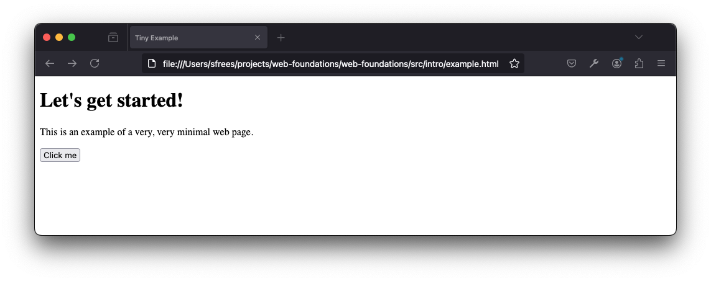
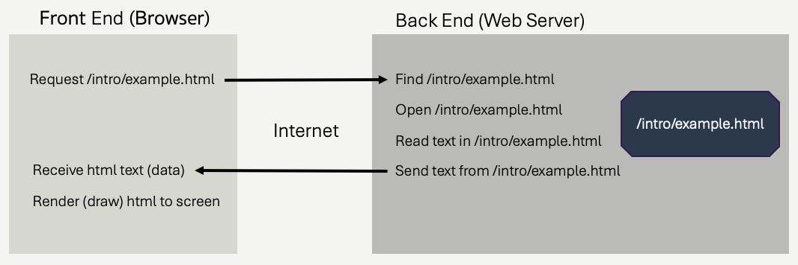

# The Field of Web Development
*Web applications are just sofware applications, with networking*.  

Maybe more specifically, they are software applications with networking separating the user interface (the part people see and click on) and the *business* logic.  No matter what lanaguges you use, the general design of the frameworks you will find are pretty much the same.  The industry is **very cyclical**, and very susceptable to buzzwords and trends.  For example, I've witnessed several iterations *away* and *back* to server-side rendering.  I've witnessed front end development changing to require it's own application and build structure, separate from the rest of the application; and I've witnessed a revolt against this taking hold - perhaps returning us to simpler architectures.  

For a long time, web development was thought of as a *lesser* sub-field of computer science.  Real programmers built "big" programs that had their own UI's and were written in C++ and Java.  Toy web sites had some JavaScript, and were written in "broken" scripting languages like [Perl](https://www.perl.org/) and [php](https://www.php.net/).  Real programmers couldn't be bothered with creating applications for the web, and even if they wanted to, web browsers were such a mess that it was too expensive and error prone to pull off.  Times have changed, and few think of web development as *lesser* anymore.  It's been a fascinating ride.

The change started to take hold in the early 2000's.  While it took a long time, the dominance of Internet Explorer waned, and the competition among browsers fostered improving web standards.  Better standards meant web developers had a better chance to make their app work well on everyone's machines.  Browsers like Chrome also got *way* faster, and way more powerful - making it worth everyone's time to start looking at what they could do with JavaScript.  Suddenly, real application were starting to be delivered on web technology - driving more development focus into those same technologies.  HTML got better.  CSS got *a lot better*.  JavaScript *grew up*.  

Along the same time as all these nice things were happening on the front end, back end (serverside) development was changing too.  The first web application were written in a way most wouldn't recognize - actually instantiating new processes and running entire programs to respond to *each* request.  These programs could be written in any language, and a web server would handle the networking and invoke the appropriate (compiled) program to create the network response.  Languages like php and ASP, and later Java extended this model, allowing server side applications to be written as one process in it's own *containers*.  These containers handled a lot of the web-specific plumbing, like making parsing / writing HTTP much easier.  They all focused on different ways of allowing developers to generate HTML responses programmatically, and they all took somewhat different approaches.  There was little seperation of concerns - the business logic, HTTP processing, HTML generation, and other aspects of the programs were highly integrated.  Applications written in different frameworks looked completely different from each other, even if they largely did the same thing.

[Ruby on Rails](https://rubyonrails.org/) - or just "Rails" - was released in 2004, and things changed..  Rails took a number of huge leaps in how server side frameworks worked. Rails pioneered and/or refined rapid application development on the server, using command line interfaces to build out routes, controllers, and views.  Web applications began to be more modular, and composable.  It worked with view template engines to separate view generation from business logic. It didn't invent the MVC pattern, but it was really the first web framework to truly deliver on the MVC promise.  We'll talk a lot more about it later in this book.

By the late 00's, and throughout the 2010's, both of the above trends just strengthened.  Web standards and browser performance led to more developers doing more things client side, in JavaScript.  As this happened, developers wanted better tooling, better dependency management, better UI frameworks - so they built them.  Server side, developers loved how Rails was designed, but they wanted to use their favoritye programming language - not just Ruby.  Serverside frameworks heavily influenced by Rails emerged - Django (Python), Laravel (PHP), Grails (Groovy/Java), Express (Node.JS), and many more.  Even .NET was on board - releasing ASP.NET MVC - very much in line with the Rails design.  

Modern web development has benefited by a virtuous circle - as tools and lanaguages and standards improved, the amount being done on the web grew, which demanded even better tools, languages, and standards.  The explosion of different devices accessible to people also created huge demand for standards.  Today, nearly every software application we interact with - whether it's through a traditional web browser or through an app on our phone - **is a web application**.  In many respect, today, web development **is** software development.  


## The landscape
We are eventually going to focus on a slice of web technologies (our "stack"), but it's important to have an understanding of how things fit together.  We've been throwing around some terms that need explanation:

### Front end
Front end develop refers to all the code used to display the user interface to a user - wherever that user interace might live.  In most cases (in the context of this book), this is the web browser.  The web browser must draw the user interface (the graphics, the user interface elements, etc.) using code delivered to it from the web server.  The code delivered tells it the *structure* of the web page, the *styles* of the page, and the *interactivty* of the user interface.

On the front end, we generally have three languages for these three aspects:

- **Structure**:  HyperText Markup Language (HTML)
- **Style**:  Cascading Style Sheets (CSS)
- **Interactivty**:  JavaScript

Let's look at a tiny example, a simple web page that has a bit of text, and a button.

```html
<!DOCTYPE html>
<html>
    <head>
        <title>Tiny Example</title>
    </head>
    <body>
        <h1>Let's get started!</h1>
        <p>This is an example of a <span>very, very</span> minimal web page.<p>
        <p>
            <button type='button'>Click me</button>
        </p>
    </body>
</html>
```
Without getting stuck on any details, understand that the above is HTML code.  It is defining a page with a heading, some text, and a button.  It's the *structure* of the page.  We'll spend lots of time talking about HTML later.

How does this get displayed to a user?  **The answer is important**, and be careful to understand it.  The HTML, as *text*, must be loaded into a web browser, *somehow*.  If you take the text, and you save it in a file called [example.html](./example.html) on your computer, you *can* load it in your web browser by simply double clicking on it.  It will look something like this:



**Notice what is shown in the URL address bar.**  

```
file:///Users/sfrees/projects/web-foundations/web-foundations/src/intro/example.html
```
The browser has loaded an HTML file **directly** from the file system and displayed it.  To display it, it parsed the HTML into it's own internal representation and invoked it's own drawing/graphics commands to render the page according to HTML specifications.

 While that's OK, you **must understand that this is not the way the web works**.  HTML files that appear in your web browser **are not** stored on your own computer in most cases.  In most cases, they are stored on some other machine, on the internet!  

This brings us to our first shift away from "front end", and to the back end (and the networking in between).  We are going to refine our understanding of this over and over again, here we are going to keep things **very** high level.

### Back end

Type the following into your web browser's address bar:

```
https://webfoundationsbook.com/intro/example.html
```

The same page loads, but this time, that file didn't come from your own computer.  Delete `example.html` from your own machine, if you don't believe me.  Instead, it came from a different machine - webfoundationsbook.com.  When you typed the address into your web browser, the web browser *connected* to webfoundationsbook.com, it sent a specially crafted message (as you'll see soon, crafted with HTTP) asking webfoundationsbook.com to send the *text* contained in a file found at `/intro/example.html` *on webfoundationsbook.com's hard drive*.  That text was then parsed and rendered by the browser, just the same.

In order for that to all work, that means *some program must be running* on the webfoundationsbook.com computer.  That program is accepting connections and requests from other machines.  It's decoding the requests, finding the file requested, opening the file, and sending the contents of the file back to the connected browser!  That program **is a web server**.

Some of the most common web servers for doing this (and much more) are [apache](https://httpd.apache.org/) or [nginx](https://nginx.org/en/). We will see more of those later on in this book.



The browser's pseudocode, vastly simplified, might look something like this.

```c++
    // Pseudocode for the web browser

    // Suppose we can access the values in the UI through 
    // through a built-in browser object

    response = send_http_request(browser.address_bar.value);
    
    // The response object might have a body attribute, containing
    // the HTML text that was returned by the server.

    render(response.body);
```

Here's some psuedocode (missing vital error handling!) further illustrating what is happening on the *server*.

```c++
    // Pseudocode for a web server

    // Suppose we have function to read a request off 
    // the network, from a browser
    request = recv_http_request();

    // Suppose the request object returned has a path 
    // property, corresponding to /intro/example.html
    // when the browser requests https://webfoundationsbook.com/intro/example.html
    file = open_file(request.path);

    // Read the html from the file, as plain text (character buffer)
    html_text = file.readAll();

    // Use a function to send the data back to the browser
    send_http_response(html_text);

```


So, already, we see there are *typically* two programs involved - (1) a web browser and (2) a web server.  The web browser asks for and receives *front end code* from the server - in this case **html**.  The web server is responsible for **generating** that text - in this case, simply by reading the `example.html` file from it's own file system.  Once the web browser receives the HTML code, it uses it to draw the page to the screen.  

If you are wondering, web browsers and web servers *can* be written in literally **any** programming language.  Most web browsers are written in C/C++, and some have at least some components written in other languages like Rust.  Web servers, especially the top level ones (we'll explain what that means later) are also often written in C/C++.  It's important to remember, *they are just ordinary programs*, they read files, they make network connections (sockets), they parse and generate specially formatted text, they draw things (browsers, not servers).

### Return to the front end - Styling
So we've established that HTML code is delivered to a web browser, usually from a web server.  That HTML code defines the structure of the page.  Web browsers use standard conventions to draw HTML to the screen in expected ways.  Looking at the HTML we were using, notice the text that is wrapped in the `<h1>` and `<button>` elements.  They look different than the other bits of text wrapped in `<p>` and `<span>`.  `h1` is a heading, `button` is pretty obviously telling the browser to draw a button.  `p` is a paragraph and `span` is a text span within a paragraph that *can* be styled differently (but isn't yet).  This is the **structure** of the page - it's contents.

Front end code also is used to define *style* and *interactivity*.   Let's add just a bit of style, by making the heading's text underlined, and the span's text blue.  We do this by adding **Cascading Style Sheet** (CSS) rules.  CSS is a language unto itself, and we will study it in several future chapters - but for now, we will just embed it right into our HTML code.

```html
<!DOCTYPE html>
<html>
    <head>
        <title>Tiny Example</title>
        <style>
            h1 {
                text-decoration:underline;
            }
            span {
                color:blue;
            }
        </style>
    </head>
    <body>
        <h1>Let's get started!</h1>
        <p>This is an example of a <span>very, very</span> minimal web page.<p>
        <p>
            <button type='button'>Click me</button>
        </p>
    </body>
</html>
```
All the magic is happening within the `style` element - we've used CSS syntax to tell the browser to style `h1` elements and `span` elements a bit differently.  Go ahead and load the following in your web browser, no surprises - just some styling.
```
https://webfoundationsbook.com/intro/example-style.html
```

CSS can be used to define all aspects of the visual styling and layout of HTML content.  It's an immensly powerful language, that has undergone incredible cycles of improvements over the decades since it's introduction.  While there were some early competitors, no other language is used to style HTML these days - CSS is the language.  All browsers support CSS (at least, mostly).  

Since visual styling is *so important*, it shouldn't be surprising that CSS styling code can grow - it can become a huge part of the front end development efforts.  If you have any experience in computer science and software engineering, you know that we like to reuse code.  CSS is no different - reusing and modularizing CSS is important when creating maintainable web applications.  Moreover, not all of us are artists - we aren't all trained in good UI practices.  It shouldn't be surprising that there are libraries and frameworks that contain vast quantities of CSS code designed by people *who are really good at designing visual systems*, and that these libraries and frameworks are often freely available.  

Here are a few exampls of CSS libraries and frameworks that are commonly used.  The list isn't exhaustive, but hopefully it gives you an idea of how they fit into the web application landscape if you've heard about them.  They **are just CSS**, they are added into your HTML to provide the web browser styling instructions.

- [Bootstrap](https://getbootstrap.com/) - likely the most widely used framework, this has been around for a long time.  Provides full styling of everything from text, navigation toolbards, dialogs, and more.  We will spend some time looking at this in more detail in later chapters.
- [Foundation](https://get.foundation/) - similar in aims to bootstrap, Foundation provides full styling of most user interface components.
- [Tailwinds](https://tailwindcss.com/) - takes a different approach compared to Bootstrap and Foundation, in that it focuses on composable CSS styles rather than full user interface componetns.  This gives designers more control, but can also be harder to get started with.
- [Simple.css](https://simplecss.org/) - lightweight CSS framework that provides an extremely minimal set of stylings for HTML elements. Theses types of frameworks are really nice for rapid development, because they don't require you to add much to your HTML at all.  Their goal is to get things looking "good" immediately, and then you can add more later.

There are also more specialized libraries defining styling.  By more, I mean **thousands**.  They are all just CSS, that get added to your front end HTML code.  Here are some two interesting ones, just to show how varied they can be.

- [United States Web Design System](https://designsystem.digital.gov/) - this is the standard CSS frameworks for use on United States government web sites.  Many other countries have similar frameworks.  The goal is to provide extremely high quality out-of-the-box accessibility.  The∂
- [NES.css](https://nostalgic-css.github.io/NES.css/) - all the way on the other side of the spectrum, here's a CSS library that simply styles all your HTML so the page looks like it's from the Nintendo Entertainment System from the 1980's.  [It's fun](./example-nes.html), but certainly not general purpose!

### Front end interactivity
The page we've been looking at is  *static*.  Once it's shown on the screen, it doesn't change.  The HTML and CSS are delivered to the browser, and that's that.  What if we want something to happen when we click that `<button>` element though?  This is where we can add some *interactivity*.  Interactivity on the web generally means creating code that *alters the HTML or CSS* currently loaded in the web browser, causing something to change.  It can mean more, but for now that's a good enough description.

Let's add some interactivity.  When the user clicks the button, we are going to **add** some content below the button and change some of the CSS attached to the span element.

```html
<!DOCTYPE html>
<html>
    <head>
        <title>Tiny Example</title>
        <style>
            h1 {
                text-decoration:underline;
            }
            span {
                color:blue;
            }
        </style>
    </head>
    <body>
        <h1>Let's get started!</h1>
        <p>This is an example of a <span>very, very</span> minimal web page.<p>
        <p>
            <button type='button'>Click me</button>
        </p>
        <script>
        // Change the "very, very" to red, and add a new text snippet
        // with a random number, and remove the button so it can't be clicked
        // again!
        document.querySelector('button').addEventListener('click', () => {
            document.querySelector('span').style.color = 'red';
            const n = Math.ceil(Math.random() * 10);
            const p = `<p>Random number generated client side: ${n}`;
            document.querySelector('p').innerHTML += p;
            document.querySelector('button').remove();
        });
    </script>
    </body>
</html>

```
Go ahead and [check it out](./example-style-js.html).  When you click the button, something really important is happening - the JavaScript inside the `script` element is **changing** the HTML itself, using what is called the Document Object Model (DOM).  The span is given a new CSS value for `color`.  A new `p` element is created and appended to the last `p` element in the document, with a random number within the text (it's different every time you load the page).  The `button` is removed entirely.  Notice, the browser changes what is rendered as the JavaScript changes the DOM elements.  The DOM elements *are* what the browser renders - they *are* the internal representation of the HTML loaded by the browser.

It's important to understand that the JavaScript code that modified the HTML DOM is running inside the web browser.  The web browser, in addition to a renderer, a JavaScript runtime environment!  **The server is not involved in anything that we just did**, it has no idea anyone has click a button, or that any HTML has been modified.  It all happened within the browser's internal representation of the HTML the server sent to it.

Interactivity on the front end, using JavaScript could (and most definately is) be the subject of entire books, entire courses, and entire careers.  As you might imagine, there are a huge number of frameworks that help developers write JavaScript to add an enormous amount of interactivity to HTML.  You've no doubt heard of some.

- [jQuery](https://jquery.com/) - probably the first and most broadly used JavaScript framework, in many ways it revolutionized how we wrote JavaScript.  jQuery was created in 2006, when JavaScript suffered from a very poorly standardized DOM API, meaning writing JavaScript to interact with the HTML DOM (change things on the page) needed to be written differently depending on the browser.  THis was also a time when Internet Explorer was still quite popular, but Chrome, Safari, and Firefox were too large to be ignored.  jQuery created a very powerful API that smoothed over the differences.  It inspired iterations to JavaScript itself, which later became part of the standard web APIs across all browsers.  jQuery isn't often used these days, because JavaScript has evolved enough that it's no longer necessary - but it's impact is still felt.
- [React](https://react.dev/) - released in 2013, React became the most popular *reactive* framework/library very quickly, and has remained so through the time of this writing.  React focuses on component design, and has offshoots like Reach Native which aid in mobile application development.  The concept of *reactivity* centers around how developers map application state (usually state is represented by JavaScript objects) to HTML DOM changes.  Reactive frameworks allow the developer to modify state variables, and those changes are automatically applied to the DOM based on declaritive rules.  This is very different than the *procedural* approach in our JS example above, where we *directly* modify the DOM.  There are many reactive frameworks, the concept is extremely powerful.  
- [Vue](https://vuejs.org/) - released in 2014, Vue is similar to React in terms of it's model of development.  A proper Vue app manages front end application state, and automatically modifies the DOM based on those state changes.  It has what many people feel is a shallower learning curve than React, and we will use it when we dive deeper into reactive frameworks and single page application design later in this book.
- [Angular](https://angular.dev/) - AngularJS was initially released in 2010, and rewritten (and renamed to Angular) in 2016.  Angular shares a lot of design principles with React and Vue, along with other predecessors like [Ember](https://emberjs.com/) and [Knockout](https://knockoutjs.com/).

There are lots and lots of other front end JavaScript libraries and frameworks.  Some are large, some are very small.  While we won't dive too deeply into them, we will learn the fundamentals of JavaScript on the client (front end) in depth, and you'll be able to pick many of these frameworks up pretty quickly once you've mastered the basics.

### Back to the Back end
We could have a web site just with HTML, CSS, and JavaScript.  You could have lots of HTML pages, link them together, and use CSS and JavaScript to do a lot interesting things.

We could write our own HTML, CSS, and JavaScript in a text editor, and use a SFTP program to transfer those files to a simple web server that can map network requests from clients to these files. Those files are then transmitted to the browser for rendering.  This is in fact still very viable, it's probably *still* how most web pages are delivered.  

However, there is something *missing*.  Our pages are still *static* in that they are always exactly the same, whenever they are loaded into the browser.  Sure, our front end JavaScript might change the DOM later, but it's always exactly the same HTML, CSS, and JavaScript being delivered to the browser, because we are just serving up *files*.

As a little thought experiment, what if we rewrote the server pseudocode from above so we didn't use a file at all?

```c++
    // Pseudocode for a web server, without a file.

    // Suppose we have function to read a request off 
    // the network, from a browser
    request = recv_http_request();

    if (request.path == '/intro/example.html') {
        html_text = "<!DOCTYPE html><html><head><title>Tiny Example</title></head>";
        html_text += "<body><h1>Let's get started!</h1><p>This is an example of a ";
        html_text += "<span>very, very</span> minimal web page.<p><p>";
        html_text += "<button type='button'>Click me</button></p></body></html>";

        send_http_response(html_text);
    }
    else {
        // send some sort of error, we don't have anything for this path...
    }
   
```

If you look closely, the web server is sending *exactly the same text* to the web browser when the browser requests `/intro/example.html` as it was before.  The difference is that instead of getting the HTML text from a file saved on disk, the web server is just *generating* the HTML using string concatenation.  It's ugly, but it works - and in fact, the browser **cannot tell the difference**.

Why would we do this? **The answer is simple, and profoundly important**.  Now, since we are generating the HTML inside a program, we have the freedom to create **different** HTML whenever we want.  We can fetch data from a database, and include that data in the HTML.  We can perform any number of computations, interact with any number of data stores and systems, and use any other mechanism to customize the HTML delivered to the browser.  We now have the ability to create a *fully customized* HTML response to `/intro/example.html` if we please.

To drive this point home a little more, let's generate a random number and put it in the HTML sent to the browser.  

```c++
    // Pseudocode for a web server, without a file.

    // Suppose we have function to read a request off 
    // the network, from a browser
    request = recv_http_request();

    if (request.path == '/intro/example.html') {
        html_text = "<!DOCTYPE html><html><head><title>Tiny Example</title></head>";
        html_text += "<body><h1>Let's get started!</h1><p>This is an example of a ";
        html_text += "<span>very, very</span> minimal web page.<p><p>";
        html_text += "<button type='button'>Click me</button></p></body></html>";

        send_http_response(html_text);
    }
    else if (request.path == '/intro/example-style-js.html') {
        
        number = Math.ceil(Math.random() * 100);
        
        // The beginning is just static text content
        html_text = "<!DOCTYPE html>";
        html_text = "<html>";
        html_text = "   <head>";
        html_text = "       <title>Tiny Example</title>";
        html_text = "       <style>";
        html_text = "           h1 {";
        html_text = "               text-decoration:underline;";
        html_text = "           }";
        html_text = "           span {";
        html_text = "               color:blue;";
        html_text = "           }";
        html_text = "        </style>";
        html_text = "   </head>";
        html_text = "   <body>";
        html_text = "       <h1>Let's get started!</h1>";
        html_text = "       <p>This is an example of a <span>very, very</span> minimal web page.<p>";

        // Here's the dynamic bit, with the server generated number in the text.
        html_text = "       <p>The server generated number is:  " + number + " </p>"

        // The rest is static again.
        html_text = "       <p>";
        html_text = "           <button type='button'>Click me</button>";
        html_text = "       </p>";
        html_text = "       <script>";
        html_text = "           document.querySelector('button').addEventListener('click', () => {";
        html_text = "               document.querySelector('span').style.color = 'red';";
        html_text = "               const n = Math.ceil(Math.random() * 10);";
        html_text = "               const p = `<p>Random number generated client side: ${n}`;";
        html_text = "               document.querySelector('p').innerHTML += p;";
        html_text = "               document.querySelector('button').remove();";
        html_text = "           });";
        html_text = "       </script>";
        html_text = "   </body>";
        html_text = "</html>";
    }
    else {
        // send some sort of error, we don't have anything for this path...
    }
   
```
Right about now, you may be getting a sick feeling in your stomach.  We are writing code, inside code.  Worse yet, we are writing code (a mix of HTML, CSS, and JavaScript) inside plain old strings, and using concatenation to build it all up.  This is a tiny example.  If you feel like this won't scale well up to real web applications, you are 100% correct!

Now we've arrived at the land of *back end frameworks*.  Server side, backend web frameworks handle the following types of things (and many more):

1. **HTTP parsing / formation** - we side stepped this by imagining we had functions like `recv_http_request` and `send_http_response`.  In reality, these types of functions will be part of a web server framework/library, and will be doing a ton of work for us.
2. **Path routing** - we have the beginning of *routing* in our last example, where we use `if` and `else if` statements to determine which response to generate based on the requested path.  Routing is a major part of web development - the server needs to respond to many many different paths (urls).  Web frameworks will provide methods of organizing your code into functions, objects, and modules that map to specific paths/urls, and the framework will ensure the right handlers are called at the right time.

3.  **View transformations** - we aren't going to generate HTML with strings.  We are going to build objects of data programmatically (models), and then use templating engines to transform the data into HTML (views)using a template language.  It's a mouthful, but when we get there, you will see how much easier it makes things! There are tons of templating languages, and most do pretty much the same thing.  If you've heard about [ejs](https://ejs.co/), [Jinja](https://jinja.palletsprojects.com/en/3.1.x/), [pug](https://pugjs.org/api/getting-started.html), [HAML](https://haml.info/), [Liquid](https://shopify.github.io/liquid/), [Mustache](https://mustache.github.io/), or [Handlebars](https://handlebarsjs.com/)... they are all templating languages with large following in the web development community.  We'll talk about pug in more detail later.  Once you learn one, the others are very easy to pick up.

Full featured web frameworks tend to cover #1 and #2, and typically will let you choose which templating language to use.  Modern frameworks are available in just about every programming language you can think of.  Most modern frameworks support the Model-View-Controller (MVC) Architecture - which we discussed a bit above.  MVC is a way of organizing the application in a way that seperates model (the data), the view (HTML generation), and the business logic (also called *controller*).  

It's hard to say if one is better than the other - there tends to be a few good choices for each programming language.  Which programming language you choose is probably more of a decision based on you and your teams skills, and preferences - rather than anything specific to the web.

Here's a sampling of some popular backend web frameworks.  Each of these covers all of the above, and often includes more.  Note that your choice of a backend framework has nothing to do with anything we've discussed about the front end.  They are completely seperate!

- Python
    - [Django](https://www.djangoproject.com/)
    - [Flask](https://flask.palletsprojects.com/)
- Java (and JVM languages)
    - [Grails](https://grails.org/)
    - [Spring Boot](https://spring.io/projects/spring-boot/)
- Rust
    - [Rocket](https://rocket.rs/)
    - [Actix](https://actix.rs/)
- Ruby
    - [Rails](https://rubyonrails.org/)
- PHP
    - [Laravel](https://laravel.com/)
    - [CakePHP](https://cakephp.org/)
- C++
    - [Drogon](https://drogon.org/)
- .NET
    - [ASP.NET Core/MVC](https://dotnet.microsoft.com/en-us/apps/aspnet)
- JavaScript (Node.js)
    - [Express.js](https://expressjs.com/)
    - [Sails.js](https://sailsjs.com/)
    - [Deno](https://deno.com/)

We'll discuss frameworks in depth later in the book.  

### In-between and outside
We've glossed over the *in between* part, the technology that connects the front end and back end.  That's networking, and that is HTTP.  We will cover that extensively in the next few chapters!  

Outside the typical discussion of front end and back end development are all the systems components and concerns that tend to make up web applications of any complexity.  This includes **security**, understanding TLS/HTTPS, hashing, authentication, CORS, and more.  This includes databases of all kinds - relational, document stores, and more.  We'll also need to learn about hosting, content delivery, and deployment.  It's alot of ground to cover, and there are chapters dedicated to these topics later in the book.

## Breadth & Depth
The goal of this book is to give you enough *breadth* to understand how all of the pieces of web development fit together.  You'll understand the fundamentals in a way that allows you to pick up new frameworks quickly.  You will understand the *entirety* of full stack web development.

The second  goal of this book is to give you **depth** along a particular set of frameworks/libraries so you can build a full scale web app from the ground up.  You will understand how front end and backend frameworks work at a low level, and then see how we apply layer after layer until we reach modern framework functionality.  We'll choose specific frameworks at each step - for bot the front end and back end - and get a lot of experience using them.