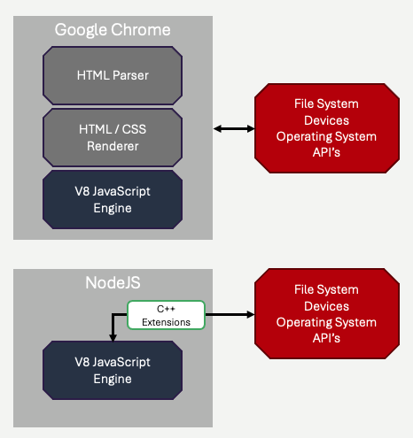

# JavaScript
We are now going to a take a detour *away* from talking about web development and start looking at JavaScript as a fundamental programming language.  We will examine the syntax, runtime, and design features of the language - just as you likely did when you learned your first programming languages - maybe Python, Java, or C++.  We will cover the foundational aspects of programming in JavaScript without discussing how the language connects to web development specifically just yet - although we will start out with a brief history.  Of course, JavaScript is inescapably linked to web development, but it's important to remember that it is *actually just a general purpose programming language*!

## How we got here
JavaScript, often abbreviated as JS, has a rich and evolving history that began in the mid-1990s. It was created by Brendan Eich while working at Netscape Communications Corporation. In 1995, Eich was tasked with developing a lightweight scripting language to enable interactive web pages. The result was Mocha, which later became known as LiveScript. However, just before its official launch, Netscape rebranded it to JavaScript, partly as a marketing strategy to leverage the growing popularity of the Java programming language, even though the two languages are fundamentally different.

The first official release of JavaScript was in December 1995 with Netscape Navigator 3.0. This version introduced basic scripting capabilities, allowing developers to manipulate HTML elements and respond to user events. The language's initial focus was on client-side scripting, enabling dynamic content without the need for full-page reloads. The language's data *was the website* being rendered, and the code you wrote manipulated the structure (the HTML).  In many ways, you can think of JavaScript originally as a programming language designed to allow you to modify HTML being rendered by the browser.  As the web exploded, JavaScript quickly gained traction, becoming a standard component of web development.

In 1996, Microsoft introduced its own version of JavaScript, called JScript, which led to compatibility issues across different browsers. To address this, the European Computer Manufacturers Association (ECMA) standardized the language under the name ECMAScript in 1997. The first edition, ECMAScript 1 (ES1), laid the groundwork for a more uniform scripting environment across browsers, promoting greater interoperability.

Over the years, JavaScript evolved significantly. ECMAScript 3 (ES3), released in 1999, introduced crucial features such as regular expressions, try/catch error handling, and better string manipulation. However, after ES3, progress slowed down for several years, largely due to the dominance of Internet Explorer and a lack of focus on web standards.  For a long period of time, JavaScript was plagued by the incompatabilities between various web browser's *implementation* of it's features.  This was particularly problematic when working with more advanced aspects of web development, like AJAX.  

In 2009, the release of ECMAScript 5 (ES5) marked a significant milestone, introducing features like strict mode and JSON support, further solidifying JavaScript’s capabilities. Then, in 2015, ECMAScript 6 (ES6), also known as ECMAScript 2015, was released, bringing major enhancements such as arrow functions, classes, and template literals. This version shifted JavaScript into a more modern programming language, enabling developers to write cleaner and more maintainable code.  As we will discuss below, the advancements in the language itself occured in tandem with significant advancements inthe *performance* of JavaScript runtimes.  

It's fair to say that from 2008-2015, there was a virtuous circle of improvements in the language, it's performance, and it's impact.

## Node.js - JavaScript without the web browser
JavaScript evolved as a language strictly within the context of the *web browser*.  The langauge did not have **true** I/O - for most of it's history JavaScript had no concept of writing to the console, writing to files, reading data from your hard drive, etc.  This is for good reason of course, it was assumed that JavaScript code, by definition, was code running on the *end users's* computer, inside a browser, as a result of visiting a web page.  **No one wanted JavaScript** to be able to interact with their machine - it was untrusted code downloaded from a web server!

All that changed in 2009.  Before you get worried, it's not that the obvious security concerns about having a web page's JavaScript interact directly with your computer are now ignored, it's just that we no longer think of JavaScript code *only* within the context of a web browser.

Let's take a step back, and think about another general purpose language with a runtime system:  Python.  Python code is cross-platform.  It's cross-platform because the code itself is not compiled before being distributed, it is distributed as regular Python code.  In order to run a Python program, the *end user* must have the [Python Intepreter](https://www.python.org/) installed on their computer.  The intepreter comes in various versions, for most common operating systems.  The intepreter is written in C++ and C, it reads Python code and performs the corresponding operations.

When the Python intepreter encounters a `print` statement in Python, the intepreter interacts *with the operating system*, using *operating system APIs*, in C, to perform the printing operation.  In fact, the Python intepreter can expose C APIs for many operating system resources - the file system, the network interaces (sockets), etc.  This allows Python code to be general purpose - there are Python functions to interface with devices - and those functions are mapped to C APIs the underlying operating system provides.

What does this have to do with JavaScript?  Well, Javascript is similarly cross-platform.  The code is distributed to end users, and the code is run by an intepreter which is written in C/C++ (for the most part).  The interpreter, prior to 2009, was generally assumed to be *a web browser*.  The choice *not* to support interfaces to the operating system's APIs was just that - *a choice*.  

### Google Chrome and the V8 Engine
Web browsers aren't normally written as monoliths.  Web browsers contain HTML parsing code, HTML/CSS rendering (drawing) code, user input and network code, and JavaScript execution code.  All of these components can be fairly distinct.  The part of Google Chrome (circa 2008) that was responsible for intpereting and executing JavaScript code was a C++ library called the *[V8 Engine](https://v8.dev/)*.  The V8 engine was different than the JavaScript execution libraries found (at the time) in Safari, Firefox, Internet Explorer, and others.   **It was blazingly fast**.  The reasons for this speed are a topic unto themselves, but the V8 library made several important advancements in JavaScript execution inspired from work done for other runtime systems (Java Virtual Machine, .NET CLR, etc), including Just-in-Time compilation.

The dramatic improvement in execution speed, coupled with the ubiquity of JavaScript *developer skills* due to the web, suddenly made JavaScript a more attractive language for people to write *general* programs - distinct from the web.

### Node.js 
In 2009, Ryan Dahl released the first version of Node.js.  Node.js is the V8 Engine, but instead of embedding it within a web browser, it is embedded in a command line program called `node`, written in C++, that supports **JavaScript interfaces to operating system APIs**.  That last part of the sentance is what is really important - when you run a Node.js intepreter, you are running a C++ program that can translation JavaScript code into operating system APIs allowing your JavaScript code to access things like the file system and network devices directly.  These interfaces are exposed via Node.js specific *includes* (`require`) of specific libraries:  `fs`, `net`, etc.  These libraries are not part of standard JavaScript.  They are not available within V8 engines hosted within web browses.  They are hosted by Node.js.  They are just as safe as code written in any other languages - and just as dangerous.  Node.js programs are programs just like C++ programs, Java programs, .NET programs, and Python programs.  They have the same capabilities, and the same abilities to access the host computer.   **They are not distributed via web browsers**.



In the image above, observe the difference in the relationship to the V8 engine and the operating system.  With Google Chrome, V8 executes within the browser process.  The browser is a C++ program, contain several (many) parts.  The browser may interact with the operating system, like any other C++ program - the browser certainly can access network devices, etc.  The browser **does not** expose an interface to V8 that allows JavaScript to interact with the operating system, however.  In the NodeJS diagram, we see C++ extensions within Node JS (a C++ program) that purposely expose interfaces to the operating system.  This *does* allow JavaScript code to interact with devices and the file system.  Node.js *is not a web browser*!

**Pro Tip**&#128161; It is so important that you understand the difference between JavaScript running in the browser, and JavaScript running in Node.js!  JavaScript is a programming language - it can run in different places. JavaScript running in the browser runs on the **end user's** browser, and is 100% focused on manipulating the web page the browser has currently loaded.  JavaScript running in Node.js is running on the machine your run the program on.  You can write any program in JavaScript, and use Node.js to run it.  It could be a web server.  It could be a game.  It could be accounting software.  It's a **general purpose language**.  For the remainder of this chapter, and for the next several chapters as well, **we are only talking about Node.js** - not code running in the user's web browser.  **Make sure you are crystal clear on this!**

## Running Node.js Programs
You will need to install the Node.js runtime on your computer.  You can do so for any platform by visiting the main website for the system - [https://nodejs.org](https://nodejs.org).  There are a few other ways to install Node.js, including using the [NVM](https://github.com/nvm-sh/nvm), which allows you to more easily manage *multiple versions* of Node.js on the same machine.  While this is my *recommended* approach, it's not strictly necessary - you can use the standard install if you wish.

Once installed, you should be able to type the following on your commamnd prompt (Windows) or terminal (MacOS, Linux):
```
node -v
```
The output should look something like this, although the version you've installed might be different.
```
v20.12.2
```

You will also need a code editor suitable for Node.js.  You will want to stay within the same editor when working in HTML, CSS, later on too.  Modern editors like [Visual Studio Code](https://code.visualstudio.com/), [Sublime Text](https://www.sublimetext.com/), [Zed](https://zed.dev/) all have fantastic support for Node.js.  If you are familiar with `vim`, `emacs`, Notepad++, they also support Node.js and JavaScript.  More heavyweight IDEs can also work well (JetBrains WebStorm, Visual Studio), but are not necessary.

**Pro Tip**&#128161; As of this writing (2025), Node.js is pretty stable.  Differences between versions do not tend to be major.  In the past however, there were *significant* changes.  If you have Node.js installed on your machine and the version is lower than v20, you are **strongly** encouraged to upgrade the installation.  If your installation is v14 or below, you **must** upgrade, as important modern parts of the language itself (JavaScript) are either not supported.  


## Before we go further...
We are going to move quickly through JavaScript.  There are links embedded in the following text to reference material, covering hundreds of functions and features of the language.  The purpose of this chapter is not to be an exhaustive reference for JavaScript - the [Mozilla Developmer Network - MDN](https://developer.mozilla.org/en-US/docs/Web/JavaScript) is perfect for that.  The purpose of this chapter is to expose you to the language *concepts* so you can start working with it.  **Please** use the MDN or another resource for reference, and use this chapter for insight!