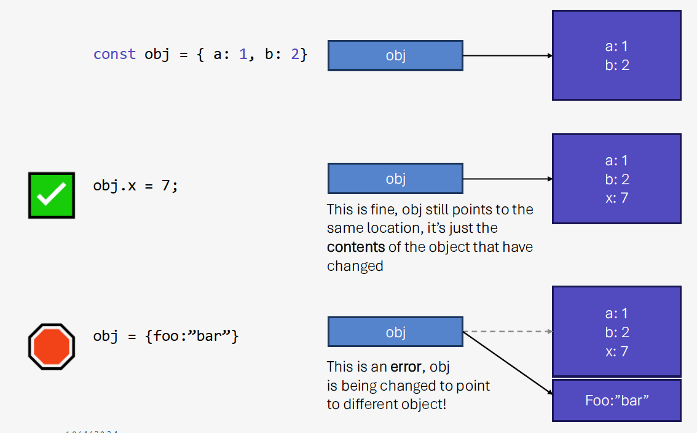

# Objects
As has been described a few times in this chapter, JavaScript has two *kinds* of types - **primitives** and **objects**.  We've talked a lot about primitives, and we've mentioned objects a few times.  In this section, we'll look a lot more closely at objects, and then over the next few sections we will look at *specific* specializations of objects.

If you are coming from an object oriented language, the word *object* has a specific meaning.  Normally we think of it as an *instance* of a class - a class being a data type.  In object oriented languages, we usually have built in classes and user defined classes - and in both cases we think of *classes* as blueprints for new data types.  We create instances when we declare variables of that type.

JavaScript has a fundamentally different take on *objects* and object orientation.  We are going to look at the most commmon and practical uses of *objects*, and then we will breifly discuss their implementation details.

## Objects are just bags of properties
JavaScript code can create objects, without defining classes.  While we will discuss actual classes (which are a newer feature of JavaScript), *objects* are mostly just instances of the `Object` type.  As a programmer, you can put *whatever* properties you want in *each* object instance you create.  There is no blueprint, no new type.

```js
// Create a new, empty object
const obj1 = {};

// Create a new object with two properties
const obj2 = {a: 1, b: 2};

// We can add x as a new property just
// by setting it.
obj1.x = 7;
// Same with c, which can be added to obj2
obj2.c = "Hello";
// And a can be changed to have a string 
// rather than a number.
obj2.a = "World";
```

In the code above, we highlight two concepts - property *addition* and changing property values.  We are also demonstrating how `const` objects can be mutated, which might at first seem surprising.

Let's deal with those issue in reverse order.  `const obj1` is indeed declaring a new *constant* object, but the *const* is not referring to the object that `obj1` points to, it's referring to the `obj1` reference itself.  Variables, whether they refer to primitives or objects, are just references.  `const obj1` means that `obj1` will always refer to the object we've created, but the *contents* of that object are always free to change.



For example, the following code would *violate* the constant constraint:

```js
const o = {};
// We would throw an error here.  Even though it's still an 
// empty object, when you create a new object with the literal {} 
// notation, a new object is being created in memory.  If o was
// declared with let, this would be fine - but const means o cannot
// point to or refer to a different location in memory.
o = {};
```
The following is fine:
```js
const o = {};
o.a = 1;
```
We can also always *change* properties within an object.  When we changed `obj2.a` in the original code above, we were changing the value that `a` refers to.  That neither changes the object that `obj2` refers too, nor does it cause any problem by changing the data type.  This is for the same reason that `let a = 1` can be followed by `a = "hello"` - we've already established that JavaScript variables can refer to data of *any* type over their lifetime.

BTW, there is also nothing wrong with this:

```js
let a = 5;
a = {b: 9};
a = "hello";
```
In each of those statements, the variable `a` is being reassigned (`let` permits this).  The fact that its being changed from a number, to an object, to a string is not an issue.

Finally, in the original code we demonstrated that properties could be added via simple assignment.

```js
// Create a new object with two properties
const obj2 = {a: 1, b: 2};
// c can be added to obj2
obj2.c = "Hello";
```

This is perfectly normal, and expected in JavaScript. We create objects, and we add properties to them.  We can also reference properties, and it is **always safe to do so**:

```js
const obj2 = {a: 1, b: 2};
obj2.c = "Hello";

// There is no d property, so
// the value printed is `undefined`
console.log(obj2.d);
```
Here we see that `undefined` concept again.  Accessing a property within an object that has not been assigned results in `undefined` being returned.  In fact, you can almost think of every object as always having the *entire infinite* set of all possible properties already available - but that they have all been initialized to `undefined`.  This of course is **not** how it works under the hood - but it **is** the behavior.

Remember:

- referencing a property of an object that was never set is ok - you get `undefined`.  
- referencing a property of an undefined object is something quite different - and it will crash your program!

```js
const o = {};
let x;
console.log(o.missing); // undefined
console.log(x.missing); // Program crashes, x isn't an object at all!
```

## Object creation
Now that we've gotten started, let's look at all the ways that we can create objects in the first place.

The most common way is to use the *literal* notation:

```js
const o = {};
```
Alternatively, some prefer to use `const o = new Object()`.  This is using a constructor syntax that you might already feel comfortable with.  It's OK to use, but it's verbose, and it isn't really any different than using the `{}` notation.

A third way is to use `const o = Object.create(null)`.  This is a more unusual case, and is very rarely used in practice.  This syntax provides the ability to take advantage of some of the internals of how objects work in JavaScript - through a *prototype* system.  We'll discuss this later on in this section, but in practice it's not used directly all that often in regular web development.

When creating objects, we are free to create them with any number of properties;

```js
const x = 5;
const o = {
    a: 10,
    b: "Hello World",
    c: null, 
    d: x
};
```
It is perfectly natural to do this, and it is quite useful to do so.  Objects are used **extensively** in JavaScript code because they are so easy to create, they are flexible, and once you get the hang of them, very easy to use.

## Object Properties
Object property names can be referenced using the `.` operator.  Assignment and referencing works as you'd expect, with the reminder that you can assign properties that don't already exist, and you can also reference properties that don't already exist, without issue.

Object names, when they follow the rules of standard identifiers (start with alphabetical or underscore, no spaces, and limit characters to alphanumeric plus _ and a few others) can use the `.` operator, but actually property names can be even more flexible.

For situations where a property name must use a naming convention that does not adhere to the indentifier syntax, you can use `[]` notation instead.

```js
const o = {};
o["Hello World"] = 5;

console.log(o["Hello World"]);

```
The property name "Hello World" is not a valid identifier, and thus cannot be used with the `.` operator, but you can still use it as a property name.  There are some use cases where this comes in handy, but generally you will want to stick to proper identifier names.  The `.` operator is much more ergnonmic.

The `[]` syntax for referencing object properties does have a nice use case though.  Consider the code below, where a *random* property name is accessed:

```js
const o = {a: 1, b: 2};
const name = Math.random() < 0.5 ? 'a' : 'b';
console.log(o[name]);
```
This code might appear odd (and yes, it's a bit contrived).  We set a variable `name` to be be **either** `"a"` or `"b"`, and then use the value of `name` to access the corresponding proeprty.

Note that this is different than `o.name`, which would attempt to access the property called `name` - which is undefined.  This literally is accessing either property `a` or `b` based on the *value* of `name`.  


### Checking for object properties
Accessing missing properties results in `undefined`, which in most cases is sufficient to determine whether an object contains a given property.  The following is a common method of checking:

```js

const o = { a: 1 };
if (o.b) {
    //has b
}
```
This method can be error prone however, especially given JavaScript's type conversions. A safer way is to explicitely check for `undefined` with the `===`

```js
const o = {a: 0};
if (o.a ) {
    // This will be skipped, because 0 is intepreted as false.
    // If we were trying to chekc if a EXISTS, this would be 
    // an incorrect result!
}
// Instead, check explicitely for undefined:

if (o.a !== undefined) {
    // a is present.  Maybe it's 0, but it's there!
}
```

We can also make use of the `in` keyword to check if a property is present within an object.

```js
const o = {a: 0};
if ('a' in o) {
    // Yes, this branch will execute - there
    // is a property called a
}
if ('b' in o) {
    // This branch will NOT execture, there 
    // is no b property in o
}

```

The `in` keyword is the most accurate method of checking whether properties exist in an object - but it's not necessarily used as much as it should be in practice.

### Removing Properties
We've seen that we can easily *add* properties, via assignment.  Can we remove them?  We certainly can, and there are two schools of thought.

1. We can use the `delete` keyword.  `delete o.a` removed `a` from the object.  Any subsequent reference of `o.a` will result in `undefined`.
2. We can also just set `o.a` to be `undefined` - `o.a = undefined`.  This has exactly the same effect, and may be faster - although most modern JavaScript runtime will optimize the inefficiency associated with `delete` away.

The difference between the two methods comes up when we try to *iterate* over all the object property names found in an object - often called the object *keys*.  It also comes up when using the `in` keyword, which is an alternative way to check if object properties are present.

```js
const o = {
    a: 10,
    b: "Hello World",
    c: null, 
    d: 20
};

// This removes a, it's no longer a property in o
delete o.a;
// This doesn't remove the property, it sets it to undefined.
o.b = undefined;

if (o.a !== undefined) {
    // This will NOT print
    console.log('o.a is present - check 1');
}
if ('a' in o) {
    // This will NOT print
    console.log('o.a is present - check 2');
}

if (o.b !== undefined) {
    // This will NOT print
    console.log('o.b is present - check 1');
}
if ('b' in o) {
    // This WILL print
    console.log('o.b is present - check 2');
}

// Prints b, c, d - a is not in o, but b still is.
for (let p in o) {
    console.log(p);
}

```
In the above code, we are clearly demonstrating the difference between `delete` and setting the property to `b`.  It's important to understand the difference.  There's no one right answer, it all depends on context.  `delete` **truly** removed the property, and the result is that `in` works (both as a boolean expresion, and an iteration of object properties) as you would expect if the property was completely deleted.  Setting the property to `undefined` **keeps** the property in the object, but sets it's value to `undefined`.

**Pro Tip**&#128161; Programmers tend to get really opinionated about their code. That's a good thing, it means they care.  There are those that argue strongly that `delete` is better than setting to `undefined`, and those that argue strongly that it doesn't matter.  You can decide - but here's something to think about:  It's generally antithetical to the idea of `undefined` to explitely set something to `undefined`.  The meaning of `undefined` is that the programmer has *not set it*. `null` is supposed to be what is used when the **programmer** has explicitely set the value to *nothing*.  So, wouldn't it be more accurate to set a property to `null` rather than `undefined`?  In which case, the distinction between the `delete` operator and setting the property to `null` is far more significant.  Food for thought...

## Nested Objects
Object properties can be *anything*. They can be primitives, or other objects.  It's quite common for objects to contain other objects, which contain other objects. There are no restrictions (one caveat, see below).

```js

const obj = {
    a: 5, 
    b: 10,
    c: {
        x: "hello",
        y: "world"
    }
}

const foo = {a: 10, b: 20, c: 30};
obj.bar = foo;

console.log(obj.bar.b); // Prints 20

```

The one thing to watch out for with nested objects is **circular references**.  They are permitted.  They are also a great way to introduce some really nasty bugs - so you need to be careful!

```js
const root = {
    parent: null,
    data: {...}
}
const child = {
    parent: root,
    data: {...}
}
const grand_child = {
    parent: root,
    data: {...}
}
// So far, so good.  Each object has a reference to it's "parent".
// But now let's stitch them together the other way
root.child = child;
child.child = grand_child;
grand_child.child = null;

// Conceptually, there is nothing wrong with this at all
// However, we need to be careful about iteration.

// Will be called recursively
function visit(obj) {
    // Iterates each object, prints the key,
    // and descends into the object itself
    for (let name in obj) {
        console.log(name);
        visit(obj);
    }
}
visit(root);
// We'll never get to this line... visit is an infinite loop, 
// because root has a child, and that child has a parent, and 
// they are pointing to eachother!
```
## Serialization and Deserialization
The example above is a starting point for a better way to print out objects (the circular reference notwithstanding).  We've already seen the decidedly unimpressive `toString` method for objects - which prints `[object Object]`.  It's pretty common that we'd want to print (maybe for debugging) the entire contents of an object.  That's easy, with the `JSON` built in object.

**JSON** stands for **J**ava**S**cript**O**bject**N**otation.  JSON has actually replaced **XML** in most areas of software development as the preferred way to store structured, hiearchacal data as text - in **any programming langauge**, because it is so intuitive and flexible.  **It looks just like how we declar a nested object in JavaScript** - with the excption that *property* names and all values are quoted.

```js
const obj = {
    a: 5, 
    b: 10,
    c: {
        x: "hello",
        y: "world"
    }
}

const foo = {a: 10, b: 20, c: 30};
obj.bar = foo;

console.log(JSON.stringify(obj));
// Prints the following:
// {"a": "5", "b": "10, "c": {"x": "hello", 
// "y": "world"}, "bar": {"a": "10", "b": "20", "c": "30"}}
```

The `stringify` method can also accept parameters to help format the text. 

```js
const obj = {
    a: 5, 
    b: 10,
    c: {
        x: "hello",
        y: "world"
    }
}

const foo = {a: 10, b: 20, c: 30};
obj.bar = foo;

console.log(JSON.stringify(obj, null, 2));
// Prints the following:
/* {
        "a": "5", 
        "b": "10, 
        "c": {
            "x": "hello", 
            "y": "world"
        }, 
        "bar": {
            "a": "10", 
            "b": "20", 
            "c": "30"
        }
    }
*/
```
You can learn more [here](https://developer.mozilla.org/en-US/docs/Web/JavaScript/Reference/Global_Objects/JSON/stringify)

`stringify` is efficient, and is incredibly useful for *serializing* data - taking a complex object and turning into a language and platform agnostic string, which can be sent over a network, stored to disk, or even dropped into a database.  **We will use JSON a lot**.

Given a JSON string, we can also easily *parse* it with the `JSON.parse` function. Giving `parse` a JSON string will result in an `Object` being returned. This process is referred to as **deserialization**.  JSON started in JavaScript, but all modern programming languages either have built in, or standard extension for JSON serialization and deserialization.  JSON is an incredibly popular method of moving data between programs, devices, and languages because of the ubitquity of serialization and deserialization capabilities, and it's relative simplicity as a format.

```js
// Using template literal ` just because the string has double 
// quotes already in it.  In a real world example, you would be 
// getting this string from somewhere (disk, user, etc), since 
// otherwise, you'd have just written it as an object literal 
// in the first place!
const string_from_somewhere = `"{"a": "5", "b": "10, "c": 
                    {"x": "hello", "y": "world"}, "bar":
                    {"a": "10", "b": "20", "c": "30"}}"`;

const obj = JSON.parse(string_from_somewhere);

console.log(obj.bar.b); // Prints 20

```

### Cloning
`JSON.stringify` and `JSON.parse` have often been used as a way to *clone* objects.  The assignment operator `=` in JavaScript, when used with objects, performs a **shallow** copy - it's simply setting another reference to the same exact location in memory.

```js
const o = {a: 2, b: 0};
const u = o; // Shallow copy

o.a = 5;
console.log(u.a); // Prints 5, since u points to same object as o
```
What happens when we want to create a distinct copy of `o` instead?  For such a simple object, it's trivial - we could iterate properties manually - but that's not reasonable for large, nested objects.  The way most programmers did this (until relatively recently) was to leveral `JSON` itself.

```js
const o = {a: 2, b: 0};

// Turn o into a string, then parse the string
// JSON.parse returns a new object.
const u = JSON.parse(JSON.stringify(o));

o.a = 5;
console.log(u.a); // Prints 2, since u refers to distinct object
```
`JSON.stringify` is susceptable to circular references, which is one of the reasons we need to be careful about them.  Using serialization and deserialization will fail with circular references.  The JavaScript language has more recently been updated to include a `structuredClone` global function, which is a superior method of creating deep clones of complex objects.  It's can be more efficient than using `JSON.stringify` and `JSON.parse`, and it also is more robust - in particular it can handle circular references gracefully.


```js
const o = {a: 2, b: 0};
const u = structuredClone(o);

o.a = 5;
console.log(u.a); // Prints 2, since u refers to distinct object
```

- [structuredClone](https://developer.mozilla.org/en-US/docs/Web/API/Window/structuredClone) - Mozilla Developer Network

## Methods?
If you are coming from an object oriented langauge with classes, you are probably wondering where the *class methods* are.  Objects usually have data *and* methods.  The JavaScript object does have several methods already defined.  We saw the `toString` method, for example.  There are a few others, which you can take a look at here (we'll encounter some uses for them later)

- [Object Reference](https://developer.mozilla.org/en-US/docs/Web/JavaScript/Reference/Global_Objects/Object) - Mozilla Developer Network

You can also *add functions* to objects, and we will take a look at that later in this chapter when we focus on functions themselves.  The syntax will be familiar to you.

## Other types of objects
There are some helpful specialization *types* of objects, but they are all objects.  These types of objects have their own constructors and their own methods, and we will revisit how they are built behind the scenes later on when we discuss prototypes and classes towards the end of this chapter.  Some good examples include:

- [Date](https://developer.mozilla.org/en-US/docs/Web/JavaScript/Reference/Global_Objects/Date)
- [Map](https://developer.mozilla.org/en-US/docs/Web/JavaScript/Reference/Global_Objects/Map)
- [Set](https://developer.mozilla.org/en-US/docs/Web/JavaScript/Reference/Global_Objects/Set)
- [Regular Expressions (RegExp)](https://developer.mozilla.org/en-US/docs/Web/JavaScript/Reference/Global_Objects/RegExp)

The primitives also have their own object specialization counterparts - with their own constructors and their own methods.

- [String](https://developer.mozilla.org/en-US/docs/Web/JavaScript/Reference/Global_Objects/String)
- [Number](https://developer.mozilla.org/en-US/docs/Web/JavaScript/Reference/Global_Objects/Number)
- [Boolean](https://developer.mozilla.org/en-US/docs/Web/JavaScript/Reference/Global_Objects/Boolean)

Before closing out this section, let's look at the following example of using property names with the `[]` syntax rather than the `.` operator.  Recall, by using the `[]` syntax, we can use properties that are not valid identifiers - like strings with spaces, strings that start with numbers, or even *numbers themselves*.

```js
const o = {};
o["hello world"] = 1;
o["9lives"] = 2;
o["6"] = 12;
o[3] = 18;
```
Look closely at that last one.  

`o[3]` should looks like something pretty familiar to you.  

That looks like an **array**.  

```js
const a = {};
for (let i = 0; i < 10; i++) {
    a[i] = i*i;
}
console.log(a[5]); // prints 25
```
Since object properties can be numbers, we've essentially created an *array-like* structure out of a plain old object.  In JavaScript, **arrays are just objects**.  They do have some specific syntax that differentiates them from objects - but they are just specializations of objects. They have all the same features of objects, just different conventions!