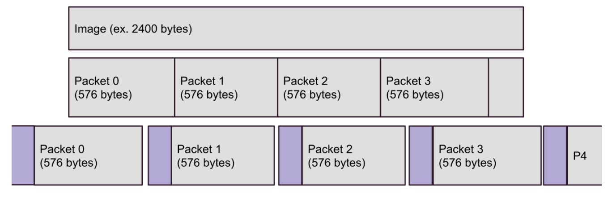

# Network Protocols
When we say *the web*, it's fair to think about web browsers, web sites, urls, etc.  Of course, the term "the web" is commonly used interchangeably with *the internet*.  Truly, *the internet* is a lot more broad than you might realize though.  The *internet* is a global network of computers.  It facilitates your web browser accessing a web site.  It facilitates email delivery.  It lets your Ring security camera notify your phone when the Amazon delivery arrives.  When we talk about *the internet* we are talking about *the entire* internet - which encompasses billions (if not trillions!) of devices talking to each other.  

The first thing we need to understand about computer networks is the concept of a **protocol**.  A network is just a collection of devices, sending electrical signals to each other over *some* medium.  In order for this to be useful, we need some things:

1. We need to know how to find devices to talk to
2. We need to know how to translate electrical signals into useful information

There's a whole bunch of things that flow from those two requirements.  It might help to first consider some real world protocols.  The postal system comes to mind.

When we want to mail a physical thing to someone, what do we do?  First, we need to know their address.  We need to know that (at least in the United States) that addresses look something like this:

```
98 Hall Dr.
Appleton, WI 54911
```
There are rules here.  On the second line, we expect the town or city.  The abbreviation after the comma needs to correspond to an actual state in the US.  The number after the state is a *zip code*, or *postal code*.  This indicates not only a geographic area, but also a specific **post office** (or set of post offices) that can handle the mail going to addresses within that postal code.  

Here we have the beginnings of point #1 above.  There is an **expectation** of how an address is defined and intepreted.  It's an agreement.  If you think more carefully, there are more - such as where you write this address on an envelope, etc.  All of the things associated with fillng out an address on an envelope is part of the mail system's **protocol**.

We also know that our mail can *enter* the mail network through various places - our own mailbox, or a public postal box.  From that point, there is a vast infrastructure which routes our physical mail to the appropriate destination - taking many hops along the way, through regional distribution centers, via airplane, train, truck, to the local postal office, and then to the physical address of the recipient.  We intuitively know that this requires a lot of coordination - meaning all of the various touch points need to know the rules.  They need to know where to route the mail!

With #1 out of the way, how does the mail system handle #2 - exchaning meaningful information? Interestingly enough, the postal system actually does **very little** to facilitate this.  Just about the only thing it ensures (or at least attempts to) is that when you mail something to someone, they will receive the whole thing, in reasonable condition.  If I mail a letter to you, the postal system's promise to me is that the entire letter will arrive, and it will still be readable.

So, how do we effectively communicate via the postal system?  Well, the postal system is one protocol - for mail transport and delivery - but there is also another protocol at work.  When you send a letter to someone in the mail, you implicitely make a few assumptions.  Most importantly, you assume the recipient speaks (or reads) the same language as you, or at least the same language the letter was written in.  There are also other commonly accepted conventions - like letters normally have a subject, a date, a signature.  There are actually many assumptions built into our communciation - all of which we can consider the "letter writing protocol".

Notice now that we have identified two protocols.  One protocol, the *postal protocol*, establishes a set of rules and expectations for transport and delivery of letters.  The second protocol, the *letter protocol* establishes a set of rules and expectations for understanding the contents of such letters.

## Computer Protocols
What does this all have to do with computer networks?  Computers need to communicate under a set of assumptions.  All data in a computer systems is represented by 1's and 0's (see [big vs little endian](https://en.wikipedia.org/wiki/Endianness) if you think this is straightforward).  In order for computers to communicate, we'll need answers to the following:

1. How are 1's and 0's encoded/decoded across the medium of transmission (copper wires, radio signals, fiber optics)?
2. How is the encoded data's recipient to be represented?
3. How can the data be routed to the receiver if not directly connected to the sender?
4. How do we ensure the data arrives in reasonable condition (not corrupted)?
5. How can the recipient intepret the data after it arrives?

Just like with our postal / letter example, all of these questions aren't going to be addressed by an **single** protocol.  In fact, computer network protocols formally defines several *layers* of protocols to handle these sort of questions.  The model is called the [Open Systems Interconnnection - OSI](https://en.wikipedia.org/wiki/OSI_model) model.

In the OSI model, the question of how 1's and 0's are encoded/decoded is considered part of the **Physical** and to some extent the **Data link** layers.  These are the first two layers.

Layer 3 - the **Network** layer provides addressing, routing, and traffic control (think of that as an aggreement on how to handle situations where the network is overloaded).  This really covers question #2 and #3, and will be handled by the first protocol we will look at in detail - the **Internet Protocol**.

Our 4th question - how we ensure data arrives in reasonable condition - is actually more interesting than it might originally appear.  Looking back to our postal/letter example - what do we mean by a letter arriving in reasonable condition?  Clearly, if the letter itself is unreadable (perhaps water was spilled on it, and the ink has bled), it is unusable.  This happens with 1's and 0's on the internet too - the physical transimission of these electronic signals *is not perfect*.  Think about the trillions of 1's and 0's that are traveling through the air, through wires under the ocean, etc.  Those bits will get flipped sometimes!  This will result in a mangled data transmission.  

How do we know if some of the bits have been flipped though?  If you recieve a physical letter in the mail that was somehow made unreadable, it's obvious to you - because the "letters" on the page are no longer letters - they are blobs of ink.  In a computer system, if a bit gets flipped from a 1 to a 0, or a 0 to a 1, the data is still *valid* data.  It's still 1's and 0's!  

To drive this point home, let's imagine I'm sending you a secret number, the number 23.  I send you the following binary data, which is the number 23 written as an 8-bit binary number.

```
00010111
```
Now let's say you receive this, but only after these signals travel the globe, and one digit gets flipped somehow.

```
01010111
```
You have received the number 87.  The number 87 is a perfectly reasonable number!  There is no way for you to know that an error has occurred!

Thankfully, we have ways of handling this kind of data corruption - *checksums*, and we'll cover it in a bit. This error detection is handled by the **Network Protocol** layer in the OSI model, and in our case will be part of the **Internet Protocol**.  

As we will see however, detecting an error is not the same thing as *handling* an error.  When an error occurs, what should we do?  Do we have the sender resend it?  How would we notify the sender?  These questions are handled by the **Transport** layer, and will be handled by other protocols above the **Internet Protocl** in our case - either by **Transmission Control Protocol** or in some cases **User Datagram Protocol**.

The last question we have is #5, *how can the recipient intepret the data after it arrives?*.  There's a lot backed in here.  As you might recall from the postal/letter example, understanding the contents of a message requires a lot of mutual agreement.  Is the letter written in a language the recipient can understand?  Is there context to this letter - meaning, is the letter part of a sequence of communications?  Does the letter contain appropriate meta data (subject, date, etc.)?  

All of these issues are handled by layers 5-7 in the OSI model - **Session**, **Presentation**, and **Application** layers.  For web development, the **Hypertext Transfer Protocol** protocol outlines all the rules for these layers.  For other applications, other protocols define the rules - for example, email uses **SMTP (Simple Mail Transfer Protocol)** and file transfer applications use **FTP (File Transfer Protocal)** and **SFTP (Secure File Transfer Protocol)**.  Some applications even use their own custom set of rules, although this is less commmon.  Generally, web applications will also layer their own logic and context over these protocols as well, unique to the particular use case of the application. For a web application, things like login/logout sequences, url navigation, etc. are clearly unique to the application itself.  If users visit specific pages out of order, they might be "breaking the rules".

We won't cover physical networking in this book.  It's a fascinating subject - understanding how 1's and 0's are actually transmitted across the globe - through the air (3G, 4G, 5G, LTE, etc), via satellites, ocean cables, etc - is a pretty heavy topic.  When you start to think about the shear volume of data, and the speed at which it moves, it's mind boggling.  However, as a web developer, the movement of 1's and 0's between machines is far enough removed from you that it's really out of scope.  If you are interested, start by looking at the [Physical Layer](https://en.wikipedia.org/wiki/Physical_layer) and then you can start working your way to all the various technologies.

As a web developer, you will be **will** be dealing with at least **three protocols** for communication in web development:

1. Internet Protocol:  Addressing, Routing, Error Detection
2. Transmission Control Protocol:  Error handling, reliable delivery of requests/responses, multiplexing
3. HyperText Transfer Protocol:  Encoding/Decoding of requests and response, and all of the rules of the web!

While the HyperText Transfer Protocol is the most important, the other two are still quite relevant, so we will tackle them in order.

# The Internet Protocol
The *Internet* (capitalized intentionally) isn't the only network.  It's the biggest network (by far), and really the only network used by the public today.  However, if you went back in time to the 1960's, there was no reason to belive this would be the case.  There were many networks - meaning there were lots of *network protocols*.  Most of them were networks either within the defense industry or within academia.  These networks weren't compatable with each other.  

There was a need to have computers on different networks talk to each other - so there became a need for a *standard* protocol.  In 1974, [the **Internet Protocol**](https://ieeexplore.ieee.org/document/1092259) was proposed by V. Cerf and R. Kahn.  It was quite literally devised as a protocol for communicating between networks - **inter**net.  The protocol grew in adoption, and along with a few other innovations (TCP, which we will see soon) eventually supplanted most other networking protocols entirely.  In 1983, one of the largest and most important networks - ARPANET (Advanced Research projects Agency Network) switched over to the **Internet Protocol**.  The network of computers that communicated using the **Internet Protocol** grew and grew.  By the 1980's, *the internet* (not capitalized) was how people talked about the network of computers speaking the **Internet Protocol**.  By the early 1990's, web technologies were running on top of the internet, and the rest is history.

So, what is the **Internet Protocol**?  First, we'll call it simply **IP** from now on.  

The first thing to understand is that the IP protocol is implemented primarily by the operating system on your computer.  The IP protocol defines the fundamental format of all data moving through the internet. Thus, data encoded as IP data goes *directly* from memory to the network device of a computer - and out to the internet.  The operating system generally limits access to network devices, and so you may interact and use the IP protocol via the operating systems API's.

IP provides two core facilities:

1. Addressing
2. Message Chunking & Error Checking

If you've heard of an *IP address*, then you know a little about IP already!  We are going to go in reverse order though, starting out with message chunking - or what are referred to as **packets**.

## IP Packets
IP *messages* are chunks of data that an application wishes to send to another.  These messages are of arbitrary length, they are defined by the application doing the sending.  An application transferring files might send an image as an IP message.  A web browser might send an HTTP request as a message.  

Sending *arbitrary* length 1's and 0's creates a bunch of problems.  First, from a device design and software design perspective, dealing with fixed length chunks of data is *always* more efficient.  Second, depending on the devices receiving (or more importantly, forwarding) the messages, arbitrarily long message may create electronic traffic jams, network congestion.  To mitigate this, IP slices all messages into **fixed length packets**.

An internet **packet** is a fixed size chunk of binary data, with consistent and well defined meta data attached to it.  This metadata will contain addressing information of both sender and receiver, along with a sequence number identifying where the packet is within the original larger message.

The **I**nternet is, at it's core, a peer to peer network.  Every machine on the internet is considered an **IP host**, and every IP host must be capable of sending, receiving, and forwarding IP packets.  While your laptop or home computer is unlikely to be doing a lot of forwarding, forwarding IP packets is a critical design feature of the internet.  Your computer is connected to a *web* of network switches that receive packets, determine whether they can connect directly to the intended recipient or which other switch is available to help locate the recipient.  Each one of these switches moves up and down a topology (see below) that makes up the internet.  Each packet might be forwarded by *dozens* of different network switches before it reaches it's final destination - just like the letter you send in the mail get's handled by many people before arriving at it's destination.

By slicing a message into packets, the network can route packets across the network *independently* - meaning packets belonging to the same larger message can take *different* paths through the network.  This significantly aides in network congestion management and automatic load balancing, a primary function of all of the many millions of internet switches and routers making up the network.  There's no analog to this in the postal/letter analogy - it's the equivelant of cutting your letter up into tiny pieces before sending :)

Let's look at a more concrete example.  Suppose we are sending a 2.4kb image over IP.  The *minimum* packet size that all IP hosts must be able to handle is 576 bytes.  Hosts can negotiate sending larger packets, but at this point let's just assume packet sizes of 576 bytes.

Each packet will have a header attached to it, including IP version, total packet size (fixed), sender and recipient address, and routing flags such as sequence number.  These packets (four of them, in the image below) are then sent across the network.



Note that in the image, packet 4 is smaller than the rest, it has the remaining bytes, less than 576.  In reality, it will be sent as 576 bytes, with the remainder of the payload zeroed out.

**Each** packet flows through a network of switches.  We will address a bit more on how these messages are routed across the network below, but for now the important concepts is that they travel through the network **seperately**, and may take different paths.  Packets belonging to the same message can arrive out of order (packet 3 may arrive at it's destination before packet 1).  The IP protocol (the code implementing, at the operating system and device driver level) is responsible for re-assembling the packets **in their correct order** to form the resulting message on the receipients side.

### Error Checking and Checksums
It's important to understand that whenever electronic data transmission occurs, we do have the possibility of errors.  Computer networks send 1's and 0's over a medium, let's say radio frequency (wifi).  Just like static when listening to your car's radio, transmission isn't perfect.  As described above, when binary data transmission errors happen, the result is that a 1 is flipped to a 0 or a 0 is flipped to a 1.  The result is *stil a valid binary data packet*.  In the best case, the resulting binary packet is nonesense, and easily understood to be corrupted.  However, in most cases, the flipped bit results in a valid data packet, and it's impossible for a recipient to notice the bit flipping has occurred just by looking at the data.

For a concrete example, think about the IP message from above - and image. Images are sequences of pixels.  Each pixel is three numbers, a value (typically) between 0 and 255 for red, green, and blue.  For a reasonably sized image, there are thousands of pixels.  Each pixel is barely perceptable to the human eye, but the composit gives us a nice crisp picture.   **What if one of those pixels was corrupted**?  One of the pixels that should look red, when it is received, is blue.  How could a receiving program, which doesn't know what the image *should* look like, know that this has happened?  The answer is, it's impossible - without some extra information.

The key to this problem is the concept of **checksums**.  [Checksums](https://en.wikipedia.org/wiki/Checksum) are *hashes* of a string of data.  If you are familiar with has tables, you know the concept. For simple hash tables, you might take a large number and use the modulus operator to determine it's hash, and it's location in the table.  Hashing *functions* exist to take arbitrarily long strings of data, and compute hash values from them that are substantially shorter.  

Hashing *functions* are one way functions.  They aren't magic, [here's how it's done for all IP packets](https://www.ietf.org/rfc/rfc1071.txt).  Multiple (actually, infinite) inputs map to the same hash, however statistically speaking, the chances of two *random* inputs mapping to the same has is astonishingly low.  

How does hashing relate to error detection?  An IP packet has a payload (the actual data). This payload can be sent as input to the hashing function, resulting in a numeric value of just a few bytes.  This checksum is then *added* to the IP packet header, and sent over the network.

When a machine receives a packet, the first thing it does is extract the payload data (a certain number of bytes) and the checkum from the packet.  These are at well defined locations within the packet, so this part is quite trivial. Since all IP hosts use *the same* hashing function to compute checksums, the receiver can calculate the checksum of the received payload, and compare it with the checksum it found in the packet, which was computed by the sender originally.

There are 4 possible outcomes:
1. One or more bits have been flipped in the area of the packet that held the checksum.  This will result in the computed checksum being *different* than the checksum found in the packet, and the packet can be deemed corrupted.
2. One of more bits have been flipped in the area of the packet that held the data payload. This will result in the computed checksum again being *different* than the checksum found in the packet, and the packet can be deemed corrupted.  Note, there is an infinitesimally small chance that the bit flipping that occurred in the payload section resulted in a payload that still hashes to the *same* checksum.  This would result in a false negative - the packet was corrupted by IP can't detected.   Again, the chances of this actually happening are [infinitesimally](https://www.merriam-webster.com/dictionary/infinitesimal) small.
3. One ore more bits have been flipped in both the checksum and payload area of the packet.  As in case #2, there is an incredibly small chance that this flipping results in the checksum changing such that the equally corrupted payload now hashes to the new checksum - however this is so unlikely we shouldn't even discuss it.
4. No bit flipping occurs, the checksums match, the packet is accepted - hooray!

Recall that each IP message is sliced into *many* packets.  **If any packet within a message is corrupted, the entire message is dropped**.  This message drop can happen at the switch level (as it's moving through the network) or on the recipient machine.  This is a **hard** drop - meaning that's it - the message is simply discarded. The sender is not notified.  More on this to come :)

Ultimately, IP uses checksums to ensure the following:  **A message received by a program is the same message that was sent by the sending program**.  

Remember, however: IP does **not** ensure every message is received, and it does **not** ensure a sequence of messages are received in the same order they are sent.

## IP Addresses
Thus far we've described what IP packets look like, to some extent.  We've agreed that each packet has a *header*, and that the header has sender and receiver addressses.  We have not defined what these addresses look like though.  Let's work on that.

An IP address is made of four numbers, between 0 and 255, separated by dots (periods).  

```
172.16.254.1
```
Actually, this is more specifically an IP v4 address.  IP v6 addresses are more complex, and address the issue of potentially running out of IP v4 addresses (among other issues iwth v4).  There is a lot to talk about regarding IP v4 and IP v6, but it's beyond the scope of a web development book - web developers will very rarely, if ever, deal with IP v6 addresses.

It's a 32-bit number, with each of the 4 numbers encoded as 8 bits.  Every computer on the internet is assigned an IP address, however the *vast majority* are not assigned permenant IP addresses.  When your  laptop connects to a wifi switch, for example, it is assigned a temporary IP address which is unique *within the sub network that wifi switch is managing*.  This is, in part, why we don't think we'll actually run out of IP v4 as quickly as we thought.  Check out [Network address translation](https://en.wikipedia.org/wiki/Network_address_translation) for more on this.  

Many machines, in particular machines that are frequently contacted by others, do have permenant of fixed IP addresses.  These machines include routers and switches that act as gateways into other subnetworks, and servers (like web servers, database servers, etc).  When your laptop or phone connects to your wireless service or wifi router, one of the first things it's doing is establishing/negotiating what machines it will use as the *first hop* for any outbound network messages. These *first hop* machines are often called *gateways*.  Gateway machines maintain lists of other gateway machines, along with which subnetworks (subnets) they manage.  Subnets are defined by *ranges* of IP addresses - for example, a particular subnet might be 172.0.0.0 through 172.255.255.255, and another machine *within* that subnet might manage IP addresses between 172.0.0.0 through 172.0.0.255.  The idea is that routers and switches maintain registries of *ranges of IP addresses* they have connections with.  When your computer sends a message to another computer, the message (IP packet) will be sent to your initial gateway machine, and then along any number of routers, being forwarded to eventually to the correct machine.  Gateway machines actually maintaint their registries through **another** protocol - the *[Border Gateway Protocol](https://en.wikipedia.org/wiki/Border_Gateway_Protocol)*.  Again, this is where we start to get outside of our scope, as a web developer, you will not often need to delve into the details of routing much further. 

There are some special IP addresses that you should know about.  Perhaps the most important is the *loopback* address - `127.0.0.1`.  `127.0.0.1` is always the **current machine**.  If you send an IP packet to the loopback address, it will be received your own machine.   You'll see this a lot in web development, because when you are coding things up, you are probably visiting your own machine via your browser!  You will probably also use `http://localhost` for this too.

Some addresses are otherwise reserved - `0.0.0.0.0` is not used, `255.255.255.255` is a broadcast address, typically not used for anything related to web development. `224.0.0.0` to `239.255.255.255` are used for multicast (again, not used for most web development).  There is more structure to IP addresses than we are discussing here - such as Class A, B, and C and their uses.  You can actually see how the various ranges of IP addresses are allocated to top teir networks [here](https://en.wikipedia.org/wiki/List_of_assigned_/8_IPv4_address_blocks), it's public data.  

From our perspective as web developers, that's likely as far as we need to go in terms of addressing.  IP addresses are numeric numbers, very similar to addresses on an postal envelope.  Routers and switches are able to use IP addresses to route data through the network and to their destination.

**Pro Tip**&#128161;  IP addresses are not the same as *domain names*.  We are used to referring to machines using human readable names - https://www.google.com, https://webfoundationsbook.com, and so on.  These domain names *map* to IP addresses, and they are transformed using publically available and accessible databases.  We'll cover this in the next chapter on HTTP and in particular, when we cover DNS.

## IP Limitations
The **Internet Protocol** provides the baseline functionality of all internet applications, however it falls short in two specific areas.  

1. Error handling
2. Multiplexing

First, we have the unresolved issue of error *handling*.  IP detects corrupt messages, however it does not attempt to recover - it simple drops the messages.  Since most applications communicate in sequences, dropped messages means there are gaps in communication.  IP also makes no attempt to ensure messages arrive in order.  Recall that each message you send is sliced into packets.  Packets are small, to optimize their flow through the network.  IP assembles packets back together on the recipient's end to form a coherent message, however two messages (each consisting of many packets) sent are not garaunteed to arrive in the same order.  For example, if the first message was sliced into 100 packets (large message), and the second message was smaller (maybe 5 packets), it's **very** possible that all 5 packets within the second message arrive *before* each of the 100 packets from the first message.  Out of order message may or may not be a problem for an application, but generally for web development it is.

The second problem is a bit more subtle. Imagine a scenario where you have two programs running on your computer.  Each program is in communication with a remote machine (it doesn't matter if they are both talking to the same machine, or two different machines).  What happens when an IP message is received?

Remember, the operating system is in charge of reading the IP message from the network device, and *forwarding* the message to the program that wants to read it.  **Which program wants to read the message?** 

IP actually doesn't define this, there is nothing within the IP message header that identifies the *program* on the specific machine that is waiting for the message.  The operating system is not in the business of deciphering the *contents* of the message, and even if it was, it's difficult to imaging a fool-proof way for the operating system to already accurately figure out which program should receive the message.  This example is describing **multiplexing** - the concept of having messages streaming into a computer and being forwarded to one of many programs currently running on the machine.  It's sort of like receiving main to your house, and figuring out which one of your roomates should read it!

The layer up is the *transport* layer, and in web development this is nearly always handled by the **Transmission Control Protocol** - TCP.  TCP will *build* on IP to address error handling and multiplexing.