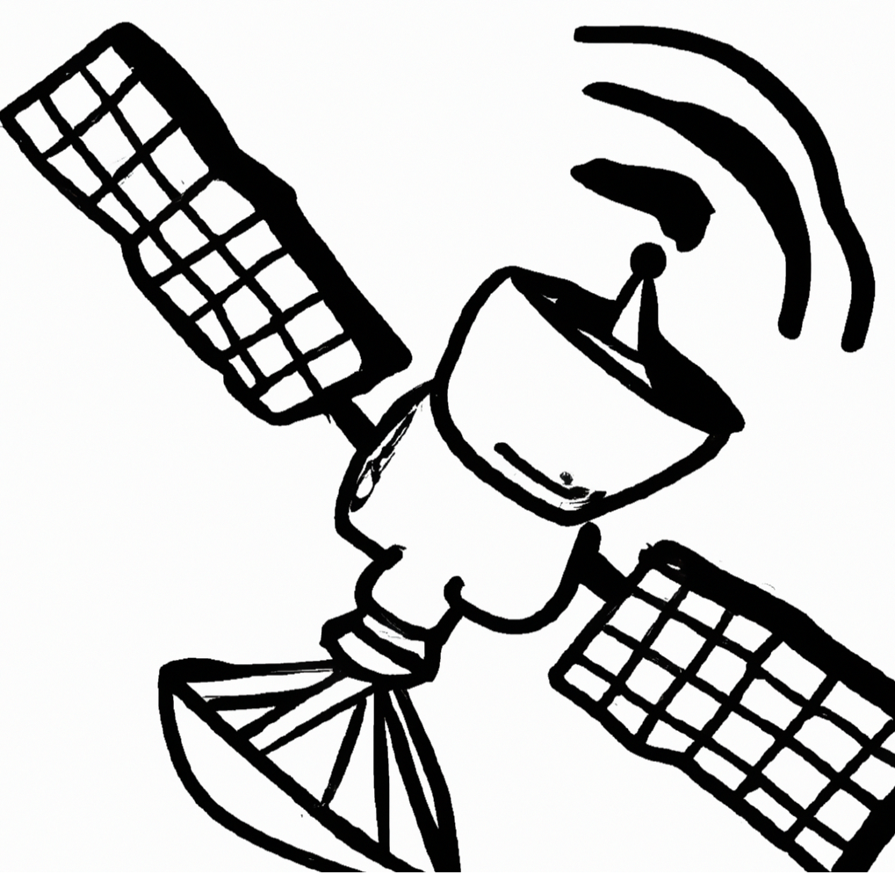

# Networks

As a web developer, you typically work far above the level of **I**nternet **P**rotocol (IP), **T**ransmission **C**ontrol **P**rotocol (TCP), sockets and the other underpinnings of computer networks and the internet.  *Typically* is not the same as *always*, however.  Moreover, having a solid understanding of how the web technologies have been built on the back of core technologies like IP/TCP gives you a huge advantage when keeping up with the ever changing field you are entering.  

This chapter provides you the fundamental knowledge and skills needed, and also the perspective to not only understand the modern web and it’s tooling, but also appreciate it.  Having a solid understanding of networking concepts will also come to your rescue when learning about deploying your web applications along with other *devop* type activities.
