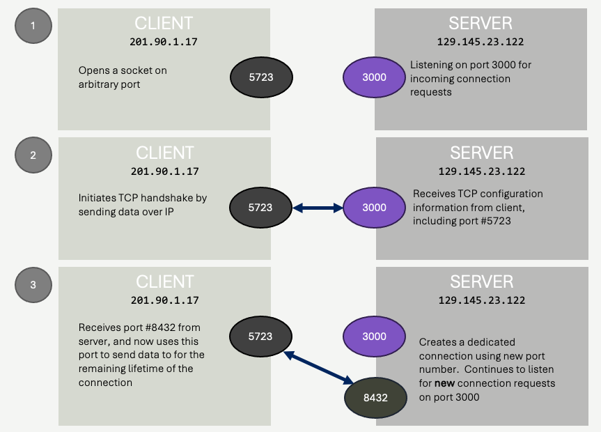

# Socket Programming
It's possible to write applications directly on top of IP, but it's not common.  The transport layer - TCP in our case - makes for a much more conveninent programming abstraction. TCP is a *connection-oriented* protocol that uses ports and sequence numbers, along with acknowledgement and resend strategies, to create reliable and (somewhat) private communication between two applications running on (usually) two different machines.  The protocol itself is so standardized, that rather than implementing it yourself, you typically use your operating systems's APIs (either directly or indirectly) to handle the details for you.  Most, if not all, operating systems comes with an API that implement the "TCP/IP Stack" - meaning they provide an API for programmers to work with TCP over IP.  This API is usually exposed via C libaries, however most other programming languages provide developers a higher level API in the host language which wraps the C libraries of the operating system.

Regardless of which language you interact with the TCP/IP stack through, one single concept prevails:  **the socket**.  In network programming, a **socket** refers to a *connection* between two machines over a port number.  In the case of a TCP socket, the socket consists of all of the following:

1. Port number of each machine (the two peers)
2. Sequence numbers (bi-directional)
3. TCP acknowledgement timer configuration, flow control established during TCP handshake

Notice, a *socket* is really just "state".  It's not a physical connection, it's the book-keeping associated with implementing TCP on top of IP.  In some languages, sockets are naturally represented by classes and objects, while in others they are represented by *file descriptors* or *handles*.  Regardless, the operating systems is generally the player that maintains all the book-keeping - as it's the one that is implementing the IP and TCP protocols.  The software representation of the socket is your *interface* into all of this functionality.

## Side Note:  What about UDP?
TCP isn't the only transport layer (Layer 4) protocol built on top of IP.  UDP - **U**ser **D**atagram **P**rotocol - adds some convenience on top of IP (Layer 3), but not quite as much as TCP does.  While TCP is a *connection oriented* protocol, which establishes sequence numbers for communication, the UDP protocol is *connectionless*.  UDP adds the concept of **port numbers** on top of IP (as TCP does), but peers can send data to target machines without any initial "handshake".  This means communication can be faster - there's less overhead - but the tradeoff is that UDP does not include a mechanism to recognize lost or out-of-order communication, or the ability to correct these problems.  This is because UDP does **not** add a concept of sequence numbers, which allows for any detection of lost/out-of-order packets.  When working with UDP, the application developer must handle these concepts (if necessary) at the application level.

It's fair to ask - why does UDP exist if it doesn't detect or resolve lost or out of order packets?  The answer is pretty simple - there are times where you simply don't need *reliability*, but you do want to send / receive data via specific port numbers.  The IP protocol sends data between machines, but Layer 4 Transport Protocols (TCP and UDP) establish port numbers to allow for separate streams of communication.  This allows multiple applications on a single machine to receive data from different machines.

UDP is a great alternative for applications that are streaming *updates*.  For example, a networked video game may be sending a player's physical location to peer machines.  In this case, each individual position update is not critical - if one is lost, it's better to receive the next update, rather than try to get the last update resent.  Likewise, when implementing video or audio communication systems - where video content is streaming across the internet - a dropped frame or audio clip shouldn't be resent - it's better to simply receive the next one.  These types of applications need port numbers (separate streams of data communication), but they don't need the detect/resend functionality of TCP.  UDP is enough, and since it's more efficient, applications benefit from increased network performance.

**Pro Tip**&#128161;:   If you find yourself implementing *reliability* control on top of UDP, take a step back.  TCP is used by almost every single networked application in the world that needs reliable communication.  It's optimized.  It works, and it works well.  Don't implement your own reliability protocols unless you have an incredibly good reason to (and I'd respectfully argue that you probably don't!).  If you need reliability, use TCP.  If you aren't sure if you need reliability, use TCP.  If you are *really* sure you don't need reliability, then use UDP.

## A Server, A Client and a Connection
The terms *server* and *client*  are loaded terms in computer networking.  They mean a lot of different things, in a lot of different contexts.  For TCP/IP networking, the two terms really mean something very simple however:

- *The Server* - the machine that **accepts** new connnections when contacted by another machine.
- *The Client* - the machine that initiates contact with a server to establish a connection.

Notice what the above does **not** say.  There is no contextual distinction between what a server or and client actually do, once they connect with each other.  There is no expectation that further communication is in a specific direction (server sends things to client, or vice versa), bi-directional, or otherwise.  There is an implied difference in the two machine's role however:  the *server* usually accepts and can maintain connections with *several* clients simultaneously, while clients generally talk to one server at a time (although there are *many* exceptions to this pattern).

So, how does a client establish a connection?  It all starts with the client application knowing which machine it wants to talk to, and through which *port* number.  

Let's outline an **example** sequence, and then we will discuss how the client might obtain this information a bit later.

### The Server:  Example
The server application is running on a machine with an IP address of 129.145.23.122.  It *listens* for TCP connections from clients on **port number 3000**.  This is commonly written as `129.145.23.122:3000`.  In the next section, we will cover how this *listening* action is performed in C code, and then in some other languages.

### The Client:  Example
The client application is running on a different machine, with an IP address of 201.90.1.17.  Critically, **it knows the server's  IP address and the port number** - it knows that it will be connecting to `129.145.23.122:3000`.  

### Making the Connection
The **client** will invoke an API call to *connect* to the server - passing the `129.145.23.122:3000` IP/port information to the appropriate library call.  

This library call (or sequence of calls, depending on the programming language and operating system) will do a few things:

1. It will request from the operating system a free port number *on the client* machine.  This port number is not known ahead of time - and need not be the same every time the application runs.  It won't be the same for all clients.  It's required, because eventually the server will need to send data to the client machine, and it will need a port number to do that - but the client will tell the server which port to use during the connection process, so it doen't need to be known ahead of time.
2. The operating system's networking code will invoke the appropriate network devices to send a TCP connection request to the server (IP address 129.145.23.122, port 3000).  This connection request is sent as a set of IP packets, using the IP protocol.  The server, which must be listening on port 3000, will receive this data and exchange several more messages with the client machine.  This *handkshake* exchanges information such as (1) client's socket port number, (2) sequence number starting points (probably 0 for each direction), (3) acknowledgement expectations (how long to wait for acknowledgements, how frequent they should be, etc.) and any other information associated with the implmementation of TCP.
3. **Most importantly**, the handshake process includes a critical step **on the server side**.  The server, which was listening for requests on port 3000, requests it's operating system to allocate a *new* port number to dedicate to communicating with this particular client.  This port number, much like the client's port number, is transient - it will be different for every client connection, and every time the server runs.  **This port number is sent to the client during the handshake data exchange**.  

To summarize:
- The client initiates the connection by sending data to the server at the server's IP address and listening port number.
- The client sends the server the port number that the server should use when sending data to the client.
- The server creates a new port number, and sends this port number to the client so the client knows which port number to talk to the server over from now on.

At this point, we can consider the *socket* connected.  The *socket* is a connection - it contains the IP address of both machines, the port numbers each machine is using to communicate *for this specific connection*, and all the TCP bookkeeping data such as sequence numbers and acknowledgement parameters.

From this point forward, when the client sends data to the server, it sends it via TCP to IP address 129.145.23.122 **on port 8432**.  When the server sends data to the client, it sends to IP address 201.90.1.17 **on port 5723**.  Port numbers 8432 and 5723 are **arbitrary** and dynamically generated at run time - only the listening port on the server (3000) must be known ahead of time.

**Key Point** &#128273;:  The creation, by the server, of a new port number for the new connection is something that is often missed by students.  The server is listening for *new* connections on port 3000 - but once a connection is created, it does not use port 3000 for communicating with the newly connected client - it uses a new port number, dynamically generated for the client.  **This allows the server to now continue to listen for ADDITIONAL clients attempting to connect over port 3000**.

### How does the client know which port to connect to?
You might be wondering - how does the client know to contact the machine with IP address of 129.145.23.122, and how does it know it is listening on port 3000?  The short answer is, *it just does*!  

A client **must** know which machine it wants to connect to, and what port number it is accepting connections on.  When two applications are connecting to each other, written by the same programmer, or programming team - this information is often just baked into the code (or, hopefully, configuration files).  

Sometimes, the client application will just ask the user for this information - and the user is responsible for supplying it.  

In other circumstances, port numbers might be known *through convention*.  For example, while email servers *could* listen on any port number, most listen on either port `25`, `587`, or `465`.  Why those port numbers?  Well, that's harder to answer - but the reason's are historical, not technical.  We'll learn a few, but there are [a lot](https://en.wikipedia.org/wiki/List_of_TCP_and_UDP_port_numbers).  These *conventional* port numbers are more often referred to as **well-known port numbers**.

Just remember, client' initiate connections to servers. Clients need to know the server's address and port - *somehow*.  Servers don't need to know anything ahead of time about clients - they just accept new connections from them!

